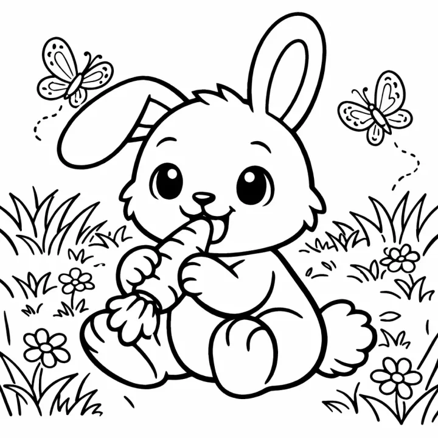

# AI Coloring Book Prompts

**231 tested AI prompts for coloring books, story books, activity books and KDP covers** — 77 themes, from dinosaurs and mandalas to ABC books, mazes and bedtime stories. Each one is a ready-made brief: copy it into any AI tool, or open it in [InkChamps](https://inkchamps.com/?utm_source=github&utm_medium=prompt_library&utm_campaign=ai-coloring-book-prompts&utm_content=readme-intro) with one click and download a print-ready PDF for Amazon KDP, Etsy or home printing.

[**Browse the prompts on the website →**](https://gunjchhetri.github.io/ai-coloring-book-prompts/)  ·  [**Make a book on InkChamps →**](https://inkchamps.com/?utm_source=github&utm_medium=prompt_library&utm_campaign=ai-coloring-book-prompts&utm_content=readme-top)

   

Sample pages made with InkChamps.

## What is in the library

| Kind of book | Themes | Prompts |
|---|---|---|
| [Coloring Books](prompts/coloring-books/README.md) — Themed coloring books for kids, teens and adults: animals, mandalas, holidays, ABC and more. | 34 | 102 |
| [Story Coloring Books](prompts/story-coloring-books/README.md) — Coloring books that tell one story, a line or two of text on every page. | 8 | 24 |
| [Illustrated Children's Story Books](prompts/illustrated-story-books/README.md) — Full-colour children's picture books: bedtime, friendship, bravery, birthdays. | 10 | 30 |
| [Activity Books](prompts/activity-books/README.md) — Mazes, word search, sudoku, tracing, dot-to-dot and spot the difference, all themed. | 10 | 30 |
| [Educational Coloring Books](prompts/educational-coloring-books/README.md) — Color-to-learn books that teach one idea per page: life cycles, space, the body. | 10 | 30 |
| [KDP Book Covers](prompts/kdp-book-covers/README.md) — Print-ready Amazon KDP paperback covers with front, spine and back. | 5 | 15 |

## Every theme

**Coloring Books:** [Dinosaur](prompts/coloring-books/dinosaur-coloring-book-prompts.md) · [Farm Animal](prompts/coloring-books/farm-animal-coloring-book-prompts.md) · [Ocean Animal](prompts/coloring-books/ocean-animal-coloring-book-prompts.md) · [Unicorn](prompts/coloring-books/unicorn-coloring-book-prompts.md) · [Dragon](prompts/coloring-books/dragon-coloring-book-prompts.md) · [Jungle & Safari Animal](prompts/coloring-books/jungle-safari-coloring-book-prompts.md) · [Cat](prompts/coloring-books/cat-coloring-book-prompts.md) · [Dog & Puppy](prompts/coloring-books/dog-puppy-coloring-book-prompts.md) · [Bird](prompts/coloring-books/bird-coloring-book-prompts.md) · [Bug & Insect](prompts/coloring-books/bug-insect-coloring-book-prompts.md) · [Space](prompts/coloring-books/space-coloring-book-prompts.md) · [Vehicle](prompts/coloring-books/vehicle-coloring-book-prompts.md) · [Princess & Castle](prompts/coloring-books/princess-castle-coloring-book-prompts.md) · [Mermaid](prompts/coloring-books/mermaid-coloring-book-prompts.md) · [Robot](prompts/coloring-books/robot-coloring-book-prompts.md) · [Kawaii Food](prompts/coloring-books/kawaii-food-coloring-book-prompts.md) · [Mandala](prompts/coloring-books/mandala-coloring-book-prompts.md) · [Animal Mandala](prompts/coloring-books/animal-mandala-coloring-book-prompts.md) · [Stress Relief](prompts/coloring-books/stress-relief-coloring-book-prompts.md) · [Cozy](prompts/coloring-books/cozy-coloring-book-prompts.md) · [Bold and Easy](prompts/coloring-books/bold-and-easy-coloring-book-prompts.md) · [Flower & Botanical](prompts/coloring-books/flower-botanical-coloring-book-prompts.md) · [Christmas](prompts/coloring-books/christmas-coloring-book-prompts.md) · [Halloween](prompts/coloring-books/halloween-coloring-book-prompts.md) · [Easter & Spring](prompts/coloring-books/easter-spring-coloring-book-prompts.md) · [Valentine's Day](prompts/coloring-books/valentines-day-coloring-book-prompts.md) · [Autumn & Thanksgiving](prompts/coloring-books/autumn-thanksgiving-coloring-book-prompts.md) · [Alphabet ABC](prompts/coloring-books/alphabet-abc-coloring-book-prompts.md) · [Numbers & Counting](prompts/coloring-books/numbers-counting-coloring-book-prompts.md) · [Shapes and Colors](prompts/coloring-books/shapes-and-colors-coloring-book-prompts.md) · [Good Habits & Manners](prompts/coloring-books/good-habits-manners-coloring-book-prompts.md) · [Feelings & Emotions](prompts/coloring-books/feelings-emotions-coloring-book-prompts.md) · [Greek Mythology](prompts/coloring-books/greek-mythology-coloring-book-prompts.md) · [Bible Story](prompts/coloring-books/bible-story-coloring-book-prompts.md)

**Story Coloring Books:** [Bedtime Story](prompts/story-coloring-books/bedtime-story-coloring-book-prompts.md) · [First Day of School Story](prompts/story-coloring-books/first-day-of-school-story-coloring-book-prompts.md) · [New Baby Sibling Story](prompts/story-coloring-books/new-baby-sibling-story-coloring-book-prompts.md) · [Dinosaur Adventure Story](prompts/story-coloring-books/dinosaur-adventure-story-coloring-book-prompts.md) · [Space Adventure Story](prompts/story-coloring-books/space-adventure-story-coloring-book-prompts.md) · [Kindness and Friendship Story](prompts/story-coloring-books/kindness-friendship-story-coloring-book-prompts.md) · [Christmas Story](prompts/story-coloring-books/christmas-story-coloring-book-prompts.md) · [Ocean Adventure Story](prompts/story-coloring-books/ocean-adventure-story-coloring-book-prompts.md)

**Illustrated Children's Story Books:** [Bedtime](prompts/illustrated-story-books/bedtime-story-book-prompts.md) · [Friendship](prompts/illustrated-story-books/friendship-story-book-prompts.md) · [Bravery](prompts/illustrated-story-books/bravery-overcoming-fears-story-book-prompts.md) · [Potty Training](prompts/illustrated-story-books/potty-training-story-book-prompts.md) · [First Day of School](prompts/illustrated-story-books/first-day-of-school-story-book-prompts.md) · [New Baby Sibling](prompts/illustrated-story-books/new-baby-sibling-story-book-prompts.md) · [Dragon](prompts/illustrated-story-books/dragon-story-book-prompts.md) · [Animal Fable](prompts/illustrated-story-books/animal-fable-story-book-prompts.md) · [Personalized Birthday](prompts/illustrated-story-books/personalized-birthday-story-book-prompts.md) · [Kindness and Sharing](prompts/illustrated-story-books/kindness-and-sharing-story-book-prompts.md)

**Activity Books:** [Dinosaur](prompts/activity-books/dinosaur-activity-book-prompts.md) · [Preschool Workbook](prompts/activity-books/preschool-workbook-prompts.md) · [Travel](prompts/activity-books/travel-activity-book-prompts.md) · [Space](prompts/activity-books/space-activity-book-prompts.md) · [Halloween](prompts/activity-books/halloween-activity-book-prompts.md) · [Christmas](prompts/activity-books/christmas-activity-book-prompts.md) · [Large Print Word Search](prompts/activity-books/large-print-word-search-prompts.md) · [Maze Book](prompts/activity-books/maze-book-prompts.md) · [Sudoku Puzzle Book](prompts/activity-books/sudoku-puzzle-book-prompts.md) · [Ocean](prompts/activity-books/ocean-activity-book-prompts.md)

**Educational Coloring Books:** [Life Cycle](prompts/educational-coloring-books/life-cycle-coloring-book-prompts.md) · [Solar System](prompts/educational-coloring-books/solar-system-coloring-book-prompts.md) · [Water Cycle and Weather](prompts/educational-coloring-books/water-cycle-weather-coloring-book-prompts.md) · [Human Body](prompts/educational-coloring-books/human-body-coloring-book-prompts.md) · [How Plants Grow](prompts/educational-coloring-books/how-plants-grow-coloring-book-prompts.md) · [Community Helpers](prompts/educational-coloring-books/community-helpers-coloring-book-prompts.md) · [Recycling and Earth Day](prompts/educational-coloring-books/recycling-earth-day-coloring-book-prompts.md) · [Bees and Pollinators](prompts/educational-coloring-books/bees-and-pollinators-coloring-book-prompts.md) · [Volcano and Earth Science](prompts/educational-coloring-books/volcanoes-earth-science-coloring-book-prompts.md) · [World Cultures and Landmarks](prompts/educational-coloring-books/world-cultures-landmarks-coloring-book-prompts.md)

**KDP Book Covers:** [Coloring Book Cover](prompts/kdp-book-covers/coloring-book-cover-prompts.md) · [Children's Picture Book Cover](prompts/kdp-book-covers/childrens-picture-book-cover-prompts.md) · [Activity and Puzzle Book Cover](prompts/kdp-book-covers/activity-puzzle-book-cover-prompts.md) · [Large Print Word Search Book Cover](prompts/kdp-book-covers/word-search-book-cover-prompts.md) · [Journal and Notebook Cover](prompts/kdp-book-covers/journal-notebook-cover-prompts.md)

## How to use a prompt

1. **Pick a theme** and a prompt that fits your reader's age.
2. **Click "Make this book on InkChamps".** The brief opens in the [InkChamps](https://inkchamps.com/?utm_source=github&utm_medium=prompt_library&utm_campaign=ai-coloring-book-prompts&utm_content=readme-howto) creator, already filled in. Check the age and page count, press create, and download the PDF.
3. **Or copy the brief** into ChatGPT, Gemini, Claude or another image tool. The briefs describe the pages, not one tool's settings, so they travel.
4. **Using an AI agent?** Every prompt has its exact InkChamps MCP call under *Exact settings for AI agents*. See the [agent guide](guides/ai-agents-mcp.md).

Every prompt states its age band, page count, page size and style, because a book for a 4-year-old and a book for an adult are drawn differently: line weight, detail and how much background a page carries all change with age.

## Guides

- [How to use these prompts](guides/how-to-use-these-prompts.md)
- [Make a Gemini Gem or custom GPT that writes book prompts](guides/gemini-gem-and-custom-gpt.md)
- [Order books from Claude, Cursor and other AI agents (MCP)](guides/ai-agents-mcp.md)
- [Can you sell AI coloring books on Amazon KDP?](guides/sell-ai-coloring-books-on-amazon-kdp.md)

## FAQ

**What is the best prompt for an AI coloring book?**

One that names the reader's age, the number of pages and concrete subjects for those pages — "a stegosaurus watering a vegetable garden" rather than "cute dinosaurs". Describe what is on the pages and leave drawing rules (line weight, no shading) to the tool. Every prompt here follows that pattern.

**Can I sell coloring books made from these prompts on Amazon KDP or Etsy?**

Yes. The prompts are CC BY 4.0 and use only original characters, no brands or famous characters. Amazon KDP asks you to disclose AI-generated images when you publish; see [KDP's content guidelines](https://kdp.amazon.com/en_US/help/topic/G200672390) and our [KDP guide](guides/sell-ai-coloring-books-on-amazon-kdp.md).

**How many pages should a coloring book have?**

Amazon KDP paperbacks need at least 24 pages. Most kids' coloring books sell at 30 to 50 single-sided pages; toddler books can be shorter, and a list book (A to Z, numbers 1 to 20) has exactly one page per item.

**What size is best for a KDP coloring book?**

8.5 × 11 in is the standard for coloring and activity books. 8.5 × 8.5 in suits picture books and toddler books, and 6 × 9 in suits journals and small gift books.

**Do these prompts work in ChatGPT, Gemini or Midjourney?**

The briefs are plain English, so they work as a starting point anywhere. One click on InkChamps turns a brief into a whole consistent book (every page, the right line weight for the age, a print-ready PDF) rather than one image at a time.

**Are the prompts free?**

Yes, every prompt is free to use. Making the book on InkChamps uses credits; each prompt lists its cost at Standard and Premium quality.

## Contribute

New themes and better briefs are welcome. Add a prompt to the right file in [`data/`](data/README.md), run `python3 tools/build.py`, and open a pull request. The build checks every prompt against what InkChamps accepts, so a prompt that passes works first time.

## License

The prompts are licensed [CC BY 4.0](LICENSE): use them, sell the books you make with them, and adapt them. If you republish the prompts themselves, credit "AI Coloring Book Prompts by InkChamps" with a link to this repository. The build scripts are MIT.

Made by [InkChamps](https://inkchamps.com/?utm_source=github&utm_medium=prompt_library&utm_campaign=ai-coloring-book-prompts&utm_content=readme-footer) — the AI book maker for KDP sellers, Etsy shops, parents and teachers.
