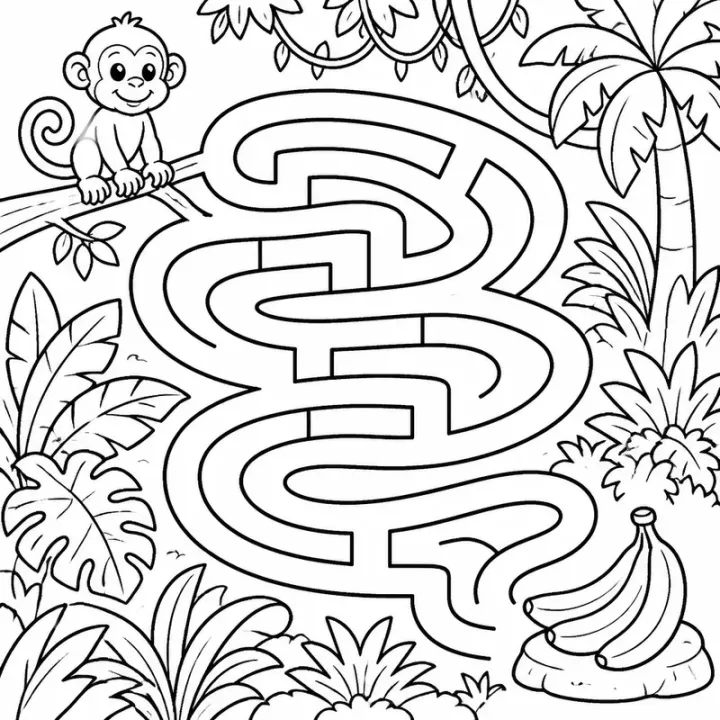

# Christmas Activity Book Prompts for Kids: Mazes, Word Search & More



Christmas activity books are a classic stocking stuffer and one of the biggest seasonal sellers on Amazon KDP and Etsy. These prompts cover a cozy preschool book, a busy North Pole puzzle book and a 24-day advent puzzle countdown. Every scene uses original characters, so the book is safe to sell.

> **Make any of these in one click.** Each prompt opens in [InkChamps](https://inkchamps.com/?utm_source=github&utm_medium=prompt_library&utm_campaign=ai-coloring-book-prompts&utm_content=christmas-activity-book-prompts), the AI book maker that turns a brief into a print-ready PDF for Amazon KDP, Etsy or home printing. Or copy the brief into any AI tool you like.

**Prompts on this page:** [Cozy Christmas for preschoolers](#1-cozy-christmas-for-preschoolers) · [North Pole workshop puzzle book](#2-north-pole-workshop-puzzle-book) · [24-day advent puzzle countdown](#3-24-day-advent-puzzle-countdown)

## 1. Cozy Christmas for preschoolers

**Ages:** 3-6 · **Pages:** 30 · **Size:** 8.5 × 11 in · **Activities:** Tracing (6), Shadow matching (8), Connect the dots (8), Coloring pages (8) · **Quality:** Standard · **Credits:** 30 Standard · 60 Premium

```text
A cozy Christmas at home: decorating the tree, a gingerbread house, hanging stockings by the fireplace, a snowman with a carrot nose, a reindeer in the snow, a sleigh full of gifts, mittens and hot cocoa, cookies for Santa. Tracing pages trace candy cane stripes, snowflake lines and the shapes of a star, bell and tree. Shadows to match: bell, stocking, star, gift, snowman, reindeer, candle, tree.
```

[**▶ Make this activity book on InkChamps**](https://inkchamps.com/dashboard/?tool=activity-book&prompt=A%20cozy%20Christmas%20at%20home%3A%20decorating%20the%20tree%2C%20a%20gingerbread%20house%2C%20hanging%20stockings%20by%20the%20fireplace%2C%20a%20snowman%20with%20a%20carrot%20nose%2C%20a%20reindeer%20in%20the%20snow%2C%20a%20sleigh%20full%20of%20gifts%2C%20mittens%20and%20hot%20cocoa%2C%20cookies%20for%20Santa.%20Tracing%20pages%20trace%20candy%20cane%20stripes%2C%20snowflake%20lines%20and%20the%20shapes%20of%20a%20star%2C%20bell%20and%20tree.%20Shadows%20to%20match%3A%20bell%2C%20stocking%2C%20star%2C%20gift%2C%20snowman%2C%20reindeer%2C%20candle%2C%20tree.&utm_source=github&utm_medium=prompt_library&utm_campaign=ai-coloring-book-prompts&utm_content=christmas-activity-book-prompts-1)

*Why it works:* Grandparents and parents pick up a cozy, simple book like this as a stocking stuffer for a three- or four-year-old, and the tracing pages make it a little bit educational too.

<details><summary>Exact settings for AI agents (InkChamps MCP)</summary>

```json
{
  "tool": "create_activity_book",
  "arguments": {
    "ageGroup": "3-6",
    "numberOfPages": 30,
    "highQuality": false,
    "pageSize": "8.5x11",
    "description": "A cozy Christmas at home: decorating the tree, a gingerbread house, hanging stockings by the fireplace, a snowman with a carrot nose, a reindeer in the snow, a sleigh full of gifts, mittens and hot cocoa, cookies for Santa. Tracing pages trace candy cane stripes, snowflake lines and the shapes of a star, bell and tree. Shadows to match: bell, stocking, star, gift, snowman, reindeer, candle, tree.",
    "activities": [
      "tracing_worksheet_book",
      "shadow_matching_book",
      "connect_the_dots_book",
      "coloring_book"
    ],
    "inkByType": {
      "tracing_worksheet_book": "black_and_white",
      "shadow_matching_book": "color",
      "connect_the_dots_book": "black_and_white"
    },
    "pagesByType": {
      "tracing_worksheet_book": 6,
      "shadow_matching_book": 8,
      "connect_the_dots_book": 8,
      "coloring_book": 8
    }
  }
}
```

</details>

## 2. North Pole workshop puzzle book

**Ages:** 6-9 · **Pages:** 40 · **Size:** 8.5 × 11 in · **Activities:** Mazes (10), Word search (10), Spot the difference (10), Coloring pages (10) · **Maze styles:** walls, tube, round · **Quality:** Standard · **Credits:** 40 Standard · 80 Premium

```text
A busy North Pole workshop: elves painting wooden toys, wrapping presents on a conveyor belt, a reindeer stable, a mail room full of letters, a polar bear sledding, a sleigh loading up on Christmas Eve. Word search words: REINDEER, SLEIGH, SNOWFLAKE, MISTLETOE, ORNAMENT, STOCKING, CHIMNEY, COOKIES, ELVES, WREATH, CANDY CANE, PRESENTS, CAROLS, TINSEL, COCOA. Mazes guide the sleigh across rooftops to deliver every gift.
```

[**▶ Make this activity book on InkChamps**](https://inkchamps.com/dashboard/?tool=activity-book&prompt=A%20busy%20North%20Pole%20workshop%3A%20elves%20painting%20wooden%20toys%2C%20wrapping%20presents%20on%20a%20conveyor%20belt%2C%20a%20reindeer%20stable%2C%20a%20mail%20room%20full%20of%20letters%2C%20a%20polar%20bear%20sledding%2C%20a%20sleigh%20loading%20up%20on%20Christmas%20Eve.%20Word%20search%20words%3A%20REINDEER%2C%20SLEIGH%2C%20SNOWFLAKE%2C%20MISTLETOE%2C%20ORNAMENT%2C%20STOCKING%2C%20CHIMNEY%2C%20COOKIES%2C%20ELVES%2C%20WREATH%2C%20CANDY%20CANE%2C%20PRESENTS%2C%20CAROLS%2C%20TINSEL%2C%20COCOA.%20Mazes%20guide%20the%20sleigh%20across%20rooftops%20to%20deliver%20every%20gift.&utm_source=github&utm_medium=prompt_library&utm_campaign=ai-coloring-book-prompts&utm_content=christmas-activity-book-prompts-2)

*Why it works:* This is the core stocking-stuffer book for 6-9 year olds, and a workshop setting gives every page a new busy scene for spot the difference.

<details><summary>Exact settings for AI agents (InkChamps MCP)</summary>

```json
{
  "tool": "create_activity_book",
  "arguments": {
    "ageGroup": "6-9",
    "numberOfPages": 40,
    "highQuality": false,
    "pageSize": "8.5x11",
    "description": "A busy North Pole workshop: elves painting wooden toys, wrapping presents on a conveyor belt, a reindeer stable, a mail room full of letters, a polar bear sledding, a sleigh loading up on Christmas Eve. Word search words: REINDEER, SLEIGH, SNOWFLAKE, MISTLETOE, ORNAMENT, STOCKING, CHIMNEY, COOKIES, ELVES, WREATH, CANDY CANE, PRESENTS, CAROLS, TINSEL, COCOA. Mazes guide the sleigh across rooftops to deliver every gift.",
    "activities": [
      "maze_book",
      "word_search_book",
      "spot_the_difference_book",
      "coloring_book"
    ],
    "inkByType": {
      "maze_book": "color",
      "word_search_book": "black_and_white",
      "spot_the_difference_book": "color"
    },
    "mazeStyles": [
      "walls",
      "tube",
      "round"
    ],
    "pagesByType": {
      "maze_book": 10,
      "word_search_book": 10,
      "spot_the_difference_book": 10,
      "coloring_book": 10
    }
  }
}
```

</details>

## 3. 24-day advent puzzle countdown

**Ages:** 9-13 · **Pages:** 24 · **Size:** 8.5 × 11 in · **Activities:** Word search (8), Sudoku (8), Mazes (8) · **Maze styles:** walls, square tube, round · **Quality:** Standard · **Credits:** 24 Standard · 48 Premium

```text
A countdown to Christmas with one puzzle for each day from December 1 to 24, decorated with a snowy village: ice skating on a pond, a holiday market, carolers, a train through snowy pines, a cabin at night. Word search lists. Winter: BLIZZARD, ICICLE, SNOWDRIFT, SNOWFLAKE, TOBOGGAN. Baking: NUTMEG, CINNAMON, SHORTBREAD, FRUITCAKE. Traditions: ADVENT, POINSETTIA, NUTCRACKER, YULE LOG. Mazes are snowy forest paths.
```

[**▶ Make this activity book on InkChamps**](https://inkchamps.com/dashboard/?tool=activity-book&prompt=A%20countdown%20to%20Christmas%20with%20one%20puzzle%20for%20each%20day%20from%20December%201%20to%2024%2C%20decorated%20with%20a%20snowy%20village%3A%20ice%20skating%20on%20a%20pond%2C%20a%20holiday%20market%2C%20carolers%2C%20a%20train%20through%20snowy%20pines%2C%20a%20cabin%20at%20night.%20Word%20search%20lists.%20Winter%3A%20BLIZZARD%2C%20ICICLE%2C%20SNOWDRIFT%2C%20SNOWFLAKE%2C%20TOBOGGAN.%20Baking%3A%20NUTMEG%2C%20CINNAMON%2C%20SHORTBREAD%2C%20FRUITCAKE.%20Traditions%3A%20ADVENT%2C%20POINSETTIA%2C%20NUTCRACKER%2C%20YULE%20LOG.%20Mazes%20are%20snowy%20forest%20paths.&utm_source=github&utm_medium=prompt_library&utm_campaign=ai-coloring-book-prompts&utm_content=christmas-activity-book-prompts-3)

*Why it works:* Parents of tweens want a no-chocolate advent calendar, and exactly 24 puzzles gives a daily December ritual that is easy to market.

<details><summary>Exact settings for AI agents (InkChamps MCP)</summary>

```json
{
  "tool": "create_activity_book",
  "arguments": {
    "ageGroup": "9-13",
    "numberOfPages": 24,
    "highQuality": false,
    "pageSize": "8.5x11",
    "description": "A countdown to Christmas with one puzzle for each day from December 1 to 24, decorated with a snowy village: ice skating on a pond, a holiday market, carolers, a train through snowy pines, a cabin at night. Word search lists. Winter: BLIZZARD, ICICLE, SNOWDRIFT, SNOWFLAKE, TOBOGGAN. Baking: NUTMEG, CINNAMON, SHORTBREAD, FRUITCAKE. Traditions: ADVENT, POINSETTIA, NUTCRACKER, YULE LOG. Mazes are snowy forest paths.",
    "activities": [
      "word_search_book",
      "sudoku_book",
      "maze_book"
    ],
    "inkByType": {
      "word_search_book": "black_and_white",
      "sudoku_book": "black_and_white",
      "maze_book": "black_and_white"
    },
    "mazeStyles": [
      "walls",
      "square_tube",
      "round"
    ],
    "pagesByType": {
      "word_search_book": 8,
      "sudoku_book": 8,
      "maze_book": 8
    }
  }
}
```

</details>

## Tips for christmas activity book

- Publish Christmas books by early October; KDP review plus holiday shipping eats November.
- Use an original Santa's helper elf or reindeer with a name instead of any character from a holiday film.
- A 24-page advent version, one puzzle a day, gives buyers a reason to start the book on December 1st.

## More prompts like these

- [Large Print Word Search Prompts for Adults and Seniors](large-print-word-search-prompts.md)
- [Maze Book Prompts for Kids: Easy to Hard Mazes by Age](maze-book-prompts.md)
- [Sudoku Puzzle Book Prompts for Kids, Teens and Adults](sudoku-puzzle-book-prompts.md)
- [Ocean Activity Book Prompts for Kids: Sea Animal Mazes & Puzzles](ocean-activity-book-prompts.md)
- [Dinosaur Activity Book Prompts for Kids (Mazes, Word Search & More)](dinosaur-activity-book-prompts.md)
- [Preschool Workbook Prompts: ABC Tracing, Shapes & Matching (Ages 3-6)](preschool-workbook-prompts.md)

---

[All activity books prompts](README.md) · [Every prompt in the library](../../README.md) · [Browse on the website](https://gunjchhetri.github.io/ai-coloring-book-prompts/activity-books/christmas-activity-book-prompts/) · Prompts licensed [CC BY 4.0](../../LICENSE) by [InkChamps](https://inkchamps.com/?utm_source=github&utm_medium=prompt_library&utm_campaign=ai-coloring-book-prompts&utm_content=footer)
