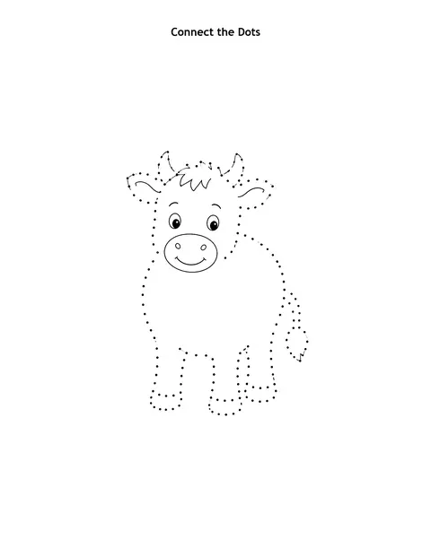

# Dinosaur Activity Book: prompts



3 prompts. The full page, with sample pages and tips, is in the [InkChamps prompt library](https://inkchamps.com/prompts/activity-books/dinosaur/). Each prompt below opens in InkChamps with one click; or copy the brief into any AI tool.

**Prompts on this page:** [Friendly dinosaur valley for preschoolers](#1-friendly-dinosaur-valley-for-preschoolers) · [Dinosaur puzzle adventure for ages 6-9](#2-dinosaur-puzzle-adventure-for-ages-6-9) · [Fossil hunter logic book for ages 9-13](#3-fossil-hunter-logic-book-for-ages-9-13)

## 1. Friendly dinosaur valley for preschoolers

**Ages:** 3-6 · **Pages:** 30 · **Size:** 8.5 × 11 in · **Activities:** Connect the dots (8), Shadow matching (8), Mazes (6), Coloring pages (8) · **Maze styles:** tube, square tube · **Quality:** Standard · **Credits:** 30 Standard · 60 Premium

```text
Friendly dinosaurs in a sunny prehistoric valley: a baby triceratops hatching from an egg, a brachiosaurus eating treetop leaves, a stegosaurus splashing in a puddle, a pteranodon gliding over a smoking volcano, a little T. rex digging up a bone. Mazes help a hungry dinosaur reach its nest of eggs or a pile of ferns. Keep every dinosaur smiling and gentle, with no fighting or sharp teeth.
```

[**▶ Make this activity book on InkChamps**](https://inkchamps.com/dashboard/?tool=activity-book&prompt=Friendly%20dinosaurs%20in%20a%20sunny%20prehistoric%20valley%3A%20a%20baby%20triceratops%20hatching%20from%20an%20egg%2C%20a%20brachiosaurus%20eating%20treetop%20leaves%2C%20a%20stegosaurus%20splashing%20in%20a%20puddle%2C%20a%20pteranodon%20gliding%20over%20a%20smoking%20volcano%2C%20a%20little%20T.%20rex%20digging%20up%20a%20bone.%20Mazes%20help%20a%20hungry%20dinosaur%20reach%20its%20nest%20of%20eggs%20or%20a%20pile%20of%20ferns.%20Keep%20every%20dinosaur%20smiling%20and%20gentle%2C%20with%20no%20fighting%20or%20sharp%20teeth.&utm_source=github&utm_medium=prompt_library&utm_campaign=ai-coloring-book-prompts&utm_content=dinosaur-activity-book-prompts-1)

<details><summary>Exact settings for AI agents (InkChamps MCP)</summary>

```json
{
  "tool": "create_activity_book",
  "arguments": {
    "ageGroup": "3-6",
    "numberOfPages": 30,
    "highQuality": false,
    "pageSize": "8.5x11",
    "description": "Friendly dinosaurs in a sunny prehistoric valley: a baby triceratops hatching from an egg, a brachiosaurus eating treetop leaves, a stegosaurus splashing in a puddle, a pteranodon gliding over a smoking volcano, a little T. rex digging up a bone. Mazes help a hungry dinosaur reach its nest of eggs or a pile of ferns. Keep every dinosaur smiling and gentle, with no fighting or sharp teeth.",
    "activities": [
      "connect_the_dots_book",
      "shadow_matching_book",
      "maze_book",
      "coloring_book"
    ],
    "inkByType": {
      "connect_the_dots_book": "black_and_white",
      "shadow_matching_book": "color",
      "maze_book": "color"
    },
    "mazeStyles": [
      "tube",
      "square_tube"
    ],
    "pagesByType": {
      "connect_the_dots_book": 8,
      "shadow_matching_book": 8,
      "maze_book": 6,
      "coloring_book": 8
    }
  }
}
```

</details>

## 2. Dinosaur puzzle adventure for ages 6-9

**Ages:** 6-9 · **Pages:** 40 · **Size:** 8.5 × 11 in · **Activities:** Mazes (10), Word search (10), Spot the difference (8), Connect the dots (6), Coloring pages (6) · **Maze styles:** walls, tube, round · **Quality:** Standard · **Credits:** 40 Standard · 80 Premium

```text
A dinosaur expedition through jungles, swamps, volcano fields and a riverbank full of footprints. Mazes guide a raptor back to its nest or an explorer jeep through ferns. Word search words: DINOSAUR, HORNS, PLATES, RAPTOR, FOSSIL, VOLCANO, JURASSIC, HERBIVORE, CARNIVORE, SKELETON, FOOTPRINT, EGG, CLAW, TAIL, SWAMP. Spot the difference scenes: a dinosaur picnic, a nest of hatchlings, a museum skeleton hall.
```

[**▶ Make this activity book on InkChamps**](https://inkchamps.com/dashboard/?tool=activity-book&prompt=A%20dinosaur%20expedition%20through%20jungles%2C%20swamps%2C%20volcano%20fields%20and%20a%20riverbank%20full%20of%20footprints.%20Mazes%20guide%20a%20raptor%20back%20to%20its%20nest%20or%20an%20explorer%20jeep%20through%20ferns.%20Word%20search%20words%3A%20DINOSAUR%2C%20HORNS%2C%20PLATES%2C%20RAPTOR%2C%20FOSSIL%2C%20VOLCANO%2C%20JURASSIC%2C%20HERBIVORE%2C%20CARNIVORE%2C%20SKELETON%2C%20FOOTPRINT%2C%20EGG%2C%20CLAW%2C%20TAIL%2C%20SWAMP.%20Spot%20the%20difference%20scenes%3A%20a%20dinosaur%20picnic%2C%20a%20nest%20of%20hatchlings%2C%20a%20museum%20skeleton%20hall.&utm_source=github&utm_medium=prompt_library&utm_campaign=ai-coloring-book-prompts&utm_content=dinosaur-activity-book-prompts-2)

<details><summary>Exact settings for AI agents (InkChamps MCP)</summary>

```json
{
  "tool": "create_activity_book",
  "arguments": {
    "ageGroup": "6-9",
    "numberOfPages": 40,
    "highQuality": false,
    "pageSize": "8.5x11",
    "description": "A dinosaur expedition through jungles, swamps, volcano fields and a riverbank full of footprints. Mazes guide a raptor back to its nest or an explorer jeep through ferns. Word search words: DINOSAUR, HORNS, PLATES, RAPTOR, FOSSIL, VOLCANO, JURASSIC, HERBIVORE, CARNIVORE, SKELETON, FOOTPRINT, EGG, CLAW, TAIL, SWAMP. Spot the difference scenes: a dinosaur picnic, a nest of hatchlings, a museum skeleton hall.",
    "activities": [
      "maze_book",
      "word_search_book",
      "spot_the_difference_book",
      "connect_the_dots_book",
      "coloring_book"
    ],
    "inkByType": {
      "maze_book": "color",
      "word_search_book": "black_and_white",
      "spot_the_difference_book": "color",
      "connect_the_dots_book": "black_and_white"
    },
    "mazeStyles": [
      "walls",
      "tube",
      "round"
    ],
    "pagesByType": {
      "maze_book": 10,
      "word_search_book": 10,
      "spot_the_difference_book": 8,
      "connect_the_dots_book": 6,
      "coloring_book": 6
    }
  }
}
```

</details>

## 3. Fossil hunter logic book for ages 9-13

**Ages:** 9-13 · **Pages:** 50 · **Size:** 8.5 × 11 in · **Activities:** Word search (14), Sudoku (12), Mazes (14), Spot the difference (10) · **Maze styles:** walls, square tube, round · **Quality:** Standard · **Credits:** 50 Standard · 100 Premium

```text
A fossil dig in a desert canyon: paleontologists with brushes, picks and sieves, rock layers, a field tent, a museum lab. Word search lists by topic. Periods: TRIASSIC, JURASSIC, CRETACEOUS, MESOZOIC, EXTINCTION. Dinosaurs: ANKYLOSAURUS, TRICERATOPS, SPINOSAURUS, ALLOSAURUS, IGUANODON, DIPLODOCUS. Dig site: TROWEL, BRUSH, SIEVE, PLASTER, CHISEL, SEDIMENT, AMBER. Mazes run through canyon tunnels and dig-site trenches.
```

[**▶ Make this activity book on InkChamps**](https://inkchamps.com/dashboard/?tool=activity-book&prompt=A%20fossil%20dig%20in%20a%20desert%20canyon%3A%20paleontologists%20with%20brushes%2C%20picks%20and%20sieves%2C%20rock%20layers%2C%20a%20field%20tent%2C%20a%20museum%20lab.%20Word%20search%20lists%20by%20topic.%20Periods%3A%20TRIASSIC%2C%20JURASSIC%2C%20CRETACEOUS%2C%20MESOZOIC%2C%20EXTINCTION.%20Dinosaurs%3A%20ANKYLOSAURUS%2C%20TRICERATOPS%2C%20SPINOSAURUS%2C%20ALLOSAURUS%2C%20IGUANODON%2C%20DIPLODOCUS.%20Dig%20site%3A%20TROWEL%2C%20BRUSH%2C%20SIEVE%2C%20PLASTER%2C%20CHISEL%2C%20SEDIMENT%2C%20AMBER.%20Mazes%20run%20through%20canyon%20tunnels%20and%20dig-site%20trenches.&utm_source=github&utm_medium=prompt_library&utm_campaign=ai-coloring-book-prompts&utm_content=dinosaur-activity-book-prompts-3)

<details><summary>Exact settings for AI agents (InkChamps MCP)</summary>

```json
{
  "tool": "create_activity_book",
  "arguments": {
    "ageGroup": "9-13",
    "numberOfPages": 50,
    "highQuality": false,
    "pageSize": "8.5x11",
    "description": "A fossil dig in a desert canyon: paleontologists with brushes, picks and sieves, rock layers, a field tent, a museum lab. Word search lists by topic. Periods: TRIASSIC, JURASSIC, CRETACEOUS, MESOZOIC, EXTINCTION. Dinosaurs: ANKYLOSAURUS, TRICERATOPS, SPINOSAURUS, ALLOSAURUS, IGUANODON, DIPLODOCUS. Dig site: TROWEL, BRUSH, SIEVE, PLASTER, CHISEL, SEDIMENT, AMBER. Mazes run through canyon tunnels and dig-site trenches.",
    "activities": [
      "word_search_book",
      "sudoku_book",
      "maze_book",
      "spot_the_difference_book"
    ],
    "inkByType": {
      "word_search_book": "black_and_white",
      "sudoku_book": "black_and_white",
      "maze_book": "black_and_white",
      "spot_the_difference_book": "color"
    },
    "mazeStyles": [
      "walls",
      "square_tube",
      "round"
    ],
    "pagesByType": {
      "word_search_book": 14,
      "sudoku_book": 12,
      "maze_book": 14,
      "spot_the_difference_book": 10
    }
  }
}
```

</details>

## More prompts like these

- [Preschool Workbook Prompts: ABC Tracing, Shapes & Matching (Ages 3-6)](preschool-workbook-prompts.md)
- [Travel Activity Book Prompts for Kids: Road Trip & Airplane Fun](travel-activity-book-prompts.md)
- [Space Activity Book Prompts for Kids: Planets, Rockets & Puzzles](space-activity-book-prompts.md)
- [Halloween Activity Book Prompts for Kids (Not Too Spooky)](halloween-activity-book-prompts.md)
- [Christmas Activity Book Prompts for Kids: Mazes, Word Search & More](christmas-activity-book-prompts.md)
- [Large Print Word Search Prompts for Adults and Seniors](large-print-word-search-prompts.md)

---

[All activity books prompts](README.md) · [Every prompt in the library](../../README.md) · [This page on InkChamps](https://inkchamps.com/prompts/activity-books/dinosaur/) · Prompts licensed [CC BY 4.0](../../LICENSE) by [InkChamps](https://inkchamps.com/?utm_source=github&utm_medium=prompt_library&utm_campaign=ai-coloring-book-prompts&utm_content=footer)
