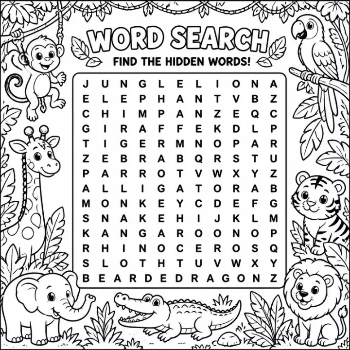

# Large Print Word Search: prompts



3 prompts. The full page, with sample pages and tips, is in the [InkChamps prompt library](https://inkchamps.com/prompts/activity-books/large-print-word-search/). Each prompt below opens in InkChamps with one click; or copy the brief into any AI tool.

**Prompts on this page:** [Gardener's large print word search](#1-gardeners-large-print-word-search) · [Travel the world large print word search](#2-travel-the-world-large-print-word-search) · [1960s nostalgia large print word search](#3-1960s-nostalgia-large-print-word-search)

## 1. Gardener's large print word search

**Ages:** 13+ · **Pages:** 30 · **Size:** 8.5 × 11 in · **Activities:** Word search (30) · **Quality:** Standard · **Credits:** 30 Standard · 60 Premium

```text
A large print gardening word search, each puzzle framed by flowers and watering cans. Flowers: ROSE, TULIP, DAISY, LILAC, PEONY, DAHLIA, PANSY, IRIS, POPPY, ASTER, LILY, ZINNIA. Vegetables: TOMATO, CARROT, RADISH, SPINACH, PUMPKIN, ONION, BEAN, PEA, LEEK, CORN, BEET, KALE. Herbs: BASIL, THYME, MINT, PARSLEY, ROSEMARY, SAGE, DILL, CHIVES, OREGANO, FENNEL, LAVENDER, BAY. Garden birds: ROBIN, FINCH, WREN, CARDINAL, BLUEBIRD, SPARROW, DOVE, JAY, OWL, CROW, THRUSH, HERON. Tools: TROWEL, RAKE, SHEARS, HOSE, SPADE, HOE, FORK, GLOVES, BUCKET, SHED, POT, SEEDS.
```

[**▶ Make this activity book on InkChamps**](https://inkchamps.com/dashboard/?tool=activity-book&prompt=A%20large%20print%20gardening%20word%20search%2C%20each%20puzzle%20framed%20by%20flowers%20and%20watering%20cans.%20Flowers%3A%20ROSE%2C%20TULIP%2C%20DAISY%2C%20LILAC%2C%20PEONY%2C%20DAHLIA%2C%20PANSY%2C%20IRIS%2C%20POPPY%2C%20ASTER%2C%20LILY%2C%20ZINNIA.%20Vegetables%3A%20TOMATO%2C%20CARROT%2C%20RADISH%2C%20SPINACH%2C%20PUMPKIN%2C%20ONION%2C%20BEAN%2C%20PEA%2C%20LEEK%2C%20CORN%2C%20BEET%2C%20KALE.%20Herbs%3A%20BASIL%2C%20THYME%2C%20MINT%2C%20PARSLEY%2C%20ROSEMARY%2C%20SAGE%2C%20DILL%2C%20CHIVES%2C%20OREGANO%2C%20FENNEL%2C%20LAVENDER%2C%20BAY.%20Garden%20birds%3A%20ROBIN%2C%20FINCH%2C%20WREN%2C%20CARDINAL%2C%20BLUEBIRD%2C%20SPARROW%2C%20DOVE%2C%20JAY%2C%20OWL%2C%20CROW%2C%20THRUSH%2C%20HERON.%20Tools%3A%20TROWEL%2C%20RAKE%2C%20SHEARS%2C%20HOSE%2C%20SPADE%2C%20HOE%2C%20FORK%2C%20GLOVES%2C%20BUCKET%2C%20SHED%2C%20POT%2C%20SEEDS.&utm_source=github&utm_medium=prompt_library&utm_campaign=ai-coloring-book-prompts&utm_content=large-print-word-search-prompts-1)

<details><summary>Exact settings for AI agents (InkChamps MCP)</summary>

```json
{
  "tool": "create_activity_book",
  "arguments": {
    "ageGroup": "13+",
    "numberOfPages": 30,
    "highQuality": false,
    "pageSize": "8.5x11",
    "description": "A large print gardening word search, each puzzle framed by flowers and watering cans. Flowers: ROSE, TULIP, DAISY, LILAC, PEONY, DAHLIA, PANSY, IRIS, POPPY, ASTER, LILY, ZINNIA. Vegetables: TOMATO, CARROT, RADISH, SPINACH, PUMPKIN, ONION, BEAN, PEA, LEEK, CORN, BEET, KALE. Herbs: BASIL, THYME, MINT, PARSLEY, ROSEMARY, SAGE, DILL, CHIVES, OREGANO, FENNEL, LAVENDER, BAY. Garden birds: ROBIN, FINCH, WREN, CARDINAL, BLUEBIRD, SPARROW, DOVE, JAY, OWL, CROW, THRUSH, HERON. Tools: TROWEL, RAKE, SHEARS, HOSE, SPADE, HOE, FORK, GLOVES, BUCKET, SHED, POT, SEEDS.",
    "activities": [
      "word_search_book"
    ],
    "inkByType": {
      "word_search_book": "black_and_white"
    },
    "pagesByType": {
      "word_search_book": 30
    }
  }
}
```

</details>

## 2. Travel the world large print word search

**Ages:** 13+ · **Pages:** 30 · **Size:** 8.5 × 11 in · **Activities:** Word search (30) · **Quality:** Standard · **Credits:** 30 Standard · 60 Premium

```text
A large print armchair-travel word search, each puzzle framed with postcards and a vintage map. Europe: PARIS, VENICE, LISBON, VIENNA, DUBLIN, ATHENS, ROME, PRAGUE, OSLO, MADRID, BERLIN, NICE. Islands: HAWAII, BALI, SICILY, TAHITI, ICELAND, MALTA, CRETE, FIJI, CUBA, JAVA, CAPRI, SAMOA. Parks: CANYON, GEYSER, REDWOODS, GLACIER, MESA, LAKE, FALLS, TRAIL, CAMP, RIDGE, ARCHES, DUNES. Packing: PASSPORT, CAMERA, SUNHAT, POSTCARD, MAP, TICKET, SCARF, SNACKS, BOOK, PILLOW, SOCKS, KEYS. Ways to go: CRUISE, RAILWAY, FERRY, CARAVAN, AIRPLANE, BUS, TAXI, BIKE, TRAM, BOAT, COACH, CANOE.
```

[**▶ Make this activity book on InkChamps**](https://inkchamps.com/dashboard/?tool=activity-book&prompt=A%20large%20print%20armchair-travel%20word%20search%2C%20each%20puzzle%20framed%20with%20postcards%20and%20a%20vintage%20map.%20Europe%3A%20PARIS%2C%20VENICE%2C%20LISBON%2C%20VIENNA%2C%20DUBLIN%2C%20ATHENS%2C%20ROME%2C%20PRAGUE%2C%20OSLO%2C%20MADRID%2C%20BERLIN%2C%20NICE.%20Islands%3A%20HAWAII%2C%20BALI%2C%20SICILY%2C%20TAHITI%2C%20ICELAND%2C%20MALTA%2C%20CRETE%2C%20FIJI%2C%20CUBA%2C%20JAVA%2C%20CAPRI%2C%20SAMOA.%20Parks%3A%20CANYON%2C%20GEYSER%2C%20REDWOODS%2C%20GLACIER%2C%20MESA%2C%20LAKE%2C%20FALLS%2C%20TRAIL%2C%20CAMP%2C%20RIDGE%2C%20ARCHES%2C%20DUNES.%20Packing%3A%20PASSPORT%2C%20CAMERA%2C%20SUNHAT%2C%20POSTCARD%2C%20MAP%2C%20TICKET%2C%20SCARF%2C%20SNACKS%2C%20BOOK%2C%20PILLOW%2C%20SOCKS%2C%20KEYS.%20Ways%20to%20go%3A%20CRUISE%2C%20RAILWAY%2C%20FERRY%2C%20CARAVAN%2C%20AIRPLANE%2C%20BUS%2C%20TAXI%2C%20BIKE%2C%20TRAM%2C%20BOAT%2C%20COACH%2C%20CANOE.&utm_source=github&utm_medium=prompt_library&utm_campaign=ai-coloring-book-prompts&utm_content=large-print-word-search-prompts-2)

<details><summary>Exact settings for AI agents (InkChamps MCP)</summary>

```json
{
  "tool": "create_activity_book",
  "arguments": {
    "ageGroup": "13+",
    "numberOfPages": 30,
    "highQuality": false,
    "pageSize": "8.5x11",
    "description": "A large print armchair-travel word search, each puzzle framed with postcards and a vintage map. Europe: PARIS, VENICE, LISBON, VIENNA, DUBLIN, ATHENS, ROME, PRAGUE, OSLO, MADRID, BERLIN, NICE. Islands: HAWAII, BALI, SICILY, TAHITI, ICELAND, MALTA, CRETE, FIJI, CUBA, JAVA, CAPRI, SAMOA. Parks: CANYON, GEYSER, REDWOODS, GLACIER, MESA, LAKE, FALLS, TRAIL, CAMP, RIDGE, ARCHES, DUNES. Packing: PASSPORT, CAMERA, SUNHAT, POSTCARD, MAP, TICKET, SCARF, SNACKS, BOOK, PILLOW, SOCKS, KEYS. Ways to go: CRUISE, RAILWAY, FERRY, CARAVAN, AIRPLANE, BUS, TAXI, BIKE, TRAM, BOAT, COACH, CANOE.",
    "activities": [
      "word_search_book"
    ],
    "inkByType": {
      "word_search_book": "black_and_white"
    },
    "pagesByType": {
      "word_search_book": 30
    }
  }
}
```

</details>

## 3. 1960s nostalgia large print word search

**Ages:** 13+ · **Pages:** 24 · **Size:** 8.5 × 11 in · **Activities:** Word search (24) · **Quality:** Standard · **Credits:** 24 Standard · 48 Premium

```text
A large print 1960s word search, each puzzle decorated with jukeboxes and vinyl records. Fashion: MINISKIRT, BEEHIVE, GOGO BOOTS, TIE DYE, BELL BOTTOMS, BEADS, FRINGE, SANDALS, POLKA DOT, HEADBAND, PLATFORMS, PONCHO. Dances: TWIST, LIMBO, STROLL, SWIM, FRUG, MONKEY, PONY, JERK, HUSTLE, SHIMMY, LOCOMOTION, SHAKE. At home: TV DINNER, PERCOLATOR, FONDUE, JELLO, LAVA LAMP, TRANSISTOR, RECORDS, RADIO, PHONE, SHAG RUG, FORMICA, AVOCADO. Big moments: MOON LANDING, SPACE RACE, PEACE SIGN, SURF MUSIC, ASTRONAUT, ROCKET, WOODSTOCK, DRIVE IN, JUKEBOX, DINER, BEATNIK, FLOWER POWER.
```

[**▶ Make this activity book on InkChamps**](https://inkchamps.com/dashboard/?tool=activity-book&prompt=A%20large%20print%201960s%20word%20search%2C%20each%20puzzle%20decorated%20with%20jukeboxes%20and%20vinyl%20records.%20Fashion%3A%20MINISKIRT%2C%20BEEHIVE%2C%20GOGO%20BOOTS%2C%20TIE%20DYE%2C%20BELL%20BOTTOMS%2C%20BEADS%2C%20FRINGE%2C%20SANDALS%2C%20POLKA%20DOT%2C%20HEADBAND%2C%20PLATFORMS%2C%20PONCHO.%20Dances%3A%20TWIST%2C%20LIMBO%2C%20STROLL%2C%20SWIM%2C%20FRUG%2C%20MONKEY%2C%20PONY%2C%20JERK%2C%20HUSTLE%2C%20SHIMMY%2C%20LOCOMOTION%2C%20SHAKE.%20At%20home%3A%20TV%20DINNER%2C%20PERCOLATOR%2C%20FONDUE%2C%20JELLO%2C%20LAVA%20LAMP%2C%20TRANSISTOR%2C%20RECORDS%2C%20RADIO%2C%20PHONE%2C%20SHAG%20RUG%2C%20FORMICA%2C%20AVOCADO.%20Big%20moments%3A%20MOON%20LANDING%2C%20SPACE%20RACE%2C%20PEACE%20SIGN%2C%20SURF%20MUSIC%2C%20ASTRONAUT%2C%20ROCKET%2C%20WOODSTOCK%2C%20DRIVE%20IN%2C%20JUKEBOX%2C%20DINER%2C%20BEATNIK%2C%20FLOWER%20POWER.&utm_source=github&utm_medium=prompt_library&utm_campaign=ai-coloring-book-prompts&utm_content=large-print-word-search-prompts-3)

<details><summary>Exact settings for AI agents (InkChamps MCP)</summary>

```json
{
  "tool": "create_activity_book",
  "arguments": {
    "ageGroup": "13+",
    "numberOfPages": 24,
    "highQuality": false,
    "pageSize": "8.5x11",
    "description": "A large print 1960s word search, each puzzle decorated with jukeboxes and vinyl records. Fashion: MINISKIRT, BEEHIVE, GOGO BOOTS, TIE DYE, BELL BOTTOMS, BEADS, FRINGE, SANDALS, POLKA DOT, HEADBAND, PLATFORMS, PONCHO. Dances: TWIST, LIMBO, STROLL, SWIM, FRUG, MONKEY, PONY, JERK, HUSTLE, SHIMMY, LOCOMOTION, SHAKE. At home: TV DINNER, PERCOLATOR, FONDUE, JELLO, LAVA LAMP, TRANSISTOR, RECORDS, RADIO, PHONE, SHAG RUG, FORMICA, AVOCADO. Big moments: MOON LANDING, SPACE RACE, PEACE SIGN, SURF MUSIC, ASTRONAUT, ROCKET, WOODSTOCK, DRIVE IN, JUKEBOX, DINER, BEATNIK, FLOWER POWER.",
    "activities": [
      "word_search_book"
    ],
    "inkByType": {
      "word_search_book": "black_and_white"
    },
    "pagesByType": {
      "word_search_book": 24
    }
  }
}
```

</details>

## More prompts like these

- [Maze Book Prompts for Kids: Easy to Hard Mazes by Age](maze-book-prompts.md)
- [Sudoku Puzzle Book Prompts for Kids, Teens and Adults](sudoku-puzzle-book-prompts.md)
- [Ocean Activity Book Prompts for Kids: Sea Animal Mazes & Puzzles](ocean-activity-book-prompts.md)
- [Dinosaur Activity Book Prompts for Kids (Mazes, Word Search & More)](dinosaur-activity-book-prompts.md)
- [Preschool Workbook Prompts: ABC Tracing, Shapes & Matching (Ages 3-6)](preschool-workbook-prompts.md)
- [Travel Activity Book Prompts for Kids: Road Trip & Airplane Fun](travel-activity-book-prompts.md)

---

[All activity books prompts](README.md) · [Every prompt in the library](../../README.md) · [This page on InkChamps](https://inkchamps.com/prompts/activity-books/large-print-word-search/) · Prompts licensed [CC BY 4.0](../../LICENSE) by [InkChamps](https://inkchamps.com/?utm_source=github&utm_medium=prompt_library&utm_campaign=ai-coloring-book-prompts&utm_content=footer)
