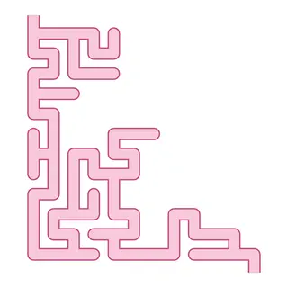

# Maze Book: prompts



3 prompts. The full page, with sample pages and tips, is in the [InkChamps prompt library](https://inkchamps.com/prompts/activity-books/maze-book/). Each prompt below opens in InkChamps with one click; or copy the brief into any AI tool.

**Prompts on this page:** [First mazes: help the animals get home](#1-first-mazes-help-the-animals-get-home) · [Adventure mazes for ages 6-9](#2-adventure-mazes-for-ages-6-9) · [Challenging labyrinths for ages 9-13](#3-challenging-labyrinths-for-ages-9-13)

## 1. First mazes: help the animals get home

**Ages:** 3-6 · **Pages:** 30 · **Size:** 8.5 × 11 in · **Activities:** Mazes (30) · **Maze styles:** tube, square tube · **Quality:** Standard · **Credits:** 30 Standard · 60 Premium

```text
Big, easy mazes where friendly animals find their way home: a puppy to its doghouse, a bee to a flower, a duckling to the pond, a squirrel to its acorn, a bunny to the carrot patch, a penguin to its family, a turtle to the sea, a hen to her nest, a fish to the coral, a mouse to the cheese. Each maze has a clear start animal and a goal, with simple garden, farm and seaside scenery around it.
```

[**▶ Make this activity book on InkChamps**](https://inkchamps.com/dashboard/?tool=activity-book&prompt=Big%2C%20easy%20mazes%20where%20friendly%20animals%20find%20their%20way%20home%3A%20a%20puppy%20to%20its%20doghouse%2C%20a%20bee%20to%20a%20flower%2C%20a%20duckling%20to%20the%20pond%2C%20a%20squirrel%20to%20its%20acorn%2C%20a%20bunny%20to%20the%20carrot%20patch%2C%20a%20penguin%20to%20its%20family%2C%20a%20turtle%20to%20the%20sea%2C%20a%20hen%20to%20her%20nest%2C%20a%20fish%20to%20the%20coral%2C%20a%20mouse%20to%20the%20cheese.%20Each%20maze%20has%20a%20clear%20start%20animal%20and%20a%20goal%2C%20with%20simple%20garden%2C%20farm%20and%20seaside%20scenery%20around%20it.&utm_source=github&utm_medium=prompt_library&utm_campaign=ai-coloring-book-prompts&utm_content=maze-book-prompts-1)

<details><summary>Exact settings for AI agents (InkChamps MCP)</summary>

```json
{
  "tool": "create_activity_book",
  "arguments": {
    "ageGroup": "3-6",
    "numberOfPages": 30,
    "highQuality": false,
    "pageSize": "8.5x11",
    "description": "Big, easy mazes where friendly animals find their way home: a puppy to its doghouse, a bee to a flower, a duckling to the pond, a squirrel to its acorn, a bunny to the carrot patch, a penguin to its family, a turtle to the sea, a hen to her nest, a fish to the coral, a mouse to the cheese. Each maze has a clear start animal and a goal, with simple garden, farm and seaside scenery around it.",
    "activities": [
      "maze_book"
    ],
    "inkByType": {
      "maze_book": "color"
    },
    "mazeStyles": [
      "tube",
      "square_tube"
    ],
    "pagesByType": {
      "maze_book": 30
    }
  }
}
```

</details>

## 2. Adventure mazes for ages 6-9

**Ages:** 6-9 · **Pages:** 50 · **Size:** 8.5 × 11 in · **Activities:** Mazes (50) · **Maze styles:** walls, tube, round · **Quality:** Standard · **Credits:** 50 Standard · 100 Premium

```text
Fifty adventure mazes, each in a new place: a pirate island to the buried treasure chest, a jungle temple to a golden idol, a castle to the dragon's tower, a submarine through a coral reef, a knight through a hedge garden, a train through mountain tunnels, a robot through a factory, a rocket through an asteroid belt, a beaver through a river dam, a camel across desert dunes.
```

[**▶ Make this activity book on InkChamps**](https://inkchamps.com/dashboard/?tool=activity-book&prompt=Fifty%20adventure%20mazes%2C%20each%20in%20a%20new%20place%3A%20a%20pirate%20island%20to%20the%20buried%20treasure%20chest%2C%20a%20jungle%20temple%20to%20a%20golden%20idol%2C%20a%20castle%20to%20the%20dragon%27s%20tower%2C%20a%20submarine%20through%20a%20coral%20reef%2C%20a%20knight%20through%20a%20hedge%20garden%2C%20a%20train%20through%20mountain%20tunnels%2C%20a%20robot%20through%20a%20factory%2C%20a%20rocket%20through%20an%20asteroid%20belt%2C%20a%20beaver%20through%20a%20river%20dam%2C%20a%20camel%20across%20desert%20dunes.&utm_source=github&utm_medium=prompt_library&utm_campaign=ai-coloring-book-prompts&utm_content=maze-book-prompts-2)

<details><summary>Exact settings for AI agents (InkChamps MCP)</summary>

```json
{
  "tool": "create_activity_book",
  "arguments": {
    "ageGroup": "6-9",
    "numberOfPages": 50,
    "highQuality": false,
    "pageSize": "8.5x11",
    "description": "Fifty adventure mazes, each in a new place: a pirate island to the buried treasure chest, a jungle temple to a golden idol, a castle to the dragon's tower, a submarine through a coral reef, a knight through a hedge garden, a train through mountain tunnels, a robot through a factory, a rocket through an asteroid belt, a beaver through a river dam, a camel across desert dunes.",
    "activities": [
      "maze_book"
    ],
    "inkByType": {
      "maze_book": "black_and_white"
    },
    "mazeStyles": [
      "walls",
      "tube",
      "round"
    ],
    "pagesByType": {
      "maze_book": 50
    }
  }
}
```

</details>

## 3. Challenging labyrinths for ages 9-13

**Ages:** 9-13 · **Pages:** 60 · **Size:** 8.5 × 11 in · **Activities:** Mazes (60) · **Maze styles:** walls, square tube, round · **Quality:** Standard · **Credits:** 60 Standard · 120 Premium

```text
Sixty hard mazes for older kids, themed as escape missions: an ancient stone labyrinth, a city of rooftops and alleys, an underground mine with rail carts, a space station on lockdown, an ice cave, a spy getting out of a laser-guarded museum, a hedge maze at a royal palace, a sewer system, a volcano lair, a lost city in the clouds. Mazes get harder from the start of the book to the end.
```

[**▶ Make this activity book on InkChamps**](https://inkchamps.com/dashboard/?tool=activity-book&prompt=Sixty%20hard%20mazes%20for%20older%20kids%2C%20themed%20as%20escape%20missions%3A%20an%20ancient%20stone%20labyrinth%2C%20a%20city%20of%20rooftops%20and%20alleys%2C%20an%20underground%20mine%20with%20rail%20carts%2C%20a%20space%20station%20on%20lockdown%2C%20an%20ice%20cave%2C%20a%20spy%20getting%20out%20of%20a%20laser-guarded%20museum%2C%20a%20hedge%20maze%20at%20a%20royal%20palace%2C%20a%20sewer%20system%2C%20a%20volcano%20lair%2C%20a%20lost%20city%20in%20the%20clouds.%20Mazes%20get%20harder%20from%20the%20start%20of%20the%20book%20to%20the%20end.&utm_source=github&utm_medium=prompt_library&utm_campaign=ai-coloring-book-prompts&utm_content=maze-book-prompts-3)

<details><summary>Exact settings for AI agents (InkChamps MCP)</summary>

```json
{
  "tool": "create_activity_book",
  "arguments": {
    "ageGroup": "9-13",
    "numberOfPages": 60,
    "highQuality": false,
    "pageSize": "8.5x11",
    "description": "Sixty hard mazes for older kids, themed as escape missions: an ancient stone labyrinth, a city of rooftops and alleys, an underground mine with rail carts, a space station on lockdown, an ice cave, a spy getting out of a laser-guarded museum, a hedge maze at a royal palace, a sewer system, a volcano lair, a lost city in the clouds. Mazes get harder from the start of the book to the end.",
    "activities": [
      "maze_book"
    ],
    "inkByType": {
      "maze_book": "black_and_white"
    },
    "mazeStyles": [
      "walls",
      "square_tube",
      "round"
    ],
    "pagesByType": {
      "maze_book": 60
    }
  }
}
```

</details>

## More prompts like these

- [Sudoku Puzzle Book Prompts for Kids, Teens and Adults](sudoku-puzzle-book-prompts.md)
- [Ocean Activity Book Prompts for Kids: Sea Animal Mazes & Puzzles](ocean-activity-book-prompts.md)
- [Dinosaur Activity Book Prompts for Kids (Mazes, Word Search & More)](dinosaur-activity-book-prompts.md)
- [Preschool Workbook Prompts: ABC Tracing, Shapes & Matching (Ages 3-6)](preschool-workbook-prompts.md)
- [Travel Activity Book Prompts for Kids: Road Trip & Airplane Fun](travel-activity-book-prompts.md)
- [Space Activity Book Prompts for Kids: Planets, Rockets & Puzzles](space-activity-book-prompts.md)

---

[All activity books prompts](README.md) · [Every prompt in the library](../../README.md) · [This page on InkChamps](https://inkchamps.com/prompts/activity-books/maze-book/) · Prompts licensed [CC BY 4.0](../../LICENSE) by [InkChamps](https://inkchamps.com/?utm_source=github&utm_medium=prompt_library&utm_campaign=ai-coloring-book-prompts&utm_content=footer)
