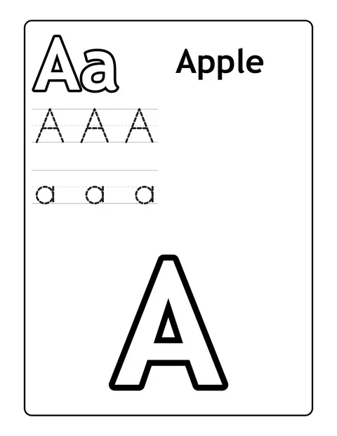

# Alphabet ABC Coloring Book Prompts for Toddlers & Preschool



Alphabet coloring books are a must-have for parents, preschool teachers and homeschoolers teaching letter recognition, and they sell steadily all year on Amazon KDP. These ABC coloring book prompts list every letter from A to Z with its word, so each of the 26 pages shows one letter and one clear picture. Choose animals, foods or vehicles depending on what the child loves.

> **Make any of these in one click.** Each prompt opens in [InkChamps](https://inkchamps.com/?utm_source=github&utm_medium=prompt_library&utm_campaign=ai-coloring-book-prompts&utm_content=alphabet-abc-coloring-book-prompts), the AI book maker that turns a brief into a print-ready PDF for Amazon KDP, Etsy or home printing. Or copy the brief into any AI tool you like.

**Prompts on this page:** [A to Z animals](#1-a-to-z-animals) · [A to Z yummy foods](#2-a-to-z-yummy-foods) · [A to Z things that go](#3-a-to-z-things-that-go)

## 1. A to Z animals

**Ages:** 3-6 · **Pages:** 26 · **Size:** 8.5 × 11 in · **Style:** Cute animals · **Detail:** Easy · **Layout:** One item per page, with its caption · **Quality:** Standard · **Credits:** 26 Standard · 78 Premium

```text
An alphabet book of animals, one letter per page, each page showing the letter and one big friendly animal: A alligator, B bear, C cat, D duck, E elephant, F fox, G giraffe, H hippo, I iguana, J jellyfish, K koala, L lion, M monkey, N narwhal, O owl, P penguin, Q quail, R rabbit, S sloth, T turtle, U umbrellabird, V vulture, W whale, X x-ray fish, Y yak, Z zebra.
```

[**▶ Make this coloring book on InkChamps**](https://inkchamps.com/dashboard/?tool=coloring-book&prompt=An%20alphabet%20book%20of%20animals%2C%20one%20letter%20per%20page%2C%20each%20page%20showing%20the%20letter%20and%20one%20big%20friendly%20animal%3A%20A%20alligator%2C%20B%20bear%2C%20C%20cat%2C%20D%20duck%2C%20E%20elephant%2C%20F%20fox%2C%20G%20giraffe%2C%20H%20hippo%2C%20I%20iguana%2C%20J%20jellyfish%2C%20K%20koala%2C%20L%20lion%2C%20M%20monkey%2C%20N%20narwhal%2C%20O%20owl%2C%20P%20penguin%2C%20Q%20quail%2C%20R%20rabbit%2C%20S%20sloth%2C%20T%20turtle%2C%20U%20umbrellabird%2C%20V%20vulture%2C%20W%20whale%2C%20X%20x-ray%20fish%2C%20Y%20yak%2C%20Z%20zebra.&utm_source=github&utm_medium=prompt_library&utm_campaign=ai-coloring-book-prompts&utm_content=alphabet-abc-coloring-book-prompts-1)

*Why it works:* Parents and preschool teachers buy animal alphabet books more than any other ABC theme, and one animal per letter keeps learning simple.

<details><summary>Exact settings for AI agents (InkChamps MCP)</summary>

```json
{
  "tool": "create_coloring_book",
  "arguments": {
    "ageGroup": "3-6",
    "numberOfPages": 26,
    "highQuality": false,
    "pageSize": "8.5x11",
    "description": "An alphabet book of animals, one letter per page, each page showing the letter and one big friendly animal: A alligator, B bear, C cat, D duck, E elephant, F fox, G giraffe, H hippo, I iguana, J jellyfish, K koala, L lion, M monkey, N narwhal, O owl, P penguin, Q quail, R rabbit, S sloth, T turtle, U umbrellabird, V vulture, W whale, X x-ray fish, Y yak, Z zebra.",
    "style": "cute_animals",
    "complexity": "easy",
    "title": "ABC Animals Coloring Book",
    "pageCategory": "concept"
  }
}
```

</details>

## 2. A to Z yummy foods

**Ages:** 3-6 · **Pages:** 26 · **Size:** 8.5 × 11 in · **Style:** Food fun · **Detail:** Easy · **Layout:** One item per page, with its caption · **Quality:** Standard · **Credits:** 26 Standard · 78 Premium

```text
An alphabet book of foods, one letter per page with the letter and one big tasty food: A apple, B banana, C carrot, D doughnut, E egg, F fig, G grapes, H honey, I ice cream, J jam, K kiwi, L lemon, M muffin, N noodles, O orange, P pear, Q quiche, R raspberry, S strawberry, T tomato, U upside-down cake, V vegetable soup, W watermelon, X xiao long bao dumplings, Y yogurt, Z zucchini.
```

[**▶ Make this coloring book on InkChamps**](https://inkchamps.com/dashboard/?tool=coloring-book&prompt=An%20alphabet%20book%20of%20foods%2C%20one%20letter%20per%20page%20with%20the%20letter%20and%20one%20big%20tasty%20food%3A%20A%20apple%2C%20B%20banana%2C%20C%20carrot%2C%20D%20doughnut%2C%20E%20egg%2C%20F%20fig%2C%20G%20grapes%2C%20H%20honey%2C%20I%20ice%20cream%2C%20J%20jam%2C%20K%20kiwi%2C%20L%20lemon%2C%20M%20muffin%2C%20N%20noodles%2C%20O%20orange%2C%20P%20pear%2C%20Q%20quiche%2C%20R%20raspberry%2C%20S%20strawberry%2C%20T%20tomato%2C%20U%20upside-down%20cake%2C%20V%20vegetable%20soup%2C%20W%20watermelon%2C%20X%20xiao%20long%20bao%20dumplings%2C%20Y%20yogurt%2C%20Z%20zucchini.&utm_source=github&utm_medium=prompt_library&utm_campaign=ai-coloring-book-prompts&utm_content=alphabet-abc-coloring-book-prompts-2)

*Why it works:* Parents of picky eaters and early-years teachers like a food alphabet that pairs letter learning with naming fruits and vegetables.

<details><summary>Exact settings for AI agents (InkChamps MCP)</summary>

```json
{
  "tool": "create_coloring_book",
  "arguments": {
    "ageGroup": "3-6",
    "numberOfPages": 26,
    "highQuality": false,
    "pageSize": "8.5x11",
    "description": "An alphabet book of foods, one letter per page with the letter and one big tasty food: A apple, B banana, C carrot, D doughnut, E egg, F fig, G grapes, H honey, I ice cream, J jam, K kiwi, L lemon, M muffin, N noodles, O orange, P pear, Q quiche, R raspberry, S strawberry, T tomato, U upside-down cake, V vegetable soup, W watermelon, X xiao long bao dumplings, Y yogurt, Z zucchini.",
    "style": "food_fun",
    "complexity": "easy",
    "pageCategory": "concept"
  }
}
```

</details>

## 3. A to Z things that go

**Ages:** 6-9 · **Pages:** 26 · **Size:** 8.5 × 11 in · **Style:** General coloring · **Detail:** Medium · **Layout:** One item per page, with its caption · **Quality:** Standard · **Credits:** 26 Standard · 78 Premium

```text
An alphabet book of vehicles, one letter per page, each showing the letter and the vehicle at work in a simple scene: A ambulance, B bulldozer, C cement mixer, D dump truck, E excavator, F fire truck, G garbage truck, H helicopter, I ice cream truck, J jet plane, K kayak, L locomotive, M motorcycle, N narrowboat, O ocean liner, P police car, Q quad bike, R rocket, S submarine, T tractor, U unicycle, V van, W wagon, X xebec sailing ship, Y yacht, Z zeppelin.
```

[**▶ Make this coloring book on InkChamps**](https://inkchamps.com/dashboard/?tool=coloring-book&prompt=An%20alphabet%20book%20of%20vehicles%2C%20one%20letter%20per%20page%2C%20each%20showing%20the%20letter%20and%20the%20vehicle%20at%20work%20in%20a%20simple%20scene%3A%20A%20ambulance%2C%20B%20bulldozer%2C%20C%20cement%20mixer%2C%20D%20dump%20truck%2C%20E%20excavator%2C%20F%20fire%20truck%2C%20G%20garbage%20truck%2C%20H%20helicopter%2C%20I%20ice%20cream%20truck%2C%20J%20jet%20plane%2C%20K%20kayak%2C%20L%20locomotive%2C%20M%20motorcycle%2C%20N%20narrowboat%2C%20O%20ocean%20liner%2C%20P%20police%20car%2C%20Q%20quad%20bike%2C%20R%20rocket%2C%20S%20submarine%2C%20T%20tractor%2C%20U%20unicycle%2C%20V%20van%2C%20W%20wagon%2C%20X%20xebec%20sailing%20ship%2C%20Y%20yacht%2C%20Z%20zeppelin.&utm_source=github&utm_medium=prompt_library&utm_campaign=ai-coloring-book-prompts&utm_content=alphabet-abc-coloring-book-prompts-3)

*Why it works:* Vehicle-loving kids and their parents look for a things-that-go alphabet, and simple working scenes keep it interesting for ages 6 to 9.

<details><summary>Exact settings for AI agents (InkChamps MCP)</summary>

```json
{
  "tool": "create_coloring_book",
  "arguments": {
    "ageGroup": "6-9",
    "numberOfPages": 26,
    "highQuality": false,
    "pageSize": "8.5x11",
    "description": "An alphabet book of vehicles, one letter per page, each showing the letter and the vehicle at work in a simple scene: A ambulance, B bulldozer, C cement mixer, D dump truck, E excavator, F fire truck, G garbage truck, H helicopter, I ice cream truck, J jet plane, K kayak, L locomotive, M motorcycle, N narrowboat, O ocean liner, P police car, Q quad bike, R rocket, S submarine, T tractor, U unicycle, V van, W wagon, X xebec sailing ship, Y yacht, Z zeppelin.",
    "style": "general_coloring",
    "complexity": "medium",
    "pageCategory": "concept"
  }
}
```

</details>

## Tips for alphabet abc coloring book

- List all 26 letters with their word so every page gets exactly one letter; set the page count to 26.
- Pick words a small child can say and recognise; obscure words make the letter harder to learn.
- Sell themed alphabet books as a series (animals, foods, vehicles); parents often buy two or three.

## More prompts like these

- [Numbers & Counting Coloring Book Prompts for Kids](numbers-counting-coloring-book-prompts.md)
- [Shapes and Colors Coloring Book Prompts for Preschool](shapes-and-colors-coloring-book-prompts.md)
- [Good Habits & Manners Coloring Book Prompts for Kids](good-habits-manners-coloring-book-prompts.md)
- [Feelings & Emotions Coloring Book Prompts for Kids](feelings-emotions-coloring-book-prompts.md)
- [Greek Mythology Coloring Book Prompts](greek-mythology-coloring-book-prompts.md)
- [Bible Story Coloring Book Prompts for Kids & Adults](bible-story-coloring-book-prompts.md)

---

[All coloring books prompts](README.md) · [Every prompt in the library](../../README.md) · [Browse on the website](https://gunjchhetri.github.io/ai-coloring-book-prompts/coloring-books/alphabet-abc-coloring-book-prompts/) · Prompts licensed [CC BY 4.0](../../LICENSE) by [InkChamps](https://inkchamps.com/?utm_source=github&utm_medium=prompt_library&utm_campaign=ai-coloring-book-prompts&utm_content=footer)
