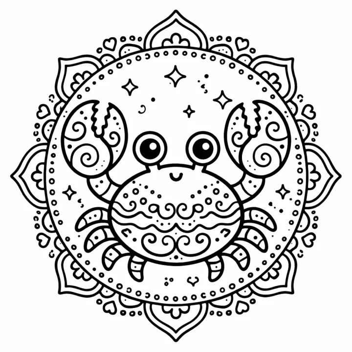

# Animal Mandala Coloring Book: prompts



3 prompts. The full page, with sample pages and tips, is in the [InkChamps prompt library](https://inkchamps.com/prompts/coloring-books/animal-mandala/). Each prompt below opens in InkChamps with one click; or copy the brief into any AI tool.

**Prompts on this page:** [Wild animal mandalas for adults](#1-wild-animal-mandalas-for-adults) · [Ocean creature mandalas for tweens](#2-ocean-creature-mandalas-for-tweens) · [Easy animal mandalas for kids](#3-easy-animal-mandalas-for-kids)

## 1. Wild animal mandalas for adults

**Ages:** 13+ · **Pages:** 50 · **Size:** 8.5 × 11 in · **Style:** Mandala animal · **Detail:** Hard · **Quality:** Premium · **Credits:** 50 Standard · 150 Premium

```text
Fifty majestic wild animals, each filled with intricate mandala and zentangle patterns: a lion with a mane of petals, an elephant draped in paisley, a wolf howling under a patterned moon, a great horned owl, a fox curled in a ring of leaves, a tiger, a stag with lace antlers, a grizzly bear, a giraffe, a hummingbird at a lotus, a sea turtle, a peacock and a chameleon, each set against a floral mandala backdrop.
```

[**▶ Make this coloring book on InkChamps**](https://inkchamps.com/dashboard/?tool=coloring-book&prompt=Fifty%20majestic%20wild%20animals%2C%20each%20filled%20with%20intricate%20mandala%20and%20zentangle%20patterns%3A%20a%20lion%20with%20a%20mane%20of%20petals%2C%20an%20elephant%20draped%20in%20paisley%2C%20a%20wolf%20howling%20under%20a%20patterned%20moon%2C%20a%20great%20horned%20owl%2C%20a%20fox%20curled%20in%20a%20ring%20of%20leaves%2C%20a%20tiger%2C%20a%20stag%20with%20lace%20antlers%2C%20a%20grizzly%20bear%2C%20a%20giraffe%2C%20a%20hummingbird%20at%20a%20lotus%2C%20a%20sea%20turtle%2C%20a%20peacock%20and%20a%20chameleon%2C%20each%20set%20against%20a%20floral%20mandala%20backdrop.&utm_source=github&utm_medium=prompt_library&utm_campaign=ai-coloring-book-prompts&utm_content=animal-mandala-coloring-book-prompts-1)

<details><summary>Exact settings for AI agents (InkChamps MCP)</summary>

```json
{
  "tool": "create_coloring_book",
  "arguments": {
    "ageGroup": "13+",
    "numberOfPages": 50,
    "highQuality": true,
    "pageSize": "8.5x11",
    "description": "Fifty majestic wild animals, each filled with intricate mandala and zentangle patterns: a lion with a mane of petals, an elephant draped in paisley, a wolf howling under a patterned moon, a great horned owl, a fox curled in a ring of leaves, a tiger, a stag with lace antlers, a grizzly bear, a giraffe, a hummingbird at a lotus, a sea turtle, a peacock and a chameleon, each set against a floral mandala backdrop.",
    "style": "mandala_animal",
    "complexity": "hard",
    "title": "Wild Animal Mandalas"
  }
}
```

</details>

## 2. Ocean creature mandalas for tweens

**Ages:** 9-13 · **Pages:** 40 · **Size:** 8.5 × 11 in · **Style:** Mandala sea · **Detail:** Medium · **Quality:** Standard · **Credits:** 40 Standard · 120 Premium

```text
Forty sea creatures filled with flowing mandala patterns: a sea turtle with a patterned shell, an octopus with swirling tentacles, a seahorse, a humpback whale, jellyfish trailing lace ribbons, a manta ray, dolphins leaping in a circle, a pufferfish, a hermit crab, a starfish, clownfish in an anemone, a narwhal, and coral reefs and shells woven between them like a tide-pool mandala.
```

[**▶ Make this coloring book on InkChamps**](https://inkchamps.com/dashboard/?tool=coloring-book&prompt=Forty%20sea%20creatures%20filled%20with%20flowing%20mandala%20patterns%3A%20a%20sea%20turtle%20with%20a%20patterned%20shell%2C%20an%20octopus%20with%20swirling%20tentacles%2C%20a%20seahorse%2C%20a%20humpback%20whale%2C%20jellyfish%20trailing%20lace%20ribbons%2C%20a%20manta%20ray%2C%20dolphins%20leaping%20in%20a%20circle%2C%20a%20pufferfish%2C%20a%20hermit%20crab%2C%20a%20starfish%2C%20clownfish%20in%20an%20anemone%2C%20a%20narwhal%2C%20and%20coral%20reefs%20and%20shells%20woven%20between%20them%20like%20a%20tide-pool%20mandala.&utm_source=github&utm_medium=prompt_library&utm_campaign=ai-coloring-book-prompts&utm_content=animal-mandala-coloring-book-prompts-2)

<details><summary>Exact settings for AI agents (InkChamps MCP)</summary>

```json
{
  "tool": "create_coloring_book",
  "arguments": {
    "ageGroup": "9-13",
    "numberOfPages": 40,
    "highQuality": false,
    "pageSize": "8.5x11",
    "description": "Forty sea creatures filled with flowing mandala patterns: a sea turtle with a patterned shell, an octopus with swirling tentacles, a seahorse, a humpback whale, jellyfish trailing lace ribbons, a manta ray, dolphins leaping in a circle, a pufferfish, a hermit crab, a starfish, clownfish in an anemone, a narwhal, and coral reefs and shells woven between them like a tide-pool mandala.",
    "style": "mandala_sea",
    "complexity": "medium"
  }
}
```

</details>

## 3. Easy animal mandalas for kids

**Ages:** 6-9 · **Pages:** 30 · **Size:** 8.5 × 11 in · **Style:** Mandala animal · **Detail:** Easy · **Quality:** Standard · **Credits:** 30 Standard · 90 Premium

```text
Thirty friendly animals with simple patterns inside them for young colorists: a sitting cat with hearts and dots, a puppy with star-patterned ears, a bunny, a butterfly with big patterned wings, an owl, a turtle with a flower shell, a fish with wavy scales, a snail, a ladybug, a koala and a hedgehog, each framed by a simple round ring of flowers or leaves.
```

[**▶ Make this coloring book on InkChamps**](https://inkchamps.com/dashboard/?tool=coloring-book&prompt=Thirty%20friendly%20animals%20with%20simple%20patterns%20inside%20them%20for%20young%20colorists%3A%20a%20sitting%20cat%20with%20hearts%20and%20dots%2C%20a%20puppy%20with%20star-patterned%20ears%2C%20a%20bunny%2C%20a%20butterfly%20with%20big%20patterned%20wings%2C%20an%20owl%2C%20a%20turtle%20with%20a%20flower%20shell%2C%20a%20fish%20with%20wavy%20scales%2C%20a%20snail%2C%20a%20ladybug%2C%20a%20koala%20and%20a%20hedgehog%2C%20each%20framed%20by%20a%20simple%20round%20ring%20of%20flowers%20or%20leaves.&utm_source=github&utm_medium=prompt_library&utm_campaign=ai-coloring-book-prompts&utm_content=animal-mandala-coloring-book-prompts-3)

<details><summary>Exact settings for AI agents (InkChamps MCP)</summary>

```json
{
  "tool": "create_coloring_book",
  "arguments": {
    "ageGroup": "6-9",
    "numberOfPages": 30,
    "highQuality": false,
    "pageSize": "8.5x11",
    "description": "Thirty friendly animals with simple patterns inside them for young colorists: a sitting cat with hearts and dots, a puppy with star-patterned ears, a bunny, a butterfly with big patterned wings, an owl, a turtle with a flower shell, a fish with wavy scales, a snail, a ladybug, a koala and a hedgehog, each framed by a simple round ring of flowers or leaves.",
    "style": "mandala_animal",
    "complexity": "easy"
  }
}
```

</details>

## More prompts like these

- [Stress Relief Coloring Book Prompts for Adults](stress-relief-coloring-book-prompts.md)
- [Cozy Coloring Book Prompts: Hygge, Cottagecore & Café Scenes](cozy-coloring-book-prompts.md)
- [Bold and Easy Coloring Book Prompts for Adults & Seniors](bold-and-easy-coloring-book-prompts.md)
- [Flower & Botanical Coloring Book Prompts](flower-botanical-coloring-book-prompts.md)
- [Christmas Coloring Book Prompts for Kids & Adults](christmas-coloring-book-prompts.md)
- [Halloween Coloring Book Prompts: Spooky-Cute & Spooky-Cozy](halloween-coloring-book-prompts.md)

---

[All coloring books prompts](README.md) · [Every prompt in the library](../../README.md) · [This page on InkChamps](https://inkchamps.com/prompts/coloring-books/animal-mandala/) · Prompts licensed [CC BY 4.0](../../LICENSE) by [InkChamps](https://inkchamps.com/?utm_source=github&utm_medium=prompt_library&utm_campaign=ai-coloring-book-prompts&utm_content=footer)
