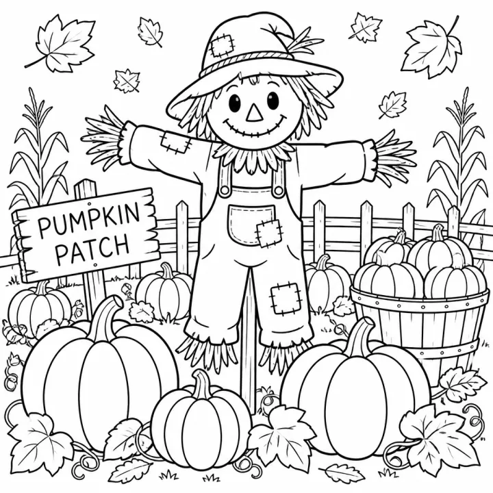

# Autumn & Thanksgiving Coloring Book Prompts



Autumn and Thanksgiving coloring books sell from September to late November: parents keep kids busy at the holiday table, teachers use them in class, and adults love the cozy fall mood. These autumn and Thanksgiving coloring book prompts include a simple fall book for toddlers, a Thanksgiving gratitude book for kids and a cozy autumn book for teens and adults.

> **Make any of these in one click.** Each prompt opens in [InkChamps](https://inkchamps.com/?utm_source=github&utm_medium=prompt_library&utm_campaign=ai-coloring-book-prompts&utm_content=autumn-thanksgiving-coloring-book-prompts), the AI book maker that turns a brief into a print-ready PDF for Amazon KDP, Etsy or home printing. Or copy the brief into any AI tool you like.

**Prompts on this page:** [Fall leaves and pumpkins for toddlers](#1-fall-leaves-and-pumpkins-for-toddlers) · [Thanksgiving feast and gratitude for kids](#2-thanksgiving-feast-and-gratitude-for-kids) · [Cozy autumn days for adults](#3-cozy-autumn-days-for-adults)

## 1. Fall leaves and pumpkins for toddlers

**Ages:** 3-6 · **Pages:** 30 · **Size:** 8.5 × 11 in · **Style:** General coloring · **Detail:** Easy · **Quality:** Standard · **Credits:** 30 Standard · 90 Premium

```text
Thirty simple autumn pictures: a big maple leaf, an acorn with a cap, a squirrel holding a nut, a pumpkin with a curly vine, a scarecrow in a field, a basket of apples, a smiling turkey, a hedgehog in a pile of leaves, a sunflower, a corn cob, a pair of rain boots, a hot-cider mug, an owl in a tree and a wheelbarrow of gourds.
```

[**▶ Make this coloring book on InkChamps**](https://inkchamps.com/dashboard/?tool=coloring-book&prompt=Thirty%20simple%20autumn%20pictures%3A%20a%20big%20maple%20leaf%2C%20an%20acorn%20with%20a%20cap%2C%20a%20squirrel%20holding%20a%20nut%2C%20a%20pumpkin%20with%20a%20curly%20vine%2C%20a%20scarecrow%20in%20a%20field%2C%20a%20basket%20of%20apples%2C%20a%20smiling%20turkey%2C%20a%20hedgehog%20in%20a%20pile%20of%20leaves%2C%20a%20sunflower%2C%20a%20corn%20cob%2C%20a%20pair%20of%20rain%20boots%2C%20a%20hot-cider%20mug%2C%20an%20owl%20in%20a%20tree%20and%20a%20wheelbarrow%20of%20gourds.&utm_source=github&utm_medium=prompt_library&utm_campaign=ai-coloring-book-prompts&utm_content=autumn-thanksgiving-coloring-book-prompts-1)

*Why it works:* Parents and preschool teachers want an easy fall theme for September through November, with big shapes for small hands.

<details><summary>Exact settings for AI agents (InkChamps MCP)</summary>

```json
{
  "tool": "create_coloring_book",
  "arguments": {
    "ageGroup": "3-6",
    "numberOfPages": 30,
    "highQuality": false,
    "pageSize": "8.5x11",
    "description": "Thirty simple autumn pictures: a big maple leaf, an acorn with a cap, a squirrel holding a nut, a pumpkin with a curly vine, a scarecrow in a field, a basket of apples, a smiling turkey, a hedgehog in a pile of leaves, a sunflower, a corn cob, a pair of rain boots, a hot-cider mug, an owl in a tree and a wheelbarrow of gourds.",
    "style": "general_coloring",
    "complexity": "easy",
    "theme": "Autumn"
  }
}
```

</details>

## 2. Thanksgiving feast and gratitude for kids

**Ages:** 6-9 · **Pages:** 30 · **Size:** 8.5 × 11 in · **Style:** General coloring · **Detail:** Medium · **Quality:** Standard · **Credits:** 30 Standard · 90 Premium

```text
Thirty Thanksgiving pages: a family around a feast table, kids helping roll pie crust, a turkey and pumpkin pie on the counter, a harvest parade with a giant balloon float of a turkey, picking apples at an orchard, a hayride at a farm, friends sharing a picnic, a cornucopia of vegetables, a kid drawing a thank-you card, grandparents arriving at the door and a football game in the backyard.
```

[**▶ Make this coloring book on InkChamps**](https://inkchamps.com/dashboard/?tool=coloring-book&prompt=Thirty%20Thanksgiving%20pages%3A%20a%20family%20around%20a%20feast%20table%2C%20kids%20helping%20roll%20pie%20crust%2C%20a%20turkey%20and%20pumpkin%20pie%20on%20the%20counter%2C%20a%20harvest%20parade%20with%20a%20giant%20balloon%20float%20of%20a%20turkey%2C%20picking%20apples%20at%20an%20orchard%2C%20a%20hayride%20at%20a%20farm%2C%20friends%20sharing%20a%20picnic%2C%20a%20cornucopia%20of%20vegetables%2C%20a%20kid%20drawing%20a%20thank-you%20card%2C%20grandparents%20arriving%20at%20the%20door%20and%20a%20football%20game%20in%20the%20backyard.&utm_source=github&utm_medium=prompt_library&utm_campaign=ai-coloring-book-prompts&utm_content=autumn-thanksgiving-coloring-book-prompts-2)

*Why it works:* Parents buy Thanksgiving books to keep kids happy at the holiday table, and gratitude scenes appeal to teachers and homeschoolers.

<details><summary>Exact settings for AI agents (InkChamps MCP)</summary>

```json
{
  "tool": "create_coloring_book",
  "arguments": {
    "ageGroup": "6-9",
    "numberOfPages": 30,
    "highQuality": false,
    "pageSize": "8.5x11",
    "description": "Thirty Thanksgiving pages: a family around a feast table, kids helping roll pie crust, a turkey and pumpkin pie on the counter, a harvest parade with a giant balloon float of a turkey, picking apples at an orchard, a hayride at a farm, friends sharing a picnic, a cornucopia of vegetables, a kid drawing a thank-you card, grandparents arriving at the door and a football game in the backyard.",
    "style": "general_coloring",
    "complexity": "medium",
    "theme": "Thanksgiving"
  }
}
```

</details>

## 3. Cozy autumn days for adults

**Ages:** 13+ · **Pages:** 40 · **Size:** 8.5 × 11 in · **Style:** General coloring · **Detail:** Medium · **Quality:** Standard · **Credits:** 40 Standard · 120 Premium

```text
Forty cozy fall scenes: a farm stand piled with pumpkins and squash, an apple orchard with ladders and baskets, a cabin porch with blankets and cider, a forest path of falling leaves, a knitted sweater and a stack of books, a mushroom-covered log, a harvest wreath on a door, a pie cooling on a windowsill, a covered bridge over a stream and a fox in golden leaves.
```

[**▶ Make this coloring book on InkChamps**](https://inkchamps.com/dashboard/?tool=coloring-book&prompt=Forty%20cozy%20fall%20scenes%3A%20a%20farm%20stand%20piled%20with%20pumpkins%20and%20squash%2C%20an%20apple%20orchard%20with%20ladders%20and%20baskets%2C%20a%20cabin%20porch%20with%20blankets%20and%20cider%2C%20a%20forest%20path%20of%20falling%20leaves%2C%20a%20knitted%20sweater%20and%20a%20stack%20of%20books%2C%20a%20mushroom-covered%20log%2C%20a%20harvest%20wreath%20on%20a%20door%2C%20a%20pie%20cooling%20on%20a%20windowsill%2C%20a%20covered%20bridge%20over%20a%20stream%20and%20a%20fox%20in%20golden%20leaves.&utm_source=github&utm_medium=prompt_library&utm_campaign=ai-coloring-book-prompts&utm_content=autumn-thanksgiving-coloring-book-prompts-3)

*Why it works:* Teens and adults who love fall aesthetics buy cozy autumn books from September onward, ahead of the Halloween and Thanksgiving rush.

<details><summary>Exact settings for AI agents (InkChamps MCP)</summary>

```json
{
  "tool": "create_coloring_book",
  "arguments": {
    "ageGroup": "13+",
    "numberOfPages": 40,
    "highQuality": false,
    "pageSize": "8.5x11",
    "description": "Forty cozy fall scenes: a farm stand piled with pumpkins and squash, an apple orchard with ladders and baskets, a cabin porch with blankets and cider, a forest path of falling leaves, a knitted sweater and a stack of books, a mushroom-covered log, a harvest wreath on a door, a pie cooling on a windowsill, a covered bridge over a stream and a fox in golden leaves.",
    "style": "general_coloring",
    "complexity": "medium",
    "theme": "Autumn",
    "title": "Cozy Autumn"
  }
}
```

</details>

## Tips for autumn & thanksgiving coloring book

- Pair Thanksgiving with general autumn scenes so the book sells from September, not just one week in November.
- Gratitude moments (sharing food, helping cook, family around a table) make the kids' book feel meaningful.
- Market the kids' book as a 'Thanksgiving table activity'; parents search for something to keep kids busy before dinner.

## More prompts like these

- [Alphabet ABC Coloring Book Prompts for Toddlers & Preschool](alphabet-abc-coloring-book-prompts.md)
- [Numbers & Counting Coloring Book Prompts for Kids](numbers-counting-coloring-book-prompts.md)
- [Shapes and Colors Coloring Book Prompts for Preschool](shapes-and-colors-coloring-book-prompts.md)
- [Good Habits & Manners Coloring Book Prompts for Kids](good-habits-manners-coloring-book-prompts.md)
- [Feelings & Emotions Coloring Book Prompts for Kids](feelings-emotions-coloring-book-prompts.md)
- [Greek Mythology Coloring Book Prompts](greek-mythology-coloring-book-prompts.md)

---

[All coloring books prompts](README.md) · [Every prompt in the library](../../README.md) · [Browse on the website](https://gunjchhetri.github.io/ai-coloring-book-prompts/coloring-books/autumn-thanksgiving-coloring-book-prompts/) · Prompts licensed [CC BY 4.0](../../LICENSE) by [InkChamps](https://inkchamps.com/?utm_source=github&utm_medium=prompt_library&utm_campaign=ai-coloring-book-prompts&utm_content=footer)
