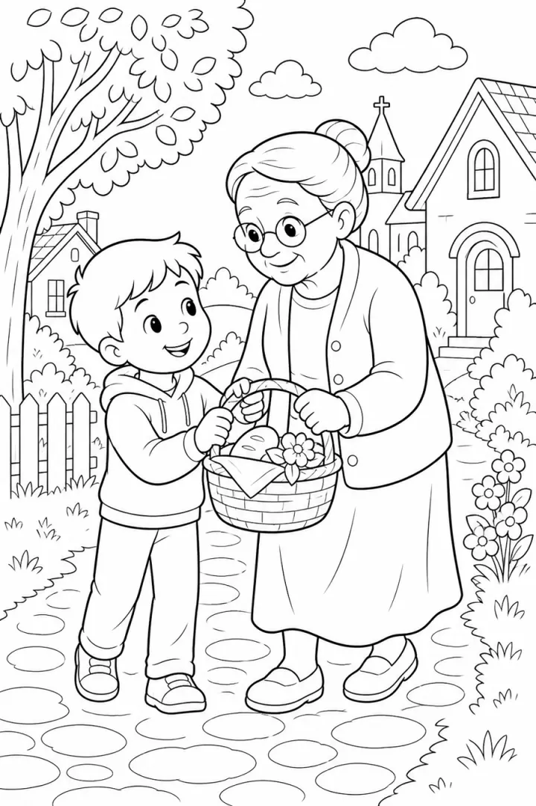

# Bible Story Coloring Book: prompts



3 prompts. The full page, with sample pages and tips, is in the [InkChamps prompt library](https://inkchamps.com/prompts/coloring-books/bible/). Each prompt below opens in InkChamps with one click; or copy the brief into any AI tool.

**Prompts on this page:** [My first Bible stories for toddlers](#1-my-first-bible-stories-for-toddlers) · [Bible stories for Sunday school](#2-bible-stories-for-sunday-school) · [Scripture-inspired scenes for adults](#3-scripture-inspired-scenes-for-adults)

## 1. My first Bible stories for toddlers

**Ages:** 3-6 · **Pages:** 30 · **Size:** 8.5 × 11 in · **Style:** General coloring · **Detail:** Easy · **Quality:** Standard · **Credits:** 30 Standard · 90 Premium

```text
Thirty simple, gentle Bible story pictures for little ones: Noah's Ark with animals walking in two by two, a rainbow over the ark, baby Moses in a basket among the reeds, Jonah and the big fish, young David with his sheep, Daniel calm among friendly lions, baby Jesus in the manger, Jesus welcoming children, a boy sharing five loaves and two fish and a lost sheep found.
```

[**▶ Make this coloring book on InkChamps**](https://inkchamps.com/dashboard/?tool=coloring-book&prompt=Thirty%20simple%2C%20gentle%20Bible%20story%20pictures%20for%20little%20ones%3A%20Noah%27s%20Ark%20with%20animals%20walking%20in%20two%20by%20two%2C%20a%20rainbow%20over%20the%20ark%2C%20baby%20Moses%20in%20a%20basket%20among%20the%20reeds%2C%20Jonah%20and%20the%20big%20fish%2C%20young%20David%20with%20his%20sheep%2C%20Daniel%20calm%20among%20friendly%20lions%2C%20baby%20Jesus%20in%20the%20manger%2C%20Jesus%20welcoming%20children%2C%20a%20boy%20sharing%20five%20loaves%20and%20two%20fish%20and%20a%20lost%20sheep%20found.&utm_source=github&utm_medium=prompt_library&utm_campaign=ai-coloring-book-prompts&utm_content=bible-story-coloring-book-prompts-1)

<details><summary>Exact settings for AI agents (InkChamps MCP)</summary>

```json
{
  "tool": "create_coloring_book",
  "arguments": {
    "ageGroup": "3-6",
    "numberOfPages": 30,
    "highQuality": false,
    "pageSize": "8.5x11",
    "description": "Thirty simple, gentle Bible story pictures for little ones: Noah's Ark with animals walking in two by two, a rainbow over the ark, baby Moses in a basket among the reeds, Jonah and the big fish, young David with his sheep, Daniel calm among friendly lions, baby Jesus in the manger, Jesus welcoming children, a boy sharing five loaves and two fish and a lost sheep found.",
    "style": "general_coloring",
    "complexity": "easy",
    "title": "My First Bible Stories"
  }
}
```

</details>

## 2. Bible stories for Sunday school

**Ages:** 6-9 · **Pages:** 40 · **Size:** 8.5 × 11 in · **Style:** General coloring · **Detail:** Medium · **Quality:** Standard · **Credits:** 40 Standard · 120 Premium

```text
Forty Bible stories in order, one scene per page: creation of the animals, Adam naming the animals in the garden, shown from the shoulders up among tall plants, Noah's Ark, the Tower of Babel, Joseph's colorful coat, baby Moses in the reeds, Moses parting the Red Sea, the walls of Jericho falling, young David facing Goliath with his sling, Jonah and the big fish, Daniel in the lions' den, Queen Esther before the king, the nativity, Jesus calming the storm, the Good Samaritan helping a traveller, the prodigal son's welcome home, Zacchaeus in the sycamore tree and the empty tomb.
```

[**▶ Make this coloring book on InkChamps**](https://inkchamps.com/dashboard/?tool=coloring-book&prompt=Forty%20Bible%20stories%20in%20order%2C%20one%20scene%20per%20page%3A%20creation%20of%20the%20animals%2C%20Adam%20naming%20the%20animals%20in%20the%20garden%2C%20shown%20from%20the%20shoulders%20up%20among%20tall%20plants%2C%20Noah%27s%20Ark%2C%20the%20Tower%20of%20Babel%2C%20Joseph%27s%20colorful%20coat%2C%20baby%20Moses%20in%20the%20reeds%2C%20Moses%20parting%20the%20Red%20Sea%2C%20the%20walls%20of%20Jericho%20falling%2C%20young%20David%20facing%20Goliath%20with%20his%20sling%2C%20Jonah%20and%20the%20big%20fish%2C%20Daniel%20in%20the%20lions%27%20den%2C%20Queen%20Esther%20before%20the%20king%2C%20the%20nativity%2C%20Jesus%20calming%20the%20storm%2C%20the%20Good%20Samaritan%20helping%20a%20traveller%2C%20the%20prodigal%20son%27s%20welcome%20home%2C%20Zacchaeus%20in%20the%20sycamore%20tree%20and%20the%20empty%20tomb.&utm_source=github&utm_medium=prompt_library&utm_campaign=ai-coloring-book-prompts&utm_content=bible-story-coloring-book-prompts-2)

<details><summary>Exact settings for AI agents (InkChamps MCP)</summary>

```json
{
  "tool": "create_coloring_book",
  "arguments": {
    "ageGroup": "6-9",
    "numberOfPages": 40,
    "highQuality": false,
    "pageSize": "8.5x11",
    "description": "Forty Bible stories in order, one scene per page: creation of the animals, Adam naming the animals in the garden, shown from the shoulders up among tall plants, Noah's Ark, the Tower of Babel, Joseph's colorful coat, baby Moses in the reeds, Moses parting the Red Sea, the walls of Jericho falling, young David facing Goliath with his sling, Jonah and the big fish, Daniel in the lions' den, Queen Esther before the king, the nativity, Jesus calming the storm, the Good Samaritan helping a traveller, the prodigal son's welcome home, Zacchaeus in the sycamore tree and the empty tomb.",
    "style": "general_coloring",
    "complexity": "medium"
  }
}
```

</details>

## 3. Scripture-inspired scenes for adults

**Ages:** 13+ · **Pages:** 40 · **Size:** 8.5 × 11 in · **Style:** Inspirational · **Detail:** Hard · **Quality:** Premium · **Credits:** 40 Standard · 120 Premium

```text
Forty detailed, reverent scenes inspired by scripture: the Garden of Eden in full bloom, the wolf and the lamb resting together, as Isaiah foretold, a dove with an olive branch over the ark, lilies of the field, the vine and the branches, the good shepherd carrying a lamb, a stained-glass style nativity, Ruth gleaning wheat in the fields, the burning bush, the feeding of the five thousand by the sea and a sunrise over the empty tomb.
```

[**▶ Make this coloring book on InkChamps**](https://inkchamps.com/dashboard/?tool=coloring-book&prompt=Forty%20detailed%2C%20reverent%20scenes%20inspired%20by%20scripture%3A%20the%20Garden%20of%20Eden%20in%20full%20bloom%2C%20the%20wolf%20and%20the%20lamb%20resting%20together%2C%20as%20Isaiah%20foretold%2C%20a%20dove%20with%20an%20olive%20branch%20over%20the%20ark%2C%20lilies%20of%20the%20field%2C%20the%20vine%20and%20the%20branches%2C%20the%20good%20shepherd%20carrying%20a%20lamb%2C%20a%20stained-glass%20style%20nativity%2C%20Ruth%20gleaning%20wheat%20in%20the%20fields%2C%20the%20burning%20bush%2C%20the%20feeding%20of%20the%20five%20thousand%20by%20the%20sea%20and%20a%20sunrise%20over%20the%20empty%20tomb.&utm_source=github&utm_medium=prompt_library&utm_campaign=ai-coloring-book-prompts&utm_content=bible-story-coloring-book-prompts-3)

<details><summary>Exact settings for AI agents (InkChamps MCP)</summary>

```json
{
  "tool": "create_coloring_book",
  "arguments": {
    "ageGroup": "13+",
    "numberOfPages": 40,
    "highQuality": true,
    "pageSize": "8.5x11",
    "description": "Forty detailed, reverent scenes inspired by scripture: the Garden of Eden in full bloom, the wolf and the lamb resting together, as Isaiah foretold, a dove with an olive branch over the ark, lilies of the field, the vine and the branches, the good shepherd carrying a lamb, a stained-glass style nativity, Ruth gleaning wheat in the fields, the burning bush, the feeding of the five thousand by the sea and a sunrise over the empty tomb.",
    "style": "inspirational",
    "complexity": "hard",
    "title": "Scenes of Faith"
  }
}
```

</details>

## More prompts like these

- [Dinosaur Coloring Book Prompts for Kids & KDP](dinosaur-coloring-book-prompts.md)
- [Farm Animal Coloring Book Prompts: Cute Barnyard Pages](farm-animal-coloring-book-prompts.md)
- [Ocean Animal Coloring Book Prompts: Sea Creatures & Coral Reefs](ocean-animal-coloring-book-prompts.md)
- [Unicorn Coloring Book Prompts: Unicorns & Magical Creatures](unicorn-coloring-book-prompts.md)
- [Dragon Coloring Book Prompts for Kids, Teens & Adults](dragon-coloring-book-prompts.md)
- [Jungle & Safari Animal Coloring Book Prompts](jungle-safari-coloring-book-prompts.md)

---

[All coloring books prompts](README.md) · [Every prompt in the library](../../README.md) · [This page on InkChamps](https://inkchamps.com/prompts/coloring-books/bible/) · Prompts licensed [CC BY 4.0](../../LICENSE) by [InkChamps](https://inkchamps.com/?utm_source=github&utm_medium=prompt_library&utm_campaign=ai-coloring-book-prompts&utm_content=footer)
