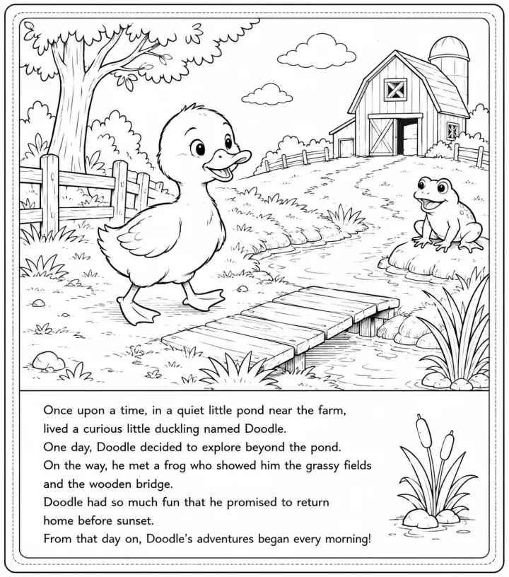

# Bird Coloring Book: prompts



3 prompts. The full page, with sample pages and tips, is in the [InkChamps prompt library](https://inkchamps.com/prompts/coloring-books/bird/). Each prompt below opens in InkChamps with one click; or copy the brief into any AI tool.

**Prompts on this page:** [Chubby baby birds for toddlers](#1-chubby-baby-birds-for-toddlers) · [24 birds of the world with names](#2-24-birds-of-the-world-with-names) · [Floral bird mandalas for adults](#3-floral-bird-mandalas-for-adults)

## 1. Chubby baby birds for toddlers

**Ages:** 3-6 · **Pages:** 30 · **Size:** 8.5 × 8.5 in · **Style:** Cute birds · **Detail:** Easy · **Quality:** Standard · **Credits:** 30 Standard · 90 Premium

```text
Chubby, smiling birds in gardens, ponds and seashores: an owlet peeking out of a tree hollow, a robin tugging a worm, ducklings in a puddle, a penguin chick sliding on its belly, a parrot eating a slice of mango, baby chicks in a nest waiting for breakfast, a flamingo standing on one leg, a hummingbird at a flower, a puffin with a fish, and a toucan in a banana tree.
```

[**▶ Make this coloring book on InkChamps**](https://inkchamps.com/dashboard/?tool=coloring-book&prompt=Chubby%2C%20smiling%20birds%20in%20gardens%2C%20ponds%20and%20seashores%3A%20an%20owlet%20peeking%20out%20of%20a%20tree%20hollow%2C%20a%20robin%20tugging%20a%20worm%2C%20ducklings%20in%20a%20puddle%2C%20a%20penguin%20chick%20sliding%20on%20its%20belly%2C%20a%20parrot%20eating%20a%20slice%20of%20mango%2C%20baby%20chicks%20in%20a%20nest%20waiting%20for%20breakfast%2C%20a%20flamingo%20standing%20on%20one%20leg%2C%20a%20hummingbird%20at%20a%20flower%2C%20a%20puffin%20with%20a%20fish%2C%20and%20a%20toucan%20in%20a%20banana%20tree.&utm_source=github&utm_medium=prompt_library&utm_campaign=ai-coloring-book-prompts&utm_content=bird-coloring-book-prompts-1)

<details><summary>Exact settings for AI agents (InkChamps MCP)</summary>

```json
{
  "tool": "create_coloring_book",
  "arguments": {
    "ageGroup": "3-6",
    "numberOfPages": 30,
    "highQuality": false,
    "pageSize": "8.5x8.5",
    "description": "Chubby, smiling birds in gardens, ponds and seashores: an owlet peeking out of a tree hollow, a robin tugging a worm, ducklings in a puddle, a penguin chick sliding on its belly, a parrot eating a slice of mango, baby chicks in a nest waiting for breakfast, a flamingo standing on one leg, a hummingbird at a flower, a puffin with a fish, and a toucan in a banana tree.",
    "style": "cute_birds",
    "complexity": "easy",
    "theme": "baby birds",
    "title": "Little Birds Coloring Book"
  }
}
```

</details>

## 2. 24 birds of the world with names

**Ages:** 6-9 · **Pages:** 24 · **Size:** 8.5 × 11 in · **Style:** Cute birds · **Detail:** Medium · **Layout:** One item per page, with its caption · **Quality:** Standard · **Credits:** 24 Standard · 72 Premium

```text
A bird book, one bird per page with its name: robin, blue jay, cardinal, goldfinch, chickadee, woodpecker, hummingbird, barn owl, bald eagle, peacock, flamingo, pelican, puffin, emperor penguin, ostrich, toucan, scarlet macaw, swan, mallard duck, kingfisher, red-tailed hawk, crow, heron, cockatoo.
```

[**▶ Make this coloring book on InkChamps**](https://inkchamps.com/dashboard/?tool=coloring-book&prompt=A%20bird%20book%2C%20one%20bird%20per%20page%20with%20its%20name%3A%20robin%2C%20blue%20jay%2C%20cardinal%2C%20goldfinch%2C%20chickadee%2C%20woodpecker%2C%20hummingbird%2C%20barn%20owl%2C%20bald%20eagle%2C%20peacock%2C%20flamingo%2C%20pelican%2C%20puffin%2C%20emperor%20penguin%2C%20ostrich%2C%20toucan%2C%20scarlet%20macaw%2C%20swan%2C%20mallard%20duck%2C%20kingfisher%2C%20red-tailed%20hawk%2C%20crow%2C%20heron%2C%20cockatoo.&utm_source=github&utm_medium=prompt_library&utm_campaign=ai-coloring-book-prompts&utm_content=bird-coloring-book-prompts-2)

<details><summary>Exact settings for AI agents (InkChamps MCP)</summary>

```json
{
  "tool": "create_coloring_book",
  "arguments": {
    "ageGroup": "6-9",
    "numberOfPages": 24,
    "highQuality": false,
    "pageSize": "8.5x11",
    "description": "A bird book, one bird per page with its name: robin, blue jay, cardinal, goldfinch, chickadee, woodpecker, hummingbird, barn owl, bald eagle, peacock, flamingo, pelican, puffin, emperor penguin, ostrich, toucan, scarlet macaw, swan, mallard duck, kingfisher, red-tailed hawk, crow, heron, cockatoo.",
    "style": "cute_birds",
    "complexity": "medium",
    "pageCategory": "concept",
    "theme": "birds of the world",
    "title": "Birds of the World Coloring Book"
  }
}
```

</details>

## 3. Floral bird mandalas for adults

**Ages:** 13+ · **Pages:** 40 · **Size:** 8.5 × 11 in · **Style:** Mandala birds · **Detail:** Hard · **Quality:** Premium · **Credits:** 40 Standard · 120 Premium

```text
Birds among intricate flowers and patterns: a peacock with a fan of ornate feathers, an owl on a branch of patterned leaves, hummingbirds sipping from hibiscus, a pair of lovebirds inside a heart of roses, a heron in a lotus pond, a cardinal on a snowy berry branch, swallows circling a round mandala, a kingfisher above patterned water, and an open birdcage overflowing with vines and blossoms.
```

[**▶ Make this coloring book on InkChamps**](https://inkchamps.com/dashboard/?tool=coloring-book&prompt=Birds%20among%20intricate%20flowers%20and%20patterns%3A%20a%20peacock%20with%20a%20fan%20of%20ornate%20feathers%2C%20an%20owl%20on%20a%20branch%20of%20patterned%20leaves%2C%20hummingbirds%20sipping%20from%20hibiscus%2C%20a%20pair%20of%20lovebirds%20inside%20a%20heart%20of%20roses%2C%20a%20heron%20in%20a%20lotus%20pond%2C%20a%20cardinal%20on%20a%20snowy%20berry%20branch%2C%20swallows%20circling%20a%20round%20mandala%2C%20a%20kingfisher%20above%20patterned%20water%2C%20and%20an%20open%20birdcage%20overflowing%20with%20vines%20and%20blossoms.&utm_source=github&utm_medium=prompt_library&utm_campaign=ai-coloring-book-prompts&utm_content=bird-coloring-book-prompts-3)

<details><summary>Exact settings for AI agents (InkChamps MCP)</summary>

```json
{
  "tool": "create_coloring_book",
  "arguments": {
    "ageGroup": "13+",
    "numberOfPages": 40,
    "highQuality": true,
    "pageSize": "8.5x11",
    "description": "Birds among intricate flowers and patterns: a peacock with a fan of ornate feathers, an owl on a branch of patterned leaves, hummingbirds sipping from hibiscus, a pair of lovebirds inside a heart of roses, a heron in a lotus pond, a cardinal on a snowy berry branch, swallows circling a round mandala, a kingfisher above patterned water, and an open birdcage overflowing with vines and blossoms.",
    "style": "mandala_birds",
    "complexity": "hard",
    "theme": "floral birds",
    "title": "Birds in Bloom: A Mandala Coloring Book"
  }
}
```

</details>

## More prompts like these

- [Bug & Insect Coloring Book Prompts for Kids and Adults](bug-insect-coloring-book-prompts.md)
- [Space Coloring Book Prompts: Planets, Astronauts & Aliens](space-coloring-book-prompts.md)
- [Vehicle Coloring Book Prompts: Trucks, Diggers, Trains & Cars](vehicle-coloring-book-prompts.md)
- [Princess & Castle Coloring Book Prompts (Original Characters)](princess-castle-coloring-book-prompts.md)
- [Mermaid Coloring Book Prompts for Kids, Teens & Adults](mermaid-coloring-book-prompts.md)
- [Robot Coloring Book Prompts for Kids & Tweens](robot-coloring-book-prompts.md)

---

[All coloring books prompts](README.md) · [Every prompt in the library](../../README.md) · [This page on InkChamps](https://inkchamps.com/prompts/coloring-books/bird/) · Prompts licensed [CC BY 4.0](../../LICENSE) by [InkChamps](https://inkchamps.com/?utm_source=github&utm_medium=prompt_library&utm_campaign=ai-coloring-book-prompts&utm_content=footer)
