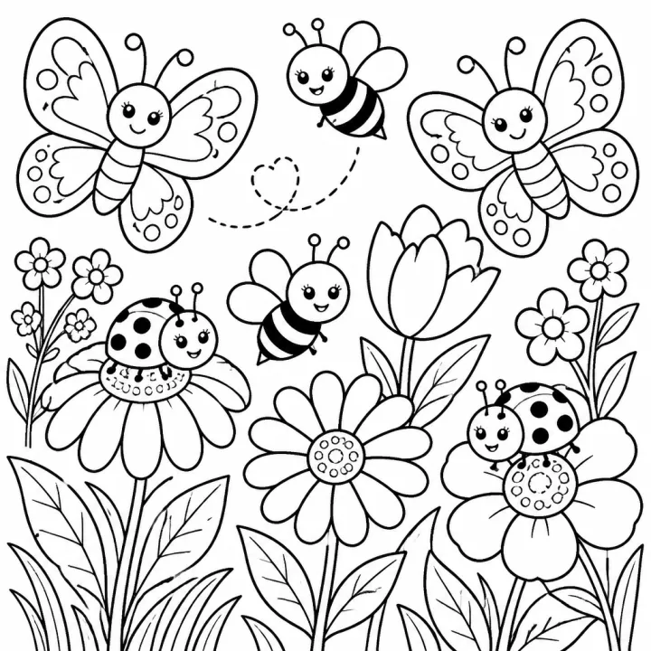

# Bug & Insect Coloring Book: prompts



3 prompts. The full page, with sample pages and tips, is in the [InkChamps prompt library](https://inkchamps.com/prompts/coloring-books/bug-insect/). Each prompt below opens in InkChamps with one click; or copy the brief into any AI tool.

**Prompts on this page:** [Friendly garden bugs](#1-friendly-garden-bugs) · [24 bugs and minibeasts with names](#2-24-bugs-and-minibeasts-with-names) · [Butterflies, moths and beetles for adults](#3-butterflies-moths-and-beetles-for-adults)

## 1. Friendly garden bugs

**Ages:** 3-6 · **Pages:** 30 · **Size:** 8.5 × 8.5 in · **Style:** Cute insects · **Detail:** Easy · **Quality:** Standard · **Credits:** 30 Standard · 90 Premium

```text
Smiling little bugs in a sunny garden: a ladybug on a strawberry, a bumblebee buzzing around a sunflower, a caterpillar munching a leaf, a snail climbing a mushroom, a butterfly landing on a daisy, an ant carrying a crumb of bread, a firefly glowing at dusk, a dragonfly over a lily pond, a grasshopper hopping through tall grass, and a spider waving from a dewy web.
```

[**▶ Make this coloring book on InkChamps**](https://inkchamps.com/dashboard/?tool=coloring-book&prompt=Smiling%20little%20bugs%20in%20a%20sunny%20garden%3A%20a%20ladybug%20on%20a%20strawberry%2C%20a%20bumblebee%20buzzing%20around%20a%20sunflower%2C%20a%20caterpillar%20munching%20a%20leaf%2C%20a%20snail%20climbing%20a%20mushroom%2C%20a%20butterfly%20landing%20on%20a%20daisy%2C%20an%20ant%20carrying%20a%20crumb%20of%20bread%2C%20a%20firefly%20glowing%20at%20dusk%2C%20a%20dragonfly%20over%20a%20lily%20pond%2C%20a%20grasshopper%20hopping%20through%20tall%20grass%2C%20and%20a%20spider%20waving%20from%20a%20dewy%20web.&utm_source=github&utm_medium=prompt_library&utm_campaign=ai-coloring-book-prompts&utm_content=bug-insect-coloring-book-prompts-1)

<details><summary>Exact settings for AI agents (InkChamps MCP)</summary>

```json
{
  "tool": "create_coloring_book",
  "arguments": {
    "ageGroup": "3-6",
    "numberOfPages": 30,
    "highQuality": false,
    "pageSize": "8.5x8.5",
    "description": "Smiling little bugs in a sunny garden: a ladybug on a strawberry, a bumblebee buzzing around a sunflower, a caterpillar munching a leaf, a snail climbing a mushroom, a butterfly landing on a daisy, an ant carrying a crumb of bread, a firefly glowing at dusk, a dragonfly over a lily pond, a grasshopper hopping through tall grass, and a spider waving from a dewy web.",
    "style": "cute_insects",
    "complexity": "easy",
    "theme": "garden bugs",
    "title": "Garden Bugs Coloring Book"
  }
}
```

</details>

## 2. 24 bugs and minibeasts with names

**Ages:** 6-9 · **Pages:** 24 · **Size:** 8.5 × 11 in · **Style:** Cute insects · **Detail:** Medium · **Layout:** One item per page, with its caption · **Quality:** Standard · **Credits:** 24 Standard · 72 Premium

```text
A bugs and minibeasts book, one creature per page with its name: honeybee, bumblebee, ladybug, monarch butterfly, luna moth, dragonfly, grasshopper, cricket, praying mantis, ant, firefly, stag beetle, rhinoceros beetle, caterpillar, stick insect, cicada, water strider, dung beetle, termite, weevil, wasp, earwig, jewel beetle, garden spider.
```

[**▶ Make this coloring book on InkChamps**](https://inkchamps.com/dashboard/?tool=coloring-book&prompt=A%20bugs%20and%20minibeasts%20book%2C%20one%20creature%20per%20page%20with%20its%20name%3A%20honeybee%2C%20bumblebee%2C%20ladybug%2C%20monarch%20butterfly%2C%20luna%20moth%2C%20dragonfly%2C%20grasshopper%2C%20cricket%2C%20praying%20mantis%2C%20ant%2C%20firefly%2C%20stag%20beetle%2C%20rhinoceros%20beetle%2C%20caterpillar%2C%20stick%20insect%2C%20cicada%2C%20water%20strider%2C%20dung%20beetle%2C%20termite%2C%20weevil%2C%20wasp%2C%20earwig%2C%20jewel%20beetle%2C%20garden%20spider.&utm_source=github&utm_medium=prompt_library&utm_campaign=ai-coloring-book-prompts&utm_content=bug-insect-coloring-book-prompts-2)

<details><summary>Exact settings for AI agents (InkChamps MCP)</summary>

```json
{
  "tool": "create_coloring_book",
  "arguments": {
    "ageGroup": "6-9",
    "numberOfPages": 24,
    "highQuality": false,
    "pageSize": "8.5x11",
    "description": "A bugs and minibeasts book, one creature per page with its name: honeybee, bumblebee, ladybug, monarch butterfly, luna moth, dragonfly, grasshopper, cricket, praying mantis, ant, firefly, stag beetle, rhinoceros beetle, caterpillar, stick insect, cicada, water strider, dung beetle, termite, weevil, wasp, earwig, jewel beetle, garden spider.",
    "style": "cute_insects",
    "complexity": "medium",
    "pageCategory": "concept",
    "theme": "bugs and minibeasts",
    "title": "Bugs and Minibeasts Coloring Book"
  }
}
```

</details>

## 3. Butterflies, moths and beetles for adults

**Ages:** 13+ · **Pages:** 40 · **Size:** 8.5 × 11 in · **Style:** General coloring · **Detail:** Hard · **Quality:** Premium · **Credits:** 40 Standard · 120 Premium

```text
Butterflies, moths and beetles in rich decorative detail: a monarch with patterned wings over milkweed, a luna moth beneath a full moon, a swallowtail in a garden of foxgloves, jewel beetles arranged like a vintage collector's display, a dragonfly over water lilies, a bee on honeycomb among flowers, butterflies forming a round wreath, a moth with lace-like wings, and a stag beetle on an oak branch with acorns.
```

[**▶ Make this coloring book on InkChamps**](https://inkchamps.com/dashboard/?tool=coloring-book&prompt=Butterflies%2C%20moths%20and%20beetles%20in%20rich%20decorative%20detail%3A%20a%20monarch%20with%20patterned%20wings%20over%20milkweed%2C%20a%20luna%20moth%20beneath%20a%20full%20moon%2C%20a%20swallowtail%20in%20a%20garden%20of%20foxgloves%2C%20jewel%20beetles%20arranged%20like%20a%20vintage%20collector%27s%20display%2C%20a%20dragonfly%20over%20water%20lilies%2C%20a%20bee%20on%20honeycomb%20among%20flowers%2C%20butterflies%20forming%20a%20round%20wreath%2C%20a%20moth%20with%20lace-like%20wings%2C%20and%20a%20stag%20beetle%20on%20an%20oak%20branch%20with%20acorns.&utm_source=github&utm_medium=prompt_library&utm_campaign=ai-coloring-book-prompts&utm_content=bug-insect-coloring-book-prompts-3)

<details><summary>Exact settings for AI agents (InkChamps MCP)</summary>

```json
{
  "tool": "create_coloring_book",
  "arguments": {
    "ageGroup": "13+",
    "numberOfPages": 40,
    "highQuality": true,
    "pageSize": "8.5x11",
    "description": "Butterflies, moths and beetles in rich decorative detail: a monarch with patterned wings over milkweed, a luna moth beneath a full moon, a swallowtail in a garden of foxgloves, jewel beetles arranged like a vintage collector's display, a dragonfly over water lilies, a bee on honeycomb among flowers, butterflies forming a round wreath, a moth with lace-like wings, and a stag beetle on an oak branch with acorns.",
    "style": "general_coloring",
    "complexity": "hard",
    "theme": "butterflies and beetles",
    "title": "Wings and Shells: An Insect Coloring Book"
  }
}
```

</details>

## More prompts like these

- [Space Coloring Book Prompts: Planets, Astronauts & Aliens](space-coloring-book-prompts.md)
- [Vehicle Coloring Book Prompts: Trucks, Diggers, Trains & Cars](vehicle-coloring-book-prompts.md)
- [Princess & Castle Coloring Book Prompts (Original Characters)](princess-castle-coloring-book-prompts.md)
- [Mermaid Coloring Book Prompts for Kids, Teens & Adults](mermaid-coloring-book-prompts.md)
- [Robot Coloring Book Prompts for Kids & Tweens](robot-coloring-book-prompts.md)
- [Kawaii Food Coloring Book Prompts: Cute Desserts, Fruit & Snacks](kawaii-food-coloring-book-prompts.md)

---

[All coloring books prompts](README.md) · [Every prompt in the library](../../README.md) · [This page on InkChamps](https://inkchamps.com/prompts/coloring-books/bug-insect/) · Prompts licensed [CC BY 4.0](../../LICENSE) by [InkChamps](https://inkchamps.com/?utm_source=github&utm_medium=prompt_library&utm_campaign=ai-coloring-book-prompts&utm_content=footer)
