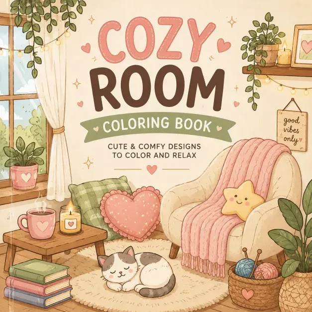

# Cozy Coloring Book: prompts



3 prompts. The full page, with sample pages and tips, is in the [InkChamps prompt library](https://inkchamps.com/prompts/coloring-books/cozy/). Each prompt below opens in InkChamps with one click; or copy the brief into any AI tool.

**Prompts on this page:** [Hygge home moments for adults](#1-hygge-home-moments-for-adults) · [Cottagecore countryside](#2-cottagecore-countryside) · [Cozy animal cafés and little shops](#3-cozy-animal-cafs-and-little-shops)

## 1. Hygge home moments for adults

**Ages:** 13+ · **Pages:** 40 · **Size:** 8.5 × 11 in · **Style:** General coloring · **Detail:** Medium · **Quality:** Standard · **Credits:** 40 Standard · 120 Premium

```text
Forty cozy indoor scenes: a reading nook with a knitted blanket and a sleeping cat, a kitchen with bread cooling on the counter, socks warming by a wood stove, a bathtub with candles and plants, a bedroom with string lights and stacked books, a rainy window with tea and cookies, a sunroom full of houseplants, a pantry of jars, a window seat in snowfall and a cluttered craft table with yarn.
```

[**▶ Make this coloring book on InkChamps**](https://inkchamps.com/dashboard/?tool=coloring-book&prompt=Forty%20cozy%20indoor%20scenes%3A%20a%20reading%20nook%20with%20a%20knitted%20blanket%20and%20a%20sleeping%20cat%2C%20a%20kitchen%20with%20bread%20cooling%20on%20the%20counter%2C%20socks%20warming%20by%20a%20wood%20stove%2C%20a%20bathtub%20with%20candles%20and%20plants%2C%20a%20bedroom%20with%20string%20lights%20and%20stacked%20books%2C%20a%20rainy%20window%20with%20tea%20and%20cookies%2C%20a%20sunroom%20full%20of%20houseplants%2C%20a%20pantry%20of%20jars%2C%20a%20window%20seat%20in%20snowfall%20and%20a%20cluttered%20craft%20table%20with%20yarn.&utm_source=github&utm_medium=prompt_library&utm_campaign=ai-coloring-book-prompts&utm_content=cozy-coloring-book-prompts-1)

<details><summary>Exact settings for AI agents (InkChamps MCP)</summary>

```json
{
  "tool": "create_coloring_book",
  "arguments": {
    "ageGroup": "13+",
    "numberOfPages": 40,
    "highQuality": false,
    "pageSize": "8.5x11",
    "description": "Forty cozy indoor scenes: a reading nook with a knitted blanket and a sleeping cat, a kitchen with bread cooling on the counter, socks warming by a wood stove, a bathtub with candles and plants, a bedroom with string lights and stacked books, a rainy window with tea and cookies, a sunroom full of houseplants, a pantry of jars, a window seat in snowfall and a cluttered craft table with yarn.",
    "style": "general_coloring",
    "complexity": "medium",
    "title": "Cozy Corners: A Hygge Coloring Book"
  }
}
```

</details>

## 2. Cottagecore countryside

**Ages:** 13+ · **Pages:** 40 · **Size:** 8.5 × 11 in · **Style:** General coloring · **Detail:** Medium · **Quality:** Standard · **Credits:** 40 Standard · 120 Premium

```text
Forty cottagecore pages of slow country life: a thatched cottage with roses over the door, a garden gate and vegetable beds, a picnic basket on a quilt by a stream, beehives in a meadow, a farmers market stall of jams and bread, sheep grazing near a stone wall, mushroom foraging in a mossy wood, a village bakery, a greenhouse, a washing line in the breeze and a bicycle with a flower basket.
```

[**▶ Make this coloring book on InkChamps**](https://inkchamps.com/dashboard/?tool=coloring-book&prompt=Forty%20cottagecore%20pages%20of%20slow%20country%20life%3A%20a%20thatched%20cottage%20with%20roses%20over%20the%20door%2C%20a%20garden%20gate%20and%20vegetable%20beds%2C%20a%20picnic%20basket%20on%20a%20quilt%20by%20a%20stream%2C%20beehives%20in%20a%20meadow%2C%20a%20farmers%20market%20stall%20of%20jams%20and%20bread%2C%20sheep%20grazing%20near%20a%20stone%20wall%2C%20mushroom%20foraging%20in%20a%20mossy%20wood%2C%20a%20village%20bakery%2C%20a%20greenhouse%2C%20a%20washing%20line%20in%20the%20breeze%20and%20a%20bicycle%20with%20a%20flower%20basket.&utm_source=github&utm_medium=prompt_library&utm_campaign=ai-coloring-book-prompts&utm_content=cozy-coloring-book-prompts-2)

<details><summary>Exact settings for AI agents (InkChamps MCP)</summary>

```json
{
  "tool": "create_coloring_book",
  "arguments": {
    "ageGroup": "13+",
    "numberOfPages": 40,
    "highQuality": false,
    "pageSize": "8.5x11",
    "description": "Forty cottagecore pages of slow country life: a thatched cottage with roses over the door, a garden gate and vegetable beds, a picnic basket on a quilt by a stream, beehives in a meadow, a farmers market stall of jams and bread, sheep grazing near a stone wall, mushroom foraging in a mossy wood, a village bakery, a greenhouse, a washing line in the breeze and a bicycle with a flower basket.",
    "style": "general_coloring",
    "complexity": "medium"
  }
}
```

</details>

## 3. Cozy animal cafés and little shops

**Ages:** 9-13 · **Pages:** 36 · **Size:** 8.5 × 11 in · **Style:** Cute animals · **Detail:** Medium · **Quality:** Standard · **Credits:** 36 Standard · 108 Premium

```text
Thirty-six charming little shops run by animals: a hedgehog bakery with cinnamon rolls, a bear café pouring hot cocoa, a cat bookshop with cushions in the window, a rabbit flower shop, a fox tea house, a raccoon antique store, an otter ice-cream parlour, a mouse cheese shop, a frog plant nursery, a panda noodle bar and a badger yarn store, each shown inside or at its front door on a rainy evening.
```

[**▶ Make this coloring book on InkChamps**](https://inkchamps.com/dashboard/?tool=coloring-book&prompt=Thirty-six%20charming%20little%20shops%20run%20by%20animals%3A%20a%20hedgehog%20bakery%20with%20cinnamon%20rolls%2C%20a%20bear%20caf%C3%A9%20pouring%20hot%20cocoa%2C%20a%20cat%20bookshop%20with%20cushions%20in%20the%20window%2C%20a%20rabbit%20flower%20shop%2C%20a%20fox%20tea%20house%2C%20a%20raccoon%20antique%20store%2C%20an%20otter%20ice-cream%20parlour%2C%20a%20mouse%20cheese%20shop%2C%20a%20frog%20plant%20nursery%2C%20a%20panda%20noodle%20bar%20and%20a%20badger%20yarn%20store%2C%20each%20shown%20inside%20or%20at%20its%20front%20door%20on%20a%20rainy%20evening.&utm_source=github&utm_medium=prompt_library&utm_campaign=ai-coloring-book-prompts&utm_content=cozy-coloring-book-prompts-3)

<details><summary>Exact settings for AI agents (InkChamps MCP)</summary>

```json
{
  "tool": "create_coloring_book",
  "arguments": {
    "ageGroup": "9-13",
    "numberOfPages": 36,
    "highQuality": false,
    "pageSize": "8.5x11",
    "description": "Thirty-six charming little shops run by animals: a hedgehog bakery with cinnamon rolls, a bear café pouring hot cocoa, a cat bookshop with cushions in the window, a rabbit flower shop, a fox tea house, a raccoon antique store, an otter ice-cream parlour, a mouse cheese shop, a frog plant nursery, a panda noodle bar and a badger yarn store, each shown inside or at its front door on a rainy evening.",
    "style": "cute_animals",
    "complexity": "medium"
  }
}
```

</details>

## More prompts like these

- [Bold and Easy Coloring Book Prompts for Adults & Seniors](bold-and-easy-coloring-book-prompts.md)
- [Flower & Botanical Coloring Book Prompts](flower-botanical-coloring-book-prompts.md)
- [Christmas Coloring Book Prompts for Kids & Adults](christmas-coloring-book-prompts.md)
- [Halloween Coloring Book Prompts: Spooky-Cute & Spooky-Cozy](halloween-coloring-book-prompts.md)
- [Easter & Spring Coloring Book Prompts](easter-spring-coloring-book-prompts.md)
- [Valentine's Day Coloring Book Prompts](valentines-day-coloring-book-prompts.md)

---

[All coloring books prompts](README.md) · [Every prompt in the library](../../README.md) · [This page on InkChamps](https://inkchamps.com/prompts/coloring-books/cozy/) · Prompts licensed [CC BY 4.0](../../LICENSE) by [InkChamps](https://inkchamps.com/?utm_source=github&utm_medium=prompt_library&utm_campaign=ai-coloring-book-prompts&utm_content=footer)
