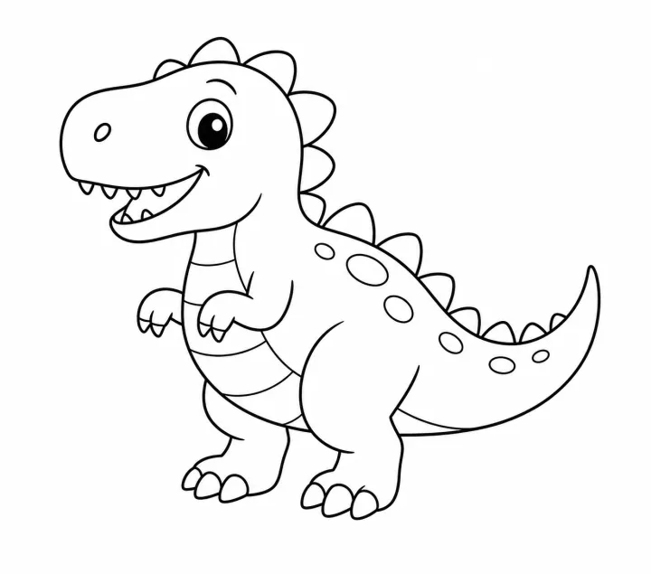

# Dinosaur Coloring Book: prompts



3 prompts. The full page, with sample pages and tips, is in the [InkChamps prompt library](https://inkchamps.com/prompts/coloring-books/dinosaur/). Each prompt below opens in InkChamps with one click; or copy the brief into any AI tool.

**Prompts on this page:** [Baby dinosaurs for toddlers](#1-baby-dinosaurs-for-toddlers) · [Dinosaur ABC book](#2-dinosaur-abc-book) · [Realistic prehistoric world for older kids](#3-realistic-prehistoric-world-for-older-kids)

## 1. Baby dinosaurs for toddlers

**Ages:** 3-6 · **Pages:** 30 · **Size:** 8.5 × 8.5 in · **Style:** Cute animals · **Detail:** Easy · **Quality:** Standard · **Credits:** 30 Standard · 90 Premium

```text
Chubby, smiling baby dinosaurs doing the everyday things little kids love: a T-rex blowing out birthday candles, a triceratops splashing in a bubble bath, a stegosaurus watering a vegetable garden, a brachiosaurus reading a bedtime story, a baby dino hatching from a speckled egg, a pterodactyl flying a kite, a dinosaur picnic, a sandcastle on the beach, and a sleepy dino hugging a teddy bear. Gentle and funny, never scary.
```

[**▶ Make this coloring book on InkChamps**](https://inkchamps.com/dashboard/?tool=coloring-book&prompt=Chubby%2C%20smiling%20baby%20dinosaurs%20doing%20the%20everyday%20things%20little%20kids%20love%3A%20a%20T-rex%20blowing%20out%20birthday%20candles%2C%20a%20triceratops%20splashing%20in%20a%20bubble%20bath%2C%20a%20stegosaurus%20watering%20a%20vegetable%20garden%2C%20a%20brachiosaurus%20reading%20a%20bedtime%20story%2C%20a%20baby%20dino%20hatching%20from%20a%20speckled%20egg%2C%20a%20pterodactyl%20flying%20a%20kite%2C%20a%20dinosaur%20picnic%2C%20a%20sandcastle%20on%20the%20beach%2C%20and%20a%20sleepy%20dino%20hugging%20a%20teddy%20bear.%20Gentle%20and%20funny%2C%20never%20scary.&utm_source=github&utm_medium=prompt_library&utm_campaign=ai-coloring-book-prompts&utm_content=dinosaur-coloring-book-prompts-1)

<details><summary>Exact settings for AI agents (InkChamps MCP)</summary>

```json
{
  "tool": "create_coloring_book",
  "arguments": {
    "ageGroup": "3-6",
    "numberOfPages": 30,
    "highQuality": false,
    "pageSize": "8.5x8.5",
    "description": "Chubby, smiling baby dinosaurs doing the everyday things little kids love: a T-rex blowing out birthday candles, a triceratops splashing in a bubble bath, a stegosaurus watering a vegetable garden, a brachiosaurus reading a bedtime story, a baby dino hatching from a speckled egg, a pterodactyl flying a kite, a dinosaur picnic, a sandcastle on the beach, and a sleepy dino hugging a teddy bear. Gentle and funny, never scary.",
    "style": "cute_animals",
    "complexity": "easy",
    "theme": "baby dinosaurs",
    "title": "My First Dinosaur Coloring Book"
  }
}
```

</details>

## 2. Dinosaur ABC book

**Ages:** 6-9 · **Pages:** 26 · **Size:** 8.5 × 11 in · **Style:** General coloring · **Detail:** Medium · **Layout:** One item per page, with its caption · **Quality:** Standard · **Credits:** 26 Standard · 78 Premium

```text
A dinosaur alphabet, one dinosaur per letter with its name: A ankylosaurus, B brachiosaurus, C compsognathus, D diplodocus, E edmontosaurus, F fukuiraptor, G gallimimus, H hadrosaurus, I iguanodon, J jobaria, K kentrosaurus, L lambeosaurus, M maiasaura, N nodosaurus, O oviraptor, P parasaurolophus, Q qianzhousaurus, R rajasaurus, S stegosaurus, T tyrannosaurus rex, U utahraptor, V velociraptor, W wuerhosaurus, X xenoceratops, Y yangchuanosaurus, Z zuniceratops.
```

[**▶ Make this coloring book on InkChamps**](https://inkchamps.com/dashboard/?tool=coloring-book&prompt=A%20dinosaur%20alphabet%2C%20one%20dinosaur%20per%20letter%20with%20its%20name%3A%20A%20ankylosaurus%2C%20B%20brachiosaurus%2C%20C%20compsognathus%2C%20D%20diplodocus%2C%20E%20edmontosaurus%2C%20F%20fukuiraptor%2C%20G%20gallimimus%2C%20H%20hadrosaurus%2C%20I%20iguanodon%2C%20J%20jobaria%2C%20K%20kentrosaurus%2C%20L%20lambeosaurus%2C%20M%20maiasaura%2C%20N%20nodosaurus%2C%20O%20oviraptor%2C%20P%20parasaurolophus%2C%20Q%20qianzhousaurus%2C%20R%20rajasaurus%2C%20S%20stegosaurus%2C%20T%20tyrannosaurus%20rex%2C%20U%20utahraptor%2C%20V%20velociraptor%2C%20W%20wuerhosaurus%2C%20X%20xenoceratops%2C%20Y%20yangchuanosaurus%2C%20Z%20zuniceratops.&utm_source=github&utm_medium=prompt_library&utm_campaign=ai-coloring-book-prompts&utm_content=dinosaur-coloring-book-prompts-2)

<details><summary>Exact settings for AI agents (InkChamps MCP)</summary>

```json
{
  "tool": "create_coloring_book",
  "arguments": {
    "ageGroup": "6-9",
    "numberOfPages": 26,
    "highQuality": false,
    "pageSize": "8.5x11",
    "description": "A dinosaur alphabet, one dinosaur per letter with its name: A ankylosaurus, B brachiosaurus, C compsognathus, D diplodocus, E edmontosaurus, F fukuiraptor, G gallimimus, H hadrosaurus, I iguanodon, J jobaria, K kentrosaurus, L lambeosaurus, M maiasaura, N nodosaurus, O oviraptor, P parasaurolophus, Q qianzhousaurus, R rajasaurus, S stegosaurus, T tyrannosaurus rex, U utahraptor, V velociraptor, W wuerhosaurus, X xenoceratops, Y yangchuanosaurus, Z zuniceratops.",
    "style": "general_coloring",
    "complexity": "medium",
    "pageCategory": "concept",
    "theme": "dinosaur alphabet",
    "title": "Dinosaurs from A to Z"
  }
}
```

</details>

## 3. Realistic prehistoric world for older kids

**Ages:** 9-13 · **Pages:** 40 · **Size:** 8.5 × 11 in · **Style:** Jungle adventure · **Detail:** Medium · **Quality:** Standard · **Credits:** 40 Standard · 120 Premium

```text
A detailed prehistoric world full of action and discovery: a T-rex stalking through a fern forest, a herd of triceratops crossing a river, a spinosaurus catching fish in a swamp, pterosaurs soaring past an erupting volcano, an ankylosaurus guarding its nest, a mother maiasaura feeding her hatchlings, a mosasaur breaching the sea, raptors hunting in moonlight, a young paleontologist brushing dust off a giant skull, and a museum hall with a towering skeleton.
```

[**▶ Make this coloring book on InkChamps**](https://inkchamps.com/dashboard/?tool=coloring-book&prompt=A%20detailed%20prehistoric%20world%20full%20of%20action%20and%20discovery%3A%20a%20T-rex%20stalking%20through%20a%20fern%20forest%2C%20a%20herd%20of%20triceratops%20crossing%20a%20river%2C%20a%20spinosaurus%20catching%20fish%20in%20a%20swamp%2C%20pterosaurs%20soaring%20past%20an%20erupting%20volcano%2C%20an%20ankylosaurus%20guarding%20its%20nest%2C%20a%20mother%20maiasaura%20feeding%20her%20hatchlings%2C%20a%20mosasaur%20breaching%20the%20sea%2C%20raptors%20hunting%20in%20moonlight%2C%20a%20young%20paleontologist%20brushing%20dust%20off%20a%20giant%20skull%2C%20and%20a%20museum%20hall%20with%20a%20towering%20skeleton.&utm_source=github&utm_medium=prompt_library&utm_campaign=ai-coloring-book-prompts&utm_content=dinosaur-coloring-book-prompts-3)

<details><summary>Exact settings for AI agents (InkChamps MCP)</summary>

```json
{
  "tool": "create_coloring_book",
  "arguments": {
    "ageGroup": "9-13",
    "numberOfPages": 40,
    "highQuality": false,
    "pageSize": "8.5x11",
    "description": "A detailed prehistoric world full of action and discovery: a T-rex stalking through a fern forest, a herd of triceratops crossing a river, a spinosaurus catching fish in a swamp, pterosaurs soaring past an erupting volcano, an ankylosaurus guarding its nest, a mother maiasaura feeding her hatchlings, a mosasaur breaching the sea, raptors hunting in moonlight, a young paleontologist brushing dust off a giant skull, and a museum hall with a towering skeleton.",
    "style": "jungle_adventure",
    "complexity": "medium",
    "theme": "prehistoric world",
    "title": "Dinosaur World Coloring Book"
  }
}
```

</details>

## More prompts like these

- [Farm Animal Coloring Book Prompts: Cute Barnyard Pages](farm-animal-coloring-book-prompts.md)
- [Ocean Animal Coloring Book Prompts: Sea Creatures & Coral Reefs](ocean-animal-coloring-book-prompts.md)
- [Unicorn Coloring Book Prompts: Unicorns & Magical Creatures](unicorn-coloring-book-prompts.md)
- [Dragon Coloring Book Prompts for Kids, Teens & Adults](dragon-coloring-book-prompts.md)
- [Jungle & Safari Animal Coloring Book Prompts](jungle-safari-coloring-book-prompts.md)
- [Cat Coloring Book Prompts: Kittens, Cozy Cats & Cat Mandalas](cat-coloring-book-prompts.md)

---

[All coloring books prompts](README.md) · [Every prompt in the library](../../README.md) · [This page on InkChamps](https://inkchamps.com/prompts/coloring-books/dinosaur/) · Prompts licensed [CC BY 4.0](../../LICENSE) by [InkChamps](https://inkchamps.com/?utm_source=github&utm_medium=prompt_library&utm_campaign=ai-coloring-book-prompts&utm_content=footer)
