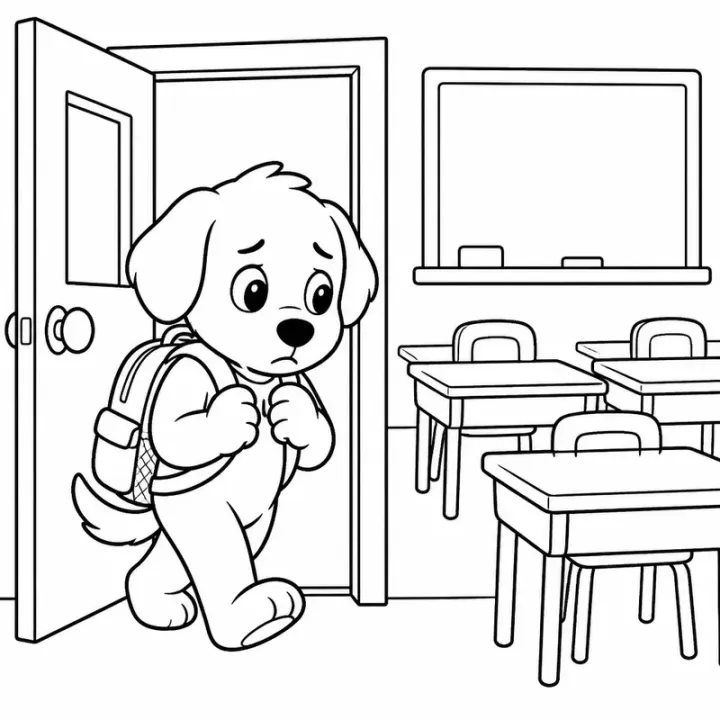

# Dog & Puppy Coloring Book Prompts for Kids and Adults



Dogs are a top-selling coloring theme because almost every family has, or wants, a dog. A puppy coloring book makes an easy gift for kids, and breed-specific pages give dog lovers of every age something personal to color. These dog and puppy coloring book prompts cover a playful toddler book, a dog breeds book with a name on every page, and patterned dog portraits for adults.

> **Make any of these in one click.** Each prompt opens in [InkChamps](https://inkchamps.com/?utm_source=github&utm_medium=prompt_library&utm_campaign=ai-coloring-book-prompts&utm_content=dog-puppy-coloring-book-prompts), the AI book maker that turns a brief into a print-ready PDF for Amazon KDP, Etsy or home printing. Or copy the brief into any AI tool you like.

**Prompts on this page:** [Happy puppies for toddlers](#1-happy-puppies-for-toddlers) · [25 dog breeds with names](#2-25-dog-breeds-with-names) · [Patterned dog portraits for adults](#3-patterned-dog-portraits-for-adults)

## 1. Happy puppies for toddlers

**Ages:** 3-6 · **Pages:** 30 · **Size:** 8.5 × 8.5 in · **Style:** Cute animals · **Detail:** Easy · **Quality:** Standard · **Credits:** 30 Standard · 90 Premium

```text
Bouncy, happy puppies doing puppy things: a puppy chewing a big bone, chasing its own tail, splashing through a puddle in rain boots, sleeping in a dog bed under a blanket, fetching a ball in the park, getting a bubble bath, digging in the garden, playing tug of war with a rope, carrying a stick far too big for it, and cuddling with a child at bedtime.
```

[**▶ Make this coloring book on InkChamps**](https://inkchamps.com/dashboard/?tool=coloring-book&prompt=Bouncy%2C%20happy%20puppies%20doing%20puppy%20things%3A%20a%20puppy%20chewing%20a%20big%20bone%2C%20chasing%20its%20own%20tail%2C%20splashing%20through%20a%20puddle%20in%20rain%20boots%2C%20sleeping%20in%20a%20dog%20bed%20under%20a%20blanket%2C%20fetching%20a%20ball%20in%20the%20park%2C%20getting%20a%20bubble%20bath%2C%20digging%20in%20the%20garden%2C%20playing%20tug%20of%20war%20with%20a%20rope%2C%20carrying%20a%20stick%20far%20too%20big%20for%20it%2C%20and%20cuddling%20with%20a%20child%20at%20bedtime.&utm_source=github&utm_medium=prompt_library&utm_campaign=ai-coloring-book-prompts&utm_content=dog-puppy-coloring-book-prompts-1)

*Why it works:* Parents of young puppy fans want silly, recognisable dog moments in big shapes that are easy to color.

<details><summary>Exact settings for AI agents (InkChamps MCP)</summary>

```json
{
  "tool": "create_coloring_book",
  "arguments": {
    "ageGroup": "3-6",
    "numberOfPages": 30,
    "highQuality": false,
    "pageSize": "8.5x8.5",
    "description": "Bouncy, happy puppies doing puppy things: a puppy chewing a big bone, chasing its own tail, splashing through a puddle in rain boots, sleeping in a dog bed under a blanket, fetching a ball in the park, getting a bubble bath, digging in the garden, playing tug of war with a rope, carrying a stick far too big for it, and cuddling with a child at bedtime.",
    "style": "cute_animals",
    "complexity": "easy",
    "theme": "playful puppies",
    "title": "Puppy Love Coloring Book"
  }
}
```

</details>

## 2. 25 dog breeds with names

**Ages:** 6-9 · **Pages:** 25 · **Size:** 8.5 × 11 in · **Style:** Cute animals · **Detail:** Medium · **Layout:** One item per page, with its caption · **Quality:** Standard · **Credits:** 25 Standard · 75 Premium

```text
A dog breeds book, one breed per page with its name: Labrador Retriever, Golden Retriever, German Shepherd, Beagle, Dachshund, Poodle, Bulldog, French Bulldog, Corgi, Husky, Dalmatian, Chihuahua, Pug, Border Collie, Shih Tzu, Boxer, Great Dane, Yorkshire Terrier, Cocker Spaniel, Bernese Mountain Dog, Shiba Inu, Saint Bernard, Greyhound, Australian Shepherd, Pomeranian.
```

[**▶ Make this coloring book on InkChamps**](https://inkchamps.com/dashboard/?tool=coloring-book&prompt=A%20dog%20breeds%20book%2C%20one%20breed%20per%20page%20with%20its%20name%3A%20Labrador%20Retriever%2C%20Golden%20Retriever%2C%20German%20Shepherd%2C%20Beagle%2C%20Dachshund%2C%20Poodle%2C%20Bulldog%2C%20French%20Bulldog%2C%20Corgi%2C%20Husky%2C%20Dalmatian%2C%20Chihuahua%2C%20Pug%2C%20Border%20Collie%2C%20Shih%20Tzu%2C%20Boxer%2C%20Great%20Dane%2C%20Yorkshire%20Terrier%2C%20Cocker%20Spaniel%2C%20Bernese%20Mountain%20Dog%2C%20Shiba%20Inu%2C%20Saint%20Bernard%2C%20Greyhound%2C%20Australian%20Shepherd%2C%20Pomeranian.&utm_source=github&utm_medium=prompt_library&utm_campaign=ai-coloring-book-prompts&utm_content=dog-puppy-coloring-book-prompts-2)

*Why it works:* Kids love finding their own dog's breed, and parents see a book that teaches names while it entertains.

<details><summary>Exact settings for AI agents (InkChamps MCP)</summary>

```json
{
  "tool": "create_coloring_book",
  "arguments": {
    "ageGroup": "6-9",
    "numberOfPages": 25,
    "highQuality": false,
    "pageSize": "8.5x11",
    "description": "A dog breeds book, one breed per page with its name: Labrador Retriever, Golden Retriever, German Shepherd, Beagle, Dachshund, Poodle, Bulldog, French Bulldog, Corgi, Husky, Dalmatian, Chihuahua, Pug, Border Collie, Shih Tzu, Boxer, Great Dane, Yorkshire Terrier, Cocker Spaniel, Bernese Mountain Dog, Shiba Inu, Saint Bernard, Greyhound, Australian Shepherd, Pomeranian.",
    "style": "cute_animals",
    "complexity": "medium",
    "pageCategory": "concept",
    "theme": "dog breeds",
    "title": "Dog Breeds Coloring Book"
  }
}
```

</details>

## 3. Patterned dog portraits for adults

**Ages:** 13+ · **Pages:** 40 · **Size:** 8.5 × 11 in · **Style:** Mandala animal · **Detail:** Hard · **Quality:** Premium · **Credits:** 40 Standard · 120 Premium

```text
Detailed dog portraits and scenes for grown-up dog lovers: a golden retriever framed by sunflowers, a dachshund filled with floral patterns, a husky howling at an ornamental moon, a corgi asleep on a quilted blanket, a poodle with a coat of curling swirls, a beagle inside an autumn leaf mandala, a border collie in a flowering meadow, a pug in a cozy armchair, and a dog and owner walking at sunset.
```

[**▶ Make this coloring book on InkChamps**](https://inkchamps.com/dashboard/?tool=coloring-book&prompt=Detailed%20dog%20portraits%20and%20scenes%20for%20grown-up%20dog%20lovers%3A%20a%20golden%20retriever%20framed%20by%20sunflowers%2C%20a%20dachshund%20filled%20with%20floral%20patterns%2C%20a%20husky%20howling%20at%20an%20ornamental%20moon%2C%20a%20corgi%20asleep%20on%20a%20quilted%20blanket%2C%20a%20poodle%20with%20a%20coat%20of%20curling%20swirls%2C%20a%20beagle%20inside%20an%20autumn%20leaf%20mandala%2C%20a%20border%20collie%20in%20a%20flowering%20meadow%2C%20a%20pug%20in%20a%20cozy%20armchair%2C%20and%20a%20dog%20and%20owner%20walking%20at%20sunset.&utm_source=github&utm_medium=prompt_library&utm_campaign=ai-coloring-book-prompts&utm_content=dog-puppy-coloring-book-prompts-3)

*Why it works:* Adult dog owners buy detailed dog books as relaxing hobbies and gifts, and breed variety means most buyers find their own dog.

<details><summary>Exact settings for AI agents (InkChamps MCP)</summary>

```json
{
  "tool": "create_coloring_book",
  "arguments": {
    "ageGroup": "13+",
    "numberOfPages": 40,
    "highQuality": true,
    "pageSize": "8.5x11",
    "description": "Detailed dog portraits and scenes for grown-up dog lovers: a golden retriever framed by sunflowers, a dachshund filled with floral patterns, a husky howling at an ornamental moon, a corgi asleep on a quilted blanket, a poodle with a coat of curling swirls, a beagle inside an autumn leaf mandala, a border collie in a flowering meadow, a pug in a cozy armchair, and a dog and owner walking at sunset.",
    "style": "mandala_animal",
    "complexity": "hard",
    "theme": "dog portraits",
    "title": "Dog Lovers Coloring Book for Adults"
  }
}
```

</details>

## Tips for dog & puppy coloring book

- A dog breeds book lets owners find their own dog, which is a strong selling point in the listing and the Look Inside preview.
- Puppy books for toddlers sell best with action: fetching, digging, splashing and bath time.
- Popular breeds such as golden retrievers, dachshunds, corgis and huskies can each carry their own niche book later.

## More prompts like these

- [Bird Coloring Book Prompts: Cute Birds, Bird Names & Mandalas](bird-coloring-book-prompts.md)
- [Bug & Insect Coloring Book Prompts for Kids and Adults](bug-insect-coloring-book-prompts.md)
- [Space Coloring Book Prompts: Planets, Astronauts & Aliens](space-coloring-book-prompts.md)
- [Vehicle Coloring Book Prompts: Trucks, Diggers, Trains & Cars](vehicle-coloring-book-prompts.md)
- [Princess & Castle Coloring Book Prompts (Original Characters)](princess-castle-coloring-book-prompts.md)
- [Mermaid Coloring Book Prompts for Kids, Teens & Adults](mermaid-coloring-book-prompts.md)

---

[All coloring books prompts](README.md) · [Every prompt in the library](../../README.md) · [Browse on the website](https://gunjchhetri.github.io/ai-coloring-book-prompts/coloring-books/dog-puppy-coloring-book-prompts/) · Prompts licensed [CC BY 4.0](../../LICENSE) by [InkChamps](https://inkchamps.com/?utm_source=github&utm_medium=prompt_library&utm_campaign=ai-coloring-book-prompts&utm_content=footer)
