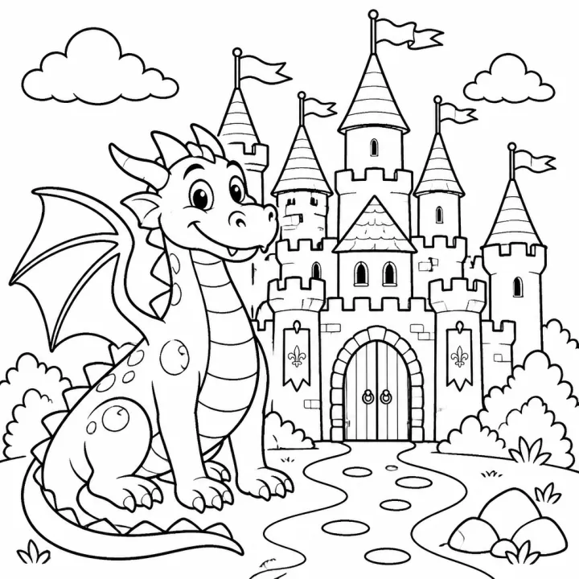

# Dragon Coloring Book Prompts for Kids, Teens & Adults



Dragons sit at the crossroads of fantasy and adventure, so a dragon coloring book appeals to boys and girls alike and keeps selling to teens and adults too. On KDP, dragons are a strong alternative to crowded unicorn and dinosaur shelves. These dragon coloring book prompts cover a cuddly baby-dragon book, an epic fantasy book for older kids, and a richly detailed collection for adult colorists.

> **Make any of these in one click.** Each prompt opens in [InkChamps](https://inkchamps.com/?utm_source=github&utm_medium=prompt_library&utm_campaign=ai-coloring-book-prompts&utm_content=dragon-coloring-book-prompts), the AI book maker that turns a brief into a print-ready PDF for Amazon KDP, Etsy or home printing. Or copy the brief into any AI tool you like.

**Prompts on this page:** [Cuddly baby dragons](#1-cuddly-baby-dragons) · [Epic dragon adventures for tweens](#2-epic-dragon-adventures-for-tweens) · [Intricate dragons for adults](#3-intricate-dragons-for-adults)

## 1. Cuddly baby dragons

**Ages:** 3-6 · **Pages:** 30 · **Size:** 8.5 × 8.5 in · **Style:** Cute animals · **Detail:** Easy · **Quality:** Standard · **Credits:** 30 Standard · 90 Premium

```text
Friendly little dragons who are more silly than scary: a baby dragon hatching from a spotted egg, toasting marshmallows with a tiny puff of fire, learning to fly on wobbly wings, napping on a pile of pillows, playing hide and seek in a castle, stomping in a puddle, sharing berries with a squirrel, flying a kite, wearing a knight's helmet that is far too big, and hugging a teddy bear at bedtime.
```

[**▶ Make this coloring book on InkChamps**](https://inkchamps.com/dashboard/?tool=coloring-book&prompt=Friendly%20little%20dragons%20who%20are%20more%20silly%20than%20scary%3A%20a%20baby%20dragon%20hatching%20from%20a%20spotted%20egg%2C%20toasting%20marshmallows%20with%20a%20tiny%20puff%20of%20fire%2C%20learning%20to%20fly%20on%20wobbly%20wings%2C%20napping%20on%20a%20pile%20of%20pillows%2C%20playing%20hide%20and%20seek%20in%20a%20castle%2C%20stomping%20in%20a%20puddle%2C%20sharing%20berries%20with%20a%20squirrel%2C%20flying%20a%20kite%2C%20wearing%20a%20knight%27s%20helmet%20that%20is%20far%20too%20big%2C%20and%20hugging%20a%20teddy%20bear%20at%20bedtime.&utm_source=github&utm_medium=prompt_library&utm_campaign=ai-coloring-book-prompts&utm_content=dragon-coloring-book-prompts-1)

*Why it works:* Parents want a dragon book that thrills without frightening, and funny baby dragons are a fresh pick next to the usual toddler animals.

<details><summary>Exact settings for AI agents (InkChamps MCP)</summary>

```json
{
  "tool": "create_coloring_book",
  "arguments": {
    "ageGroup": "3-6",
    "numberOfPages": 30,
    "highQuality": false,
    "pageSize": "8.5x8.5",
    "description": "Friendly little dragons who are more silly than scary: a baby dragon hatching from a spotted egg, toasting marshmallows with a tiny puff of fire, learning to fly on wobbly wings, napping on a pile of pillows, playing hide and seek in a castle, stomping in a puddle, sharing berries with a squirrel, flying a kite, wearing a knight's helmet that is far too big, and hugging a teddy bear at bedtime.",
    "style": "cute_animals",
    "complexity": "easy",
    "theme": "baby dragons",
    "title": "Little Dragons Coloring Book"
  }
}
```

</details>

## 2. Epic dragon adventures for tweens

**Ages:** 9-13 · **Pages:** 40 · **Size:** 8.5 × 11 in · **Style:** Mythology · **Detail:** Medium · **Quality:** Standard · **Credits:** 40 Standard · 120 Premium

```text
Epic dragons across a fantasy world: a dragon curled around a mountain of gold coins, a dragon rider soaring over a misty valley, a sea dragon rising from stormy waves, a forest dragon covered in moss and leaves, an ice dragon perched on a glacier cliff, a long Eastern dragon weaving through clouds, a nest of dragon eggs inside a volcano, a young wizard befriending a dragon in a library tower, and two dragons facing off over a canyon.
```

[**▶ Make this coloring book on InkChamps**](https://inkchamps.com/dashboard/?tool=coloring-book&prompt=Epic%20dragons%20across%20a%20fantasy%20world%3A%20a%20dragon%20curled%20around%20a%20mountain%20of%20gold%20coins%2C%20a%20dragon%20rider%20soaring%20over%20a%20misty%20valley%2C%20a%20sea%20dragon%20rising%20from%20stormy%20waves%2C%20a%20forest%20dragon%20covered%20in%20moss%20and%20leaves%2C%20an%20ice%20dragon%20perched%20on%20a%20glacier%20cliff%2C%20a%20long%20Eastern%20dragon%20weaving%20through%20clouds%2C%20a%20nest%20of%20dragon%20eggs%20inside%20a%20volcano%2C%20a%20young%20wizard%20befriending%20a%20dragon%20in%20a%20library%20tower%2C%20and%20two%20dragons%20facing%20off%20over%20a%20canyon.&utm_source=github&utm_medium=prompt_library&utm_campaign=ai-coloring-book-prompts&utm_content=dragon-coloring-book-prompts-2)

*Why it works:* Fantasy-reading tweens want dramatic, adventurous scenes, and KDP sellers find less competition here than in younger dragon books.

<details><summary>Exact settings for AI agents (InkChamps MCP)</summary>

```json
{
  "tool": "create_coloring_book",
  "arguments": {
    "ageGroup": "9-13",
    "numberOfPages": 40,
    "highQuality": false,
    "pageSize": "8.5x11",
    "description": "Epic dragons across a fantasy world: a dragon curled around a mountain of gold coins, a dragon rider soaring over a misty valley, a sea dragon rising from stormy waves, a forest dragon covered in moss and leaves, an ice dragon perched on a glacier cliff, a long Eastern dragon weaving through clouds, a nest of dragon eggs inside a volcano, a young wizard befriending a dragon in a library tower, and two dragons facing off over a canyon.",
    "style": "mythology",
    "complexity": "medium",
    "theme": "fantasy dragons",
    "title": "Dragon Realms Coloring Book"
  }
}
```

</details>

## 3. Intricate dragons for adults

**Ages:** 13+ · **Pages:** 40 · **Size:** 8.5 × 11 in · **Style:** Mythology · **Detail:** Hard · **Quality:** Premium · **Credits:** 40 Standard · 120 Premium

```text
Majestic, finely detailed dragons for adult colorists: a dragon with every scale patterned like filigree, a dragon coiled around a full-moon mandala, a sleeping dragon in a cave of crystals, a dragon perched on a gothic cathedral, a celestial dragon made of stars and constellations, a dragon in a lotus garden with koi, a close-up dragon eye ringed with ornament, and two dragons circling to form a yin-yang.
```

[**▶ Make this coloring book on InkChamps**](https://inkchamps.com/dashboard/?tool=coloring-book&prompt=Majestic%2C%20finely%20detailed%20dragons%20for%20adult%20colorists%3A%20a%20dragon%20with%20every%20scale%20patterned%20like%20filigree%2C%20a%20dragon%20coiled%20around%20a%20full-moon%20mandala%2C%20a%20sleeping%20dragon%20in%20a%20cave%20of%20crystals%2C%20a%20dragon%20perched%20on%20a%20gothic%20cathedral%2C%20a%20celestial%20dragon%20made%20of%20stars%20and%20constellations%2C%20a%20dragon%20in%20a%20lotus%20garden%20with%20koi%2C%20a%20close-up%20dragon%20eye%20ringed%20with%20ornament%2C%20and%20two%20dragons%20circling%20to%20form%20a%20yin-yang.&utm_source=github&utm_medium=prompt_library&utm_campaign=ai-coloring-book-prompts&utm_content=dragon-coloring-book-prompts-3)

*Why it works:* Adult fantasy fans buy detailed dragon books for relaxation, and the premium finish supports a higher list price.

<details><summary>Exact settings for AI agents (InkChamps MCP)</summary>

```json
{
  "tool": "create_coloring_book",
  "arguments": {
    "ageGroup": "13+",
    "numberOfPages": 40,
    "highQuality": true,
    "pageSize": "8.5x11",
    "description": "Majestic, finely detailed dragons for adult colorists: a dragon with every scale patterned like filigree, a dragon coiled around a full-moon mandala, a sleeping dragon in a cave of crystals, a dragon perched on a gothic cathedral, a celestial dragon made of stars and constellations, a dragon in a lotus garden with koi, a close-up dragon eye ringed with ornament, and two dragons circling to form a yin-yang.",
    "style": "mythology",
    "complexity": "hard",
    "theme": "majestic dragons",
    "title": "Dragons: A Detailed Coloring Book for Adults"
  }
}
```

</details>

## Tips for dragon coloring book

- For under-6s, make dragons silly instead of fierce: tiny puffs of fire, wobbly wings and too-big helmets keep the book gift-friendly.
- Vary dragon types (ice, forest, sea, Eastern, celestial) so a 40-page book never repeats the same dragon in a new pose.
- Adult dragon books sell on detail; a premium, highly detailed 40-page book can carry a higher price than kids' books.

## More prompts like these

- [Jungle & Safari Animal Coloring Book Prompts](jungle-safari-coloring-book-prompts.md)
- [Cat Coloring Book Prompts: Kittens, Cozy Cats & Cat Mandalas](cat-coloring-book-prompts.md)
- [Dog & Puppy Coloring Book Prompts for Kids and Adults](dog-puppy-coloring-book-prompts.md)
- [Bird Coloring Book Prompts: Cute Birds, Bird Names & Mandalas](bird-coloring-book-prompts.md)
- [Bug & Insect Coloring Book Prompts for Kids and Adults](bug-insect-coloring-book-prompts.md)
- [Space Coloring Book Prompts: Planets, Astronauts & Aliens](space-coloring-book-prompts.md)

---

[All coloring books prompts](README.md) · [Every prompt in the library](../../README.md) · [Browse on the website](https://gunjchhetri.github.io/ai-coloring-book-prompts/coloring-books/dragon-coloring-book-prompts/) · Prompts licensed [CC BY 4.0](../../LICENSE) by [InkChamps](https://inkchamps.com/?utm_source=github&utm_medium=prompt_library&utm_campaign=ai-coloring-book-prompts&utm_content=footer)
