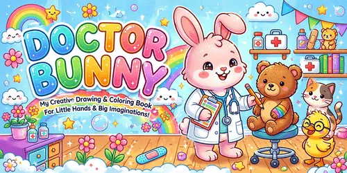

# Easter & Spring Coloring Book: prompts



3 prompts. The full page, with sample pages and tips, is in the [InkChamps prompt library](https://inkchamps.com/prompts/coloring-books/easter-spring/). Each prompt below opens in InkChamps with one click; or copy the brief into any AI tool.

**Prompts on this page:** [Bunnies, chicks and eggs for toddlers](#1-bunnies-chicks-and-eggs-for-toddlers) · [Egg hunts and spring adventures](#2-egg-hunts-and-spring-adventures) · [Folk-art Easter egg designs for adults](#3-folk-art-easter-egg-designs-for-adults)

## 1. Bunnies, chicks and eggs for toddlers

**Ages:** 3-6 · **Pages:** 30 · **Size:** 8.5 × 11 in · **Style:** Cute animals · **Detail:** Easy · **Quality:** Standard · **Credits:** 30 Standard · 90 Premium

```text
Thirty simple spring and Easter pictures: a bunny holding a big egg, a fluffy chick hatching from its shell, an Easter basket full of eggs, a lamb in the grass, a duckling in a puddle, tulips in a pot, a carrot patch, a butterfly, a bunny with a spring bonnet, a nest with three eggs, a lily, a caterpillar on a leaf and a big decorated egg with stripes and dots.
```

[**▶ Make this coloring book on InkChamps**](https://inkchamps.com/dashboard/?tool=coloring-book&prompt=Thirty%20simple%20spring%20and%20Easter%20pictures%3A%20a%20bunny%20holding%20a%20big%20egg%2C%20a%20fluffy%20chick%20hatching%20from%20its%20shell%2C%20an%20Easter%20basket%20full%20of%20eggs%2C%20a%20lamb%20in%20the%20grass%2C%20a%20duckling%20in%20a%20puddle%2C%20tulips%20in%20a%20pot%2C%20a%20carrot%20patch%2C%20a%20butterfly%2C%20a%20bunny%20with%20a%20spring%20bonnet%2C%20a%20nest%20with%20three%20eggs%2C%20a%20lily%2C%20a%20caterpillar%20on%20a%20leaf%20and%20a%20big%20decorated%20egg%20with%20stripes%20and%20dots.&utm_source=github&utm_medium=prompt_library&utm_campaign=ai-coloring-book-prompts&utm_content=easter-spring-coloring-book-prompts-1)

<details><summary>Exact settings for AI agents (InkChamps MCP)</summary>

```json
{
  "tool": "create_coloring_book",
  "arguments": {
    "ageGroup": "3-6",
    "numberOfPages": 30,
    "highQuality": false,
    "pageSize": "8.5x11",
    "description": "Thirty simple spring and Easter pictures: a bunny holding a big egg, a fluffy chick hatching from its shell, an Easter basket full of eggs, a lamb in the grass, a duckling in a puddle, tulips in a pot, a carrot patch, a butterfly, a bunny with a spring bonnet, a nest with three eggs, a lily, a caterpillar on a leaf and a big decorated egg with stripes and dots.",
    "style": "cute_animals",
    "complexity": "easy",
    "theme": "Easter",
    "title": "Hoppy Easter Coloring Book"
  }
}
```

</details>

## 2. Egg hunts and spring adventures

**Ages:** 6-9 · **Pages:** 32 · **Size:** 8.5 × 11 in · **Style:** General coloring · **Detail:** Medium · **Quality:** Standard · **Credits:** 32 Standard · 96 Premium

```text
Thirty-two springtime scenes: kids on an Easter egg hunt in the garden, a bunny family painting eggs, a picnic under cherry blossoms, splashing in puddles with umbrellas and rain boots, flying kites on a windy hill, planting seeds, a bird building a nest, a farm with newborn lambs and calves, a spring parade with bonnets and a basket race in the park.
```

[**▶ Make this coloring book on InkChamps**](https://inkchamps.com/dashboard/?tool=coloring-book&prompt=Thirty-two%20springtime%20scenes%3A%20kids%20on%20an%20Easter%20egg%20hunt%20in%20the%20garden%2C%20a%20bunny%20family%20painting%20eggs%2C%20a%20picnic%20under%20cherry%20blossoms%2C%20splashing%20in%20puddles%20with%20umbrellas%20and%20rain%20boots%2C%20flying%20kites%20on%20a%20windy%20hill%2C%20planting%20seeds%2C%20a%20bird%20building%20a%20nest%2C%20a%20farm%20with%20newborn%20lambs%20and%20calves%2C%20a%20spring%20parade%20with%20bonnets%20and%20a%20basket%20race%20in%20the%20park.&utm_source=github&utm_medium=prompt_library&utm_campaign=ai-coloring-book-prompts&utm_content=easter-spring-coloring-book-prompts-2)

<details><summary>Exact settings for AI agents (InkChamps MCP)</summary>

```json
{
  "tool": "create_coloring_book",
  "arguments": {
    "ageGroup": "6-9",
    "numberOfPages": 32,
    "highQuality": false,
    "pageSize": "8.5x11",
    "description": "Thirty-two springtime scenes: kids on an Easter egg hunt in the garden, a bunny family painting eggs, a picnic under cherry blossoms, splashing in puddles with umbrellas and rain boots, flying kites on a windy hill, planting seeds, a bird building a nest, a farm with newborn lambs and calves, a spring parade with bonnets and a basket race in the park.",
    "style": "general_coloring",
    "complexity": "medium",
    "theme": "Easter and spring"
  }
}
```

</details>

## 3. Folk-art Easter egg designs for adults

**Ages:** 13+ · **Pages:** 40 · **Size:** 8.5 × 11 in · **Style:** Mandala abstract · **Detail:** Hard · **Quality:** Premium · **Credits:** 40 Standard · 120 Premium

```text
Forty decorated Easter eggs and spring patterns: eggs covered in folk-art florals, Ukrainian-style geometric eggs, lace-patterned eggs on stands, an egg mandala of tulips, eggs in a woven basket, a bunny made of paisley, a wreath of daffodils and eggs, spring birds with patterned wings, a lamb with a fleece of swirls and a cherry blossom branch with patterned eggs hanging from it.
```

[**▶ Make this coloring book on InkChamps**](https://inkchamps.com/dashboard/?tool=coloring-book&prompt=Forty%20decorated%20Easter%20eggs%20and%20spring%20patterns%3A%20eggs%20covered%20in%20folk-art%20florals%2C%20Ukrainian-style%20geometric%20eggs%2C%20lace-patterned%20eggs%20on%20stands%2C%20an%20egg%20mandala%20of%20tulips%2C%20eggs%20in%20a%20woven%20basket%2C%20a%20bunny%20made%20of%20paisley%2C%20a%20wreath%20of%20daffodils%20and%20eggs%2C%20spring%20birds%20with%20patterned%20wings%2C%20a%20lamb%20with%20a%20fleece%20of%20swirls%20and%20a%20cherry%20blossom%20branch%20with%20patterned%20eggs%20hanging%20from%20it.&utm_source=github&utm_medium=prompt_library&utm_campaign=ai-coloring-book-prompts&utm_content=easter-spring-coloring-book-prompts-3)

<details><summary>Exact settings for AI agents (InkChamps MCP)</summary>

```json
{
  "tool": "create_coloring_book",
  "arguments": {
    "ageGroup": "13+",
    "numberOfPages": 40,
    "highQuality": true,
    "pageSize": "8.5x11",
    "description": "Forty decorated Easter eggs and spring patterns: eggs covered in folk-art florals, Ukrainian-style geometric eggs, lace-patterned eggs on stands, an egg mandala of tulips, eggs in a woven basket, a bunny made of paisley, a wreath of daffodils and eggs, spring birds with patterned wings, a lamb with a fleece of swirls and a cherry blossom branch with patterned eggs hanging from it.",
    "style": "mandala_abstract",
    "complexity": "hard",
    "theme": "Easter"
  }
}
```

</details>

## More prompts like these

- [Valentine's Day Coloring Book Prompts](valentines-day-coloring-book-prompts.md)
- [Autumn & Thanksgiving Coloring Book Prompts](autumn-thanksgiving-coloring-book-prompts.md)
- [Alphabet ABC Coloring Book Prompts for Toddlers & Preschool](alphabet-abc-coloring-book-prompts.md)
- [Numbers & Counting Coloring Book Prompts for Kids](numbers-counting-coloring-book-prompts.md)
- [Shapes and Colors Coloring Book Prompts for Preschool](shapes-and-colors-coloring-book-prompts.md)
- [Good Habits & Manners Coloring Book Prompts for Kids](good-habits-manners-coloring-book-prompts.md)

---

[All coloring books prompts](README.md) · [Every prompt in the library](../../README.md) · [This page on InkChamps](https://inkchamps.com/prompts/coloring-books/easter-spring/) · Prompts licensed [CC BY 4.0](../../LICENSE) by [InkChamps](https://inkchamps.com/?utm_source=github&utm_medium=prompt_library&utm_campaign=ai-coloring-book-prompts&utm_content=footer)
