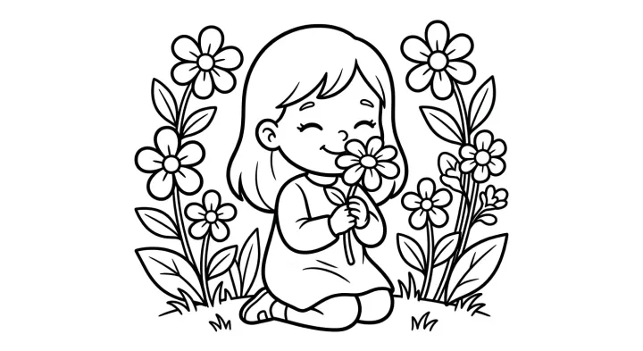

# Flower & Botanical Coloring Book Prompts



Flower coloring books are a perennial bestseller: gardeners, nature lovers and adult colorists buy them year-round, and they sell especially well around Mother's Day and spring. These flower and botanical coloring book prompts include a premium vintage botanical edition, a relaxing bouquets-and-gardens book, and a cheerful easy book for kids.

> **Make any of these in one click.** Each prompt opens in [InkChamps](https://inkchamps.com/?utm_source=github&utm_medium=prompt_library&utm_campaign=ai-coloring-book-prompts&utm_content=flower-botanical-coloring-book-prompts), the AI book maker that turns a brief into a print-ready PDF for Amazon KDP, Etsy or home printing. Or copy the brief into any AI tool you like.

**Prompts on this page:** [Vintage botanical studies for adults](#1-vintage-botanical-studies-for-adults) · [Bouquets, wreaths and garden corners](#2-bouquets-wreaths-and-garden-corners) · [Happy flowers for kids](#3-happy-flowers-for-kids)

## 1. Vintage botanical studies for adults

**Ages:** 13+ · **Pages:** 50 · **Size:** 8.5 × 11 in · **Style:** General coloring · **Detail:** Hard · **Quality:** Premium · **Credits:** 50 Standard · 150 Premium

```text
Fifty detailed botanical studies in the style of an old herbarium: a peony in full bloom with buds, a magnolia branch, bearded iris, foxgloves, a fern frond unrolling, lily of the valley, a sunflower head with seeds, poppies with seed pods, a rose stem, wild orchids, a lavender bundle, a passionflower, a sprig of olive and a cluster of hydrangea, each with leaves, stems and roots.
```

[**▶ Make this coloring book on InkChamps**](https://inkchamps.com/dashboard/?tool=coloring-book&prompt=Fifty%20detailed%20botanical%20studies%20in%20the%20style%20of%20an%20old%20herbarium%3A%20a%20peony%20in%20full%20bloom%20with%20buds%2C%20a%20magnolia%20branch%2C%20bearded%20iris%2C%20foxgloves%2C%20a%20fern%20frond%20unrolling%2C%20lily%20of%20the%20valley%2C%20a%20sunflower%20head%20with%20seeds%2C%20poppies%20with%20seed%20pods%2C%20a%20rose%20stem%2C%20wild%20orchids%2C%20a%20lavender%20bundle%2C%20a%20passionflower%2C%20a%20sprig%20of%20olive%20and%20a%20cluster%20of%20hydrangea%2C%20each%20with%20leaves%2C%20stems%20and%20roots.&utm_source=github&utm_medium=prompt_library&utm_campaign=ai-coloring-book-prompts&utm_content=flower-botanical-coloring-book-prompts-1)

*Why it works:* Adult colorists and gardeners pay a premium for realistic botanical detail, and the vintage herbarium angle stands out from generic flower books.

<details><summary>Exact settings for AI agents (InkChamps MCP)</summary>

```json
{
  "tool": "create_coloring_book",
  "arguments": {
    "ageGroup": "13+",
    "numberOfPages": 50,
    "highQuality": true,
    "pageSize": "8.5x11",
    "description": "Fifty detailed botanical studies in the style of an old herbarium: a peony in full bloom with buds, a magnolia branch, bearded iris, foxgloves, a fern frond unrolling, lily of the valley, a sunflower head with seeds, poppies with seed pods, a rose stem, wild orchids, a lavender bundle, a passionflower, a sprig of olive and a cluster of hydrangea, each with leaves, stems and roots.",
    "style": "general_coloring",
    "complexity": "hard",
    "title": "The Botanical Sketchbook"
  }
}
```

</details>

## 2. Bouquets, wreaths and garden corners

**Ages:** 13+ · **Pages:** 40 · **Size:** 8.5 × 11 in · **Style:** General coloring · **Detail:** Medium · **Quality:** Standard · **Credits:** 40 Standard · 120 Premium

```text
Forty relaxing floral pages: a bouquet of roses in a jug, a wildflower meadow with butterflies, a garden arch covered in climbing roses, a watering can spilling daisies, a tulip field with a windmill, a wreath of peonies and eucalyptus, a potting bench with seedlings, a teapot full of pansies, a window box of geraniums, a basket of cut flowers and a hummingbird at honeysuckle.
```

[**▶ Make this coloring book on InkChamps**](https://inkchamps.com/dashboard/?tool=coloring-book&prompt=Forty%20relaxing%20floral%20pages%3A%20a%20bouquet%20of%20roses%20in%20a%20jug%2C%20a%20wildflower%20meadow%20with%20butterflies%2C%20a%20garden%20arch%20covered%20in%20climbing%20roses%2C%20a%20watering%20can%20spilling%20daisies%2C%20a%20tulip%20field%20with%20a%20windmill%2C%20a%20wreath%20of%20peonies%20and%20eucalyptus%2C%20a%20potting%20bench%20with%20seedlings%2C%20a%20teapot%20full%20of%20pansies%2C%20a%20window%20box%20of%20geraniums%2C%20a%20basket%20of%20cut%20flowers%20and%20a%20hummingbird%20at%20honeysuckle.&utm_source=github&utm_medium=prompt_library&utm_campaign=ai-coloring-book-prompts&utm_content=flower-botanical-coloring-book-prompts-2)

*Why it works:* Gift buyers and relaxed adult colorists want pretty, balanced floral scenes that are detailed but not exhausting, an easy Mother's Day seller.

<details><summary>Exact settings for AI agents (InkChamps MCP)</summary>

```json
{
  "tool": "create_coloring_book",
  "arguments": {
    "ageGroup": "13+",
    "numberOfPages": 40,
    "highQuality": false,
    "pageSize": "8.5x11",
    "description": "Forty relaxing floral pages: a bouquet of roses in a jug, a wildflower meadow with butterflies, a garden arch covered in climbing roses, a watering can spilling daisies, a tulip field with a windmill, a wreath of peonies and eucalyptus, a potting bench with seedlings, a teapot full of pansies, a window box of geraniums, a basket of cut flowers and a hummingbird at honeysuckle.",
    "style": "general_coloring",
    "complexity": "medium"
  }
}
```

</details>

## 3. Happy flowers for kids

**Ages:** 6-9 · **Pages:** 30 · **Size:** 8.5 × 11 in · **Style:** General coloring · **Detail:** Easy · **Quality:** Standard · **Credits:** 30 Standard · 90 Premium

```text
Thirty bright flower pages for kids: a giant sunflower taller than a fence, tulips in a pot, a daisy chain, a ladybug on a rose, bees visiting lavender, a butterfly on a zinnia, a watering can and seed packets, a flower crown, a cactus with a pink bloom, a strawberry plant with flowers, a hummingbird at a trumpet flower and a garden path lined with pansies.
```

[**▶ Make this coloring book on InkChamps**](https://inkchamps.com/dashboard/?tool=coloring-book&prompt=Thirty%20bright%20flower%20pages%20for%20kids%3A%20a%20giant%20sunflower%20taller%20than%20a%20fence%2C%20tulips%20in%20a%20pot%2C%20a%20daisy%20chain%2C%20a%20ladybug%20on%20a%20rose%2C%20bees%20visiting%20lavender%2C%20a%20butterfly%20on%20a%20zinnia%2C%20a%20watering%20can%20and%20seed%20packets%2C%20a%20flower%20crown%2C%20a%20cactus%20with%20a%20pink%20bloom%2C%20a%20strawberry%20plant%20with%20flowers%2C%20a%20hummingbird%20at%20a%20trumpet%20flower%20and%20a%20garden%20path%20lined%20with%20pansies.&utm_source=github&utm_medium=prompt_library&utm_campaign=ai-coloring-book-prompts&utm_content=flower-botanical-coloring-book-prompts-3)

*Why it works:* Parents and teachers want a cheerful spring and gardening theme with simple, recognisable flowers kids can name.

<details><summary>Exact settings for AI agents (InkChamps MCP)</summary>

```json
{
  "tool": "create_coloring_book",
  "arguments": {
    "ageGroup": "6-9",
    "numberOfPages": 30,
    "highQuality": false,
    "pageSize": "8.5x11",
    "description": "Thirty bright flower pages for kids: a giant sunflower taller than a fence, tulips in a pot, a daisy chain, a ladybug on a rose, bees visiting lavender, a butterfly on a zinnia, a watering can and seed packets, a flower crown, a cactus with a pink bloom, a strawberry plant with flowers, a hummingbird at a trumpet flower and a garden path lined with pansies.",
    "style": "general_coloring",
    "complexity": "easy"
  }
}
```

</details>

## Tips for flower & botanical coloring book

- Name real flowers (peony, foxglove, magnolia, iris); specific species look far better than a generic 'flower'.
- For a botanical edition, ask for leaves, buds, seed pods and roots too; it gives the vintage herbarium look buyers want.
- Time flower books for spring and Mother's Day, when gift searches for floral coloring books peak.

## More prompts like these

- [Christmas Coloring Book Prompts for Kids & Adults](christmas-coloring-book-prompts.md)
- [Halloween Coloring Book Prompts: Spooky-Cute & Spooky-Cozy](halloween-coloring-book-prompts.md)
- [Easter & Spring Coloring Book Prompts](easter-spring-coloring-book-prompts.md)
- [Valentine's Day Coloring Book Prompts](valentines-day-coloring-book-prompts.md)
- [Autumn & Thanksgiving Coloring Book Prompts](autumn-thanksgiving-coloring-book-prompts.md)
- [Alphabet ABC Coloring Book Prompts for Toddlers & Preschool](alphabet-abc-coloring-book-prompts.md)

---

[All coloring books prompts](README.md) · [Every prompt in the library](../../README.md) · [Browse on the website](https://gunjchhetri.github.io/ai-coloring-book-prompts/coloring-books/flower-botanical-coloring-book-prompts/) · Prompts licensed [CC BY 4.0](../../LICENSE) by [InkChamps](https://inkchamps.com/?utm_source=github&utm_medium=prompt_library&utm_campaign=ai-coloring-book-prompts&utm_content=footer)
