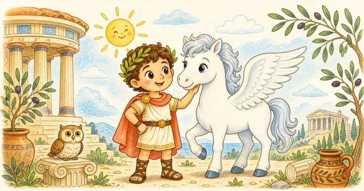

# Greek Mythology Coloring Book: prompts



3 prompts. The full page, with sample pages and tips, is in the [InkChamps prompt library](https://inkchamps.com/prompts/coloring-books/greek-mythology/). Each prompt below opens in InkChamps with one click; or copy the brief into any AI tool.

**Prompts on this page:** [Gods and heroes of Olympus for adults](#1-gods-and-heroes-of-olympus-for-adults) · [Legendary creatures bestiary](#2-legendary-creatures-bestiary) · [Greek myths for kids](#3-greek-myths-for-kids)

## 1. Gods and heroes of Olympus for adults

**Ages:** 13+ · **Pages:** 40 · **Size:** 8.5 × 11 in · **Style:** Mythology · **Detail:** Hard · **Quality:** Premium · **Credits:** 40 Standard · 120 Premium

```text
Forty dramatic scenes from Greek myths: Zeus on Mount Olympus with thunderbolts, Poseidon rising from the sea with his trident, Athena and her owl, Perseus with his mirrored shield facing Medusa, Pegasus in flight, Theseus in the Minotaur's labyrinth, Icarus falling as the sun melts his wax wings, Persephone in the underworld garden, Odysseus tied to the mast past the Sirens, the Trojan horse and Prometheus bringing fire.
```

[**▶ Make this coloring book on InkChamps**](https://inkchamps.com/dashboard/?tool=coloring-book&prompt=Forty%20dramatic%20scenes%20from%20Greek%20myths%3A%20Zeus%20on%20Mount%20Olympus%20with%20thunderbolts%2C%20Poseidon%20rising%20from%20the%20sea%20with%20his%20trident%2C%20Athena%20and%20her%20owl%2C%20Perseus%20with%20his%20mirrored%20shield%20facing%20Medusa%2C%20Pegasus%20in%20flight%2C%20Theseus%20in%20the%20Minotaur%27s%20labyrinth%2C%20Icarus%20falling%20as%20the%20sun%20melts%20his%20wax%20wings%2C%20Persephone%20in%20the%20underworld%20garden%2C%20Odysseus%20tied%20to%20the%20mast%20past%20the%20Sirens%2C%20the%20Trojan%20horse%20and%20Prometheus%20bringing%20fire.&utm_source=github&utm_medium=prompt_library&utm_campaign=ai-coloring-book-prompts&utm_content=greek-mythology-coloring-book-prompts-1)

<details><summary>Exact settings for AI agents (InkChamps MCP)</summary>

```json
{
  "tool": "create_coloring_book",
  "arguments": {
    "ageGroup": "13+",
    "numberOfPages": 40,
    "highQuality": true,
    "pageSize": "8.5x11",
    "description": "Forty dramatic scenes from Greek myths: Zeus on Mount Olympus with thunderbolts, Poseidon rising from the sea with his trident, Athena and her owl, Perseus with his mirrored shield facing Medusa, Pegasus in flight, Theseus in the Minotaur's labyrinth, Icarus falling as the sun melts his wax wings, Persephone in the underworld garden, Odysseus tied to the mast past the Sirens, the Trojan horse and Prometheus bringing fire.",
    "style": "mythology",
    "complexity": "hard",
    "title": "Myths of Olympus"
  }
}
```

</details>

## 2. Legendary creatures bestiary

**Ages:** 9-13 · **Pages:** 36 · **Size:** 8.5 × 11 in · **Style:** Mythology · **Detail:** Medium · **Quality:** Standard · **Credits:** 36 Standard · 108 Premium

```text
Thirty-six legendary creatures from Greek myth, each in its home: the three-headed dog Cerberus at the gates of the underworld, the many-headed Hydra in a swamp, the Sphinx on a rock outside Thebes, the Chimera, a centaur archer in a forest, a cyclops by his cave, harpies in a storm, Scylla in a sea strait, the Nemean lion, the golden-fleeced ram, the bronze giant Talos guarding Crete, the dragon Ladon coiled round the golden apple tree, Cetus the sea monster, the Stymphalian birds and a hippocamp, half horse and half fish.
```

[**▶ Make this coloring book on InkChamps**](https://inkchamps.com/dashboard/?tool=coloring-book&prompt=Thirty-six%20legendary%20creatures%20from%20Greek%20myth%2C%20each%20in%20its%20home%3A%20the%20three-headed%20dog%20Cerberus%20at%20the%20gates%20of%20the%20underworld%2C%20the%20many-headed%20Hydra%20in%20a%20swamp%2C%20the%20Sphinx%20on%20a%20rock%20outside%20Thebes%2C%20the%20Chimera%2C%20a%20centaur%20archer%20in%20a%20forest%2C%20a%20cyclops%20by%20his%20cave%2C%20harpies%20in%20a%20storm%2C%20Scylla%20in%20a%20sea%20strait%2C%20the%20Nemean%20lion%2C%20the%20golden-fleeced%20ram%2C%20the%20bronze%20giant%20Talos%20guarding%20Crete%2C%20the%20dragon%20Ladon%20coiled%20round%20the%20golden%20apple%20tree%2C%20Cetus%20the%20sea%20monster%2C%20the%20Stymphalian%20birds%20and%20a%20hippocamp%2C%20half%20horse%20and%20half%20fish.&utm_source=github&utm_medium=prompt_library&utm_campaign=ai-coloring-book-prompts&utm_content=greek-mythology-coloring-book-prompts-2)

<details><summary>Exact settings for AI agents (InkChamps MCP)</summary>

```json
{
  "tool": "create_coloring_book",
  "arguments": {
    "ageGroup": "9-13",
    "numberOfPages": 36,
    "highQuality": false,
    "pageSize": "8.5x11",
    "description": "Thirty-six legendary creatures from Greek myth, each in its home: the three-headed dog Cerberus at the gates of the underworld, the many-headed Hydra in a swamp, the Sphinx on a rock outside Thebes, the Chimera, a centaur archer in a forest, a cyclops by his cave, harpies in a storm, Scylla in a sea strait, the Nemean lion, the golden-fleeced ram, the bronze giant Talos guarding Crete, the dragon Ladon coiled round the golden apple tree, Cetus the sea monster, the Stymphalian birds and a hippocamp, half horse and half fish.",
    "style": "mythology",
    "complexity": "medium",
    "title": "Beasts of Greek Myth"
  }
}
```

</details>

## 3. Greek myths for kids

**Ages:** 6-9 · **Pages:** 30 · **Size:** 8.5 × 11 in · **Style:** Mythology · **Detail:** Medium · **Quality:** Standard · **Credits:** 30 Standard · 90 Premium

```text
Thirty kid-friendly Greek myth pages: Pegasus flying over the sea, Athena's wise owl, Hercules holding up the sky for Atlas, the Trojan horse rolling into the city, Pandora's jar, with little Hope still glowing inside, Icarus and his father with feathered wings, King Midas turning an apple to gold, Arachne at her loom, Demeter in a wheat field and Atalanta racing Hippomenes as he rolls golden apples.
```

[**▶ Make this coloring book on InkChamps**](https://inkchamps.com/dashboard/?tool=coloring-book&prompt=Thirty%20kid-friendly%20Greek%20myth%20pages%3A%20Pegasus%20flying%20over%20the%20sea%2C%20Athena%27s%20wise%20owl%2C%20Hercules%20holding%20up%20the%20sky%20for%20Atlas%2C%20the%20Trojan%20horse%20rolling%20into%20the%20city%2C%20Pandora%27s%20jar%2C%20with%20little%20Hope%20still%20glowing%20inside%2C%20Icarus%20and%20his%20father%20with%20feathered%20wings%2C%20King%20Midas%20turning%20an%20apple%20to%20gold%2C%20Arachne%20at%20her%20loom%2C%20Demeter%20in%20a%20wheat%20field%20and%20Atalanta%20racing%20Hippomenes%20as%20he%20rolls%20golden%20apples.&utm_source=github&utm_medium=prompt_library&utm_campaign=ai-coloring-book-prompts&utm_content=greek-mythology-coloring-book-prompts-3)

<details><summary>Exact settings for AI agents (InkChamps MCP)</summary>

```json
{
  "tool": "create_coloring_book",
  "arguments": {
    "ageGroup": "6-9",
    "numberOfPages": 30,
    "highQuality": false,
    "pageSize": "8.5x11",
    "description": "Thirty kid-friendly Greek myth pages: Pegasus flying over the sea, Athena's wise owl, Hercules holding up the sky for Atlas, the Trojan horse rolling into the city, Pandora's jar, with little Hope still glowing inside, Icarus and his father with feathered wings, King Midas turning an apple to gold, Arachne at her loom, Demeter in a wheat field and Atalanta racing Hippomenes as he rolls golden apples.",
    "style": "mythology",
    "complexity": "medium"
  }
}
```

</details>

## More prompts like these

- [Bible Story Coloring Book Prompts for Kids & Adults](bible-story-coloring-book-prompts.md)
- [Dinosaur Coloring Book Prompts for Kids & KDP](dinosaur-coloring-book-prompts.md)
- [Farm Animal Coloring Book Prompts: Cute Barnyard Pages](farm-animal-coloring-book-prompts.md)
- [Ocean Animal Coloring Book Prompts: Sea Creatures & Coral Reefs](ocean-animal-coloring-book-prompts.md)
- [Unicorn Coloring Book Prompts: Unicorns & Magical Creatures](unicorn-coloring-book-prompts.md)
- [Dragon Coloring Book Prompts for Kids, Teens & Adults](dragon-coloring-book-prompts.md)

---

[All coloring books prompts](README.md) · [Every prompt in the library](../../README.md) · [This page on InkChamps](https://inkchamps.com/prompts/coloring-books/greek-mythology/) · Prompts licensed [CC BY 4.0](../../LICENSE) by [InkChamps](https://inkchamps.com/?utm_source=github&utm_medium=prompt_library&utm_campaign=ai-coloring-book-prompts&utm_content=footer)
