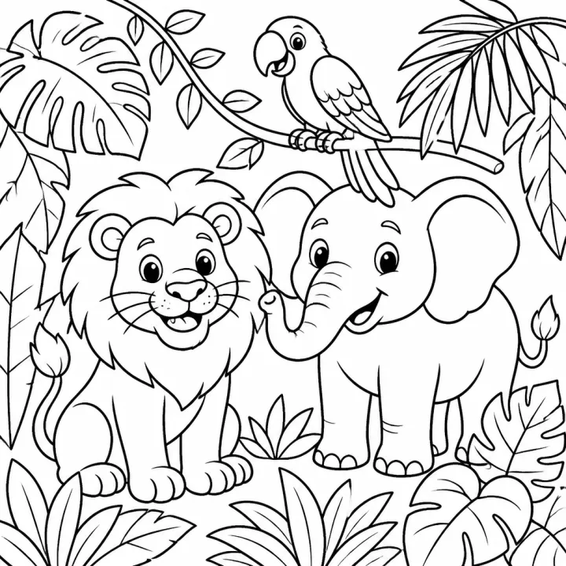

# Jungle & Safari Animal Coloring Book: prompts



3 prompts. The full page, with sample pages and tips, is in the [InkChamps prompt library](https://inkchamps.com/prompts/coloring-books/jungle-safari/). Each prompt below opens in InkChamps with one click; or copy the brief into any AI tool.

**Prompts on this page:** [Little safari friends](#1-little-safari-friends) · [Rainforest and savanna adventure](#2-rainforest-and-savanna-adventure) · [Safari animal mandalas for adults](#3-safari-animal-mandalas-for-adults)

## 1. Little safari friends

**Ages:** 3-6 · **Pages:** 30 · **Size:** 8.5 × 8.5 in · **Style:** Cute animals · **Detail:** Easy · **Quality:** Standard · **Credits:** 30 Standard · 90 Premium

```text
Happy baby animals on a gentle safari: a lion cub chasing a butterfly, a baby elephant spraying water from its trunk, a giraffe stretching for leaves, a zebra foal beside its mother, a hippo blowing bubbles in the river, a monkey swinging on a vine, a sleepy sloth hanging from a branch, a toucan on a banana leaf, a baby rhino rolling in mud, and a tiger cub napping in tall grass.
```

[**▶ Make this coloring book on InkChamps**](https://inkchamps.com/dashboard/?tool=coloring-book&prompt=Happy%20baby%20animals%20on%20a%20gentle%20safari%3A%20a%20lion%20cub%20chasing%20a%20butterfly%2C%20a%20baby%20elephant%20spraying%20water%20from%20its%20trunk%2C%20a%20giraffe%20stretching%20for%20leaves%2C%20a%20zebra%20foal%20beside%20its%20mother%2C%20a%20hippo%20blowing%20bubbles%20in%20the%20river%2C%20a%20monkey%20swinging%20on%20a%20vine%2C%20a%20sleepy%20sloth%20hanging%20from%20a%20branch%2C%20a%20toucan%20on%20a%20banana%20leaf%2C%20a%20baby%20rhino%20rolling%20in%20mud%2C%20and%20a%20tiger%20cub%20napping%20in%20tall%20grass.&utm_source=github&utm_medium=prompt_library&utm_campaign=ai-coloring-book-prompts&utm_content=jungle-safari-coloring-book-prompts-1)

<details><summary>Exact settings for AI agents (InkChamps MCP)</summary>

```json
{
  "tool": "create_coloring_book",
  "arguments": {
    "ageGroup": "3-6",
    "numberOfPages": 30,
    "highQuality": false,
    "pageSize": "8.5x8.5",
    "description": "Happy baby animals on a gentle safari: a lion cub chasing a butterfly, a baby elephant spraying water from its trunk, a giraffe stretching for leaves, a zebra foal beside its mother, a hippo blowing bubbles in the river, a monkey swinging on a vine, a sleepy sloth hanging from a branch, a toucan on a banana leaf, a baby rhino rolling in mud, and a tiger cub napping in tall grass.",
    "style": "cute_animals",
    "complexity": "easy",
    "theme": "baby safari animals",
    "title": "Little Safari Coloring Book"
  }
}
```

</details>

## 2. Rainforest and savanna adventure

**Ages:** 6-9 · **Pages:** 40 · **Size:** 8.5 × 11 in · **Style:** Jungle adventure · **Detail:** Medium · **Quality:** Standard · **Credits:** 40 Standard · 120 Premium

```text
A safari adventure from rainforest to savanna: kids in a safari jeep watching elephants at a watering hole, a lion pride resting on a rock, a cheetah racing across the grassland, gorillas in a misty mountain forest, a jaguar on a branch above a river, macaws in the rainforest canopy, a crocodile sliding into the water, meerkats standing on lookout, flamingos wading in a lake, and a hot air balloon over the herds at sunrise.
```

[**▶ Make this coloring book on InkChamps**](https://inkchamps.com/dashboard/?tool=coloring-book&prompt=A%20safari%20adventure%20from%20rainforest%20to%20savanna%3A%20kids%20in%20a%20safari%20jeep%20watching%20elephants%20at%20a%20watering%20hole%2C%20a%20lion%20pride%20resting%20on%20a%20rock%2C%20a%20cheetah%20racing%20across%20the%20grassland%2C%20gorillas%20in%20a%20misty%20mountain%20forest%2C%20a%20jaguar%20on%20a%20branch%20above%20a%20river%2C%20macaws%20in%20the%20rainforest%20canopy%2C%20a%20crocodile%20sliding%20into%20the%20water%2C%20meerkats%20standing%20on%20lookout%2C%20flamingos%20wading%20in%20a%20lake%2C%20and%20a%20hot%20air%20balloon%20over%20the%20herds%20at%20sunrise.&utm_source=github&utm_medium=prompt_library&utm_campaign=ai-coloring-book-prompts&utm_content=jungle-safari-coloring-book-prompts-2)

<details><summary>Exact settings for AI agents (InkChamps MCP)</summary>

```json
{
  "tool": "create_coloring_book",
  "arguments": {
    "ageGroup": "6-9",
    "numberOfPages": 40,
    "highQuality": false,
    "pageSize": "8.5x11",
    "description": "A safari adventure from rainforest to savanna: kids in a safari jeep watching elephants at a watering hole, a lion pride resting on a rock, a cheetah racing across the grassland, gorillas in a misty mountain forest, a jaguar on a branch above a river, macaws in the rainforest canopy, a crocodile sliding into the water, meerkats standing on lookout, flamingos wading in a lake, and a hot air balloon over the herds at sunrise.",
    "style": "jungle_adventure",
    "complexity": "medium",
    "theme": "safari adventure",
    "title": "Jungle Safari Adventure Coloring Book"
  }
}
```

</details>

## 3. Safari animal mandalas for adults

**Ages:** 13+ · **Pages:** 40 · **Size:** 8.5 × 11 in · **Style:** Mandala animal · **Detail:** Hard · **Quality:** Premium · **Credits:** 40 Standard · 120 Premium

```text
Wild animals filled with intricate patterns: a lion whose mane becomes swirling mandalas, an elephant decorated with henna-style designs, a giraffe with ornamental spots, a zebra whose stripes turn into geometric shapes, a tiger peering through patterned jungle leaves, a gorilla cradling its baby among patterned leaves, a rhino at a lily-covered watering hole, a leopard draped over a branch, a chameleon on a fern, and a toucan among tropical flowers.
```

[**▶ Make this coloring book on InkChamps**](https://inkchamps.com/dashboard/?tool=coloring-book&prompt=Wild%20animals%20filled%20with%20intricate%20patterns%3A%20a%20lion%20whose%20mane%20becomes%20swirling%20mandalas%2C%20an%20elephant%20decorated%20with%20henna-style%20designs%2C%20a%20giraffe%20with%20ornamental%20spots%2C%20a%20zebra%20whose%20stripes%20turn%20into%20geometric%20shapes%2C%20a%20tiger%20peering%20through%20patterned%20jungle%20leaves%2C%20a%20gorilla%20cradling%20its%20baby%20among%20patterned%20leaves%2C%20a%20rhino%20at%20a%20lily-covered%20watering%20hole%2C%20a%20leopard%20draped%20over%20a%20branch%2C%20a%20chameleon%20on%20a%20fern%2C%20and%20a%20toucan%20among%20tropical%20flowers.&utm_source=github&utm_medium=prompt_library&utm_campaign=ai-coloring-book-prompts&utm_content=jungle-safari-coloring-book-prompts-3)

<details><summary>Exact settings for AI agents (InkChamps MCP)</summary>

```json
{
  "tool": "create_coloring_book",
  "arguments": {
    "ageGroup": "13+",
    "numberOfPages": 40,
    "highQuality": true,
    "pageSize": "8.5x11",
    "description": "Wild animals filled with intricate patterns: a lion whose mane becomes swirling mandalas, an elephant decorated with henna-style designs, a giraffe with ornamental spots, a zebra whose stripes turn into geometric shapes, a tiger peering through patterned jungle leaves, a gorilla cradling its baby among patterned leaves, a rhino at a lily-covered watering hole, a leopard draped over a branch, a chameleon on a fern, and a toucan among tropical flowers.",
    "style": "mandala_animal",
    "complexity": "hard",
    "theme": "safari mandalas",
    "title": "Wild Safari Mandalas"
  }
}
```

</details>

## More prompts like these

- [Cat Coloring Book Prompts: Kittens, Cozy Cats & Cat Mandalas](cat-coloring-book-prompts.md)
- [Dog & Puppy Coloring Book Prompts for Kids and Adults](dog-puppy-coloring-book-prompts.md)
- [Bird Coloring Book Prompts: Cute Birds, Bird Names & Mandalas](bird-coloring-book-prompts.md)
- [Bug & Insect Coloring Book Prompts for Kids and Adults](bug-insect-coloring-book-prompts.md)
- [Space Coloring Book Prompts: Planets, Astronauts & Aliens](space-coloring-book-prompts.md)
- [Vehicle Coloring Book Prompts: Trucks, Diggers, Trains & Cars](vehicle-coloring-book-prompts.md)

---

[All coloring books prompts](README.md) · [Every prompt in the library](../../README.md) · [This page on InkChamps](https://inkchamps.com/prompts/coloring-books/jungle-safari/) · Prompts licensed [CC BY 4.0](../../LICENSE) by [InkChamps](https://inkchamps.com/?utm_source=github&utm_medium=prompt_library&utm_campaign=ai-coloring-book-prompts&utm_content=footer)
