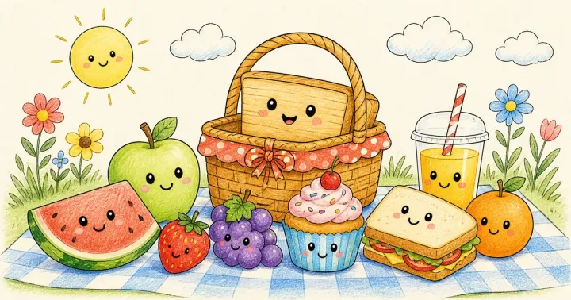

# Kawaii Food Coloring Book Prompts: Cute Desserts, Fruit & Snacks



Kawaii food coloring books, with smiling cupcakes, sushi and strawberries, are one of the fastest-growing coloring niches on Amazon KDP and Etsy. They appeal to young kids, tweens and a large teen and adult audience who love cute, bold pages that are relaxing to color. These kawaii food coloring book prompts cover a fruit-and-veggie book for little kids, a desserts book for school-age kids, and busy kawaii food scenes for teens and adults.

> **Make any of these in one click.** Each prompt opens in [InkChamps](https://inkchamps.com/?utm_source=github&utm_medium=prompt_library&utm_campaign=ai-coloring-book-prompts&utm_content=kawaii-food-coloring-book-prompts), the AI book maker that turns a brief into a print-ready PDF for Amazon KDP, Etsy or home printing. Or copy the brief into any AI tool you like.

**Prompts on this page:** [Smiling fruit and veggie friends](#1-smiling-fruit-and-veggie-friends) · [Kawaii desserts and sweet treats](#2-kawaii-desserts-and-sweet-treats) · [Busy kawaii food scenes for teens and adults](#3-busy-kawaii-food-scenes-for-teens-and-adults)

## 1. Smiling fruit and veggie friends

**Ages:** 3-6 · **Pages:** 30 · **Size:** 8.5 × 8.5 in · **Style:** Food fun · **Detail:** Easy · **Quality:** Standard · **Credits:** 30 Standard · 90 Premium

```text
Happy fruits and vegetables with sweet smiling faces: a strawberry wearing a flower crown, a banana on a skateboard, an avocado hugging its pit, a pineapple in sunglasses, watermelon slices at the beach, a carrot and a pea pod playing tag, a broccoli tree house, an apple and an orange holding hands, a family of grapes, and a lemon diving into a glass of lemonade.
```

[**▶ Make this coloring book on InkChamps**](https://inkchamps.com/dashboard/?tool=coloring-book&prompt=Happy%20fruits%20and%20vegetables%20with%20sweet%20smiling%20faces%3A%20a%20strawberry%20wearing%20a%20flower%20crown%2C%20a%20banana%20on%20a%20skateboard%2C%20an%20avocado%20hugging%20its%20pit%2C%20a%20pineapple%20in%20sunglasses%2C%20watermelon%20slices%20at%20the%20beach%2C%20a%20carrot%20and%20a%20pea%20pod%20playing%20tag%2C%20a%20broccoli%20tree%20house%2C%20an%20apple%20and%20an%20orange%20holding%20hands%2C%20a%20family%20of%20grapes%2C%20and%20a%20lemon%20diving%20into%20a%20glass%20of%20lemonade.&utm_source=github&utm_medium=prompt_library&utm_campaign=ai-coloring-book-prompts&utm_content=kawaii-food-coloring-book-prompts-1)

*Why it works:* Parents of little kids, including picky eaters, love friendly fruit and vegetable characters with simple shapes.

<details><summary>Exact settings for AI agents (InkChamps MCP)</summary>

```json
{
  "tool": "create_coloring_book",
  "arguments": {
    "ageGroup": "3-6",
    "numberOfPages": 30,
    "highQuality": false,
    "pageSize": "8.5x8.5",
    "description": "Happy fruits and vegetables with sweet smiling faces: a strawberry wearing a flower crown, a banana on a skateboard, an avocado hugging its pit, a pineapple in sunglasses, watermelon slices at the beach, a carrot and a pea pod playing tag, a broccoli tree house, an apple and an orange holding hands, a family of grapes, and a lemon diving into a glass of lemonade.",
    "style": "food_fun",
    "complexity": "easy",
    "theme": "kawaii fruit and veggies",
    "title": "Happy Fruit and Veggies Coloring Book"
  }
}
```

</details>

## 2. Kawaii desserts and sweet treats

**Ages:** 6-9 · **Pages:** 40 · **Size:** 8.5 × 11 in · **Style:** Food fun · **Detail:** Medium · **Quality:** Standard · **Credits:** 40 Standard · 120 Premium

```text
A sweet world of kawaii desserts with cute faces: a cupcake wearing a cherry hat, a stack of pancakes with dripping syrup, a donut floating on a pool ring, a three-scoop ice cream cone, a slice of birthday cake, macarons in a row, a bubble tea cup full of tapioca pearls, cookies dunking in milk, a candy shop window, a waffle topped with strawberries, and a pie cooling on a windowsill.
```

[**▶ Make this coloring book on InkChamps**](https://inkchamps.com/dashboard/?tool=coloring-book&prompt=A%20sweet%20world%20of%20kawaii%20desserts%20with%20cute%20faces%3A%20a%20cupcake%20wearing%20a%20cherry%20hat%2C%20a%20stack%20of%20pancakes%20with%20dripping%20syrup%2C%20a%20donut%20floating%20on%20a%20pool%20ring%2C%20a%20three-scoop%20ice%20cream%20cone%2C%20a%20slice%20of%20birthday%20cake%2C%20macarons%20in%20a%20row%2C%20a%20bubble%20tea%20cup%20full%20of%20tapioca%20pearls%2C%20cookies%20dunking%20in%20milk%2C%20a%20candy%20shop%20window%2C%20a%20waffle%20topped%20with%20strawberries%2C%20and%20a%20pie%20cooling%20on%20a%20windowsill.&utm_source=github&utm_medium=prompt_library&utm_campaign=ai-coloring-book-prompts&utm_content=kawaii-food-coloring-book-prompts-2)

*Why it works:* School-age kids adore cute desserts, and it is one of the most searched kawaii sub-niches for KDP sellers.

<details><summary>Exact settings for AI agents (InkChamps MCP)</summary>

```json
{
  "tool": "create_coloring_book",
  "arguments": {
    "ageGroup": "6-9",
    "numberOfPages": 40,
    "highQuality": false,
    "pageSize": "8.5x11",
    "description": "A sweet world of kawaii desserts with cute faces: a cupcake wearing a cherry hat, a stack of pancakes with dripping syrup, a donut floating on a pool ring, a three-scoop ice cream cone, a slice of birthday cake, macarons in a row, a bubble tea cup full of tapioca pearls, cookies dunking in milk, a candy shop window, a waffle topped with strawberries, and a pie cooling on a windowsill.",
    "style": "food_fun",
    "complexity": "medium",
    "theme": "kawaii desserts",
    "title": "Kawaii Sweets Coloring Book"
  }
}
```

</details>

## 3. Busy kawaii food scenes for teens and adults

**Ages:** 13+ · **Pages:** 40 · **Size:** 8.5 × 11 in · **Style:** Food fun · **Detail:** Hard · **Quality:** Premium · **Credits:** 40 Standard · 120 Premium

```text
Busy kawaii food scenes packed with cute characters: a conveyor belt of smiling sushi rolls, a ramen bowl hot spring where noodles relax, a bakery shelf crowded with happy breads and croissants, a dumpling party in a bamboo steamer, pizza night with dancing toppings, a breakfast table where eggs and toast play cards, a bento box city, a farmers market of grinning vegetables, and a teapot tea party with cakes.
```

[**▶ Make this coloring book on InkChamps**](https://inkchamps.com/dashboard/?tool=coloring-book&prompt=Busy%20kawaii%20food%20scenes%20packed%20with%20cute%20characters%3A%20a%20conveyor%20belt%20of%20smiling%20sushi%20rolls%2C%20a%20ramen%20bowl%20hot%20spring%20where%20noodles%20relax%2C%20a%20bakery%20shelf%20crowded%20with%20happy%20breads%20and%20croissants%2C%20a%20dumpling%20party%20in%20a%20bamboo%20steamer%2C%20pizza%20night%20with%20dancing%20toppings%2C%20a%20breakfast%20table%20where%20eggs%20and%20toast%20play%20cards%2C%20a%20bento%20box%20city%2C%20a%20farmers%20market%20of%20grinning%20vegetables%2C%20and%20a%20teapot%20tea%20party%20with%20cakes.&utm_source=github&utm_medium=prompt_library&utm_campaign=ai-coloring-book-prompts&utm_content=kawaii-food-coloring-book-prompts-3)

*Why it works:* Teens and adults who love cute, relaxing pages buy kawaii food books in large numbers, and full scenes give them more to color than single icons.

<details><summary>Exact settings for AI agents (InkChamps MCP)</summary>

```json
{
  "tool": "create_coloring_book",
  "arguments": {
    "ageGroup": "13+",
    "numberOfPages": 40,
    "highQuality": true,
    "pageSize": "8.5x11",
    "description": "Busy kawaii food scenes packed with cute characters: a conveyor belt of smiling sushi rolls, a ramen bowl hot spring where noodles relax, a bakery shelf crowded with happy breads and croissants, a dumpling party in a bamboo steamer, pizza night with dancing toppings, a breakfast table where eggs and toast play cards, a bento box city, a farmers market of grinning vegetables, and a teapot tea party with cakes.",
    "style": "food_fun",
    "complexity": "hard",
    "theme": "kawaii food scenes",
    "title": "Cozy Kawaii Food Coloring Book"
  }
}
```

</details>

## Tips for kawaii food coloring book

- Kawaii food is not just for kids; teens and adults buy cute, bold-and-easy books for relaxing, so consider a 13+ version.
- Give the food a scene or activity (a donut floating in a pool ring) instead of a plain portrait; it makes each page memorable.
- Fruit-and-veggie books also sell to parents of picky eaters, which is a handy angle for your listing description.

## More prompts like these

- [Mandala Coloring Book Prompts for Adults & Teens](mandala-coloring-book-prompts.md)
- [Animal Mandala Coloring Book Prompts](animal-mandala-coloring-book-prompts.md)
- [Stress Relief Coloring Book Prompts for Adults](stress-relief-coloring-book-prompts.md)
- [Cozy Coloring Book Prompts: Hygge, Cottagecore & Café Scenes](cozy-coloring-book-prompts.md)
- [Bold and Easy Coloring Book Prompts for Adults & Seniors](bold-and-easy-coloring-book-prompts.md)
- [Flower & Botanical Coloring Book Prompts](flower-botanical-coloring-book-prompts.md)

---

[All coloring books prompts](README.md) · [Every prompt in the library](../../README.md) · [Browse on the website](https://gunjchhetri.github.io/ai-coloring-book-prompts/coloring-books/kawaii-food-coloring-book-prompts/) · Prompts licensed [CC BY 4.0](../../LICENSE) by [InkChamps](https://inkchamps.com/?utm_source=github&utm_medium=prompt_library&utm_campaign=ai-coloring-book-prompts&utm_content=footer)
