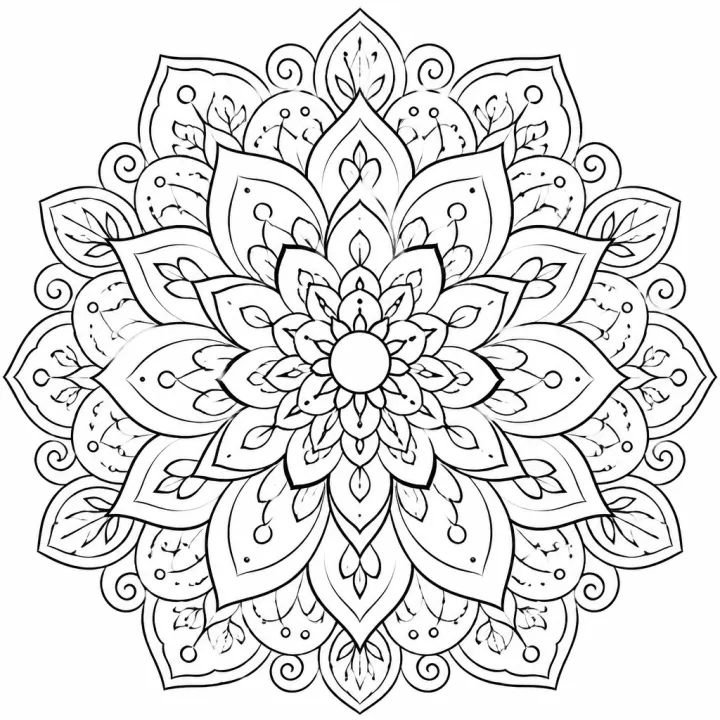

# Mandala Coloring Book Prompts for Adults & Teens



Mandala coloring books are one of the most reliable sellers on Amazon KDP, bought by adults who color to unwind and by teens who love symmetry and detail. These mandala coloring book prompts cover the full range, from dense geometric designs for experienced colorists to open, beginner-friendly mandalas and a celestial boho set for tweens. Each brief asks for a different design on every page, so the book never feels repetitive.

> **Make any of these in one click.** Each prompt opens in [InkChamps](https://inkchamps.com/?utm_source=github&utm_medium=prompt_library&utm_campaign=ai-coloring-book-prompts&utm_content=mandala-coloring-book-prompts), the AI book maker that turns a brief into a print-ready PDF for Amazon KDP, Etsy or home printing. Or copy the brief into any AI tool you like.

**Prompts on this page:** [Intricate geometric mandalas for adults](#1-intricate-geometric-mandalas-for-adults) · [Beginner-friendly mandalas with big spaces](#2-beginner-friendly-mandalas-with-big-spaces) · [Celestial boho mandalas for tweens](#3-celestial-boho-mandalas-for-tweens)

## 1. Intricate geometric mandalas for adults

**Ages:** 13+ · **Pages:** 50 · **Size:** 8.5 × 8.5 in · **Style:** Mandala abstract · **Detail:** Hard · **Quality:** Premium · **Credits:** 50 Standard · 150 Premium

```text
Fifty intricate circular mandalas, each a different design: layered lotus petals, interlocking star polygons, Moroccan tile rosettes, Celtic knot rings, feathered paisley borders, sunburst rays, honeycomb lattices and lace-like filigree. Some centre on a tiny eight-pointed star, others bloom outward through twelve rings of scallops, teardrops and tiny beads. A calm, meditative collection for long evenings of coloring.
```

[**▶ Make this coloring book on InkChamps**](https://inkchamps.com/dashboard/?tool=coloring-book&prompt=Fifty%20intricate%20circular%20mandalas%2C%20each%20a%20different%20design%3A%20layered%20lotus%20petals%2C%20interlocking%20star%20polygons%2C%20Moroccan%20tile%20rosettes%2C%20Celtic%20knot%20rings%2C%20feathered%20paisley%20borders%2C%20sunburst%20rays%2C%20honeycomb%20lattices%20and%20lace-like%20filigree.%20Some%20centre%20on%20a%20tiny%20eight-pointed%20star%2C%20others%20bloom%20outward%20through%20twelve%20rings%20of%20scallops%2C%20teardrops%20and%20tiny%20beads.%20A%20calm%2C%20meditative%20collection%20for%20long%20evenings%20of%20coloring.&utm_source=github&utm_medium=prompt_library&utm_campaign=ai-coloring-book-prompts&utm_content=mandala-coloring-book-prompts-1)

*Why it works:* Experienced adult colorists and KDP sellers in the core mandala niche want dense, varied designs, and the square format shows each mandala at full size.

<details><summary>Exact settings for AI agents (InkChamps MCP)</summary>

```json
{
  "tool": "create_coloring_book",
  "arguments": {
    "ageGroup": "13+",
    "numberOfPages": 50,
    "highQuality": true,
    "pageSize": "8.5x8.5",
    "description": "Fifty intricate circular mandalas, each a different design: layered lotus petals, interlocking star polygons, Moroccan tile rosettes, Celtic knot rings, feathered paisley borders, sunburst rays, honeycomb lattices and lace-like filigree. Some centre on a tiny eight-pointed star, others bloom outward through twelve rings of scallops, teardrops and tiny beads. A calm, meditative collection for long evenings of coloring.",
    "style": "mandala_abstract",
    "complexity": "hard",
    "title": "Mandala Meditations: 50 Intricate Designs"
  }
}
```

</details>

## 2. Beginner-friendly mandalas with big spaces

**Ages:** 13+ · **Pages:** 30 · **Size:** 8.5 × 11 in · **Style:** Mandala abstract · **Detail:** Medium · **Quality:** Standard · **Credits:** 30 Standard · 90 Premium

```text
Thirty simple mandalas for beginners and relaxed colorists: large petals, wide rings and only a few layers in each design. A flower-centred mandala, a sun with wavy rays, a ring of hearts, a five-pointed star mandala, a leaf wreath, a seashell spiral, circles of triangles and dots, a simple lotus and a snowflake-style rosette. Calm, uncluttered and quick to finish in one sitting.
```

[**▶ Make this coloring book on InkChamps**](https://inkchamps.com/dashboard/?tool=coloring-book&prompt=Thirty%20simple%20mandalas%20for%20beginners%20and%20relaxed%20colorists%3A%20large%20petals%2C%20wide%20rings%20and%20only%20a%20few%20layers%20in%20each%20design.%20A%20flower-centred%20mandala%2C%20a%20sun%20with%20wavy%20rays%2C%20a%20ring%20of%20hearts%2C%20a%20five-pointed%20star%20mandala%2C%20a%20leaf%20wreath%2C%20a%20seashell%20spiral%2C%20circles%20of%20triangles%20and%20dots%2C%20a%20simple%20lotus%20and%20a%20snowflake-style%20rosette.%20Calm%2C%20uncluttered%20and%20quick%20to%20finish%20in%20one%20sitting.&utm_source=github&utm_medium=prompt_library&utm_campaign=ai-coloring-book-prompts&utm_content=mandala-coloring-book-prompts-2)

*Why it works:* New adult colorists, seniors and gift buyers want mandalas they can actually finish, a gap many over-detailed KDP mandala books leave open.

<details><summary>Exact settings for AI agents (InkChamps MCP)</summary>

```json
{
  "tool": "create_coloring_book",
  "arguments": {
    "ageGroup": "13+",
    "numberOfPages": 30,
    "highQuality": false,
    "pageSize": "8.5x11",
    "description": "Thirty simple mandalas for beginners and relaxed colorists: large petals, wide rings and only a few layers in each design. A flower-centred mandala, a sun with wavy rays, a ring of hearts, a five-pointed star mandala, a leaf wreath, a seashell spiral, circles of triangles and dots, a simple lotus and a snowflake-style rosette. Calm, uncluttered and quick to finish in one sitting.",
    "style": "mandala_abstract",
    "complexity": "medium"
  }
}
```

</details>

## 3. Celestial boho mandalas for tweens

**Ages:** 9-13 · **Pages:** 40 · **Size:** 8.5 × 11 in · **Style:** Mandala abstract · **Detail:** Medium · **Quality:** Standard · **Credits:** 40 Standard · 120 Premium

```text
Forty boho celestial mandalas for tweens: crescent moons inside rings of stars, moon-phase circles, suns with patterned faces, crystals and gemstones arranged in a circle, feathers and beads hanging from round hoops, constellation wheels, mushroom and fern rings, and planets wrapped in swirling orbit patterns. Dreamy, trendy and full of night-sky magic.
```

[**▶ Make this coloring book on InkChamps**](https://inkchamps.com/dashboard/?tool=coloring-book&prompt=Forty%20boho%20celestial%20mandalas%20for%20tweens%3A%20crescent%20moons%20inside%20rings%20of%20stars%2C%20moon-phase%20circles%2C%20suns%20with%20patterned%20faces%2C%20crystals%20and%20gemstones%20arranged%20in%20a%20circle%2C%20feathers%20and%20beads%20hanging%20from%20round%20hoops%2C%20constellation%20wheels%2C%20mushroom%20and%20fern%20rings%2C%20and%20planets%20wrapped%20in%20swirling%20orbit%20patterns.%20Dreamy%2C%20trendy%20and%20full%20of%20night-sky%20magic.&utm_source=github&utm_medium=prompt_library&utm_campaign=ai-coloring-book-prompts&utm_content=mandala-coloring-book-prompts-3)

*Why it works:* Parents and teens shopping for an aesthetic, room-decor style book pick celestial boho themes over plain geometry, and the medium detail suits ages 9 to 13.

<details><summary>Exact settings for AI agents (InkChamps MCP)</summary>

```json
{
  "tool": "create_coloring_book",
  "arguments": {
    "ageGroup": "9-13",
    "numberOfPages": 40,
    "highQuality": false,
    "pageSize": "8.5x11",
    "description": "Forty boho celestial mandalas for tweens: crescent moons inside rings of stars, moon-phase circles, suns with patterned faces, crystals and gemstones arranged in a circle, feathers and beads hanging from round hoops, constellation wheels, mushroom and fern rings, and planets wrapped in swirling orbit patterns. Dreamy, trendy and full of night-sky magic.",
    "style": "mandala_abstract",
    "complexity": "medium"
  }
}
```

</details>

## Tips for mandala coloring book

- Name the motifs you want (lotus petals, star polygons, paisley, lace) so each page gets a different design instead of fifty near-identical circles.
- Use the 8.5x8.5 square size for single round mandalas; the design fills the page with no wasted space.
- Sell a beginner and an intricate edition side by side; buyers who finish one often come back for the other.

## More prompts like these

- [Animal Mandala Coloring Book Prompts](animal-mandala-coloring-book-prompts.md)
- [Stress Relief Coloring Book Prompts for Adults](stress-relief-coloring-book-prompts.md)
- [Cozy Coloring Book Prompts: Hygge, Cottagecore & Café Scenes](cozy-coloring-book-prompts.md)
- [Bold and Easy Coloring Book Prompts for Adults & Seniors](bold-and-easy-coloring-book-prompts.md)
- [Flower & Botanical Coloring Book Prompts](flower-botanical-coloring-book-prompts.md)
- [Christmas Coloring Book Prompts for Kids & Adults](christmas-coloring-book-prompts.md)

---

[All coloring books prompts](README.md) · [Every prompt in the library](../../README.md) · [Browse on the website](https://gunjchhetri.github.io/ai-coloring-book-prompts/coloring-books/mandala-coloring-book-prompts/) · Prompts licensed [CC BY 4.0](../../LICENSE) by [InkChamps](https://inkchamps.com/?utm_source=github&utm_medium=prompt_library&utm_campaign=ai-coloring-book-prompts&utm_content=footer)
