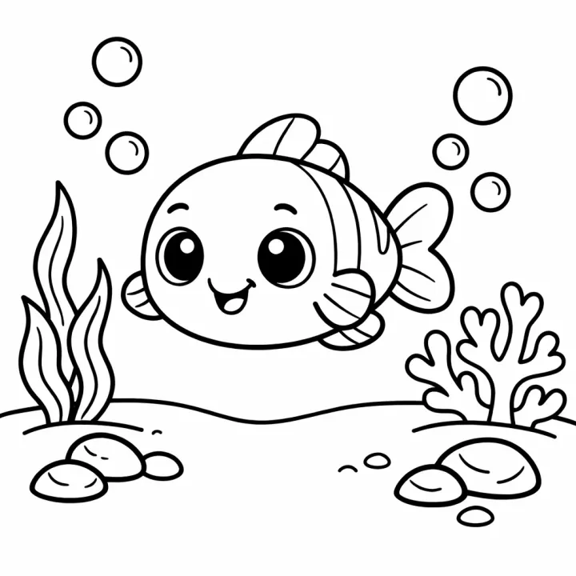

# Mermaid Coloring Book Prompts for Kids, Teens & Adults



Mermaid coloring books combine two favourite themes, magic and the ocean, and they sell strongly as gifts for girls from preschool to the tween years. Detailed mermaids with flowing hair and shell-covered tails are also a popular adult coloring niche. These mermaid coloring book prompts cover a sweet book for little kids, a full undersea kingdom adventure, and an ornate mermaid fantasy book for teens and adults, all with original characters.

> **Make any of these in one click.** Each prompt opens in [InkChamps](https://inkchamps.com/?utm_source=github&utm_medium=prompt_library&utm_campaign=ai-coloring-book-prompts&utm_content=mermaid-coloring-book-prompts), the AI book maker that turns a brief into a print-ready PDF for Amazon KDP, Etsy or home printing. Or copy the brief into any AI tool you like.

**Prompts on this page:** [Young mermaids and sea friends](#1-young-mermaids-and-sea-friends) · [Undersea mermaid kingdom](#2-undersea-mermaid-kingdom) · [Ornate mermaid fantasy for adults](#3-ornate-mermaid-fantasy-for-adults)

## 1. Young mermaids and sea friends

**Ages:** 3-6 · **Pages:** 30 · **Size:** 8.5 × 8.5 in · **Style:** Fairy tale · **Detail:** Easy · **Quality:** Standard · **Credits:** 30 Standard · 90 Premium

```text
Happy young mermaids in a bright underwater world: a mermaid hugging a sea turtle, riding a dolphin, having a tea party with a sea otter and a starfish, combing her hair with a seashell, playing hide and seek in the coral, sleeping in an open clam shell, blowing bubbles with a pufferfish, swimming with a seahorse, a baby mermaid in a seaweed cradle, and a merboy racing a school of fish.
```

[**▶ Make this coloring book on InkChamps**](https://inkchamps.com/dashboard/?tool=coloring-book&prompt=Happy%20young%20mermaids%20in%20a%20bright%20underwater%20world%3A%20a%20mermaid%20hugging%20a%20sea%20turtle%2C%20riding%20a%20dolphin%2C%20having%20a%20tea%20party%20with%20a%20sea%20otter%20and%20a%20starfish%2C%20combing%20her%20hair%20with%20a%20seashell%2C%20playing%20hide%20and%20seek%20in%20the%20coral%2C%20sleeping%20in%20an%20open%20clam%20shell%2C%20blowing%20bubbles%20with%20a%20pufferfish%2C%20swimming%20with%20a%20seahorse%2C%20a%20baby%20mermaid%20in%20a%20seaweed%20cradle%2C%20and%20a%20merboy%20racing%20a%20school%20of%20fish.&utm_source=github&utm_medium=prompt_library&utm_campaign=ai-coloring-book-prompts&utm_content=mermaid-coloring-book-prompts-1)

*Why it works:* Parents of preschoolers want gentle, magical ocean pages with a cute sea friend on each one, and mermaids are a top gift theme.

<details><summary>Exact settings for AI agents (InkChamps MCP)</summary>

```json
{
  "tool": "create_coloring_book",
  "arguments": {
    "ageGroup": "3-6",
    "numberOfPages": 30,
    "highQuality": false,
    "pageSize": "8.5x8.5",
    "description": "Happy young mermaids in a bright underwater world: a mermaid hugging a sea turtle, riding a dolphin, having a tea party with a sea otter and a starfish, combing her hair with a seashell, playing hide and seek in the coral, sleeping in an open clam shell, blowing bubbles with a pufferfish, swimming with a seahorse, a baby mermaid in a seaweed cradle, and a merboy racing a school of fish.",
    "style": "fairy_tale",
    "complexity": "easy",
    "theme": "young mermaids",
    "title": "Mermaid Friends Coloring Book"
  }
}
```

</details>

## 2. Undersea mermaid kingdom

**Ages:** 6-9 · **Pages:** 40 · **Size:** 8.5 × 11 in · **Style:** Fairy tale · **Detail:** Medium · **Quality:** Standard · **Credits:** 40 Standard · 120 Premium

```text
A magical undersea mermaid kingdom: a coral palace with seashell towers, mermaids exploring a sunken ship, a mermaid school where merkids learn about fish, a mermaid riding a whale through the deep, a treasure hunt in a glowing sea cave, a festival lit by lantern jellyfish, a mermaid on a rock beside a lighthouse at sunset, a mermaid caring for a baby octopus, a seahorse race, and mermaids playing with otters in a kelp forest.
```

[**▶ Make this coloring book on InkChamps**](https://inkchamps.com/dashboard/?tool=coloring-book&prompt=A%20magical%20undersea%20mermaid%20kingdom%3A%20a%20coral%20palace%20with%20seashell%20towers%2C%20mermaids%20exploring%20a%20sunken%20ship%2C%20a%20mermaid%20school%20where%20merkids%20learn%20about%20fish%2C%20a%20mermaid%20riding%20a%20whale%20through%20the%20deep%2C%20a%20treasure%20hunt%20in%20a%20glowing%20sea%20cave%2C%20a%20festival%20lit%20by%20lantern%20jellyfish%2C%20a%20mermaid%20on%20a%20rock%20beside%20a%20lighthouse%20at%20sunset%2C%20a%20mermaid%20caring%20for%20a%20baby%20octopus%2C%20a%20seahorse%20race%2C%20and%20mermaids%20playing%20with%20otters%20in%20a%20kelp%20forest.&utm_source=github&utm_medium=prompt_library&utm_campaign=ai-coloring-book-prompts&utm_content=mermaid-coloring-book-prompts-2)

*Why it works:* School-age mermaid fans get a whole world to explore page by page, which keeps a 40-page book fresh to the end.

<details><summary>Exact settings for AI agents (InkChamps MCP)</summary>

```json
{
  "tool": "create_coloring_book",
  "arguments": {
    "ageGroup": "6-9",
    "numberOfPages": 40,
    "highQuality": false,
    "pageSize": "8.5x11",
    "description": "A magical undersea mermaid kingdom: a coral palace with seashell towers, mermaids exploring a sunken ship, a mermaid school where merkids learn about fish, a mermaid riding a whale through the deep, a treasure hunt in a glowing sea cave, a festival lit by lantern jellyfish, a mermaid on a rock beside a lighthouse at sunset, a mermaid caring for a baby octopus, a seahorse race, and mermaids playing with otters in a kelp forest.",
    "style": "fairy_tale",
    "complexity": "medium",
    "theme": "mermaid kingdom",
    "title": "The Mermaid Kingdom Coloring Book"
  }
}
```

</details>

## 3. Ornate mermaid fantasy for adults

**Ages:** 13+ · **Pages:** 40 · **Size:** 8.5 × 11 in · **Style:** Mandala sea · **Detail:** Hard · **Quality:** Premium · **Credits:** 40 Standard · 120 Premium

```text
Graceful mermaids in richly detailed ocean scenes: a mermaid whose flowing hair is threaded with shells and pearls, a mermaid curled inside a giant nautilus, a mermaid resting in a moonlit tide pool, a mermaid encircled by a mandala of fish and coral, a mermaid queen on a coral throne, mermaids drifting among jellyfish, a mermaid holding a glowing lantern in the deep, and a tail covered in intricate scales. Every mermaid wears a shell-and-pearl or seaweed top.
```

[**▶ Make this coloring book on InkChamps**](https://inkchamps.com/dashboard/?tool=coloring-book&prompt=Graceful%20mermaids%20in%20richly%20detailed%20ocean%20scenes%3A%20a%20mermaid%20whose%20flowing%20hair%20is%20threaded%20with%20shells%20and%20pearls%2C%20a%20mermaid%20curled%20inside%20a%20giant%20nautilus%2C%20a%20mermaid%20resting%20in%20a%20moonlit%20tide%20pool%2C%20a%20mermaid%20encircled%20by%20a%20mandala%20of%20fish%20and%20coral%2C%20a%20mermaid%20queen%20on%20a%20coral%20throne%2C%20mermaids%20drifting%20among%20jellyfish%2C%20a%20mermaid%20holding%20a%20glowing%20lantern%20in%20the%20deep%2C%20and%20a%20tail%20covered%20in%20intricate%20scales.%20Every%20mermaid%20wears%20a%20shell-and-pearl%20or%20seaweed%20top.&utm_source=github&utm_medium=prompt_library&utm_campaign=ai-coloring-book-prompts&utm_content=mermaid-coloring-book-prompts-3)

*Why it works:* Teen and adult colorists buy ornate mermaid art for relaxation, and it pairs well with ocean mandala books in a KDP catalogue.

<details><summary>Exact settings for AI agents (InkChamps MCP)</summary>

```json
{
  "tool": "create_coloring_book",
  "arguments": {
    "ageGroup": "13+",
    "numberOfPages": 40,
    "highQuality": true,
    "pageSize": "8.5x11",
    "description": "Graceful mermaids in richly detailed ocean scenes: a mermaid whose flowing hair is threaded with shells and pearls, a mermaid curled inside a giant nautilus, a mermaid resting in a moonlit tide pool, a mermaid encircled by a mandala of fish and coral, a mermaid queen on a coral throne, mermaids drifting among jellyfish, a mermaid holding a glowing lantern in the deep, and a tail covered in intricate scales. Every mermaid wears a shell-and-pearl or seaweed top.",
    "style": "mandala_sea",
    "complexity": "hard",
    "theme": "mermaid fantasy",
    "title": "Mermaid Dreams: An Adult Coloring Book"
  }
}
```

</details>

## Tips for mermaid coloring book

- Keep every mermaid original; avoid famous red-haired film mermaids and their sidekicks so the book is safe to sell.
- Add sea friends (turtles, dolphins, octopuses) to almost every page; they make mermaid books far more varied than solo portraits.
- Include merboys and mermaids of different looks, which broadens the gift audience.

## More prompts like these

- [Robot Coloring Book Prompts for Kids & Tweens](robot-coloring-book-prompts.md)
- [Kawaii Food Coloring Book Prompts: Cute Desserts, Fruit & Snacks](kawaii-food-coloring-book-prompts.md)
- [Mandala Coloring Book Prompts for Adults & Teens](mandala-coloring-book-prompts.md)
- [Animal Mandala Coloring Book Prompts](animal-mandala-coloring-book-prompts.md)
- [Stress Relief Coloring Book Prompts for Adults](stress-relief-coloring-book-prompts.md)
- [Cozy Coloring Book Prompts: Hygge, Cottagecore & Café Scenes](cozy-coloring-book-prompts.md)

---

[All coloring books prompts](README.md) · [Every prompt in the library](../../README.md) · [Browse on the website](https://gunjchhetri.github.io/ai-coloring-book-prompts/coloring-books/mermaid-coloring-book-prompts/) · Prompts licensed [CC BY 4.0](../../LICENSE) by [InkChamps](https://inkchamps.com/?utm_source=github&utm_medium=prompt_library&utm_campaign=ai-coloring-book-prompts&utm_content=footer)
