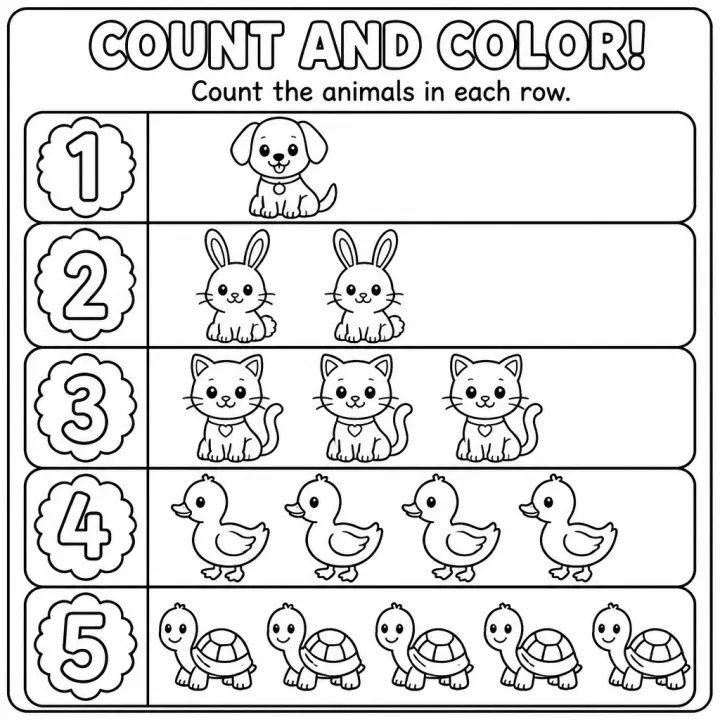

# Numbers & Counting Coloring Book Prompts for Kids



Counting coloring books help toddlers and preschoolers link a number to an amount, and they are a staple for parents, preschool teachers and homeschoolers. These numbers coloring book prompts list every number with the objects to count, so each page shows one number and exactly that many things to color. Pick a toddler 1 to 10 book, a classic 1 to 20 book or a 1 to 30 garden challenge.

> **Make any of these in one click.** Each prompt opens in [InkChamps](https://inkchamps.com/?utm_source=github&utm_medium=prompt_library&utm_campaign=ai-coloring-book-prompts&utm_content=numbers-counting-coloring-book-prompts), the AI book maker that turns a brief into a print-ready PDF for Amazon KDP, Etsy or home printing. Or copy the brief into any AI tool you like.

**Prompts on this page:** [Count 1 to 10 on the farm](#1-count-1-to-10-on-the-farm) · [Count 1 to 20 everyday things](#2-count-1-to-20-everyday-things) · [Count 1 to 30 in the garden](#3-count-1-to-30-in-the-garden)

## 1. Count 1 to 10 on the farm

**Ages:** 3-6 · **Pages:** 10 · **Size:** 8.5 × 8.5 in · **Style:** Cute animals · **Detail:** Easy · **Layout:** One item per page, with its caption · **Quality:** Standard · **Credits:** 10 Standard · 30 Premium

```text
A counting book on the farm, one number per page showing the number and exactly that many big friendly things to count: 1 cow, 2 pigs, 3 sheep, 4 hens, 5 chicks, 6 ducks, 7 bunnies, 8 eggs, 9 carrots, 10 pumpkins.
```

[**▶ Make this coloring book on InkChamps**](https://inkchamps.com/dashboard/?tool=coloring-book&prompt=A%20counting%20book%20on%20the%20farm%2C%20one%20number%20per%20page%20showing%20the%20number%20and%20exactly%20that%20many%20big%20friendly%20things%20to%20count%3A%201%20cow%2C%202%20pigs%2C%203%20sheep%2C%204%20hens%2C%205%20chicks%2C%206%20ducks%2C%207%20bunnies%2C%208%20eggs%2C%209%20carrots%2C%2010%20pumpkins.&utm_source=github&utm_medium=prompt_library&utm_campaign=ai-coloring-book-prompts&utm_content=numbers-counting-coloring-book-prompts-1)

*Why it works:* Parents of toddlers want a first counting book with big, simple farm animals that are easy to count and name. Its short length is great for home printing.

<details><summary>Exact settings for AI agents (InkChamps MCP)</summary>

```json
{
  "tool": "create_coloring_book",
  "arguments": {
    "ageGroup": "3-6",
    "numberOfPages": 10,
    "highQuality": false,
    "pageSize": "8.5x8.5",
    "description": "A counting book on the farm, one number per page showing the number and exactly that many big friendly things to count: 1 cow, 2 pigs, 3 sheep, 4 hens, 5 chicks, 6 ducks, 7 bunnies, 8 eggs, 9 carrots, 10 pumpkins.",
    "style": "cute_animals",
    "complexity": "easy",
    "title": "Count on the Farm",
    "pageCategory": "concept"
  }
}
```

</details>

## 2. Count 1 to 20 everyday things

**Ages:** 3-6 · **Pages:** 20 · **Size:** 8.5 × 11 in · **Style:** General coloring · **Detail:** Easy · **Layout:** One item per page, with its caption · **Quality:** Standard · **Credits:** 20 Standard · 60 Premium

```text
A counting book from 1 to 20, one number per page showing the number and exactly that many objects: 1 sun, 2 owls, 3 ladybugs, 4 apples, 5 ducks, 6 balloons, 7 fish, 8 stars, 9 cupcakes, 10 butterflies, 11 strawberries, 12 seashells, 13 snails, 14 leaves, 15 bubbles, 16 buttons, 17 raindrops, 18 cookies, 19 flowers, 20 marbles.
```

[**▶ Make this coloring book on InkChamps**](https://inkchamps.com/dashboard/?tool=coloring-book&prompt=A%20counting%20book%20from%201%20to%2020%2C%20one%20number%20per%20page%20showing%20the%20number%20and%20exactly%20that%20many%20objects%3A%201%20sun%2C%202%20owls%2C%203%20ladybugs%2C%204%20apples%2C%205%20ducks%2C%206%20balloons%2C%207%20fish%2C%208%20stars%2C%209%20cupcakes%2C%2010%20butterflies%2C%2011%20strawberries%2C%2012%20seashells%2C%2013%20snails%2C%2014%20leaves%2C%2015%20bubbles%2C%2016%20buttons%2C%2017%20raindrops%2C%2018%20cookies%2C%2019%20flowers%2C%2020%20marbles.&utm_source=github&utm_medium=prompt_library&utm_campaign=ai-coloring-book-prompts&utm_content=numbers-counting-coloring-book-prompts-2)

*Why it works:* Preschool teachers and homeschoolers use 1 to 20 counting books for number sense, and varied everyday objects keep each page fresh. Its short length is great for home printing.

<details><summary>Exact settings for AI agents (InkChamps MCP)</summary>

```json
{
  "tool": "create_coloring_book",
  "arguments": {
    "ageGroup": "3-6",
    "numberOfPages": 20,
    "highQuality": false,
    "pageSize": "8.5x11",
    "description": "A counting book from 1 to 20, one number per page showing the number and exactly that many objects: 1 sun, 2 owls, 3 ladybugs, 4 apples, 5 ducks, 6 balloons, 7 fish, 8 stars, 9 cupcakes, 10 butterflies, 11 strawberries, 12 seashells, 13 snails, 14 leaves, 15 bubbles, 16 buttons, 17 raindrops, 18 cookies, 19 flowers, 20 marbles.",
    "style": "general_coloring",
    "complexity": "easy",
    "pageCategory": "concept"
  }
}
```

</details>

## 3. Count 1 to 30 in the garden

**Ages:** 6-9 · **Pages:** 30 · **Size:** 8.5 × 11 in · **Style:** General coloring · **Detail:** Medium · **Layout:** One item per page, with its caption · **Quality:** Standard · **Credits:** 30 Standard · 90 Premium

```text
A garden counting book from 1 to 30, one number per page with the number and exactly that many things in a garden scene: 1 snail, 2 worms, 3 bees, 4 tulips, 5 ladybugs, 6 acorns, 7 mushrooms, 8 butterflies, 9 pebbles, 10 carrots, 11 peas, 12 daisies, 13 ants, 14 radishes, 15 seeds, 16 apples, 17 leaves, 18 strawberries, 19 cherries, 20 raindrops, 21 clover, 22 berries, 23 dewdrops, 24 blossoms, 25 fireflies, 26 petals, 27 beans, 28 grapes, 29 dots on a mushroom, 30 stars.
```

[**▶ Make this coloring book on InkChamps**](https://inkchamps.com/dashboard/?tool=coloring-book&prompt=A%20garden%20counting%20book%20from%201%20to%2030%2C%20one%20number%20per%20page%20with%20the%20number%20and%20exactly%20that%20many%20things%20in%20a%20garden%20scene%3A%201%20snail%2C%202%20worms%2C%203%20bees%2C%204%20tulips%2C%205%20ladybugs%2C%206%20acorns%2C%207%20mushrooms%2C%208%20butterflies%2C%209%20pebbles%2C%2010%20carrots%2C%2011%20peas%2C%2012%20daisies%2C%2013%20ants%2C%2014%20radishes%2C%2015%20seeds%2C%2016%20apples%2C%2017%20leaves%2C%2018%20strawberries%2C%2019%20cherries%2C%2020%20raindrops%2C%2021%20clover%2C%2022%20berries%2C%2023%20dewdrops%2C%2024%20blossoms%2C%2025%20fireflies%2C%2026%20petals%2C%2027%20beans%2C%2028%20grapes%2C%2029%20dots%20on%20a%20mushroom%2C%2030%20stars.&utm_source=github&utm_medium=prompt_library&utm_campaign=ai-coloring-book-prompts&utm_content=numbers-counting-coloring-book-prompts-3)

*Why it works:* Homeschoolers and early-grade teachers want a counting challenge beyond 20, and a garden setting turns each count into a small scene.

<details><summary>Exact settings for AI agents (InkChamps MCP)</summary>

```json
{
  "tool": "create_coloring_book",
  "arguments": {
    "ageGroup": "6-9",
    "numberOfPages": 30,
    "highQuality": false,
    "pageSize": "8.5x11",
    "description": "A garden counting book from 1 to 30, one number per page with the number and exactly that many things in a garden scene: 1 snail, 2 worms, 3 bees, 4 tulips, 5 ladybugs, 6 acorns, 7 mushrooms, 8 butterflies, 9 pebbles, 10 carrots, 11 peas, 12 daisies, 13 ants, 14 radishes, 15 seeds, 16 apples, 17 leaves, 18 strawberries, 19 cherries, 20 raindrops, 21 clover, 22 berries, 23 dewdrops, 24 blossoms, 25 fireflies, 26 petals, 27 beans, 28 grapes, 29 dots on a mushroom, 30 stars.",
    "style": "general_coloring",
    "complexity": "medium",
    "pageCategory": "concept"
  }
}
```

</details>

## Tips for numbers & counting coloring book

- List each number with its objects ('7 fish') so every page counts something different; page count equals the last number.
- Use small, separate objects (fish, stars, buttons) for higher numbers so children can count them one by one.
- Start at 1 to 10 for toddlers; go to 20 or 30 only once a child counts confidently.

## More prompts like these

- [Shapes and Colors Coloring Book Prompts for Preschool](shapes-and-colors-coloring-book-prompts.md)
- [Good Habits & Manners Coloring Book Prompts for Kids](good-habits-manners-coloring-book-prompts.md)
- [Feelings & Emotions Coloring Book Prompts for Kids](feelings-emotions-coloring-book-prompts.md)
- [Greek Mythology Coloring Book Prompts](greek-mythology-coloring-book-prompts.md)
- [Bible Story Coloring Book Prompts for Kids & Adults](bible-story-coloring-book-prompts.md)
- [Dinosaur Coloring Book Prompts for Kids & KDP](dinosaur-coloring-book-prompts.md)

---

[All coloring books prompts](README.md) · [Every prompt in the library](../../README.md) · [Browse on the website](https://gunjchhetri.github.io/ai-coloring-book-prompts/coloring-books/numbers-counting-coloring-book-prompts/) · Prompts licensed [CC BY 4.0](../../LICENSE) by [InkChamps](https://inkchamps.com/?utm_source=github&utm_medium=prompt_library&utm_campaign=ai-coloring-book-prompts&utm_content=footer)
