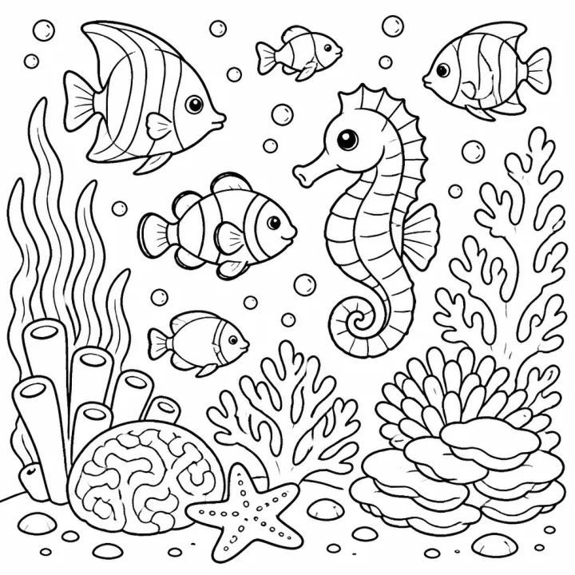

# Ocean Animal Coloring Book Prompts: Sea Creatures & Coral Reefs



Sea creatures work for every age, from a toddler's first smiling whale to an adult colorist's intricate jellyfish mandala. Ocean coloring books sell steadily on KDP and Etsy in summer and as beach-trip gifts, and teachers use them for ocean units. These ocean animal coloring book prompts cover a gentle under-the-sea book, a reef-to-deep-sea explorer book, and a premium ocean mandala collection.

> **Make any of these in one click.** Each prompt opens in [InkChamps](https://inkchamps.com/?utm_source=github&utm_medium=prompt_library&utm_campaign=ai-coloring-book-prompts&utm_content=ocean-animal-coloring-book-prompts), the AI book maker that turns a brief into a print-ready PDF for Amazon KDP, Etsy or home printing. Or copy the brief into any AI tool you like.

**Prompts on this page:** [Under-the-sea friends for little kids](#1-under-the-sea-friends-for-little-kids) · [Coral reef to deep sea explorer](#2-coral-reef-to-deep-sea-explorer) · [Ocean mandalas for adults](#3-ocean-mandalas-for-adults)

## 1. Under-the-sea friends for little kids

**Ages:** 3-6 · **Pages:** 30 · **Size:** 8.5 × 8.5 in · **Style:** Cute animals · **Detail:** Easy · **Quality:** Standard · **Credits:** 30 Standard · 90 Premium

```text
Smiling sea creatures in a sunny ocean: a baby whale spouting water, a sea turtle swimming past swaying seaweed, a clownfish peeking out of an anemone, a crab building a sandcastle, an octopus juggling seashells, a jellyfish floating among bubbles, a seahorse family, a starfish sunbathing on a rock, a dolphin leaping over a wave, and a pufferfish puffed up in surprise.
```

[**▶ Make this coloring book on InkChamps**](https://inkchamps.com/dashboard/?tool=coloring-book&prompt=Smiling%20sea%20creatures%20in%20a%20sunny%20ocean%3A%20a%20baby%20whale%20spouting%20water%2C%20a%20sea%20turtle%20swimming%20past%20swaying%20seaweed%2C%20a%20clownfish%20peeking%20out%20of%20an%20anemone%2C%20a%20crab%20building%20a%20sandcastle%2C%20an%20octopus%20juggling%20seashells%2C%20a%20jellyfish%20floating%20among%20bubbles%2C%20a%20seahorse%20family%2C%20a%20starfish%20sunbathing%20on%20a%20rock%2C%20a%20dolphin%20leaping%20over%20a%20wave%2C%20and%20a%20pufferfish%20puffed%20up%20in%20surprise.&utm_source=github&utm_medium=prompt_library&utm_campaign=ai-coloring-book-prompts&utm_content=ocean-animal-coloring-book-prompts-1)

*Why it works:* Parents of preschoolers buy happy sea animals for beach trips and bath-time fans, and each friendly creature is easy for small hands to fill.

<details><summary>Exact settings for AI agents (InkChamps MCP)</summary>

```json
{
  "tool": "create_coloring_book",
  "arguments": {
    "ageGroup": "3-6",
    "numberOfPages": 30,
    "highQuality": false,
    "pageSize": "8.5x8.5",
    "description": "Smiling sea creatures in a sunny ocean: a baby whale spouting water, a sea turtle swimming past swaying seaweed, a clownfish peeking out of an anemone, a crab building a sandcastle, an octopus juggling seashells, a jellyfish floating among bubbles, a seahorse family, a starfish sunbathing on a rock, a dolphin leaping over a wave, and a pufferfish puffed up in surprise.",
    "style": "cute_animals",
    "complexity": "easy",
    "theme": "cute sea creatures",
    "title": "Under the Sea Coloring Book for Toddlers"
  }
}
```

</details>

## 2. Coral reef to deep sea explorer

**Ages:** 6-9 · **Pages:** 40 · **Size:** 8.5 × 11 in · **Style:** General coloring · **Detail:** Medium · **Quality:** Standard · **Credits:** 40 Standard · 120 Premium

```text
Explore every layer of the ocean: a bright coral reef crowded with angelfish, parrotfish and a reef shark, a sea turtle resting in seagrass, a diver meeting a manta ray, sea otters floating in a kelp forest, a humpback whale and her calf, a glowing anglerfish in the dark deep sea, a giant squid beside a little submarine, a sunken ship with treasure chests, and hermit crabs swapping shells in a tide pool.
```

[**▶ Make this coloring book on InkChamps**](https://inkchamps.com/dashboard/?tool=coloring-book&prompt=Explore%20every%20layer%20of%20the%20ocean%3A%20a%20bright%20coral%20reef%20crowded%20with%20angelfish%2C%20parrotfish%20and%20a%20reef%20shark%2C%20a%20sea%20turtle%20resting%20in%20seagrass%2C%20a%20diver%20meeting%20a%20manta%20ray%2C%20sea%20otters%20floating%20in%20a%20kelp%20forest%2C%20a%20humpback%20whale%20and%20her%20calf%2C%20a%20glowing%20anglerfish%20in%20the%20dark%20deep%20sea%2C%20a%20giant%20squid%20beside%20a%20little%20submarine%2C%20a%20sunken%20ship%20with%20treasure%20chests%2C%20and%20hermit%20crabs%20swapping%20shells%20in%20a%20tide%20pool.&utm_source=github&utm_medium=prompt_library&utm_campaign=ai-coloring-book-prompts&utm_content=ocean-animal-coloring-book-prompts-2)

*Why it works:* Curious 6-9 year olds love real sea animals and mysterious deep-sea creatures, and teachers use the reef-to-abyss range for ocean science units.

<details><summary>Exact settings for AI agents (InkChamps MCP)</summary>

```json
{
  "tool": "create_coloring_book",
  "arguments": {
    "ageGroup": "6-9",
    "numberOfPages": 40,
    "highQuality": false,
    "pageSize": "8.5x11",
    "description": "Explore every layer of the ocean: a bright coral reef crowded with angelfish, parrotfish and a reef shark, a sea turtle resting in seagrass, a diver meeting a manta ray, sea otters floating in a kelp forest, a humpback whale and her calf, a glowing anglerfish in the dark deep sea, a giant squid beside a little submarine, a sunken ship with treasure chests, and hermit crabs swapping shells in a tide pool.",
    "style": "general_coloring",
    "complexity": "medium",
    "theme": "ocean exploration",
    "title": "Ocean Explorer Coloring Book"
  }
}
```

</details>

## 3. Ocean mandalas for adults

**Ages:** 13+ · **Pages:** 40 · **Size:** 8.5 × 11 in · **Style:** Mandala sea · **Detail:** Hard · **Quality:** Premium · **Credits:** 40 Standard · 120 Premium

```text
Intricate patterned sea life for slow, relaxing coloring: a sea turtle whose shell is a web of interlocking designs, a whale filled with waves and swirls, a jellyfish with lace-like trailing tentacles, an octopus wrapped around a round mandala, seahorses framed by branching coral, a school of patterned fish forming a circle, nautilus shells, starfish and sand dollars arranged into medallions, and a manta ray gliding over an ornamental reef.
```

[**▶ Make this coloring book on InkChamps**](https://inkchamps.com/dashboard/?tool=coloring-book&prompt=Intricate%20patterned%20sea%20life%20for%20slow%2C%20relaxing%20coloring%3A%20a%20sea%20turtle%20whose%20shell%20is%20a%20web%20of%20interlocking%20designs%2C%20a%20whale%20filled%20with%20waves%20and%20swirls%2C%20a%20jellyfish%20with%20lace-like%20trailing%20tentacles%2C%20an%20octopus%20wrapped%20around%20a%20round%20mandala%2C%20seahorses%20framed%20by%20branching%20coral%2C%20a%20school%20of%20patterned%20fish%20forming%20a%20circle%2C%20nautilus%20shells%2C%20starfish%20and%20sand%20dollars%20arranged%20into%20medallions%2C%20and%20a%20manta%20ray%20gliding%20over%20an%20ornamental%20reef.&utm_source=github&utm_medium=prompt_library&utm_campaign=ai-coloring-book-prompts&utm_content=ocean-animal-coloring-book-prompts-3)

*Why it works:* Adult colorists looking for calm, detailed pages buy sea-themed mandalas year round, and premium detail justifies a higher KDP price.

<details><summary>Exact settings for AI agents (InkChamps MCP)</summary>

```json
{
  "tool": "create_coloring_book",
  "arguments": {
    "ageGroup": "13+",
    "numberOfPages": 40,
    "highQuality": true,
    "pageSize": "8.5x11",
    "description": "Intricate patterned sea life for slow, relaxing coloring: a sea turtle whose shell is a web of interlocking designs, a whale filled with waves and swirls, a jellyfish with lace-like trailing tentacles, an octopus wrapped around a round mandala, seahorses framed by branching coral, a school of patterned fish forming a circle, nautilus shells, starfish and sand dollars arranged into medallions, and a manta ray gliding over an ornamental reef.",
    "style": "mandala_sea",
    "complexity": "hard",
    "theme": "ocean mandalas",
    "title": "Ocean Mandalas: An Adult Coloring Book"
  }
}
```

</details>

## Tips for ocean animal coloring book

- Organise an older-kids ocean book by depth, from tide pools and reefs down to the deep sea, so it feels like a journey and not a random collection.
- Ocean mandalas are a strong adult niche; sea turtles, jellyfish and octopuses carry patterns especially well.
- Summer listings and beach-vacation keywords lift ocean books from May to August, so publish ahead of the season.

## More prompts like these

- [Unicorn Coloring Book Prompts: Unicorns & Magical Creatures](unicorn-coloring-book-prompts.md)
- [Dragon Coloring Book Prompts for Kids, Teens & Adults](dragon-coloring-book-prompts.md)
- [Jungle & Safari Animal Coloring Book Prompts](jungle-safari-coloring-book-prompts.md)
- [Cat Coloring Book Prompts: Kittens, Cozy Cats & Cat Mandalas](cat-coloring-book-prompts.md)
- [Dog & Puppy Coloring Book Prompts for Kids and Adults](dog-puppy-coloring-book-prompts.md)
- [Bird Coloring Book Prompts: Cute Birds, Bird Names & Mandalas](bird-coloring-book-prompts.md)

---

[All coloring books prompts](README.md) · [Every prompt in the library](../../README.md) · [Browse on the website](https://gunjchhetri.github.io/ai-coloring-book-prompts/coloring-books/ocean-animal-coloring-book-prompts/) · Prompts licensed [CC BY 4.0](../../LICENSE) by [InkChamps](https://inkchamps.com/?utm_source=github&utm_medium=prompt_library&utm_campaign=ai-coloring-book-prompts&utm_content=footer)
