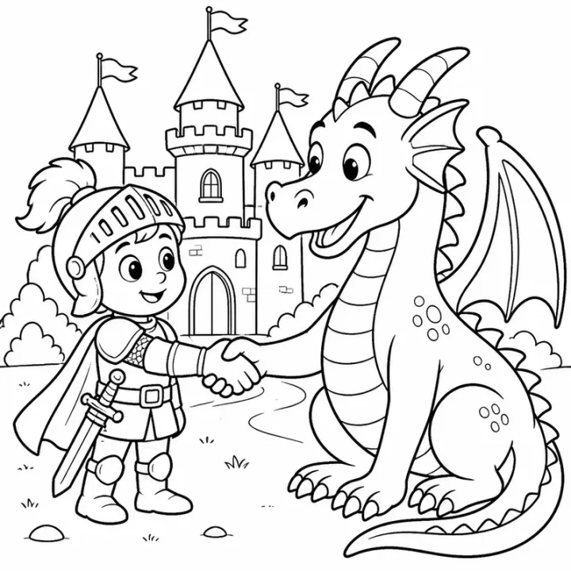

# Princess & Castle Coloring Book Prompts (Original Characters)



Princess coloring books are a perennial gift for young children, and fairy-tale castles keep their charm right into the adult coloring market. Because these prompts use original princesses, knights and kingdoms, the finished books are safe to sell on Amazon KDP and Etsy. You get a sweet princess book for preschoolers, a brave knights-and-dragons adventure, and a detailed fairy-tale castle collection for adults.

> **Make any of these in one click.** Each prompt opens in [InkChamps](https://inkchamps.com/?utm_source=github&utm_medium=prompt_library&utm_campaign=ai-coloring-book-prompts&utm_content=princess-castle-coloring-book-prompts), the AI book maker that turns a brief into a print-ready PDF for Amazon KDP, Etsy or home printing. Or copy the brief into any AI tool you like.

**Prompts on this page:** [Little princesses and castles](#1-little-princesses-and-castles) · [Knights, princesses and dragons](#2-knights-princesses-and-dragons) · [Ornate fairy-tale castles for adults](#3-ornate-fairy-tale-castles-for-adults)

## 1. Little princesses and castles

**Ages:** 3-6 · **Pages:** 30 · **Size:** 8.5 × 8.5 in · **Style:** Fairy tale · **Detail:** Easy · **Quality:** Standard · **Credits:** 30 Standard · 90 Premium

```text
Sweet original princesses in a gentle fairy-tale kingdom: a princess having a tea party with her teddy bears, a princess riding a pony through a flower meadow, a castle with tall towers and a drawbridge, a princess and a friendly frog by a pond, a royal birthday cake, a princess twirling at a ball, a little knight and his pony, a carriage pulled by white horses, a princess reading in a tower window, and a royal garden fountain.
```

[**▶ Make this coloring book on InkChamps**](https://inkchamps.com/dashboard/?tool=coloring-book&prompt=Sweet%20original%20princesses%20in%20a%20gentle%20fairy-tale%20kingdom%3A%20a%20princess%20having%20a%20tea%20party%20with%20her%20teddy%20bears%2C%20a%20princess%20riding%20a%20pony%20through%20a%20flower%20meadow%2C%20a%20castle%20with%20tall%20towers%20and%20a%20drawbridge%2C%20a%20princess%20and%20a%20friendly%20frog%20by%20a%20pond%2C%20a%20royal%20birthday%20cake%2C%20a%20princess%20twirling%20at%20a%20ball%2C%20a%20little%20knight%20and%20his%20pony%2C%20a%20carriage%20pulled%20by%20white%20horses%2C%20a%20princess%20reading%20in%20a%20tower%20window%2C%20and%20a%20royal%20garden%20fountain.&utm_source=github&utm_medium=prompt_library&utm_campaign=ai-coloring-book-prompts&utm_content=princess-castle-coloring-book-prompts-1)

*Why it works:* Parents shopping for a preschooler's birthday want a sweet, original princess book with simple shapes and familiar fairy-tale moments.

<details><summary>Exact settings for AI agents (InkChamps MCP)</summary>

```json
{
  "tool": "create_coloring_book",
  "arguments": {
    "ageGroup": "3-6",
    "numberOfPages": 30,
    "highQuality": false,
    "pageSize": "8.5x8.5",
    "description": "Sweet original princesses in a gentle fairy-tale kingdom: a princess having a tea party with her teddy bears, a princess riding a pony through a flower meadow, a castle with tall towers and a drawbridge, a princess and a friendly frog by a pond, a royal birthday cake, a princess twirling at a ball, a little knight and his pony, a carriage pulled by white horses, a princess reading in a tower window, and a royal garden fountain.",
    "style": "fairy_tale",
    "complexity": "easy",
    "theme": "little princesses",
    "title": "Little Princess Coloring Book"
  }
}
```

</details>

## 2. Knights, princesses and dragons

**Ages:** 6-9 · **Pages:** 40 · **Size:** 8.5 × 11 in · **Style:** Fairy tale · **Detail:** Medium · **Quality:** Standard · **Credits:** 40 Standard · 120 Premium

```text
Adventures in a medieval kingdom with princesses and knights of many backgrounds: a brave princess with a sword meeting a friendly dragon, knights jousting at a tournament, a feast in the great hall, a princess and a knight exploring an enchanted forest, a wizard's tower full of potions, a royal ship sailing to a faraway island, a princess inventor building a flying machine, the royal stables, and a secret garden behind the castle walls.
```

[**▶ Make this coloring book on InkChamps**](https://inkchamps.com/dashboard/?tool=coloring-book&prompt=Adventures%20in%20a%20medieval%20kingdom%20with%20princesses%20and%20knights%20of%20many%20backgrounds%3A%20a%20brave%20princess%20with%20a%20sword%20meeting%20a%20friendly%20dragon%2C%20knights%20jousting%20at%20a%20tournament%2C%20a%20feast%20in%20the%20great%20hall%2C%20a%20princess%20and%20a%20knight%20exploring%20an%20enchanted%20forest%2C%20a%20wizard%27s%20tower%20full%20of%20potions%2C%20a%20royal%20ship%20sailing%20to%20a%20faraway%20island%2C%20a%20princess%20inventor%20building%20a%20flying%20machine%2C%20the%20royal%20stables%2C%20and%20a%20secret%20garden%20behind%20the%20castle%20walls.&utm_source=github&utm_medium=prompt_library&utm_campaign=ai-coloring-book-prompts&utm_content=princess-castle-coloring-book-prompts-2)

*Why it works:* Kids who want adventure as well as gowns get both, which widens the audience for KDP sellers beyond a classic princess book.

<details><summary>Exact settings for AI agents (InkChamps MCP)</summary>

```json
{
  "tool": "create_coloring_book",
  "arguments": {
    "ageGroup": "6-9",
    "numberOfPages": 40,
    "highQuality": false,
    "pageSize": "8.5x11",
    "description": "Adventures in a medieval kingdom with princesses and knights of many backgrounds: a brave princess with a sword meeting a friendly dragon, knights jousting at a tournament, a feast in the great hall, a princess and a knight exploring an enchanted forest, a wizard's tower full of potions, a royal ship sailing to a faraway island, a princess inventor building a flying machine, the royal stables, and a secret garden behind the castle walls.",
    "style": "fairy_tale",
    "complexity": "medium",
    "theme": "medieval kingdom",
    "title": "Knights and Princesses Coloring Book"
  }
}
```

</details>

## 3. Ornate fairy-tale castles for adults

**Ages:** 13+ · **Pages:** 40 · **Size:** 8.5 × 11 in · **Style:** Fairy tale · **Detail:** Hard · **Quality:** Premium · **Credits:** 40 Standard · 120 Premium

```text
Ornate fairy-tale castles and royal scenes: a cliffside castle above a waterfall, a palace ballroom with chandeliers and dancing couples, a castle reflected in a lake ringed with roses, a princess in a gown of detailed embroidery, a gothic castle under a starry sky, a royal library with spiral staircases, a garden maze of topiaries, a winter palace in a snowy pine forest, and a castle village of timbered houses and market stalls.
```

[**▶ Make this coloring book on InkChamps**](https://inkchamps.com/dashboard/?tool=coloring-book&prompt=Ornate%20fairy-tale%20castles%20and%20royal%20scenes%3A%20a%20cliffside%20castle%20above%20a%20waterfall%2C%20a%20palace%20ballroom%20with%20chandeliers%20and%20dancing%20couples%2C%20a%20castle%20reflected%20in%20a%20lake%20ringed%20with%20roses%2C%20a%20princess%20in%20a%20gown%20of%20detailed%20embroidery%2C%20a%20gothic%20castle%20under%20a%20starry%20sky%2C%20a%20royal%20library%20with%20spiral%20staircases%2C%20a%20garden%20maze%20of%20topiaries%2C%20a%20winter%20palace%20in%20a%20snowy%20pine%20forest%2C%20and%20a%20castle%20village%20of%20timbered%20houses%20and%20market%20stalls.&utm_source=github&utm_medium=prompt_library&utm_campaign=ai-coloring-book-prompts&utm_content=princess-castle-coloring-book-prompts-3)

*Why it works:* Adult colorists love intricate architecture and romantic fairy-tale settings, a niche with fewer competitors than mandalas.

<details><summary>Exact settings for AI agents (InkChamps MCP)</summary>

```json
{
  "tool": "create_coloring_book",
  "arguments": {
    "ageGroup": "13+",
    "numberOfPages": 40,
    "highQuality": true,
    "pageSize": "8.5x11",
    "description": "Ornate fairy-tale castles and royal scenes: a cliffside castle above a waterfall, a palace ballroom with chandeliers and dancing couples, a castle reflected in a lake ringed with roses, a princess in a gown of detailed embroidery, a gothic castle under a starry sky, a royal library with spiral staircases, a garden maze of topiaries, a winter palace in a snowy pine forest, and a castle village of timbered houses and market stalls.",
    "style": "fairy_tale",
    "complexity": "hard",
    "theme": "fairy-tale castles",
    "title": "Fairy Tale Castles: A Coloring Book for Adults"
  }
}
```

</details>

## Tips for princess & castle coloring book

- Use only original princesses: anything that looks or sounds like a film character can get a KDP listing removed.
- Brave, active princesses (sword fighting, inventing, exploring) widen the audience and set your book apart from dress-only books.
- Fairy-tale castles and royal interiors are a strong adult niche; ballrooms, libraries and gardens give pages lots to color.

## More prompts like these

- [Mermaid Coloring Book Prompts for Kids, Teens & Adults](mermaid-coloring-book-prompts.md)
- [Robot Coloring Book Prompts for Kids & Tweens](robot-coloring-book-prompts.md)
- [Kawaii Food Coloring Book Prompts: Cute Desserts, Fruit & Snacks](kawaii-food-coloring-book-prompts.md)
- [Mandala Coloring Book Prompts for Adults & Teens](mandala-coloring-book-prompts.md)
- [Animal Mandala Coloring Book Prompts](animal-mandala-coloring-book-prompts.md)
- [Stress Relief Coloring Book Prompts for Adults](stress-relief-coloring-book-prompts.md)

---

[All coloring books prompts](README.md) · [Every prompt in the library](../../README.md) · [Browse on the website](https://gunjchhetri.github.io/ai-coloring-book-prompts/coloring-books/princess-castle-coloring-book-prompts/) · Prompts licensed [CC BY 4.0](../../LICENSE) by [InkChamps](https://inkchamps.com/?utm_source=github&utm_medium=prompt_library&utm_campaign=ai-coloring-book-prompts&utm_content=footer)
