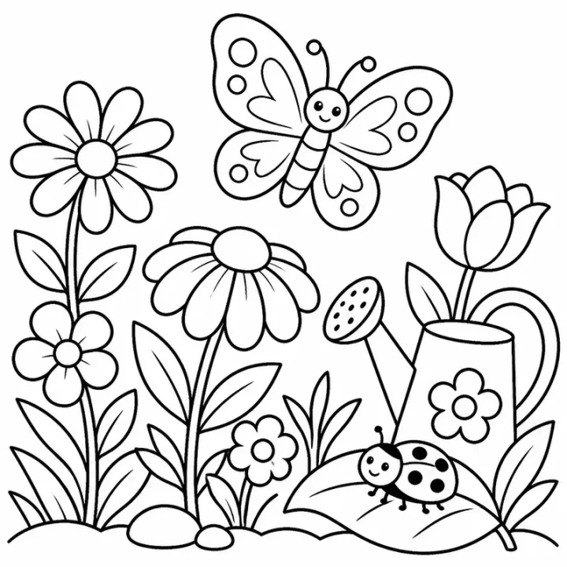

# Shapes and Colors Coloring Book: prompts



3 prompts. The full page, with sample pages and tips, is in the [InkChamps prompt library](https://inkchamps.com/prompts/coloring-books/shapes-and-colors/). Each prompt below opens in InkChamps with one click; or copy the brief into any AI tool.

**Prompts on this page:** [2D shapes in everyday things](#1-2d-shapes-in-everyday-things) · [Learn your colors](#2-learn-your-colors) · [3D shapes for early graders](#3-3d-shapes-for-early-graders)

## 1. 2D shapes in everyday things

**Ages:** 3-6 · **Pages:** 16 · **Size:** 8.5 × 11 in · **Style:** General coloring · **Detail:** Easy · **Layout:** One item per page, with its caption · **Quality:** Standard · **Credits:** 16 Standard · 48 Premium

```text
A shapes book, one shape per page, each showing the big shape and a real object in that shape: circle (a clock), square (a window), triangle (a slice of pizza), rectangle (a door), oval (an egg), star (a starfish), heart (a heart balloon), diamond (a kite), pentagon (a birdhouse), hexagon (a honeycomb), octagon (a garden gazebo seen from above), crescent (the moon), semicircle (a watermelon slice), trapezoid (a sailboat hull), parallelogram (a slanted eraser), cross (a first-aid kit).
```

[**▶ Make this coloring book on InkChamps**](https://inkchamps.com/dashboard/?tool=coloring-book&prompt=A%20shapes%20book%2C%20one%20shape%20per%20page%2C%20each%20showing%20the%20big%20shape%20and%20a%20real%20object%20in%20that%20shape%3A%20circle%20%28a%20clock%29%2C%20square%20%28a%20window%29%2C%20triangle%20%28a%20slice%20of%20pizza%29%2C%20rectangle%20%28a%20door%29%2C%20oval%20%28an%20egg%29%2C%20star%20%28a%20starfish%29%2C%20heart%20%28a%20heart%20balloon%29%2C%20diamond%20%28a%20kite%29%2C%20pentagon%20%28a%20birdhouse%29%2C%20hexagon%20%28a%20honeycomb%29%2C%20octagon%20%28a%20garden%20gazebo%20seen%20from%20above%29%2C%20crescent%20%28the%20moon%29%2C%20semicircle%20%28a%20watermelon%20slice%29%2C%20trapezoid%20%28a%20sailboat%20hull%29%2C%20parallelogram%20%28a%20slanted%20eraser%29%2C%20cross%20%28a%20first-aid%20kit%29.&utm_source=github&utm_medium=prompt_library&utm_campaign=ai-coloring-book-prompts&utm_content=shapes-and-colors-coloring-book-prompts-1)

<details><summary>Exact settings for AI agents (InkChamps MCP)</summary>

```json
{
  "tool": "create_coloring_book",
  "arguments": {
    "ageGroup": "3-6",
    "numberOfPages": 16,
    "highQuality": false,
    "pageSize": "8.5x11",
    "description": "A shapes book, one shape per page, each showing the big shape and a real object in that shape: circle (a clock), square (a window), triangle (a slice of pizza), rectangle (a door), oval (an egg), star (a starfish), heart (a heart balloon), diamond (a kite), pentagon (a birdhouse), hexagon (a honeycomb), octagon (a garden gazebo seen from above), crescent (the moon), semicircle (a watermelon slice), trapezoid (a sailboat hull), parallelogram (a slanted eraser), cross (a first-aid kit).",
    "style": "general_coloring",
    "complexity": "easy",
    "title": "My Big Book of Shapes",
    "pageCategory": "concept"
  }
}
```

</details>

## 2. Learn your colors

**Ages:** 3-6 · **Pages:** 12 · **Size:** 8.5 × 8.5 in · **Style:** General coloring · **Detail:** Easy · **Layout:** One item per page, with its caption · **Quality:** Standard · **Credits:** 12 Standard · 36 Premium

```text
A colors book, one color per page with the color's name and two things that are usually that color: red (a strawberry and a fire truck), orange (a carrot and a goldfish), yellow (the sun and a banana), green (a frog and a leaf), blue (a whale and the sea), purple (grapes and an eggplant), pink (a flamingo and a pig), brown (a bear and a tree trunk), black (a crow and a top hat), white (a snowman and a cloud), gray (an elephant and a rain cloud), rainbow (a rainbow over a meadow).
```

[**▶ Make this coloring book on InkChamps**](https://inkchamps.com/dashboard/?tool=coloring-book&prompt=A%20colors%20book%2C%20one%20color%20per%20page%20with%20the%20color%27s%20name%20and%20two%20things%20that%20are%20usually%20that%20color%3A%20red%20%28a%20strawberry%20and%20a%20fire%20truck%29%2C%20orange%20%28a%20carrot%20and%20a%20goldfish%29%2C%20yellow%20%28the%20sun%20and%20a%20banana%29%2C%20green%20%28a%20frog%20and%20a%20leaf%29%2C%20blue%20%28a%20whale%20and%20the%20sea%29%2C%20purple%20%28grapes%20and%20an%20eggplant%29%2C%20pink%20%28a%20flamingo%20and%20a%20pig%29%2C%20brown%20%28a%20bear%20and%20a%20tree%20trunk%29%2C%20black%20%28a%20crow%20and%20a%20top%20hat%29%2C%20white%20%28a%20snowman%20and%20a%20cloud%29%2C%20gray%20%28an%20elephant%20and%20a%20rain%20cloud%29%2C%20rainbow%20%28a%20rainbow%20over%20a%20meadow%29.&utm_source=github&utm_medium=prompt_library&utm_campaign=ai-coloring-book-prompts&utm_content=shapes-and-colors-coloring-book-prompts-2)

<details><summary>Exact settings for AI agents (InkChamps MCP)</summary>

```json
{
  "tool": "create_coloring_book",
  "arguments": {
    "ageGroup": "3-6",
    "numberOfPages": 12,
    "highQuality": false,
    "pageSize": "8.5x8.5",
    "description": "A colors book, one color per page with the color's name and two things that are usually that color: red (a strawberry and a fire truck), orange (a carrot and a goldfish), yellow (the sun and a banana), green (a frog and a leaf), blue (a whale and the sea), purple (grapes and an eggplant), pink (a flamingo and a pig), brown (a bear and a tree trunk), black (a crow and a top hat), white (a snowman and a cloud), gray (an elephant and a rain cloud), rainbow (a rainbow over a meadow).",
    "style": "general_coloring",
    "complexity": "easy",
    "pageCategory": "concept"
  }
}
```

</details>

## 3. 3D shapes for early graders

**Ages:** 6-9 · **Pages:** 10 · **Size:** 8.5 × 11 in · **Style:** General coloring · **Detail:** Medium · **Layout:** One item per page, with its caption · **Quality:** Standard · **Credits:** 10 Standard · 30 Premium

```text
A 3D shapes book, one solid per page, each showing the solid and a real object with that shape: sphere (a beach ball), cube (a toy block), cone (an ice cream cone), cylinder (a drum), square pyramid (the pyramids of Giza), rectangular prism (a gift box), triangular prism (a tent), torus (a doughnut), hemisphere (a bowl), hexagonal prism (a pencil).
```

[**▶ Make this coloring book on InkChamps**](https://inkchamps.com/dashboard/?tool=coloring-book&prompt=A%203D%20shapes%20book%2C%20one%20solid%20per%20page%2C%20each%20showing%20the%20solid%20and%20a%20real%20object%20with%20that%20shape%3A%20sphere%20%28a%20beach%20ball%29%2C%20cube%20%28a%20toy%20block%29%2C%20cone%20%28an%20ice%20cream%20cone%29%2C%20cylinder%20%28a%20drum%29%2C%20square%20pyramid%20%28the%20pyramids%20of%20Giza%29%2C%20rectangular%20prism%20%28a%20gift%20box%29%2C%20triangular%20prism%20%28a%20tent%29%2C%20torus%20%28a%20doughnut%29%2C%20hemisphere%20%28a%20bowl%29%2C%20hexagonal%20prism%20%28a%20pencil%29.&utm_source=github&utm_medium=prompt_library&utm_campaign=ai-coloring-book-prompts&utm_content=shapes-and-colors-coloring-book-prompts-3)

<details><summary>Exact settings for AI agents (InkChamps MCP)</summary>

```json
{
  "tool": "create_coloring_book",
  "arguments": {
    "ageGroup": "6-9",
    "numberOfPages": 10,
    "highQuality": false,
    "pageSize": "8.5x11",
    "description": "A 3D shapes book, one solid per page, each showing the solid and a real object with that shape: sphere (a beach ball), cube (a toy block), cone (an ice cream cone), cylinder (a drum), square pyramid (the pyramids of Giza), rectangular prism (a gift box), triangular prism (a tent), torus (a doughnut), hemisphere (a bowl), hexagonal prism (a pencil).",
    "style": "general_coloring",
    "complexity": "medium",
    "pageCategory": "concept"
  }
}
```

</details>

## More prompts like these

- [Good Habits & Manners Coloring Book Prompts for Kids](good-habits-manners-coloring-book-prompts.md)
- [Feelings & Emotions Coloring Book Prompts for Kids](feelings-emotions-coloring-book-prompts.md)
- [Greek Mythology Coloring Book Prompts](greek-mythology-coloring-book-prompts.md)
- [Bible Story Coloring Book Prompts for Kids & Adults](bible-story-coloring-book-prompts.md)
- [Dinosaur Coloring Book Prompts for Kids & KDP](dinosaur-coloring-book-prompts.md)
- [Farm Animal Coloring Book Prompts: Cute Barnyard Pages](farm-animal-coloring-book-prompts.md)

---

[All coloring books prompts](README.md) · [Every prompt in the library](../../README.md) · [This page on InkChamps](https://inkchamps.com/prompts/coloring-books/shapes-and-colors/) · Prompts licensed [CC BY 4.0](../../LICENSE) by [InkChamps](https://inkchamps.com/?utm_source=github&utm_medium=prompt_library&utm_campaign=ai-coloring-book-prompts&utm_content=footer)
