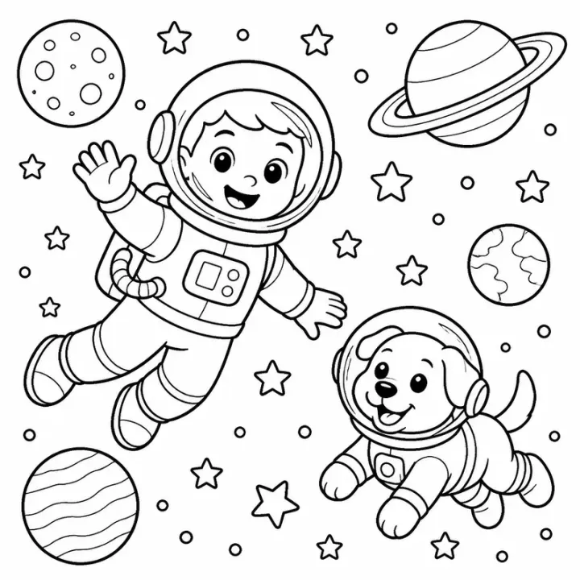

# Space Coloring Book: prompts



3 prompts. The full page, with sample pages and tips, is in the [InkChamps prompt library](https://inkchamps.com/prompts/coloring-books/space/). Each prompt below opens in InkChamps with one click; or copy the brief into any AI tool.

**Prompts on this page:** [First trip to space for toddlers](#1-first-trip-to-space-for-toddlers) · [Solar system and space book](#2-solar-system-and-space-book) · [Alien worlds adventure for tweens](#3-alien-worlds-adventure-for-tweens)

## 1. First trip to space for toddlers

**Ages:** 3-6 · **Pages:** 30 · **Size:** 8.5 × 8.5 in · **Style:** Universe space · **Detail:** Easy · **Quality:** Standard · **Credits:** 30 Standard · 90 Premium

```text
A friendly first trip to space: a smiling rocket blasting off, a child astronaut waving from the moon, a happy sun next to a sleepy moon, a ringed planet with a big grin, a little alien saying hello from a round spaceship, a puppy in a space helmet, twinkling stars around a crescent moon, an astronaut floating beside a satellite, a comet with a long tail, and a picnic in a moon crater.
```

[**▶ Make this coloring book on InkChamps**](https://inkchamps.com/dashboard/?tool=coloring-book&prompt=A%20friendly%20first%20trip%20to%20space%3A%20a%20smiling%20rocket%20blasting%20off%2C%20a%20child%20astronaut%20waving%20from%20the%20moon%2C%20a%20happy%20sun%20next%20to%20a%20sleepy%20moon%2C%20a%20ringed%20planet%20with%20a%20big%20grin%2C%20a%20little%20alien%20saying%20hello%20from%20a%20round%20spaceship%2C%20a%20puppy%20in%20a%20space%20helmet%2C%20twinkling%20stars%20around%20a%20crescent%20moon%2C%20an%20astronaut%20floating%20beside%20a%20satellite%2C%20a%20comet%20with%20a%20long%20tail%2C%20and%20a%20picnic%20in%20a%20moon%20crater.&utm_source=github&utm_medium=prompt_library&utm_campaign=ai-coloring-book-prompts&utm_content=space-coloring-book-prompts-1)

<details><summary>Exact settings for AI agents (InkChamps MCP)</summary>

```json
{
  "tool": "create_coloring_book",
  "arguments": {
    "ageGroup": "3-6",
    "numberOfPages": 30,
    "highQuality": false,
    "pageSize": "8.5x8.5",
    "description": "A friendly first trip to space: a smiling rocket blasting off, a child astronaut waving from the moon, a happy sun next to a sleepy moon, a ringed planet with a big grin, a little alien saying hello from a round spaceship, a puppy in a space helmet, twinkling stars around a crescent moon, an astronaut floating beside a satellite, a comet with a long tail, and a picnic in a moon crater.",
    "style": "universe_space",
    "complexity": "easy",
    "theme": "space for little kids",
    "title": "My First Space Coloring Book"
  }
}
```

</details>

## 2. Solar system and space book

**Ages:** 6-9 · **Pages:** 24 · **Size:** 8.5 × 11 in · **Style:** Universe space · **Detail:** Medium · **Layout:** One item per page, with its caption · **Quality:** Standard · **Credits:** 24 Standard · 72 Premium

```text
A space book, one subject per page with its name: the Sun, Mercury, Venus, Earth, the Moon, Mars, Jupiter, Saturn, Uranus, Neptune, Pluto (dwarf planet), an asteroid, a comet, a meteor shower, a galaxy, a nebula, a black hole, a constellation, an astronaut with plain mission patches, a rocket, a space station, a satellite, a Mars rover, a telescope.
```

[**▶ Make this coloring book on InkChamps**](https://inkchamps.com/dashboard/?tool=coloring-book&prompt=A%20space%20book%2C%20one%20subject%20per%20page%20with%20its%20name%3A%20the%20Sun%2C%20Mercury%2C%20Venus%2C%20Earth%2C%20the%20Moon%2C%20Mars%2C%20Jupiter%2C%20Saturn%2C%20Uranus%2C%20Neptune%2C%20Pluto%20%28dwarf%20planet%29%2C%20an%20asteroid%2C%20a%20comet%2C%20a%20meteor%20shower%2C%20a%20galaxy%2C%20a%20nebula%2C%20a%20black%20hole%2C%20a%20constellation%2C%20an%20astronaut%20with%20plain%20mission%20patches%2C%20a%20rocket%2C%20a%20space%20station%2C%20a%20satellite%2C%20a%20Mars%20rover%2C%20a%20telescope.&utm_source=github&utm_medium=prompt_library&utm_campaign=ai-coloring-book-prompts&utm_content=space-coloring-book-prompts-2)

<details><summary>Exact settings for AI agents (InkChamps MCP)</summary>

```json
{
  "tool": "create_coloring_book",
  "arguments": {
    "ageGroup": "6-9",
    "numberOfPages": 24,
    "highQuality": false,
    "pageSize": "8.5x11",
    "description": "A space book, one subject per page with its name: the Sun, Mercury, Venus, Earth, the Moon, Mars, Jupiter, Saturn, Uranus, Neptune, Pluto (dwarf planet), an asteroid, a comet, a meteor shower, a galaxy, a nebula, a black hole, a constellation, an astronaut with plain mission patches, a rocket, a space station, a satellite, a Mars rover, a telescope.",
    "style": "universe_space",
    "complexity": "medium",
    "pageCategory": "concept",
    "theme": "planets and space",
    "title": "Planets and Space Coloring Book"
  }
}
```

</details>

## 3. Alien worlds adventure for tweens

**Ages:** 9-13 · **Pages:** 40 · **Size:** 8.5 × 11 in · **Style:** Universe space · **Detail:** Medium · **Quality:** Standard · **Credits:** 40 Standard · 120 Premium

```text
A space adventure across the galaxy: astronauts with plain mission patches building a base on Mars, a rover crossing red sand dunes, a spaceship docking at a giant space station, friendly aliens farming glowing plants on their home planet, a spacewalk high above Earth, a rocket launch in billowing smoke, a space whale swimming through a nebula, robots repairing a satellite, a domed city on the moon, and kids stargazing through a backyard telescope.
```

[**▶ Make this coloring book on InkChamps**](https://inkchamps.com/dashboard/?tool=coloring-book&prompt=A%20space%20adventure%20across%20the%20galaxy%3A%20astronauts%20with%20plain%20mission%20patches%20building%20a%20base%20on%20Mars%2C%20a%20rover%20crossing%20red%20sand%20dunes%2C%20a%20spaceship%20docking%20at%20a%20giant%20space%20station%2C%20friendly%20aliens%20farming%20glowing%20plants%20on%20their%20home%20planet%2C%20a%20spacewalk%20high%20above%20Earth%2C%20a%20rocket%20launch%20in%20billowing%20smoke%2C%20a%20space%20whale%20swimming%20through%20a%20nebula%2C%20robots%20repairing%20a%20satellite%2C%20a%20domed%20city%20on%20the%20moon%2C%20and%20kids%20stargazing%20through%20a%20backyard%20telescope.&utm_source=github&utm_medium=prompt_library&utm_campaign=ai-coloring-book-prompts&utm_content=space-coloring-book-prompts-3)

<details><summary>Exact settings for AI agents (InkChamps MCP)</summary>

```json
{
  "tool": "create_coloring_book",
  "arguments": {
    "ageGroup": "9-13",
    "numberOfPages": 40,
    "highQuality": false,
    "pageSize": "8.5x11",
    "description": "A space adventure across the galaxy: astronauts with plain mission patches building a base on Mars, a rover crossing red sand dunes, a spaceship docking at a giant space station, friendly aliens farming glowing plants on their home planet, a spacewalk high above Earth, a rocket launch in billowing smoke, a space whale swimming through a nebula, robots repairing a satellite, a domed city on the moon, and kids stargazing through a backyard telescope.",
    "style": "universe_space",
    "complexity": "medium",
    "theme": "galaxy adventure",
    "title": "Galaxy Explorers Coloring Book"
  }
}
```

</details>

## More prompts like these

- [Vehicle Coloring Book Prompts: Trucks, Diggers, Trains & Cars](vehicle-coloring-book-prompts.md)
- [Princess & Castle Coloring Book Prompts (Original Characters)](princess-castle-coloring-book-prompts.md)
- [Mermaid Coloring Book Prompts for Kids, Teens & Adults](mermaid-coloring-book-prompts.md)
- [Robot Coloring Book Prompts for Kids & Tweens](robot-coloring-book-prompts.md)
- [Kawaii Food Coloring Book Prompts: Cute Desserts, Fruit & Snacks](kawaii-food-coloring-book-prompts.md)
- [Mandala Coloring Book Prompts for Adults & Teens](mandala-coloring-book-prompts.md)

---

[All coloring books prompts](README.md) · [Every prompt in the library](../../README.md) · [This page on InkChamps](https://inkchamps.com/prompts/coloring-books/space/) · Prompts licensed [CC BY 4.0](../../LICENSE) by [InkChamps](https://inkchamps.com/?utm_source=github&utm_medium=prompt_library&utm_campaign=ai-coloring-book-prompts&utm_content=footer)
