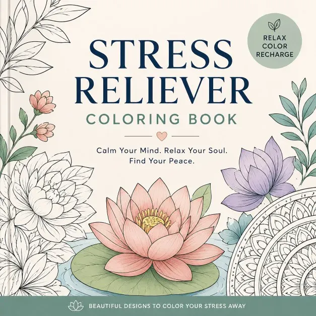

# Stress Relief Coloring Book: prompts



3 prompts. The full page, with sample pages and tips, is in the [InkChamps prompt library](https://inkchamps.com/prompts/coloring-books/stress-relief/). Each prompt below opens in InkChamps with one click; or copy the brief into any AI tool.

**Prompts on this page:** [Calming nature scenes for adults](#1-calming-nature-scenes-for-adults) · [Soothing pattern pages for anxiety relief](#2-soothing-pattern-pages-for-anxiety-relief) · [Exam-season calm for tweens](#3-exam-season-calm-for-tweens)

## 1. Calming nature scenes for adults

**Ages:** 13+ · **Pages:** 40 · **Size:** 8.5 × 11 in · **Style:** Anxiety motivation · **Detail:** Medium · **Quality:** Standard · **Credits:** 40 Standard · 120 Premium

```text
Forty peaceful scenes to slow down with: a still lake at dawn with a wooden dock, a log cabin among tall pines, a cup of tea and a candle on a rainy windowsill, a zen garden with raked sand and stones, a lotus pond with koi, a hammock between two palms, a mountain sunrise, a bonsai tree, a quiet forest stream, a lighthouse on a calm sea and a cat asleep in a sunbeam.
```

[**▶ Make this coloring book on InkChamps**](https://inkchamps.com/dashboard/?tool=coloring-book&prompt=Forty%20peaceful%20scenes%20to%20slow%20down%20with%3A%20a%20still%20lake%20at%20dawn%20with%20a%20wooden%20dock%2C%20a%20log%20cabin%20among%20tall%20pines%2C%20a%20cup%20of%20tea%20and%20a%20candle%20on%20a%20rainy%20windowsill%2C%20a%20zen%20garden%20with%20raked%20sand%20and%20stones%2C%20a%20lotus%20pond%20with%20koi%2C%20a%20hammock%20between%20two%20palms%2C%20a%20mountain%20sunrise%2C%20a%20bonsai%20tree%2C%20a%20quiet%20forest%20stream%2C%20a%20lighthouse%20on%20a%20calm%20sea%20and%20a%20cat%20asleep%20in%20a%20sunbeam.&utm_source=github&utm_medium=prompt_library&utm_campaign=ai-coloring-book-prompts&utm_content=stress-relief-coloring-book-prompts-1)

<details><summary>Exact settings for AI agents (InkChamps MCP)</summary>

```json
{
  "tool": "create_coloring_book",
  "arguments": {
    "ageGroup": "13+",
    "numberOfPages": 40,
    "highQuality": false,
    "pageSize": "8.5x11",
    "description": "Forty peaceful scenes to slow down with: a still lake at dawn with a wooden dock, a log cabin among tall pines, a cup of tea and a candle on a rainy windowsill, a zen garden with raked sand and stones, a lotus pond with koi, a hammock between two palms, a mountain sunrise, a bonsai tree, a quiet forest stream, a lighthouse on a calm sea and a cat asleep in a sunbeam.",
    "style": "anxiety_motivation",
    "complexity": "medium",
    "title": "Quiet Moments: Calming Scenes to Color"
  }
}
```

</details>

## 2. Soothing pattern pages for anxiety relief

**Ages:** 13+ · **Pages:** 50 · **Size:** 8.5 × 11 in · **Style:** Anxiety motivation · **Detail:** Hard · **Quality:** Premium · **Credits:** 50 Standard · 150 Premium

```text
Fifty full-page flowing patterns to color slowly and mindfully: rolling ocean waves, overlapping fish scales, fern fronds unfurling, pebbles in a stream, woven basket lattices, spirals of leaves, clouds stacked like quilts, feathers in rows, bubbles, honeycomb, rippling sand dunes and garden paths of stepping stones, each page a different repeating pattern with no fixed focal point.
```

[**▶ Make this coloring book on InkChamps**](https://inkchamps.com/dashboard/?tool=coloring-book&prompt=Fifty%20full-page%20flowing%20patterns%20to%20color%20slowly%20and%20mindfully%3A%20rolling%20ocean%20waves%2C%20overlapping%20fish%20scales%2C%20fern%20fronds%20unfurling%2C%20pebbles%20in%20a%20stream%2C%20woven%20basket%20lattices%2C%20spirals%20of%20leaves%2C%20clouds%20stacked%20like%20quilts%2C%20feathers%20in%20rows%2C%20bubbles%2C%20honeycomb%2C%20rippling%20sand%20dunes%20and%20garden%20paths%20of%20stepping%20stones%2C%20each%20page%20a%20different%20repeating%20pattern%20with%20no%20fixed%20focal%20point.&utm_source=github&utm_medium=prompt_library&utm_campaign=ai-coloring-book-prompts&utm_content=stress-relief-coloring-book-prompts-2)

<details><summary>Exact settings for AI agents (InkChamps MCP)</summary>

```json
{
  "tool": "create_coloring_book",
  "arguments": {
    "ageGroup": "13+",
    "numberOfPages": 50,
    "highQuality": true,
    "pageSize": "8.5x11",
    "description": "Fifty full-page flowing patterns to color slowly and mindfully: rolling ocean waves, overlapping fish scales, fern fronds unfurling, pebbles in a stream, woven basket lattices, spirals of leaves, clouds stacked like quilts, feathers in rows, bubbles, honeycomb, rippling sand dunes and garden paths of stepping stones, each page a different repeating pattern with no fixed focal point.",
    "style": "anxiety_motivation",
    "complexity": "hard"
  }
}
```

</details>

## 3. Exam-season calm for tweens

**Ages:** 9-13 · **Pages:** 30 · **Size:** 8.5 × 11 in · **Style:** Anxiety motivation · **Detail:** Medium · **Quality:** Standard · **Credits:** 30 Standard · 90 Premium

```text
Thirty calming pages for tweens who need a break from homework and tests: a cozy bed with a sleeping cat, a treehouse reading nook, a sloth napping in a hammock, an otter floating on its back, a hot-air balloon over soft hills, a starry sky from a tent, a garden swing, a jar of fireflies, a quiet beach at sunset and a bunny curled in a teacup.
```

[**▶ Make this coloring book on InkChamps**](https://inkchamps.com/dashboard/?tool=coloring-book&prompt=Thirty%20calming%20pages%20for%20tweens%20who%20need%20a%20break%20from%20homework%20and%20tests%3A%20a%20cozy%20bed%20with%20a%20sleeping%20cat%2C%20a%20treehouse%20reading%20nook%2C%20a%20sloth%20napping%20in%20a%20hammock%2C%20an%20otter%20floating%20on%20its%20back%2C%20a%20hot-air%20balloon%20over%20soft%20hills%2C%20a%20starry%20sky%20from%20a%20tent%2C%20a%20garden%20swing%2C%20a%20jar%20of%20fireflies%2C%20a%20quiet%20beach%20at%20sunset%20and%20a%20bunny%20curled%20in%20a%20teacup.&utm_source=github&utm_medium=prompt_library&utm_campaign=ai-coloring-book-prompts&utm_content=stress-relief-coloring-book-prompts-3)

<details><summary>Exact settings for AI agents (InkChamps MCP)</summary>

```json
{
  "tool": "create_coloring_book",
  "arguments": {
    "ageGroup": "9-13",
    "numberOfPages": 30,
    "highQuality": false,
    "pageSize": "8.5x11",
    "description": "Thirty calming pages for tweens who need a break from homework and tests: a cozy bed with a sleeping cat, a treehouse reading nook, a sloth napping in a hammock, an otter floating on its back, a hot-air balloon over soft hills, a starry sky from a tent, a garden swing, a jar of fireflies, a quiet beach at sunset and a bunny curled in a teacup.",
    "style": "anxiety_motivation",
    "complexity": "medium"
  }
}
```

</details>

## More prompts like these

- [Cozy Coloring Book Prompts: Hygge, Cottagecore & Café Scenes](cozy-coloring-book-prompts.md)
- [Bold and Easy Coloring Book Prompts for Adults & Seniors](bold-and-easy-coloring-book-prompts.md)
- [Flower & Botanical Coloring Book Prompts](flower-botanical-coloring-book-prompts.md)
- [Christmas Coloring Book Prompts for Kids & Adults](christmas-coloring-book-prompts.md)
- [Halloween Coloring Book Prompts: Spooky-Cute & Spooky-Cozy](halloween-coloring-book-prompts.md)
- [Easter & Spring Coloring Book Prompts](easter-spring-coloring-book-prompts.md)

---

[All coloring books prompts](README.md) · [Every prompt in the library](../../README.md) · [This page on InkChamps](https://inkchamps.com/prompts/coloring-books/stress-relief/) · Prompts licensed [CC BY 4.0](../../LICENSE) by [InkChamps](https://inkchamps.com/?utm_source=github&utm_medium=prompt_library&utm_campaign=ai-coloring-book-prompts&utm_content=footer)
