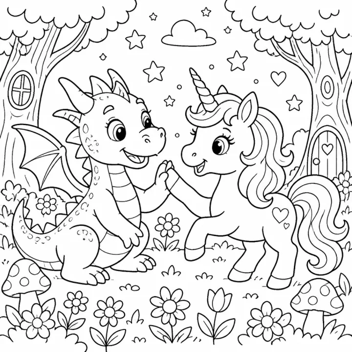

# Unicorn Coloring Book: prompts



3 prompts. The full page, with sample pages and tips, is in the [InkChamps prompt library](https://inkchamps.com/prompts/coloring-books/unicorn/). Each prompt below opens in InkChamps with one click; or copy the brief into any AI tool.

**Prompts on this page:** [Baby unicorns on clouds and rainbows](#1-baby-unicorns-on-clouds-and-rainbows) · [Unicorns and magical creatures kingdom](#2-unicorns-and-magical-creatures-kingdom) · [Unicorn mandalas for teens and adults](#3-unicorn-mandalas-for-teens-and-adults)

## 1. Baby unicorns on clouds and rainbows

**Ages:** 3-6 · **Pages:** 30 · **Size:** 8.5 × 8.5 in · **Style:** Fairy tale · **Detail:** Easy · **Quality:** Standard · **Credits:** 30 Standard · 90 Premium

```text
Sweet baby unicorns in a soft, dreamy world: a unicorn asleep on a fluffy cloud, sliding down a rainbow, eating a cupcake at a tea party, playing with a bunny in a flower meadow, splashing in a sparkling pond, wearing a flower crown, blowing bubbles, riding a merry-go-round, hugging a star-shaped pillow, and waving goodnight to the moon.
```

[**▶ Make this coloring book on InkChamps**](https://inkchamps.com/dashboard/?tool=coloring-book&prompt=Sweet%20baby%20unicorns%20in%20a%20soft%2C%20dreamy%20world%3A%20a%20unicorn%20asleep%20on%20a%20fluffy%20cloud%2C%20sliding%20down%20a%20rainbow%2C%20eating%20a%20cupcake%20at%20a%20tea%20party%2C%20playing%20with%20a%20bunny%20in%20a%20flower%20meadow%2C%20splashing%20in%20a%20sparkling%20pond%2C%20wearing%20a%20flower%20crown%2C%20blowing%20bubbles%2C%20riding%20a%20merry-go-round%2C%20hugging%20a%20star-shaped%20pillow%2C%20and%20waving%20goodnight%20to%20the%20moon.&utm_source=github&utm_medium=prompt_library&utm_campaign=ai-coloring-book-prompts&utm_content=unicorn-coloring-book-prompts-1)

<details><summary>Exact settings for AI agents (InkChamps MCP)</summary>

```json
{
  "tool": "create_coloring_book",
  "arguments": {
    "ageGroup": "3-6",
    "numberOfPages": 30,
    "highQuality": false,
    "pageSize": "8.5x8.5",
    "description": "Sweet baby unicorns in a soft, dreamy world: a unicorn asleep on a fluffy cloud, sliding down a rainbow, eating a cupcake at a tea party, playing with a bunny in a flower meadow, splashing in a sparkling pond, wearing a flower crown, blowing bubbles, riding a merry-go-round, hugging a star-shaped pillow, and waving goodnight to the moon.",
    "style": "fairy_tale",
    "complexity": "easy",
    "theme": "baby unicorns",
    "title": "Baby Unicorns Coloring Book"
  }
}
```

</details>

## 2. Unicorns and magical creatures kingdom

**Ages:** 6-9 · **Pages:** 40 · **Size:** 8.5 × 11 in · **Style:** Fairy tale · **Detail:** Medium · **Quality:** Standard · **Credits:** 40 Standard · 120 Premium

```text
An enchanted kingdom of magical creatures: unicorns galloping through a crystal forest, a winged pegasus over a mountain waterfall, a baby dragon and a unicorn sharing a picnic, a griffin guarding a castle tower, a phoenix rising from glowing flowers, fairies riding butterflies, a gnome village of mushroom houses, a narwhal in an icy sea, a nine-tailed fox spirit, and a unicorn mother and foal beneath a rainbow.
```

[**▶ Make this coloring book on InkChamps**](https://inkchamps.com/dashboard/?tool=coloring-book&prompt=An%20enchanted%20kingdom%20of%20magical%20creatures%3A%20unicorns%20galloping%20through%20a%20crystal%20forest%2C%20a%20winged%20pegasus%20over%20a%20mountain%20waterfall%2C%20a%20baby%20dragon%20and%20a%20unicorn%20sharing%20a%20picnic%2C%20a%20griffin%20guarding%20a%20castle%20tower%2C%20a%20phoenix%20rising%20from%20glowing%20flowers%2C%20fairies%20riding%20butterflies%2C%20a%20gnome%20village%20of%20mushroom%20houses%2C%20a%20narwhal%20in%20an%20icy%20sea%2C%20a%20nine-tailed%20fox%20spirit%2C%20and%20a%20unicorn%20mother%20and%20foal%20beneath%20a%20rainbow.&utm_source=github&utm_medium=prompt_library&utm_campaign=ai-coloring-book-prompts&utm_content=unicorn-coloring-book-prompts-2)

<details><summary>Exact settings for AI agents (InkChamps MCP)</summary>

```json
{
  "tool": "create_coloring_book",
  "arguments": {
    "ageGroup": "6-9",
    "numberOfPages": 40,
    "highQuality": false,
    "pageSize": "8.5x11",
    "description": "An enchanted kingdom of magical creatures: unicorns galloping through a crystal forest, a winged pegasus over a mountain waterfall, a baby dragon and a unicorn sharing a picnic, a griffin guarding a castle tower, a phoenix rising from glowing flowers, fairies riding butterflies, a gnome village of mushroom houses, a narwhal in an icy sea, a nine-tailed fox spirit, and a unicorn mother and foal beneath a rainbow.",
    "style": "fairy_tale",
    "complexity": "medium",
    "theme": "magical creatures",
    "title": "Unicorns and Magical Creatures Coloring Book"
  }
}
```

</details>

## 3. Unicorn mandalas for teens and adults

**Ages:** 13+ · **Pages:** 40 · **Size:** 8.5 × 11 in · **Style:** Mandala animal · **Detail:** Hard · **Quality:** Premium · **Credits:** 40 Standard · 120 Premium

```text
Elegant unicorns woven into ornate designs: a rearing unicorn framed by a circular floral mandala, a unicorn head with a mane of paisley and roses, unicorns in a stained-glass forest, a unicorn resting beneath a crescent moon among stars and lace, twin unicorns forming a heart of vines, a unicorn galloping over swirling waves, and a winged unicorn in a garden of peonies and butterflies.
```

[**▶ Make this coloring book on InkChamps**](https://inkchamps.com/dashboard/?tool=coloring-book&prompt=Elegant%20unicorns%20woven%20into%20ornate%20designs%3A%20a%20rearing%20unicorn%20framed%20by%20a%20circular%20floral%20mandala%2C%20a%20unicorn%20head%20with%20a%20mane%20of%20paisley%20and%20roses%2C%20unicorns%20in%20a%20stained-glass%20forest%2C%20a%20unicorn%20resting%20beneath%20a%20crescent%20moon%20among%20stars%20and%20lace%2C%20twin%20unicorns%20forming%20a%20heart%20of%20vines%2C%20a%20unicorn%20galloping%20over%20swirling%20waves%2C%20and%20a%20winged%20unicorn%20in%20a%20garden%20of%20peonies%20and%20butterflies.&utm_source=github&utm_medium=prompt_library&utm_campaign=ai-coloring-book-prompts&utm_content=unicorn-coloring-book-prompts-3)

<details><summary>Exact settings for AI agents (InkChamps MCP)</summary>

```json
{
  "tool": "create_coloring_book",
  "arguments": {
    "ageGroup": "13+",
    "numberOfPages": 40,
    "highQuality": true,
    "pageSize": "8.5x11",
    "description": "Elegant unicorns woven into ornate designs: a rearing unicorn framed by a circular floral mandala, a unicorn head with a mane of paisley and roses, unicorns in a stained-glass forest, a unicorn resting beneath a crescent moon among stars and lace, twin unicorns forming a heart of vines, a unicorn galloping over swirling waves, and a winged unicorn in a garden of peonies and butterflies.",
    "style": "mandala_animal",
    "complexity": "hard",
    "theme": "unicorn mandalas",
    "title": "Enchanted Unicorns: A Mandala Coloring Book"
  }
}
```

</details>

## More prompts like these

- [Dragon Coloring Book Prompts for Kids, Teens & Adults](dragon-coloring-book-prompts.md)
- [Jungle & Safari Animal Coloring Book Prompts](jungle-safari-coloring-book-prompts.md)
- [Cat Coloring Book Prompts: Kittens, Cozy Cats & Cat Mandalas](cat-coloring-book-prompts.md)
- [Dog & Puppy Coloring Book Prompts for Kids and Adults](dog-puppy-coloring-book-prompts.md)
- [Bird Coloring Book Prompts: Cute Birds, Bird Names & Mandalas](bird-coloring-book-prompts.md)
- [Bug & Insect Coloring Book Prompts for Kids and Adults](bug-insect-coloring-book-prompts.md)

---

[All coloring books prompts](README.md) · [Every prompt in the library](../../README.md) · [This page on InkChamps](https://inkchamps.com/prompts/coloring-books/unicorn/) · Prompts licensed [CC BY 4.0](../../LICENSE) by [InkChamps](https://inkchamps.com/?utm_source=github&utm_medium=prompt_library&utm_campaign=ai-coloring-book-prompts&utm_content=footer)
