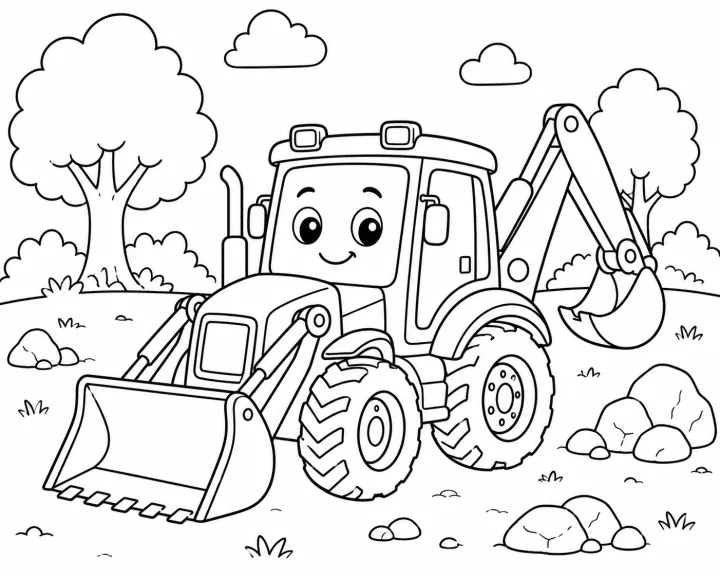

# Vehicle Coloring Book: prompts



3 prompts. The full page, with sample pages and tips, is in the [InkChamps prompt library](https://inkchamps.com/prompts/coloring-books/vehicle/). Each prompt below opens in InkChamps with one click; or copy the brief into any AI tool.

**Prompts on this page:** [Big trucks and things that go](#1-big-trucks-and-things-that-go) · [24 construction machines with names](#2-24-construction-machines-with-names) · [Classic cars and trains for teens and adults](#3-classic-cars-and-trains-for-teens-and-adults)

## 1. Big trucks and things that go

**Ages:** 3-6 · **Pages:** 30 · **Size:** 8.5 × 8.5 in · **Style:** General coloring · **Detail:** Easy · **Quality:** Standard · **Credits:** 30 Standard · 90 Premium

```text
Big, friendly vehicles little kids love: a dump truck tipping a load of dirt, an excavator digging a hole, a fire truck with its ladder raised, a school bus full of waving kids, a red tractor pulling a hay wagon, a steam train chugging over a bridge, a garbage truck on its morning route, a police car, a cement mixer, a tow truck, a helicopter, and an airplane above the clouds.
```

[**▶ Make this coloring book on InkChamps**](https://inkchamps.com/dashboard/?tool=coloring-book&prompt=Big%2C%20friendly%20vehicles%20little%20kids%20love%3A%20a%20dump%20truck%20tipping%20a%20load%20of%20dirt%2C%20an%20excavator%20digging%20a%20hole%2C%20a%20fire%20truck%20with%20its%20ladder%20raised%2C%20a%20school%20bus%20full%20of%20waving%20kids%2C%20a%20red%20tractor%20pulling%20a%20hay%20wagon%2C%20a%20steam%20train%20chugging%20over%20a%20bridge%2C%20a%20garbage%20truck%20on%20its%20morning%20route%2C%20a%20police%20car%2C%20a%20cement%20mixer%2C%20a%20tow%20truck%2C%20a%20helicopter%2C%20and%20an%20airplane%20above%20the%20clouds.&utm_source=github&utm_medium=prompt_library&utm_campaign=ai-coloring-book-prompts&utm_content=vehicle-coloring-book-prompts-1)

<details><summary>Exact settings for AI agents (InkChamps MCP)</summary>

```json
{
  "tool": "create_coloring_book",
  "arguments": {
    "ageGroup": "3-6",
    "numberOfPages": 30,
    "highQuality": false,
    "pageSize": "8.5x8.5",
    "description": "Big, friendly vehicles little kids love: a dump truck tipping a load of dirt, an excavator digging a hole, a fire truck with its ladder raised, a school bus full of waving kids, a red tractor pulling a hay wagon, a steam train chugging over a bridge, a garbage truck on its morning route, a police car, a cement mixer, a tow truck, a helicopter, and an airplane above the clouds.",
    "style": "general_coloring",
    "complexity": "easy",
    "theme": "things that go",
    "title": "Things That Go Coloring Book"
  }
}
```

</details>

## 2. 24 construction machines with names

**Ages:** 6-9 · **Pages:** 24 · **Size:** 8.5 × 11 in · **Style:** General coloring · **Detail:** Medium · **Layout:** One item per page, with its caption · **Quality:** Standard · **Credits:** 24 Standard · 72 Premium

```text
A construction vehicle book, one machine per page with its name: excavator, bulldozer, dump truck, cement mixer, tower crane, mobile crane, backhoe loader, wheel loader, road roller, forklift, skid steer, motor grader, asphalt paver, drilling rig, trencher, scraper, telehandler, pile driver, wrecking ball crane, flatbed truck, water truck, street sweeper, cherry picker, mini excavator.
```

[**▶ Make this coloring book on InkChamps**](https://inkchamps.com/dashboard/?tool=coloring-book&prompt=A%20construction%20vehicle%20book%2C%20one%20machine%20per%20page%20with%20its%20name%3A%20excavator%2C%20bulldozer%2C%20dump%20truck%2C%20cement%20mixer%2C%20tower%20crane%2C%20mobile%20crane%2C%20backhoe%20loader%2C%20wheel%20loader%2C%20road%20roller%2C%20forklift%2C%20skid%20steer%2C%20motor%20grader%2C%20asphalt%20paver%2C%20drilling%20rig%2C%20trencher%2C%20scraper%2C%20telehandler%2C%20pile%20driver%2C%20wrecking%20ball%20crane%2C%20flatbed%20truck%2C%20water%20truck%2C%20street%20sweeper%2C%20cherry%20picker%2C%20mini%20excavator.&utm_source=github&utm_medium=prompt_library&utm_campaign=ai-coloring-book-prompts&utm_content=vehicle-coloring-book-prompts-2)

<details><summary>Exact settings for AI agents (InkChamps MCP)</summary>

```json
{
  "tool": "create_coloring_book",
  "arguments": {
    "ageGroup": "6-9",
    "numberOfPages": 24,
    "highQuality": false,
    "pageSize": "8.5x11",
    "description": "A construction vehicle book, one machine per page with its name: excavator, bulldozer, dump truck, cement mixer, tower crane, mobile crane, backhoe loader, wheel loader, road roller, forklift, skid steer, motor grader, asphalt paver, drilling rig, trencher, scraper, telehandler, pile driver, wrecking ball crane, flatbed truck, water truck, street sweeper, cherry picker, mini excavator.",
    "style": "general_coloring",
    "complexity": "medium",
    "pageCategory": "concept",
    "theme": "construction vehicles",
    "title": "Construction Machines Coloring Book"
  }
}
```

</details>

## 3. Classic cars and trains for teens and adults

**Ages:** 13+ · **Pages:** 40 · **Size:** 8.5 × 11 in · **Style:** General coloring · **Detail:** Hard · **Quality:** Premium · **Credits:** 40 Standard · 120 Premium

```text
Detailed vintage vehicles of no real make, in nostalgic settings: an unbranded 1950s-style convertible outside a roadside diner, an old pickup truck loaded with pumpkins, a steam locomotive crossing a mountain viaduct, a hot rod in a garage full of tools, a vintage double-decker bus on a rainy city street, a rounded vintage camper parked at the beach, a vintage motorcycle on a desert highway, a vintage fire engine at a small-town parade and a 1920s steam tram in an old town square.
```

[**▶ Make this coloring book on InkChamps**](https://inkchamps.com/dashboard/?tool=coloring-book&prompt=Detailed%20vintage%20vehicles%20of%20no%20real%20make%2C%20in%20nostalgic%20settings%3A%20an%20unbranded%201950s-style%20convertible%20outside%20a%20roadside%20diner%2C%20an%20old%20pickup%20truck%20loaded%20with%20pumpkins%2C%20a%20steam%20locomotive%20crossing%20a%20mountain%20viaduct%2C%20a%20hot%20rod%20in%20a%20garage%20full%20of%20tools%2C%20a%20vintage%20double-decker%20bus%20on%20a%20rainy%20city%20street%2C%20a%20rounded%20vintage%20camper%20parked%20at%20the%20beach%2C%20a%20vintage%20motorcycle%20on%20a%20desert%20highway%2C%20a%20vintage%20fire%20engine%20at%20a%20small-town%20parade%20and%20a%201920s%20steam%20tram%20in%20an%20old%20town%20square.&utm_source=github&utm_medium=prompt_library&utm_campaign=ai-coloring-book-prompts&utm_content=vehicle-coloring-book-prompts-3)

<details><summary>Exact settings for AI agents (InkChamps MCP)</summary>

```json
{
  "tool": "create_coloring_book",
  "arguments": {
    "ageGroup": "13+",
    "numberOfPages": 40,
    "highQuality": true,
    "pageSize": "8.5x11",
    "description": "Detailed vintage vehicles of no real make, in nostalgic settings: an unbranded 1950s-style convertible outside a roadside diner, an old pickup truck loaded with pumpkins, a steam locomotive crossing a mountain viaduct, a hot rod in a garage full of tools, a vintage double-decker bus on a rainy city street, a rounded vintage camper parked at the beach, a vintage motorcycle on a desert highway, a vintage fire engine at a small-town parade and a 1920s steam tram in an old town square.",
    "style": "general_coloring",
    "complexity": "hard",
    "theme": "classic vehicles",
    "title": "Classic Cars and Trains Coloring Book"
  }
}
```

</details>

## More prompts like these

- [Princess & Castle Coloring Book Prompts (Original Characters)](princess-castle-coloring-book-prompts.md)
- [Mermaid Coloring Book Prompts for Kids, Teens & Adults](mermaid-coloring-book-prompts.md)
- [Robot Coloring Book Prompts for Kids & Tweens](robot-coloring-book-prompts.md)
- [Kawaii Food Coloring Book Prompts: Cute Desserts, Fruit & Snacks](kawaii-food-coloring-book-prompts.md)
- [Mandala Coloring Book Prompts for Adults & Teens](mandala-coloring-book-prompts.md)
- [Animal Mandala Coloring Book Prompts](animal-mandala-coloring-book-prompts.md)

---

[All coloring books prompts](README.md) · [Every prompt in the library](../../README.md) · [This page on InkChamps](https://inkchamps.com/prompts/coloring-books/vehicle/) · Prompts licensed [CC BY 4.0](../../LICENSE) by [InkChamps](https://inkchamps.com/?utm_source=github&utm_medium=prompt_library&utm_campaign=ai-coloring-book-prompts&utm_content=footer)
