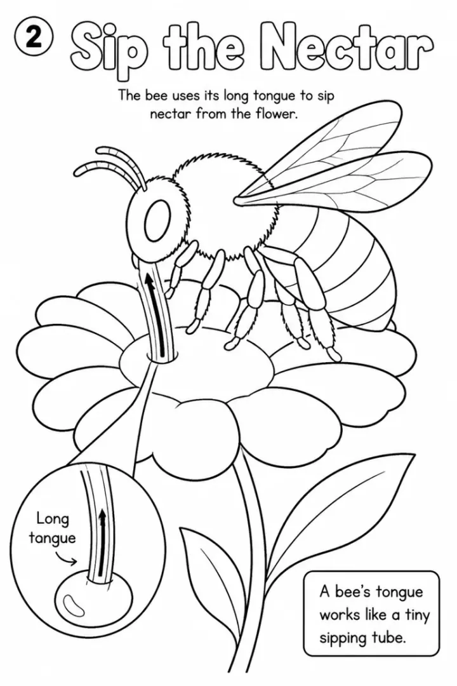

# Bees and Pollinators Coloring Book Prompts for Kids



Bees and pollinators are a spring science favorite, and kids are amazed to learn that many fruits need an insect's visit to grow. These prompts cover a honeybee's day for preschoolers, the many kinds of pollinators for 6 to 9 year olds and life inside a honeybee colony for older kids. Every fact is short and true.

> **Make any of these in one click.** Each prompt opens in [InkChamps](https://inkchamps.com/?utm_source=github&utm_medium=prompt_library&utm_campaign=ai-coloring-book-prompts&utm_content=bees-and-pollinators-coloring-book-prompts), the AI book maker that turns a brief into a print-ready PDF for Amazon KDP, Etsy or home printing. Or copy the brief into any AI tool you like.

**Prompts on this page:** [A busy bee's day for preschoolers](#1-a-busy-bees-day-for-preschoolers) · [Pollinators and the food we eat](#2-pollinators-and-the-food-we-eat) · [Inside the honeybee colony for ages 9-13](#3-inside-the-honeybee-colony-for-ages-9-13)

## 1. A busy bee's day for preschoolers

**Ages:** 3-6 · **Pages:** 10 · **Size:** 8.5 × 11 in · **Quality:** Standard · **Credits:** 10 Standard · 30 Premium

```text
A honeybee's busy day, one idea per page: 1. A honeybee flies out of the hive in the morning. 2. She lands on a flower. 3. She sips sweet nectar. 4. Yellow pollen sticks to her fuzzy body. 5. She carries pollen to the next flower. 6. That helps the flower make seeds and fruit, like apples and strawberries. 7. She flies home to the hive. 8. Bees build honeycomb with six-sided cells. 9. Bees turn nectar into honey. 10. The queen bee lays eggs that grow into new bees.
```

[**▶ Make this educational coloring book on InkChamps**](https://inkchamps.com/dashboard/?tool=educational-coloring&prompt=A%20honeybee%27s%20busy%20day%2C%20one%20idea%20per%20page%3A%201.%20A%20honeybee%20flies%20out%20of%20the%20hive%20in%20the%20morning.%202.%20She%20lands%20on%20a%20flower.%203.%20She%20sips%20sweet%20nectar.%204.%20Yellow%20pollen%20sticks%20to%20her%20fuzzy%20body.%205.%20She%20carries%20pollen%20to%20the%20next%20flower.%206.%20That%20helps%20the%20flower%20make%20seeds%20and%20fruit%2C%20like%20apples%20and%20strawberries.%207.%20She%20flies%20home%20to%20the%20hive.%208.%20Bees%20build%20honeycomb%20with%20six-sided%20cells.%209.%20Bees%20turn%20nectar%20into%20honey.%2010.%20The%20queen%20bee%20lays%20eggs%20that%20grow%20into%20new%20bees.&utm_source=github&utm_medium=prompt_library&utm_campaign=ai-coloring-book-prompts&utm_content=bees-and-pollinators-coloring-book-prompts-1)

*Why it works:* Preschool teachers doing a spring insect unit want a friendly bee story with one clear idea per page, and it eases kids' fear of bees. Its short length is great for home printing.

<details><summary>Exact settings for AI agents (InkChamps MCP)</summary>

```json
{
  "tool": "create_educational_coloring_book",
  "arguments": {
    "ageGroup": "3-6",
    "numberOfPages": 10,
    "highQuality": false,
    "pageSize": "8.5x11",
    "description": "A honeybee's busy day, one idea per page: 1. A honeybee flies out of the hive in the morning. 2. She lands on a flower. 3. She sips sweet nectar. 4. Yellow pollen sticks to her fuzzy body. 5. She carries pollen to the next flower. 6. That helps the flower make seeds and fruit, like apples and strawberries. 7. She flies home to the hive. 8. Bees build honeycomb with six-sided cells. 9. Bees turn nectar into honey. 10. The queen bee lays eggs that grow into new bees."
  }
}
```

</details>

## 2. Pollinators and the food we eat

**Ages:** 6-9 · **Pages:** 14 · **Size:** 8.5 × 11 in · **Quality:** Standard · **Credits:** 14 Standard · 42 Premium

```text
Meet the pollinators and the foods they help grow: 1. What pollination is. 2. Honeybees. 3. Bumblebees can buzz pollen loose from tomato flowers. 4. Butterflies. 5. Moths visit flowers at night. 6. Hummingbirds drink nectar from tube-shaped flowers. 7. Some bats pollinate agave and banana flowers. 8. Beetles. 9. Flies. 10. Wind carries pollen for corn and grasses. 11. Apples, strawberries and pumpkins need pollinators. 12. Almonds need bees. 13. Plant a pollinator garden. 14. Leave clover and dandelions for the bees.
```

[**▶ Make this educational coloring book on InkChamps**](https://inkchamps.com/dashboard/?tool=educational-coloring&prompt=Meet%20the%20pollinators%20and%20the%20foods%20they%20help%20grow%3A%201.%20What%20pollination%20is.%202.%20Honeybees.%203.%20Bumblebees%20can%20buzz%20pollen%20loose%20from%20tomato%20flowers.%204.%20Butterflies.%205.%20Moths%20visit%20flowers%20at%20night.%206.%20Hummingbirds%20drink%20nectar%20from%20tube-shaped%20flowers.%207.%20Some%20bats%20pollinate%20agave%20and%20banana%20flowers.%208.%20Beetles.%209.%20Flies.%2010.%20Wind%20carries%20pollen%20for%20corn%20and%20grasses.%2011.%20Apples%2C%20strawberries%20and%20pumpkins%20need%20pollinators.%2012.%20Almonds%20need%20bees.%2013.%20Plant%20a%20pollinator%20garden.%2014.%20Leave%20clover%20and%20dandelions%20for%20the%20bees.&utm_source=github&utm_medium=prompt_library&utm_campaign=ai-coloring-book-prompts&utm_content=bees-and-pollinators-coloring-book-prompts-2)

*Why it works:* Grade 1-3 teachers love a pollinator unit that links insects to lunchbox food, and it makes a strong Earth Day or spring science book. Its short length is great for home printing.

<details><summary>Exact settings for AI agents (InkChamps MCP)</summary>

```json
{
  "tool": "create_educational_coloring_book",
  "arguments": {
    "ageGroup": "6-9",
    "numberOfPages": 14,
    "highQuality": false,
    "pageSize": "8.5x11",
    "description": "Meet the pollinators and the foods they help grow: 1. What pollination is. 2. Honeybees. 3. Bumblebees can buzz pollen loose from tomato flowers. 4. Butterflies. 5. Moths visit flowers at night. 6. Hummingbirds drink nectar from tube-shaped flowers. 7. Some bats pollinate agave and banana flowers. 8. Beetles. 9. Flies. 10. Wind carries pollen for corn and grasses. 11. Apples, strawberries and pumpkins need pollinators. 12. Almonds need bees. 13. Plant a pollinator garden. 14. Leave clover and dandelions for the bees."
  }
}
```

</details>

## 3. Inside the honeybee colony for ages 9-13

**Ages:** 9-13 · **Pages:** 16 · **Size:** 8.5 × 11 in · **Quality:** Standard · **Credits:** 16 Standard · 48 Premium

```text
Life inside a honeybee colony: 1. A colony has one queen, many workers and some drones. 2. The queen lays up to 1,500 eggs a day. 3. Egg. 4. Larva. 5. Pupa. 6. Adult bee. 7. Young workers clean cells. 8. Nurse bees feed larvae. 9. Builders make wax comb. 10. Guards protect the entrance. 11. Foragers collect nectar and pollen. 12. Pollen baskets on the back legs. 13. The waggle dance shows where flowers are. 14. Bees fan nectar to dry it into honey. 15. Solitary bees like mason bees. 16. Threats to bees and how to help.
```

[**▶ Make this educational coloring book on InkChamps**](https://inkchamps.com/dashboard/?tool=educational-coloring&prompt=Life%20inside%20a%20honeybee%20colony%3A%201.%20A%20colony%20has%20one%20queen%2C%20many%20workers%20and%20some%20drones.%202.%20The%20queen%20lays%20up%20to%201%2C500%20eggs%20a%20day.%203.%20Egg.%204.%20Larva.%205.%20Pupa.%206.%20Adult%20bee.%207.%20Young%20workers%20clean%20cells.%208.%20Nurse%20bees%20feed%20larvae.%209.%20Builders%20make%20wax%20comb.%2010.%20Guards%20protect%20the%20entrance.%2011.%20Foragers%20collect%20nectar%20and%20pollen.%2012.%20Pollen%20baskets%20on%20the%20back%20legs.%2013.%20The%20waggle%20dance%20shows%20where%20flowers%20are.%2014.%20Bees%20fan%20nectar%20to%20dry%20it%20into%20honey.%2015.%20Solitary%20bees%20like%20mason%20bees.%2016.%20Threats%20to%20bees%20and%20how%20to%20help.&utm_source=github&utm_medium=prompt_library&utm_campaign=ai-coloring-book-prompts&utm_content=bees-and-pollinators-coloring-book-prompts-3)

*Why it works:* Homeschoolers and middle-grade science teachers get a full honeybee biology unit, from metamorphosis to the waggle dance, in one book. Its short length is great for home printing.

<details><summary>Exact settings for AI agents (InkChamps MCP)</summary>

```json
{
  "tool": "create_educational_coloring_book",
  "arguments": {
    "ageGroup": "9-13",
    "numberOfPages": 16,
    "highQuality": false,
    "pageSize": "8.5x11",
    "description": "Life inside a honeybee colony: 1. A colony has one queen, many workers and some drones. 2. The queen lays up to 1,500 eggs a day. 3. Egg. 4. Larva. 5. Pupa. 6. Adult bee. 7. Young workers clean cells. 8. Nurse bees feed larvae. 9. Builders make wax comb. 10. Guards protect the entrance. 11. Foragers collect nectar and pollen. 12. Pollen baskets on the back legs. 13. The waggle dance shows where flowers are. 14. Bees fan nectar to dry it into honey. 15. Solitary bees like mason bees. 16. Threats to bees and how to help."
  }
}
```

</details>

## Tips for bees and pollinators coloring book

- Show the pollen on the bee's fuzzy body; it is the picture that makes pollination click for kids.
- Include non-bee pollinators like bats, moths and hummingbirds; teachers love the surprise.
- End with something kids can do, like planting flowers bees like.

## More prompts like these

- [Volcano and Earth Science Coloring Book Prompts for Kids](volcanoes-earth-science-coloring-book-prompts.md)
- [World Cultures and Landmarks Coloring Book Prompts for Kids](world-cultures-landmarks-coloring-book-prompts.md)
- [Life Cycle Coloring Book Prompts: Butterfly, Frog, Chicken & Plant](life-cycle-coloring-book-prompts.md)
- [Solar System Coloring Book Prompts: Planets, Moon & Space Facts](solar-system-coloring-book-prompts.md)
- [Water Cycle and Weather Coloring Book Prompts for Kids](water-cycle-weather-coloring-book-prompts.md)
- [Human Body Coloring Book Prompts: Senses, Organs & Body Systems](human-body-coloring-book-prompts.md)

---

[All educational coloring books prompts](README.md) · [Every prompt in the library](../../README.md) · [Browse on the website](https://gunjchhetri.github.io/ai-coloring-book-prompts/educational-coloring-books/bees-and-pollinators-coloring-book-prompts/) · Prompts licensed [CC BY 4.0](../../LICENSE) by [InkChamps](https://inkchamps.com/?utm_source=github&utm_medium=prompt_library&utm_campaign=ai-coloring-book-prompts&utm_content=footer)
