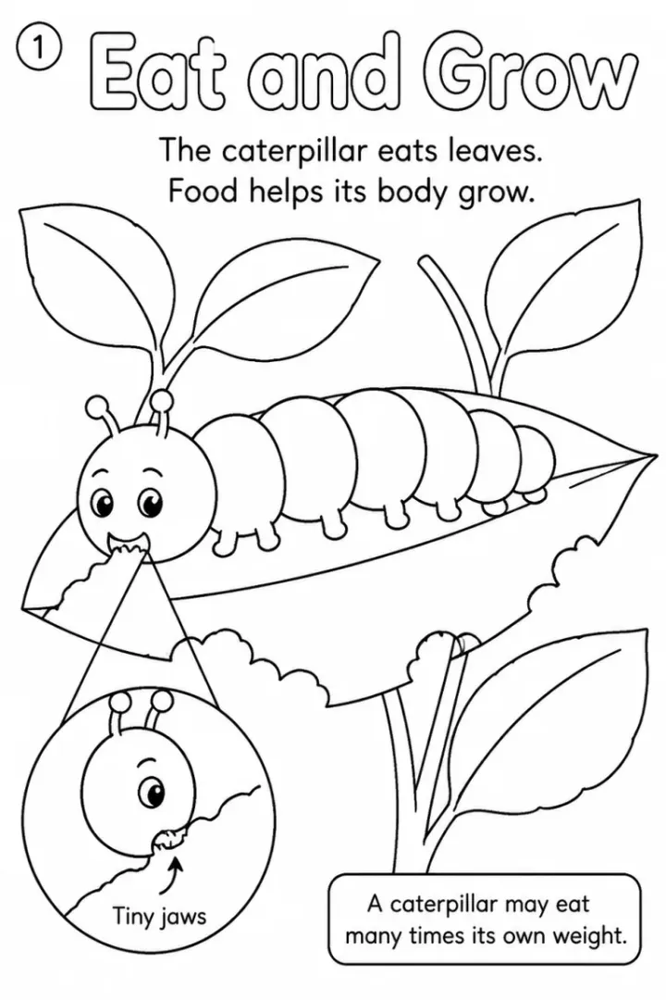

# Human Body Coloring Book Prompts: Senses, Organs & Body Systems



Kids are endlessly curious about how their own bodies work, and coloring a heart or a skeleton makes anatomy friendly instead of gross. These human body coloring book prompts start with the five senses for preschoolers and build to full organ systems for 9 to 13 year olds. Every fact is short, accurate and age-appropriate.

> **Make any of these in one click.** Each prompt opens in [InkChamps](https://inkchamps.com/?utm_source=github&utm_medium=prompt_library&utm_campaign=ai-coloring-book-prompts&utm_content=human-body-coloring-book-prompts), the AI book maker that turns a brief into a print-ready PDF for Amazon KDP, Etsy or home printing. Or copy the brief into any AI tool you like.

**Prompts on this page:** [My amazing body for preschoolers](#1-my-amazing-body-for-preschoolers) · [How my body works for ages 6-9](#2-how-my-body-works-for-ages-6-9) · [Body systems for ages 9-13](#3-body-systems-for-ages-9-13)

## 1. My amazing body for preschoolers

**Ages:** 3-6 · **Pages:** 12 · **Size:** 8.5 × 11 in · **Quality:** Standard · **Credits:** 12 Standard · 36 Premium

```text
A first book about my body, one idea per page with a child doing something: 1. My eyes see colors. 2. My ears hear music. 3. My nose smells flowers. 4. My tongue tastes food. 5. My skin feels soft and rough things. 6. My heart beats to pump blood. 7. My lungs breathe in air. 8. My bones hold me up. 9. My muscles help me run and jump. 10. My tummy digests food. 11. My brain helps me think and learn. 12. I keep my body healthy: wash hands, eat fruit, sleep.
```

[**▶ Make this educational coloring book on InkChamps**](https://inkchamps.com/dashboard/?tool=educational-coloring&prompt=A%20first%20book%20about%20my%20body%2C%20one%20idea%20per%20page%20with%20a%20child%20doing%20something%3A%201.%20My%20eyes%20see%20colors.%202.%20My%20ears%20hear%20music.%203.%20My%20nose%20smells%20flowers.%204.%20My%20tongue%20tastes%20food.%205.%20My%20skin%20feels%20soft%20and%20rough%20things.%206.%20My%20heart%20beats%20to%20pump%20blood.%207.%20My%20lungs%20breathe%20in%20air.%208.%20My%20bones%20hold%20me%20up.%209.%20My%20muscles%20help%20me%20run%20and%20jump.%2010.%20My%20tummy%20digests%20food.%2011.%20My%20brain%20helps%20me%20think%20and%20learn.%2012.%20I%20keep%20my%20body%20healthy%3A%20wash%20hands%2C%20eat%20fruit%2C%20sleep.&utm_source=github&utm_medium=prompt_library&utm_campaign=ai-coloring-book-prompts&utm_content=human-body-coloring-book-prompts-1)

*Why it works:* Preschool teachers cover 'my body' and the five senses every year, and showing a child using each part keeps it friendly for a 4-year-old. Its short length is great for home printing.

<details><summary>Exact settings for AI agents (InkChamps MCP)</summary>

```json
{
  "tool": "create_educational_coloring_book",
  "arguments": {
    "ageGroup": "3-6",
    "numberOfPages": 12,
    "highQuality": false,
    "pageSize": "8.5x11",
    "description": "A first book about my body, one idea per page with a child doing something: 1. My eyes see colors. 2. My ears hear music. 3. My nose smells flowers. 4. My tongue tastes food. 5. My skin feels soft and rough things. 6. My heart beats to pump blood. 7. My lungs breathe in air. 8. My bones hold me up. 9. My muscles help me run and jump. 10. My tummy digests food. 11. My brain helps me think and learn. 12. I keep my body healthy: wash hands, eat fruit, sleep."
  }
}
```

</details>

## 2. How my body works for ages 6-9

**Ages:** 6-9 · **Pages:** 14 · **Size:** 8.5 × 11 in · **Quality:** Standard · **Credits:** 14 Standard · 42 Premium

```text
How the body works for early readers: 1. Grown-ups have 206 bones. 2. The skull protects the brain. 3. Muscles pull on bones to move us. 4. The heart is a muscle about the size of your fist. 5. Blood travels in tubes called blood vessels. 6. Lungs fill with air when we breathe in. 7. Chewing starts digestion. 8. The stomach mixes food. 9. The intestines take in nutrients. 10. The brain sends messages along nerves. 11. Skin is the largest organ. 12. Kids have 20 baby teeth. 13. The five senses. 14. Sleep helps us grow.
```

[**▶ Make this educational coloring book on InkChamps**](https://inkchamps.com/dashboard/?tool=educational-coloring&prompt=How%20the%20body%20works%20for%20early%20readers%3A%201.%20Grown-ups%20have%20206%20bones.%202.%20The%20skull%20protects%20the%20brain.%203.%20Muscles%20pull%20on%20bones%20to%20move%20us.%204.%20The%20heart%20is%20a%20muscle%20about%20the%20size%20of%20your%20fist.%205.%20Blood%20travels%20in%20tubes%20called%20blood%20vessels.%206.%20Lungs%20fill%20with%20air%20when%20we%20breathe%20in.%207.%20Chewing%20starts%20digestion.%208.%20The%20stomach%20mixes%20food.%209.%20The%20intestines%20take%20in%20nutrients.%2010.%20The%20brain%20sends%20messages%20along%20nerves.%2011.%20Skin%20is%20the%20largest%20organ.%2012.%20Kids%20have%2020%20baby%20teeth.%2013.%20The%20five%20senses.%2014.%20Sleep%20helps%20us%20grow.&utm_source=github&utm_medium=prompt_library&utm_campaign=ai-coloring-book-prompts&utm_content=human-body-coloring-book-prompts-2)

*Why it works:* Grade 1-3 teachers and homeschoolers get a fact a page that kids can repeat at dinner, which is how they remember it. Its short length is great for home printing.

<details><summary>Exact settings for AI agents (InkChamps MCP)</summary>

```json
{
  "tool": "create_educational_coloring_book",
  "arguments": {
    "ageGroup": "6-9",
    "numberOfPages": 14,
    "highQuality": false,
    "pageSize": "8.5x11",
    "description": "How the body works for early readers: 1. Grown-ups have 206 bones. 2. The skull protects the brain. 3. Muscles pull on bones to move us. 4. The heart is a muscle about the size of your fist. 5. Blood travels in tubes called blood vessels. 6. Lungs fill with air when we breathe in. 7. Chewing starts digestion. 8. The stomach mixes food. 9. The intestines take in nutrients. 10. The brain sends messages along nerves. 11. Skin is the largest organ. 12. Kids have 20 baby teeth. 13. The five senses. 14. Sleep helps us grow."
  }
}
```

</details>

## 3. Body systems for ages 9-13

**Ages:** 9-13 · **Pages:** 16 · **Size:** 8.5 × 11 in · **Quality:** Standard · **Credits:** 16 Standard · 48 Premium

```text
The body's systems, one per page, with the main organs labeled: 1. Cells are the building blocks of life. 2. Skeletal system. 3. Muscular system. 4. Circulatory system: heart, arteries, veins. 5. Red blood cells carry oxygen. 6. Respiratory system: lungs and diaphragm. 7. Digestive system. 8. The liver and kidneys clean the blood. 9. Nervous system. 10. The brain's main parts. 11. The eye. 12. The ear. 13. Skin, hair and nails. 14. Immune system: white blood cells fight germs. 15. Teeth. 16. Exercise, sleep and food keep the systems strong.
```

[**▶ Make this educational coloring book on InkChamps**](https://inkchamps.com/dashboard/?tool=educational-coloring&prompt=The%20body%27s%20systems%2C%20one%20per%20page%2C%20with%20the%20main%20organs%20labeled%3A%201.%20Cells%20are%20the%20building%20blocks%20of%20life.%202.%20Skeletal%20system.%203.%20Muscular%20system.%204.%20Circulatory%20system%3A%20heart%2C%20arteries%2C%20veins.%205.%20Red%20blood%20cells%20carry%20oxygen.%206.%20Respiratory%20system%3A%20lungs%20and%20diaphragm.%207.%20Digestive%20system.%208.%20The%20liver%20and%20kidneys%20clean%20the%20blood.%209.%20Nervous%20system.%2010.%20The%20brain%27s%20main%20parts.%2011.%20The%20eye.%2012.%20The%20ear.%2013.%20Skin%2C%20hair%20and%20nails.%2014.%20Immune%20system%3A%20white%20blood%20cells%20fight%20germs.%2015.%20Teeth.%2016.%20Exercise%2C%20sleep%20and%20food%20keep%20the%20systems%20strong.&utm_source=github&utm_medium=prompt_library&utm_campaign=ai-coloring-book-prompts&utm_content=human-body-coloring-book-prompts-3)

*Why it works:* Middle-grade science covers body systems one at a time, and a labeled coloring page per system works as a study aid before a test. Its short length is great for home printing.

<details><summary>Exact settings for AI agents (InkChamps MCP)</summary>

```json
{
  "tool": "create_educational_coloring_book",
  "arguments": {
    "ageGroup": "9-13",
    "numberOfPages": 16,
    "highQuality": false,
    "pageSize": "8.5x11",
    "description": "The body's systems, one per page, with the main organs labeled: 1. Cells are the building blocks of life. 2. Skeletal system. 3. Muscular system. 4. Circulatory system: heart, arteries, veins. 5. Red blood cells carry oxygen. 6. Respiratory system: lungs and diaphragm. 7. Digestive system. 8. The liver and kidneys clean the blood. 9. Nervous system. 10. The brain's main parts. 11. The eye. 12. The ear. 13. Skin, hair and nails. 14. Immune system: white blood cells fight germs. 15. Teeth. 16. Exercise, sleep and food keep the systems strong."
  }
}
```

</details>

## Tips for human body coloring book

- For young kids, show a friendly child using each body part (smelling a flower, listening to a bell) rather than an anatomy chart.
- Use one system per page for older kids; a page that tries to show everything gets cluttered.
- End with healthy habits like sleep, water and washing hands, so the book closes on something kids can do.

## More prompts like these

- [How Plants Grow Coloring Book Prompts: Seeds, Roots & Photosynthesis](how-plants-grow-coloring-book-prompts.md)
- [Community Helpers Coloring Book Prompts for Preschool and Up](community-helpers-coloring-book-prompts.md)
- [Recycling and Earth Day Coloring Book Prompts for Kids](recycling-earth-day-coloring-book-prompts.md)
- [Bees and Pollinators Coloring Book Prompts for Kids](bees-and-pollinators-coloring-book-prompts.md)
- [Volcano and Earth Science Coloring Book Prompts for Kids](volcanoes-earth-science-coloring-book-prompts.md)
- [World Cultures and Landmarks Coloring Book Prompts for Kids](world-cultures-landmarks-coloring-book-prompts.md)

---

[All educational coloring books prompts](README.md) · [Every prompt in the library](../../README.md) · [Browse on the website](https://gunjchhetri.github.io/ai-coloring-book-prompts/educational-coloring-books/human-body-coloring-book-prompts/) · Prompts licensed [CC BY 4.0](../../LICENSE) by [InkChamps](https://inkchamps.com/?utm_source=github&utm_medium=prompt_library&utm_campaign=ai-coloring-book-prompts&utm_content=footer)
