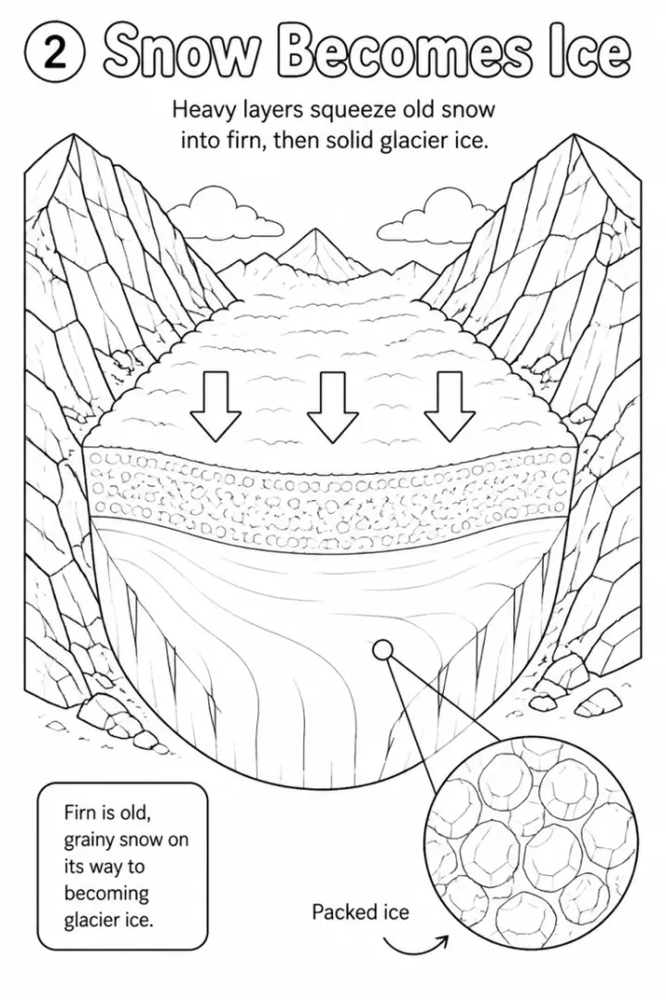

# Volcano and Earth Science Coloring Book Prompts for Kids



Volcanoes are a gateway to earth science: once kids see magma rising, they want to know about Earth's layers, plates and rocks. These prompts start with a friendly volcano story for preschoolers and build to tectonic plates and the full rock cycle for 9 to 13 year olds. Each page explains one idea with a clear cutaway drawing.

> **Make any of these in one click.** Each prompt opens in [InkChamps](https://inkchamps.com/?utm_source=github&utm_medium=prompt_library&utm_campaign=ai-coloring-book-prompts&utm_content=volcanoes-earth-science-coloring-book-prompts), the AI book maker that turns a brief into a print-ready PDF for Amazon KDP, Etsy or home printing. Or copy the brief into any AI tool you like.

**Prompts on this page:** [Volcanoes for little learners](#1-volcanoes-for-little-learners) · [Earth's layers and volcanoes for ages 6-9](#2-earths-layers-and-volcanoes-for-ages-6-9) · [Rocks and the rock cycle for ages 9-13](#3-rocks-and-the-rock-cycle-for-ages-9-13)

## 1. Volcanoes for little learners

**Ages:** 3-6 · **Pages:** 10 · **Size:** 8.5 × 11 in · **Quality:** Standard · **Credits:** 10 Standard · 30 Premium

```text
A first volcano book, one idea per page: 1. A volcano is a mountain with an opening at the top. 2. Deep under the ground it is very hot. 3. The heat melts rock into magma. 4. Magma rises up inside the volcano. 5. When the volcano erupts, the magma comes out and is called lava. 6. Clouds of ash puff into the sky. 7. Lava cools down and turns into new rock. 8. Some volcanoes make new islands in the sea. 9. Scientists called volcanologists study volcanoes safely. 10. After a long time, plants grow back on the volcano.
```

[**▶ Make this educational coloring book on InkChamps**](https://inkchamps.com/dashboard/?tool=educational-coloring&prompt=A%20first%20volcano%20book%2C%20one%20idea%20per%20page%3A%201.%20A%20volcano%20is%20a%20mountain%20with%20an%20opening%20at%20the%20top.%202.%20Deep%20under%20the%20ground%20it%20is%20very%20hot.%203.%20The%20heat%20melts%20rock%20into%20magma.%204.%20Magma%20rises%20up%20inside%20the%20volcano.%205.%20When%20the%20volcano%20erupts%2C%20the%20magma%20comes%20out%20and%20is%20called%20lava.%206.%20Clouds%20of%20ash%20puff%20into%20the%20sky.%207.%20Lava%20cools%20down%20and%20turns%20into%20new%20rock.%208.%20Some%20volcanoes%20make%20new%20islands%20in%20the%20sea.%209.%20Scientists%20called%20volcanologists%20study%20volcanoes%20safely.%2010.%20After%20a%20long%20time%2C%20plants%20grow%20back%20on%20the%20volcano.&utm_source=github&utm_medium=prompt_library&utm_campaign=ai-coloring-book-prompts&utm_content=volcanoes-earth-science-coloring-book-prompts-1)

*Why it works:* Volcano-loving preschoolers get real science in tiny steps, and parents like a book that explains the eruption without anything frightening. Its short length is great for home printing.

<details><summary>Exact settings for AI agents (InkChamps MCP)</summary>

```json
{
  "tool": "create_educational_coloring_book",
  "arguments": {
    "ageGroup": "3-6",
    "numberOfPages": 10,
    "highQuality": false,
    "pageSize": "8.5x11",
    "description": "A first volcano book, one idea per page: 1. A volcano is a mountain with an opening at the top. 2. Deep under the ground it is very hot. 3. The heat melts rock into magma. 4. Magma rises up inside the volcano. 5. When the volcano erupts, the magma comes out and is called lava. 6. Clouds of ash puff into the sky. 7. Lava cools down and turns into new rock. 8. Some volcanoes make new islands in the sea. 9. Scientists called volcanologists study volcanoes safely. 10. After a long time, plants grow back on the volcano."
  }
}
```

</details>

## 2. Earth's layers and volcanoes for ages 6-9

**Ages:** 6-9 · **Pages:** 14 · **Size:** 8.5 × 11 in · **Quality:** Standard · **Credits:** 14 Standard · 42 Premium

```text
Inside the Earth: 1. The crust is the thin layer we live on. 2. The mantle is hot, slowly moving rock. 3. The outer core is liquid metal. 4. The inner core is solid metal. 5. The crust is broken into tectonic plates. 6. Plates moving cause earthquakes. 7. The Ring of Fire around the Pacific Ocean. 8. Magma vs lava. 9. Shield volcanoes have gentle slopes. 10. Stratovolcanoes are tall and steep. 11. Cinder cones are small. 12. Pumice is so full of air it floats. 13. Obsidian is natural volcanic glass. 14. Geysers shoot hot water up.
```

[**▶ Make this educational coloring book on InkChamps**](https://inkchamps.com/dashboard/?tool=educational-coloring&prompt=Inside%20the%20Earth%3A%201.%20The%20crust%20is%20the%20thin%20layer%20we%20live%20on.%202.%20The%20mantle%20is%20hot%2C%20slowly%20moving%20rock.%203.%20The%20outer%20core%20is%20liquid%20metal.%204.%20The%20inner%20core%20is%20solid%20metal.%205.%20The%20crust%20is%20broken%20into%20tectonic%20plates.%206.%20Plates%20moving%20cause%20earthquakes.%207.%20The%20Ring%20of%20Fire%20around%20the%20Pacific%20Ocean.%208.%20Magma%20vs%20lava.%209.%20Shield%20volcanoes%20have%20gentle%20slopes.%2010.%20Stratovolcanoes%20are%20tall%20and%20steep.%2011.%20Cinder%20cones%20are%20small.%2012.%20Pumice%20is%20so%20full%20of%20air%20it%20floats.%2013.%20Obsidian%20is%20natural%20volcanic%20glass.%2014.%20Geysers%20shoot%20hot%20water%20up.&utm_source=github&utm_medium=prompt_library&utm_campaign=ai-coloring-book-prompts&utm_content=volcanoes-earth-science-coloring-book-prompts-2)

*Why it works:* Grade 2-3 teachers covering Earth's structure want each layer and volcano type on its own page, and the floating pumice fact always gets a reaction. Its short length is great for home printing.

<details><summary>Exact settings for AI agents (InkChamps MCP)</summary>

```json
{
  "tool": "create_educational_coloring_book",
  "arguments": {
    "ageGroup": "6-9",
    "numberOfPages": 14,
    "highQuality": false,
    "pageSize": "8.5x11",
    "description": "Inside the Earth: 1. The crust is the thin layer we live on. 2. The mantle is hot, slowly moving rock. 3. The outer core is liquid metal. 4. The inner core is solid metal. 5. The crust is broken into tectonic plates. 6. Plates moving cause earthquakes. 7. The Ring of Fire around the Pacific Ocean. 8. Magma vs lava. 9. Shield volcanoes have gentle slopes. 10. Stratovolcanoes are tall and steep. 11. Cinder cones are small. 12. Pumice is so full of air it floats. 13. Obsidian is natural volcanic glass. 14. Geysers shoot hot water up."
  }
}
```

</details>

## 3. Rocks and the rock cycle for ages 9-13

**Ages:** 9-13 · **Pages:** 14 · **Size:** 8.5 × 11 in · **Quality:** Standard · **Credits:** 14 Standard · 42 Premium

```text
The rock cycle: 1. Rocks are made of minerals. 2. Igneous rock forms when magma or lava cools. 3. Granite cools slowly underground. 4. Basalt cools fast at the surface. 5. Weathering breaks rock apart. 6. Water, wind and ice carry sediment away. 7. Sediment settles in layers. 8. Layers press into sedimentary rock like sandstone. 9. Fossils hide in sedimentary rock. 10. Heat and pressure make metamorphic rock. 11. Limestone becomes marble. 12. Shale becomes slate. 13. Rock melts back into magma. 14. The Mohs scale: talc is 1, diamond is 10.
```

[**▶ Make this educational coloring book on InkChamps**](https://inkchamps.com/dashboard/?tool=educational-coloring&prompt=The%20rock%20cycle%3A%201.%20Rocks%20are%20made%20of%20minerals.%202.%20Igneous%20rock%20forms%20when%20magma%20or%20lava%20cools.%203.%20Granite%20cools%20slowly%20underground.%204.%20Basalt%20cools%20fast%20at%20the%20surface.%205.%20Weathering%20breaks%20rock%20apart.%206.%20Water%2C%20wind%20and%20ice%20carry%20sediment%20away.%207.%20Sediment%20settles%20in%20layers.%208.%20Layers%20press%20into%20sedimentary%20rock%20like%20sandstone.%209.%20Fossils%20hide%20in%20sedimentary%20rock.%2010.%20Heat%20and%20pressure%20make%20metamorphic%20rock.%2011.%20Limestone%20becomes%20marble.%2012.%20Shale%20becomes%20slate.%2013.%20Rock%20melts%20back%20into%20magma.%2014.%20The%20Mohs%20scale%3A%20talc%20is%201%2C%20diamond%20is%2010.&utm_source=github&utm_medium=prompt_library&utm_campaign=ai-coloring-book-prompts&utm_content=volcanoes-earth-science-coloring-book-prompts-3)

*Why it works:* Upper elementary earth science always includes the rock cycle, and a labeled page per stage gives homeschoolers and teachers a ready study guide. Its short length is great for home printing.

<details><summary>Exact settings for AI agents (InkChamps MCP)</summary>

```json
{
  "tool": "create_educational_coloring_book",
  "arguments": {
    "ageGroup": "9-13",
    "numberOfPages": 14,
    "highQuality": false,
    "pageSize": "8.5x11",
    "description": "The rock cycle: 1. Rocks are made of minerals. 2. Igneous rock forms when magma or lava cools. 3. Granite cools slowly underground. 4. Basalt cools fast at the surface. 5. Weathering breaks rock apart. 6. Water, wind and ice carry sediment away. 7. Sediment settles in layers. 8. Layers press into sedimentary rock like sandstone. 9. Fossils hide in sedimentary rock. 10. Heat and pressure make metamorphic rock. 11. Limestone becomes marble. 12. Shale becomes slate. 13. Rock melts back into magma. 14. The Mohs scale: talc is 1, diamond is 10."
  }
}
```

</details>

## Tips for volcano and earth science coloring book

- Ask for cutaway views on key pages so kids can see the magma chamber and Earth's layers inside.
- Teach magma versus lava early: it is magma underground and lava once it comes out.
- Finish with rocks kids can find, like pumice or granite, so the book connects to a nature walk.

## More prompts like these

- [World Cultures and Landmarks Coloring Book Prompts for Kids](world-cultures-landmarks-coloring-book-prompts.md)
- [Life Cycle Coloring Book Prompts: Butterfly, Frog, Chicken & Plant](life-cycle-coloring-book-prompts.md)
- [Solar System Coloring Book Prompts: Planets, Moon & Space Facts](solar-system-coloring-book-prompts.md)
- [Water Cycle and Weather Coloring Book Prompts for Kids](water-cycle-weather-coloring-book-prompts.md)
- [Human Body Coloring Book Prompts: Senses, Organs & Body Systems](human-body-coloring-book-prompts.md)
- [How Plants Grow Coloring Book Prompts: Seeds, Roots & Photosynthesis](how-plants-grow-coloring-book-prompts.md)

---

[All educational coloring books prompts](README.md) · [Every prompt in the library](../../README.md) · [Browse on the website](https://gunjchhetri.github.io/ai-coloring-book-prompts/educational-coloring-books/volcanoes-earth-science-coloring-book-prompts/) · Prompts licensed [CC BY 4.0](../../LICENSE) by [InkChamps](https://inkchamps.com/?utm_source=github&utm_medium=prompt_library&utm_campaign=ai-coloring-book-prompts&utm_content=footer)
