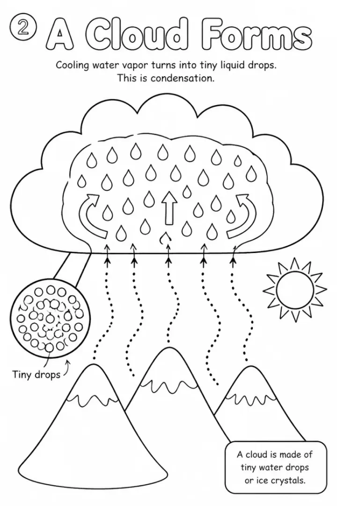

# Water Cycle and Weather Coloring Book: prompts



3 prompts. The full page, with sample pages and tips, is in the [InkChamps prompt library](https://inkchamps.com/prompts/educational-coloring-books/water-cycle-weather/). Each prompt below opens in InkChamps with one click; or copy the brief into any AI tool.

**Prompts on this page:** [Where does rain come from](#1-where-does-rain-come-from) · [Weather and seasons for ages 6-9](#2-weather-and-seasons-for-ages-6-9) · [The water cycle in depth for ages 9-13](#3-the-water-cycle-in-depth-for-ages-9-13)

## 1. Where does rain come from

**Ages:** 3-6 · **Pages:** 10 · **Size:** 8.5 × 11 in · **Quality:** Standard · **Credits:** 10 Standard · 30 Premium

```text
A simple water cycle story for little kids: 1. The Sun warms the water in the sea, lakes and puddles. 2. Tiny bits of water rise into the air where we cannot see them. 3. High up, the air is cold and the water makes clouds. 4. The clouds get full and heavy. 5. Rain falls down. 6. When it is very cold, snow falls instead. 7. Rain makes puddles, streams and rivers. 8. Rivers flow back to the sea. 9. Plants and animals drink the water. 10. The Sun warms the water again and the cycle goes round.
```

[**▶ Make this educational coloring book on InkChamps**](https://inkchamps.com/dashboard/?tool=educational-coloring&prompt=A%20simple%20water%20cycle%20story%20for%20little%20kids%3A%201.%20The%20Sun%20warms%20the%20water%20in%20the%20sea%2C%20lakes%20and%20puddles.%202.%20Tiny%20bits%20of%20water%20rise%20into%20the%20air%20where%20we%20cannot%20see%20them.%203.%20High%20up%2C%20the%20air%20is%20cold%20and%20the%20water%20makes%20clouds.%204.%20The%20clouds%20get%20full%20and%20heavy.%205.%20Rain%20falls%20down.%206.%20When%20it%20is%20very%20cold%2C%20snow%20falls%20instead.%207.%20Rain%20makes%20puddles%2C%20streams%20and%20rivers.%208.%20Rivers%20flow%20back%20to%20the%20sea.%209.%20Plants%20and%20animals%20drink%20the%20water.%2010.%20The%20Sun%20warms%20the%20water%20again%20and%20the%20cycle%20goes%20round.&utm_source=github&utm_medium=prompt_library&utm_campaign=ai-coloring-book-prompts&utm_content=water-cycle-weather-coloring-book-prompts-1)

<details><summary>Exact settings for AI agents (InkChamps MCP)</summary>

```json
{
  "tool": "create_educational_coloring_book",
  "arguments": {
    "ageGroup": "3-6",
    "numberOfPages": 10,
    "highQuality": false,
    "pageSize": "8.5x11",
    "description": "A simple water cycle story for little kids: 1. The Sun warms the water in the sea, lakes and puddles. 2. Tiny bits of water rise into the air where we cannot see them. 3. High up, the air is cold and the water makes clouds. 4. The clouds get full and heavy. 5. Rain falls down. 6. When it is very cold, snow falls instead. 7. Rain makes puddles, streams and rivers. 8. Rivers flow back to the sea. 9. Plants and animals drink the water. 10. The Sun warms the water again and the cycle goes round."
  }
}
```

</details>

## 2. Weather and seasons for ages 6-9

**Ages:** 6-9 · **Pages:** 14 · **Size:** 8.5 × 11 in · **Quality:** Standard · **Credits:** 14 Standard · 42 Premium

```text
Kinds of weather and how we measure them: 1. Sunny. 2. Cloudy. 3. Rainy. 4. Windy. 5. Snowy: snowflakes have six sides. 6. Foggy: a cloud near the ground. 7. Thunderstorms: we see lightning before we hear thunder. 8. Rainbows: sunlight shining through raindrops. 9. Hail: balls of ice from storm clouds. 10. Spring. 11. Summer. 12. Fall. 13. Winter. 14. Weather tools: a thermometer, a rain gauge and a wind vane. Show a child dressed right for each weather; for thunderstorms and hail, show the child safely indoors at the window.
```

[**▶ Make this educational coloring book on InkChamps**](https://inkchamps.com/dashboard/?tool=educational-coloring&prompt=Kinds%20of%20weather%20and%20how%20we%20measure%20them%3A%201.%20Sunny.%202.%20Cloudy.%203.%20Rainy.%204.%20Windy.%205.%20Snowy%3A%20snowflakes%20have%20six%20sides.%206.%20Foggy%3A%20a%20cloud%20near%20the%20ground.%207.%20Thunderstorms%3A%20we%20see%20lightning%20before%20we%20hear%20thunder.%208.%20Rainbows%3A%20sunlight%20shining%20through%20raindrops.%209.%20Hail%3A%20balls%20of%20ice%20from%20storm%20clouds.%2010.%20Spring.%2011.%20Summer.%2012.%20Fall.%2013.%20Winter.%2014.%20Weather%20tools%3A%20a%20thermometer%2C%20a%20rain%20gauge%20and%20a%20wind%20vane.%20Show%20a%20child%20dressed%20right%20for%20each%20weather%3B%20for%20thunderstorms%20and%20hail%2C%20show%20the%20child%20safely%20indoors%20at%20the%20window.&utm_source=github&utm_medium=prompt_library&utm_campaign=ai-coloring-book-prompts&utm_content=water-cycle-weather-coloring-book-prompts-2)

<details><summary>Exact settings for AI agents (InkChamps MCP)</summary>

```json
{
  "tool": "create_educational_coloring_book",
  "arguments": {
    "ageGroup": "6-9",
    "numberOfPages": 14,
    "highQuality": false,
    "pageSize": "8.5x11",
    "description": "Kinds of weather and how we measure them: 1. Sunny. 2. Cloudy. 3. Rainy. 4. Windy. 5. Snowy: snowflakes have six sides. 6. Foggy: a cloud near the ground. 7. Thunderstorms: we see lightning before we hear thunder. 8. Rainbows: sunlight shining through raindrops. 9. Hail: balls of ice from storm clouds. 10. Spring. 11. Summer. 12. Fall. 13. Winter. 14. Weather tools: a thermometer, a rain gauge and a wind vane. Show a child dressed right for each weather; for thunderstorms and hail, show the child safely indoors at the window."
  }
}
```

</details>

## 3. The water cycle in depth for ages 9-13

**Ages:** 9-13 · **Pages:** 12 · **Size:** 8.5 × 11 in · **Quality:** Standard · **Credits:** 12 Standard · 36 Premium

```text
The water cycle with real science words: 1. Most of Earth's water is salty ocean; only about 3% is fresh. 2. Evaporation: the Sun turns water into vapor. 3. Transpiration: plants release water through their leaves. 4. Condensation: vapor cools into droplets and forms clouds. 5. Cloud types: cumulus, stratus, cirrus, cumulonimbus. 6. Precipitation: rain, snow, sleet, hail. 7. Runoff into streams. 8. Infiltration into soil. 9. Groundwater and aquifers. 10. Glaciers and ice caps store fresh water. 11. Water treatment. 12. Saving water.
```

[**▶ Make this educational coloring book on InkChamps**](https://inkchamps.com/dashboard/?tool=educational-coloring&prompt=The%20water%20cycle%20with%20real%20science%20words%3A%201.%20Most%20of%20Earth%27s%20water%20is%20salty%20ocean%3B%20only%20about%203%25%20is%20fresh.%202.%20Evaporation%3A%20the%20Sun%20turns%20water%20into%20vapor.%203.%20Transpiration%3A%20plants%20release%20water%20through%20their%20leaves.%204.%20Condensation%3A%20vapor%20cools%20into%20droplets%20and%20forms%20clouds.%205.%20Cloud%20types%3A%20cumulus%2C%20stratus%2C%20cirrus%2C%20cumulonimbus.%206.%20Precipitation%3A%20rain%2C%20snow%2C%20sleet%2C%20hail.%207.%20Runoff%20into%20streams.%208.%20Infiltration%20into%20soil.%209.%20Groundwater%20and%20aquifers.%2010.%20Glaciers%20and%20ice%20caps%20store%20fresh%20water.%2011.%20Water%20treatment.%2012.%20Saving%20water.&utm_source=github&utm_medium=prompt_library&utm_campaign=ai-coloring-book-prompts&utm_content=water-cycle-weather-coloring-book-prompts-3)

<details><summary>Exact settings for AI agents (InkChamps MCP)</summary>

```json
{
  "tool": "create_educational_coloring_book",
  "arguments": {
    "ageGroup": "9-13",
    "numberOfPages": 12,
    "highQuality": false,
    "pageSize": "8.5x11",
    "description": "The water cycle with real science words: 1. Most of Earth's water is salty ocean; only about 3% is fresh. 2. Evaporation: the Sun turns water into vapor. 3. Transpiration: plants release water through their leaves. 4. Condensation: vapor cools into droplets and forms clouds. 5. Cloud types: cumulus, stratus, cirrus, cumulonimbus. 6. Precipitation: rain, snow, sleet, hail. 7. Runoff into streams. 8. Infiltration into soil. 9. Groundwater and aquifers. 10. Glaciers and ice caps store fresh water. 11. Water treatment. 12. Saving water."
  }
}
```

</details>

## More prompts like these

- [Human Body Coloring Book Prompts: Senses, Organs & Body Systems](human-body-coloring-book-prompts.md)
- [How Plants Grow Coloring Book Prompts: Seeds, Roots & Photosynthesis](how-plants-grow-coloring-book-prompts.md)
- [Community Helpers Coloring Book Prompts for Preschool and Up](community-helpers-coloring-book-prompts.md)
- [Recycling and Earth Day Coloring Book Prompts for Kids](recycling-earth-day-coloring-book-prompts.md)
- [Bees and Pollinators Coloring Book Prompts for Kids](bees-and-pollinators-coloring-book-prompts.md)
- [Volcano and Earth Science Coloring Book Prompts for Kids](volcanoes-earth-science-coloring-book-prompts.md)

---

[All educational coloring books prompts](README.md) · [Every prompt in the library](../../README.md) · [This page on InkChamps](https://inkchamps.com/prompts/educational-coloring-books/water-cycle-weather/) · Prompts licensed [CC BY 4.0](../../LICENSE) by [InkChamps](https://inkchamps.com/?utm_source=github&utm_medium=prompt_library&utm_campaign=ai-coloring-book-prompts&utm_content=footer)
