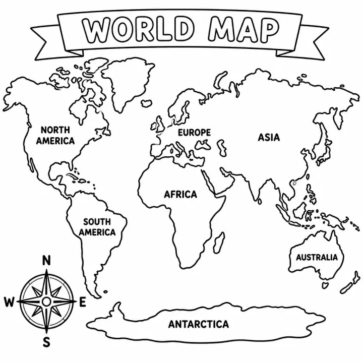

# World Cultures and Landmarks Coloring Book Prompts for Kids



A world cultures coloring book helps kids see how big and varied the world is, from saying hello in Swahili to lighting lamps for Diwali. These prompts cover greetings for preschoolers, famous landmarks for 6 to 9 year olds and festivals around the world for older kids. Each brief asks for respectful, everyday, modern pictures of people and places, never costumes or stereotypes.

> **Make any of these in one click.** Each prompt opens in [InkChamps](https://inkchamps.com/?utm_source=github&utm_medium=prompt_library&utm_campaign=ai-coloring-book-prompts&utm_content=world-cultures-landmarks-coloring-book-prompts), the AI book maker that turns a brief into a print-ready PDF for Amazon KDP, Etsy or home printing. Or copy the brief into any AI tool you like.

**Prompts on this page:** [Hello around the world for preschoolers](#1-hello-around-the-world-for-preschoolers) · [Famous landmarks of the world for ages 6-9](#2-famous-landmarks-of-the-world-for-ages-6-9) · [Festivals around the world for ages 9-13](#3-festivals-around-the-world-for-ages-9-13)

## 1. Hello around the world for preschoolers

**Ages:** 3-6 · **Pages:** 12 · **Size:** 8.5 × 11 in · **Quality:** Standard · **Credits:** 12 Standard · 36 Premium

```text
Saying hello around the world, one child and one greeting per page, with an animal or place from that country: 1. Hola, Mexico (monarch butterflies). 2. Bonjour, France (Eiffel Tower). 3. Jambo, Kenya (giraffe). 4. Konnichiwa, Japan (cherry blossoms). 5. Namaste, India (peacock). 6. Ni hao, China (panda). 7. Ciao, Italy (Leaning Tower of Pisa). 8. Marhaba, Egypt (pyramids). 9. Olá, Brazil (toucan). 10. Kia ora, New Zealand (kiwi bird). 11. Annyeonghaseyo, South Korea (hanok house). 12. Hello, Canada (moose). Children in everyday modern clothes, smiling and waving, never in costume.
```

[**▶ Make this educational coloring book on InkChamps**](https://inkchamps.com/dashboard/?tool=educational-coloring&prompt=Saying%20hello%20around%20the%20world%2C%20one%20child%20and%20one%20greeting%20per%20page%2C%20with%20an%20animal%20or%20place%20from%20that%20country%3A%201.%20Hola%2C%20Mexico%20%28monarch%20butterflies%29.%202.%20Bonjour%2C%20France%20%28Eiffel%20Tower%29.%203.%20Jambo%2C%20Kenya%20%28giraffe%29.%204.%20Konnichiwa%2C%20Japan%20%28cherry%20blossoms%29.%205.%20Namaste%2C%20India%20%28peacock%29.%206.%20Ni%20hao%2C%20China%20%28panda%29.%207.%20Ciao%2C%20Italy%20%28Leaning%20Tower%20of%20Pisa%29.%208.%20Marhaba%2C%20Egypt%20%28pyramids%29.%209.%20Ol%C3%A1%2C%20Brazil%20%28toucan%29.%2010.%20Kia%20ora%2C%20New%20Zealand%20%28kiwi%20bird%29.%2011.%20Annyeonghaseyo%2C%20South%20Korea%20%28hanok%20house%29.%2012.%20Hello%2C%20Canada%20%28moose%29.%20Children%20in%20everyday%20modern%20clothes%2C%20smiling%20and%20waving%2C%20never%20in%20costume.&utm_source=github&utm_medium=prompt_library&utm_campaign=ai-coloring-book-prompts&utm_content=world-cultures-landmarks-coloring-book-prompts-1)

*Why it works:* Preschool teachers building a multicultural classroom want a gentle first look at other languages, and kids love saying each hello out loud. Its short length is great for home printing.

<details><summary>Exact settings for AI agents (InkChamps MCP)</summary>

```json
{
  "tool": "create_educational_coloring_book",
  "arguments": {
    "ageGroup": "3-6",
    "numberOfPages": 12,
    "highQuality": false,
    "pageSize": "8.5x11",
    "description": "Saying hello around the world, one child and one greeting per page, with an animal or place from that country: 1. Hola, Mexico (monarch butterflies). 2. Bonjour, France (Eiffel Tower). 3. Jambo, Kenya (giraffe). 4. Konnichiwa, Japan (cherry blossoms). 5. Namaste, India (peacock). 6. Ni hao, China (panda). 7. Ciao, Italy (Leaning Tower of Pisa). 8. Marhaba, Egypt (pyramids). 9. Olá, Brazil (toucan). 10. Kia ora, New Zealand (kiwi bird). 11. Annyeonghaseyo, South Korea (hanok house). 12. Hello, Canada (moose). Children in everyday modern clothes, smiling and waving, never in costume."
  }
}
```

</details>

## 2. Famous landmarks of the world for ages 6-9

**Ages:** 6-9 · **Pages:** 14 · **Size:** 8.5 × 11 in · **Quality:** Standard · **Credits:** 14 Standard · 42 Premium

```text
Famous landmarks with one fact each: 1. Great Wall of China, thousands of miles long. 2. Pyramids of Giza, Egypt, over 4,500 years old. 3. Eiffel Tower, Paris. 4. Taj Mahal, India, white marble. 5. Machu Picchu, Peru, high in the Andes. 6. Statue of Liberty, New York. 7. Great Barrier Reef, Australia, seen from space. 8. Colosseum, Rome. 9. Petra, Jordan, carved into rock. 10. Mount Kilimanjaro, Tanzania. 11. Angkor Wat, Cambodia. 12. Chichen Itza, Mexico. 13. Stonehenge, England. 14. Iguazu Falls, on the border of Brazil and Argentina.
```

[**▶ Make this educational coloring book on InkChamps**](https://inkchamps.com/dashboard/?tool=educational-coloring&prompt=Famous%20landmarks%20with%20one%20fact%20each%3A%201.%20Great%20Wall%20of%20China%2C%20thousands%20of%20miles%20long.%202.%20Pyramids%20of%20Giza%2C%20Egypt%2C%20over%204%2C500%20years%20old.%203.%20Eiffel%20Tower%2C%20Paris.%204.%20Taj%20Mahal%2C%20India%2C%20white%20marble.%205.%20Machu%20Picchu%2C%20Peru%2C%20high%20in%20the%20Andes.%206.%20Statue%20of%20Liberty%2C%20New%20York.%207.%20Great%20Barrier%20Reef%2C%20Australia%2C%20seen%20from%20space.%208.%20Colosseum%2C%20Rome.%209.%20Petra%2C%20Jordan%2C%20carved%20into%20rock.%2010.%20Mount%20Kilimanjaro%2C%20Tanzania.%2011.%20Angkor%20Wat%2C%20Cambodia.%2012.%20Chichen%20Itza%2C%20Mexico.%2013.%20Stonehenge%2C%20England.%2014.%20Iguazu%20Falls%2C%20on%20the%20border%20of%20Brazil%20and%20Argentina.&utm_source=github&utm_medium=prompt_library&utm_campaign=ai-coloring-book-prompts&utm_content=world-cultures-landmarks-coloring-book-prompts-2)

*Why it works:* Teachers and homeschoolers use landmarks to anchor geography, and one landmark per page with a fact makes a map unit hands-on. Its short length is great for home printing.

<details><summary>Exact settings for AI agents (InkChamps MCP)</summary>

```json
{
  "tool": "create_educational_coloring_book",
  "arguments": {
    "ageGroup": "6-9",
    "numberOfPages": 14,
    "highQuality": false,
    "pageSize": "8.5x11",
    "description": "Famous landmarks with one fact each: 1. Great Wall of China, thousands of miles long. 2. Pyramids of Giza, Egypt, over 4,500 years old. 3. Eiffel Tower, Paris. 4. Taj Mahal, India, white marble. 5. Machu Picchu, Peru, high in the Andes. 6. Statue of Liberty, New York. 7. Great Barrier Reef, Australia, seen from space. 8. Colosseum, Rome. 9. Petra, Jordan, carved into rock. 10. Mount Kilimanjaro, Tanzania. 11. Angkor Wat, Cambodia. 12. Chichen Itza, Mexico. 13. Stonehenge, England. 14. Iguazu Falls, on the border of Brazil and Argentina."
  }
}
```

</details>

## 3. Festivals around the world for ages 9-13

**Ages:** 9-13 · **Pages:** 14 · **Size:** 8.5 × 11 in · **Quality:** Standard · **Credits:** 14 Standard · 42 Premium

```text
Festivals, shown respectfully with families taking part: 1. Diwali, lamps and rangoli. 2. Lunar New Year, lion dance and red envelopes. 3. Holi, colored powder in spring. 4. Eid al-Fitr ends Ramadan with a family meal. 5. Hanukkah, the menorah's eight nights. 6. Christmas, Jesus's birth, a decorated tree. 7. Kwanzaa, the kinara. 8. Day of the Dead, marigolds for loved ones. 9. Carnival in Brazil, kids parading with drums and confetti. 10. Songkran, Thai New Year. 11. Nowruz, Persian New Year. 12. Mid-Autumn Festival, mooncakes. 13. Inti Raymi, Peru. 14. Homowo, Ghana, a harvest feast.
```

[**▶ Make this educational coloring book on InkChamps**](https://inkchamps.com/dashboard/?tool=educational-coloring&prompt=Festivals%2C%20shown%20respectfully%20with%20families%20taking%20part%3A%201.%20Diwali%2C%20lamps%20and%20rangoli.%202.%20Lunar%20New%20Year%2C%20lion%20dance%20and%20red%20envelopes.%203.%20Holi%2C%20colored%20powder%20in%20spring.%204.%20Eid%20al-Fitr%20ends%20Ramadan%20with%20a%20family%20meal.%205.%20Hanukkah%2C%20the%20menorah%27s%20eight%20nights.%206.%20Christmas%2C%20Jesus%27s%20birth%2C%20a%20decorated%20tree.%207.%20Kwanzaa%2C%20the%20kinara.%208.%20Day%20of%20the%20Dead%2C%20marigolds%20for%20loved%20ones.%209.%20Carnival%20in%20Brazil%2C%20kids%20parading%20with%20drums%20and%20confetti.%2010.%20Songkran%2C%20Thai%20New%20Year.%2011.%20Nowruz%2C%20Persian%20New%20Year.%2012.%20Mid-Autumn%20Festival%2C%20mooncakes.%2013.%20Inti%20Raymi%2C%20Peru.%2014.%20Homowo%2C%20Ghana%2C%20a%20harvest%20feast.&utm_source=github&utm_medium=prompt_library&utm_campaign=ai-coloring-book-prompts&utm_content=world-cultures-landmarks-coloring-book-prompts-3)

*Why it works:* Teachers building an inclusive classroom want festivals from many faiths and countries treated equally and accurately, one per page. Its short length is great for home printing.

<details><summary>Exact settings for AI agents (InkChamps MCP)</summary>

```json
{
  "tool": "create_educational_coloring_book",
  "arguments": {
    "ageGroup": "9-13",
    "numberOfPages": 14,
    "highQuality": false,
    "pageSize": "8.5x11",
    "description": "Festivals, shown respectfully with families taking part: 1. Diwali, lamps and rangoli. 2. Lunar New Year, lion dance and red envelopes. 3. Holi, colored powder in spring. 4. Eid al-Fitr ends Ramadan with a family meal. 5. Hanukkah, the menorah's eight nights. 6. Christmas, Jesus's birth, a decorated tree. 7. Kwanzaa, the kinara. 8. Day of the Dead, marigolds for loved ones. 9. Carnival in Brazil, kids parading with drums and confetti. 10. Songkran, Thai New Year. 11. Nowruz, Persian New Year. 12. Mid-Autumn Festival, mooncakes. 13. Inti Raymi, Peru. 14. Homowo, Ghana, a harvest feast."
  }
}
```

</details>

## Tips for world cultures and landmarks coloring book

- Ask for people in everyday modern clothes at home, school or a market; traditional dress only where the occasion calls for it, like a festival.
- Name the country and a true fact on every page, so the book teaches geography as well as culture.
- Check spellings of greetings and festival names in the brief; they appear in the captions.

## More prompts like these

- [Life Cycle Coloring Book Prompts: Butterfly, Frog, Chicken & Plant](life-cycle-coloring-book-prompts.md)
- [Solar System Coloring Book Prompts: Planets, Moon & Space Facts](solar-system-coloring-book-prompts.md)
- [Water Cycle and Weather Coloring Book Prompts for Kids](water-cycle-weather-coloring-book-prompts.md)
- [Human Body Coloring Book Prompts: Senses, Organs & Body Systems](human-body-coloring-book-prompts.md)
- [How Plants Grow Coloring Book Prompts: Seeds, Roots & Photosynthesis](how-plants-grow-coloring-book-prompts.md)
- [Community Helpers Coloring Book Prompts for Preschool and Up](community-helpers-coloring-book-prompts.md)

---

[All educational coloring books prompts](README.md) · [Every prompt in the library](../../README.md) · [Browse on the website](https://gunjchhetri.github.io/ai-coloring-book-prompts/educational-coloring-books/world-cultures-landmarks-coloring-book-prompts/) · Prompts licensed [CC BY 4.0](../../LICENSE) by [InkChamps](https://inkchamps.com/?utm_source=github&utm_medium=prompt_library&utm_campaign=ai-coloring-book-prompts&utm_content=footer)
