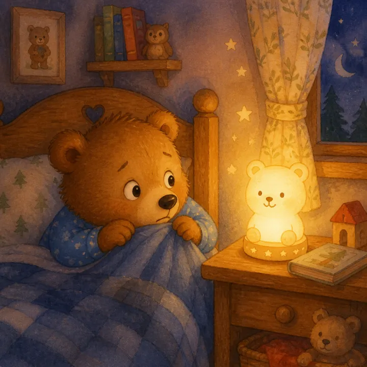

# Bedtime Story Book: prompts



3 prompts. The full page, with sample pages and tips, is in the [InkChamps prompt library](https://inkchamps.com/prompts/illustrated-story-books/bedtime/). Each prompt below opens in InkChamps with one click; or copy the brief into any AI tool.

**Prompts on this page:** [Bramble and the moonflowers](#1-bramble-and-the-moonflowers) · [Ten sheep who would not sleep](#2-ten-sheep-who-would-not-sleep) · [The boy who borrowed the moon](#3-the-boy-who-borrowed-the-moon)

## 1. Bramble and the moonflowers

**Ages:** 3-6 · **Pages:** 24 · **Size:** 8.5 × 8.5 in · **Style:** Colored pencil · **Layout:** Picture on top, text below · **Quality:** Standard · **Credits:** 48 Standard · 72 Premium

```text
Every night after the village falls asleep, Mrs. Fernsby, a tall old badger in a patched blue apron, waters the moonflowers that open only in the dark. Tonight her helper, a sleepy hedgehog named Bramble with a tiny lantern, wants to stay up to see them bloom. He yawns through every chore, but the very last flower opens just for him. Bramble curls up among the glowing petals, and Mrs. Fernsby carries him home to bed. A hushed, slow wind-down story.
```

[**▶ Make this illustrated story book on InkChamps**](https://inkchamps.com/dashboard/?tool=illustrative-story-book&prompt=Every%20night%20after%20the%20village%20falls%20asleep%2C%20Mrs.%20Fernsby%2C%20a%20tall%20old%20badger%20in%20a%20patched%20blue%20apron%2C%20waters%20the%20moonflowers%20that%20open%20only%20in%20the%20dark.%20Tonight%20her%20helper%2C%20a%20sleepy%20hedgehog%20named%20Bramble%20with%20a%20tiny%20lantern%2C%20wants%20to%20stay%20up%20to%20see%20them%20bloom.%20He%20yawns%20through%20every%20chore%2C%20but%20the%20very%20last%20flower%20opens%20just%20for%20him.%20Bramble%20curls%20up%20among%20the%20glowing%20petals%2C%20and%20Mrs.%20Fernsby%20carries%20him%20home%20to%20bed.%20A%20hushed%2C%20slow%20wind-down%20story.&utm_source=github&utm_medium=prompt_library&utm_campaign=ai-coloring-book-prompts&utm_content=bedtime-story-book-prompts-1)

<details><summary>Exact settings for AI agents (InkChamps MCP)</summary>

```json
{
  "tool": "create_illustrated_story_book",
  "arguments": {
    "ageGroup": "3-6",
    "numberOfPages": 24,
    "highQuality": false,
    "pageSize": "8.5x8.5",
    "title": "The Night Gardener",
    "theme": "A calm night-time garden",
    "style": "colored_pencil_sketch",
    "pageTemplate": "image_top_text_bottom",
    "storyPrompt": "Every night after the village falls asleep, Mrs. Fernsby, a tall old badger in a patched blue apron, waters the moonflowers that open only in the dark. Tonight her helper, a sleepy hedgehog named Bramble with a tiny lantern, wants to stay up to see them bloom. He yawns through every chore, but the very last flower opens just for him. Bramble curls up among the glowing petals, and Mrs. Fernsby carries him home to bed. A hushed, slow wind-down story."
  }
}
```

</details>

## 2. Ten sheep who would not sleep

**Ages:** 3-6 · **Pages:** 16 · **Size:** 8.5 × 8.5 in · **Style:** 2D hand-drawn · **Layout:** Words lettered into the art · **Quality:** Standard · **Credits:** 32 Standard · 48 Premium

```text
Pim, a little girl in yellow rain boots and a nightgown, can't fall asleep, so she tries counting sheep. But her ten sheep won't jump the fence: Clover wants a snack, Wooly lost her bell, the twins want one more game of tag and Big Bertha is scared of the dark. Pim helps each one settle, counting up from one to ten, until all ten sheep snore in a woolly pile. Then Pim yawns, climbs onto the softest sheep and falls asleep too. Gentle repetition with a giggly ending.
```

[**▶ Make this illustrated story book on InkChamps**](https://inkchamps.com/dashboard/?tool=illustrative-story-book&prompt=Pim%2C%20a%20little%20girl%20in%20yellow%20rain%20boots%20and%20a%20nightgown%2C%20can%27t%20fall%20asleep%2C%20so%20she%20tries%20counting%20sheep.%20But%20her%20ten%20sheep%20won%27t%20jump%20the%20fence%3A%20Clover%20wants%20a%20snack%2C%20Wooly%20lost%20her%20bell%2C%20the%20twins%20want%20one%20more%20game%20of%20tag%20and%20Big%20Bertha%20is%20scared%20of%20the%20dark.%20Pim%20helps%20each%20one%20settle%2C%20counting%20up%20from%20one%20to%20ten%2C%20until%20all%20ten%20sheep%20snore%20in%20a%20woolly%20pile.%20Then%20Pim%20yawns%2C%20climbs%20onto%20the%20softest%20sheep%20and%20falls%20asleep%20too.%20Gentle%20repetition%20with%20a%20giggly%20ending.&utm_source=github&utm_medium=prompt_library&utm_campaign=ai-coloring-book-prompts&utm_content=bedtime-story-book-prompts-2)

<details><summary>Exact settings for AI agents (InkChamps MCP)</summary>

```json
{
  "tool": "create_illustrated_story_book",
  "arguments": {
    "ageGroup": "3-6",
    "numberOfPages": 16,
    "highQuality": false,
    "pageSize": "8.5x8.5",
    "title": "Ten Sheep Who Would Not Sleep",
    "theme": "Counting to ten at bedtime",
    "style": "hand_drawn_2d",
    "pageTemplate": "text_in_image",
    "storyPrompt": "Pim, a little girl in yellow rain boots and a nightgown, can't fall asleep, so she tries counting sheep. But her ten sheep won't jump the fence: Clover wants a snack, Wooly lost her bell, the twins want one more game of tag and Big Bertha is scared of the dark. Pim helps each one settle, counting up from one to ten, until all ten sheep snore in a woolly pile. Then Pim yawns, climbs onto the softest sheep and falls asleep too. Gentle repetition with a giggly ending."
  }
}
```

</details>

## 3. The boy who borrowed the moon

**Ages:** 6-9 · **Pages:** 32 · **Size:** 8.5 × 11 in · **Style:** Paper cut-out collage · **Layout:** Text page left, picture right · **Quality:** Standard · **Credits:** 64 Standard · 96 Premium

```text
Arlo, a boy with messy red hair who wears his blanket as a cape, is scared of the dark. One night he climbs a very tall ladder and borrows the moon as his night-light. But without the moon the owls can't hunt, the tide forgets to come in and the fireflies get lost. Arlo sees the night needs its moon more than he does. He carries it back up the ladder, and from then on the moon slips a silver beam through his window every night to keep him company.
```

[**▶ Make this illustrated story book on InkChamps**](https://inkchamps.com/dashboard/?tool=illustrative-story-book&prompt=Arlo%2C%20a%20boy%20with%20messy%20red%20hair%20who%20wears%20his%20blanket%20as%20a%20cape%2C%20is%20scared%20of%20the%20dark.%20One%20night%20he%20climbs%20a%20very%20tall%20ladder%20and%20borrows%20the%20moon%20as%20his%20night-light.%20But%20without%20the%20moon%20the%20owls%20can%27t%20hunt%2C%20the%20tide%20forgets%20to%20come%20in%20and%20the%20fireflies%20get%20lost.%20Arlo%20sees%20the%20night%20needs%20its%20moon%20more%20than%20he%20does.%20He%20carries%20it%20back%20up%20the%20ladder%2C%20and%20from%20then%20on%20the%20moon%20slips%20a%20silver%20beam%20through%20his%20window%20every%20night%20to%20keep%20him%20company.&utm_source=github&utm_medium=prompt_library&utm_campaign=ai-coloring-book-prompts&utm_content=bedtime-story-book-prompts-3)

<details><summary>Exact settings for AI agents (InkChamps MCP)</summary>

```json
{
  "tool": "create_illustrated_story_book",
  "arguments": {
    "ageGroup": "6-9",
    "numberOfPages": 32,
    "highQuality": false,
    "pageSize": "8.5x11",
    "title": "The Boy Who Borrowed the Moon",
    "theme": "Being afraid of the dark",
    "style": "paper_cutout_collage",
    "pageTemplate": "text_left_image_right",
    "storyPrompt": "Arlo, a boy with messy red hair who wears his blanket as a cape, is scared of the dark. One night he climbs a very tall ladder and borrows the moon as his night-light. But without the moon the owls can't hunt, the tide forgets to come in and the fireflies get lost. Arlo sees the night needs its moon more than he does. He carries it back up the ladder, and from then on the moon slips a silver beam through his window every night to keep him company."
  }
}
```

</details>

## More prompts like these

- [Friendship Story Book Prompts for Children's Picture Books](friendship-story-book-prompts.md)
- [Bravery Story Book Prompts: Picture Books About Overcoming Fears](bravery-overcoming-fears-story-book-prompts.md)
- [Potty Training Story Book Prompts for Toddlers](potty-training-story-book-prompts.md)
- [First Day of School Story Book Prompts for Picture Books](first-day-of-school-story-book-prompts.md)
- [New Baby Sibling Story Book Prompts for Big Brothers and Sisters](new-baby-sibling-story-book-prompts.md)
- [Dragon Story Book Prompts for AI Children's Books](dragon-story-book-prompts.md)

---

[All illustrated children's story books prompts](README.md) · [Every prompt in the library](../../README.md) · [This page on InkChamps](https://inkchamps.com/prompts/illustrated-story-books/bedtime/) · Prompts licensed [CC BY 4.0](../../LICENSE) by [InkChamps](https://inkchamps.com/?utm_source=github&utm_medium=prompt_library&utm_campaign=ai-coloring-book-prompts&utm_content=footer)
