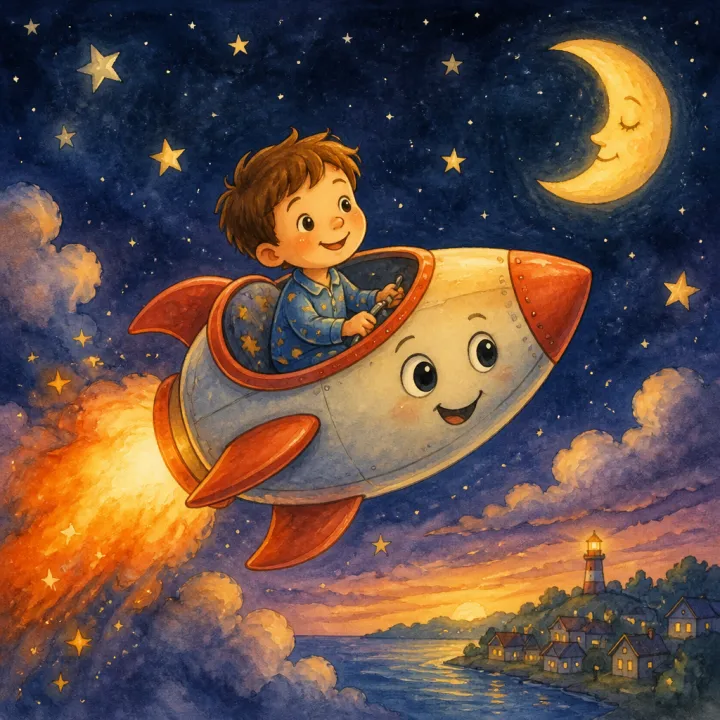

# Bravery Story Book: prompts



3 prompts. The full page, with sample pages and tips, is in the [InkChamps prompt library](https://inkchamps.com/prompts/illustrated-story-books/bravery-overcoming-fears/). Each prompt below opens in InkChamps with one click; or copy the brief into any AI tool.

**Prompts on this page:** [The monster under Milo's bed](#1-the-monster-under-milos-bed) · [Nora and the deep end](#2-nora-and-the-deep-end) · [Ivy follows the night noises](#3-ivy-follows-the-night-noises)

## 1. The monster under Milo's bed

**Ages:** 3-6 · **Pages:** 24 · **Size:** 8.5 × 8.5 in · **Style:** Chibi / kawaii · **Layout:** Picture on top, text below · **Quality:** Standard · **Credits:** 48 Standard · 72 Premium

```text
Milo, a boy in fuzzy dinosaur slippers, hears scratching under his bed. He's sure it's a monster. With his flashlight shaking, he peeks underneath and finds Gus, a small purple monster with one horn, hiding and trembling. Gus is scared of the dark up on top of the bed. Milo shows Gus his night-light and his teddy; Gus shows Milo that the shadows on the wall are just his coat and his kite. They agree to be brave together, and they both sleep with the flashlight on.
```

[**▶ Make this illustrated story book on InkChamps**](https://inkchamps.com/dashboard/?tool=illustrative-story-book&prompt=Milo%2C%20a%20boy%20in%20fuzzy%20dinosaur%20slippers%2C%20hears%20scratching%20under%20his%20bed.%20He%27s%20sure%20it%27s%20a%20monster.%20With%20his%20flashlight%20shaking%2C%20he%20peeks%20underneath%20and%20finds%20Gus%2C%20a%20small%20purple%20monster%20with%20one%20horn%2C%20hiding%20and%20trembling.%20Gus%20is%20scared%20of%20the%20dark%20up%20on%20top%20of%20the%20bed.%20Milo%20shows%20Gus%20his%20night-light%20and%20his%20teddy%3B%20Gus%20shows%20Milo%20that%20the%20shadows%20on%20the%20wall%20are%20just%20his%20coat%20and%20his%20kite.%20They%20agree%20to%20be%20brave%20together%2C%20and%20they%20both%20sleep%20with%20the%20flashlight%20on.&utm_source=github&utm_medium=prompt_library&utm_campaign=ai-coloring-book-prompts&utm_content=bravery-overcoming-fears-story-book-prompts-1)

<details><summary>Exact settings for AI agents (InkChamps MCP)</summary>

```json
{
  "tool": "create_illustrated_story_book",
  "arguments": {
    "ageGroup": "3-6",
    "numberOfPages": 24,
    "highQuality": false,
    "pageSize": "8.5x8.5",
    "title": "The Monster Under Milo's Bed",
    "theme": "Fear of monsters at night",
    "style": "chibi_kawaii",
    "pageTemplate": "image_top_text_bottom",
    "storyPrompt": "Milo, a boy in fuzzy dinosaur slippers, hears scratching under his bed. He's sure it's a monster. With his flashlight shaking, he peeks underneath and finds Gus, a small purple monster with one horn, hiding and trembling. Gus is scared of the dark up on top of the bed. Milo shows Gus his night-light and his teddy; Gus shows Milo that the shadows on the wall are just his coat and his kite. They agree to be brave together, and they both sleep with the flashlight on."
  }
}
```

</details>

## 2. Nora and the deep end

**Ages:** 6-9 · **Pages:** 24 · **Size:** 8.5 × 11 in · **Style:** Paper cut-out collage · **Layout:** Text page left, picture right · **Quality:** Standard · **Credits:** 48 Standard · 72 Premium

```text
Nora, a girl with goggles pushed up on her forehead, spends every summer day at the pool but never goes past the rope into the deep end. Her friends jump and splash; Nora sits on the edge. Her grandma, a retired lifeguard in a flowered swim cap, teaches her one small thing each week: blowing bubbles, floating like a starfish, kicking to the wall. On the last day of summer, Nora takes a big breath and jumps. She bobs up laughing, and Grandma is there.
```

[**▶ Make this illustrated story book on InkChamps**](https://inkchamps.com/dashboard/?tool=illustrative-story-book&prompt=Nora%2C%20a%20girl%20with%20goggles%20pushed%20up%20on%20her%20forehead%2C%20spends%20every%20summer%20day%20at%20the%20pool%20but%20never%20goes%20past%20the%20rope%20into%20the%20deep%20end.%20Her%20friends%20jump%20and%20splash%3B%20Nora%20sits%20on%20the%20edge.%20Her%20grandma%2C%20a%20retired%20lifeguard%20in%20a%20flowered%20swim%20cap%2C%20teaches%20her%20one%20small%20thing%20each%20week%3A%20blowing%20bubbles%2C%20floating%20like%20a%20starfish%2C%20kicking%20to%20the%20wall.%20On%20the%20last%20day%20of%20summer%2C%20Nora%20takes%20a%20big%20breath%20and%20jumps.%20She%20bobs%20up%20laughing%2C%20and%20Grandma%20is%20there.&utm_source=github&utm_medium=prompt_library&utm_campaign=ai-coloring-book-prompts&utm_content=bravery-overcoming-fears-story-book-prompts-2)

<details><summary>Exact settings for AI agents (InkChamps MCP)</summary>

```json
{
  "tool": "create_illustrated_story_book",
  "arguments": {
    "ageGroup": "6-9",
    "numberOfPages": 24,
    "highQuality": false,
    "pageSize": "8.5x11",
    "title": "Nora and the Deep End",
    "theme": "Fear of swimming",
    "style": "paper_cutout_collage",
    "pageTemplate": "text_left_image_right",
    "storyPrompt": "Nora, a girl with goggles pushed up on her forehead, spends every summer day at the pool but never goes past the rope into the deep end. Her friends jump and splash; Nora sits on the edge. Her grandma, a retired lifeguard in a flowered swim cap, teaches her one small thing each week: blowing bubbles, floating like a starfish, kicking to the wall. On the last day of summer, Nora takes a big breath and jumps. She bobs up laughing, and Grandma is there."
  }
}
```

</details>

## 3. Ivy follows the night noises

**Ages:** 6-9 · **Pages:** 28 · **Size:** 8.5 × 11 in · **Style:** 2D hand-drawn · **Layout:** Two-page spreads · **Quality:** Standard · **Credits:** 56 Standard · 84 Premium

```text
Ivy, a girl with a long yellow scarf, has just moved into a creaky old house by the woods, and at night it's full of noises. Clutching her torch, she sets out to find each one: the clank is the old radiator, the whisper is wind in the chimney, the tapping is a branch on the window and the thump is her cat Pickle chasing a moth. By the last noise, Ivy is more curious than scared. She climbs back into bed and listens to the house hum like a friend.
```

[**▶ Make this illustrated story book on InkChamps**](https://inkchamps.com/dashboard/?tool=illustrative-story-book&prompt=Ivy%2C%20a%20girl%20with%20a%20long%20yellow%20scarf%2C%20has%20just%20moved%20into%20a%20creaky%20old%20house%20by%20the%20woods%2C%20and%20at%20night%20it%27s%20full%20of%20noises.%20Clutching%20her%20torch%2C%20she%20sets%20out%20to%20find%20each%20one%3A%20the%20clank%20is%20the%20old%20radiator%2C%20the%20whisper%20is%20wind%20in%20the%20chimney%2C%20the%20tapping%20is%20a%20branch%20on%20the%20window%20and%20the%20thump%20is%20her%20cat%20Pickle%20chasing%20a%20moth.%20By%20the%20last%20noise%2C%20Ivy%20is%20more%20curious%20than%20scared.%20She%20climbs%20back%20into%20bed%20and%20listens%20to%20the%20house%20hum%20like%20a%20friend.&utm_source=github&utm_medium=prompt_library&utm_campaign=ai-coloring-book-prompts&utm_content=bravery-overcoming-fears-story-book-prompts-3)

<details><summary>Exact settings for AI agents (InkChamps MCP)</summary>

```json
{
  "tool": "create_illustrated_story_book",
  "arguments": {
    "ageGroup": "6-9",
    "numberOfPages": 28,
    "highQuality": false,
    "pageSize": "8.5x11",
    "title": "Ivy and the Night Noises",
    "theme": "Fear of the dark and strange sounds",
    "style": "hand_drawn_2d",
    "pageTemplate": "full_page_image",
    "storyPrompt": "Ivy, a girl with a long yellow scarf, has just moved into a creaky old house by the woods, and at night it's full of noises. Clutching her torch, she sets out to find each one: the clank is the old radiator, the whisper is wind in the chimney, the tapping is a branch on the window and the thump is her cat Pickle chasing a moth. By the last noise, Ivy is more curious than scared. She climbs back into bed and listens to the house hum like a friend."
  }
}
```

</details>

## More prompts like these

- [Potty Training Story Book Prompts for Toddlers](potty-training-story-book-prompts.md)
- [First Day of School Story Book Prompts for Picture Books](first-day-of-school-story-book-prompts.md)
- [New Baby Sibling Story Book Prompts for Big Brothers and Sisters](new-baby-sibling-story-book-prompts.md)
- [Dragon Story Book Prompts for AI Children's Books](dragon-story-book-prompts.md)
- [Animal Fable Story Book Prompts with a Moral](animal-fable-story-book-prompts.md)
- [Personalized Birthday Story Book Prompts for Custom Kids' Books](personalized-birthday-story-book-prompts.md)

---

[All illustrated children's story books prompts](README.md) · [Every prompt in the library](../../README.md) · [This page on InkChamps](https://inkchamps.com/prompts/illustrated-story-books/bravery-overcoming-fears/) · Prompts licensed [CC BY 4.0](../../LICENSE) by [InkChamps](https://inkchamps.com/?utm_source=github&utm_medium=prompt_library&utm_campaign=ai-coloring-book-prompts&utm_content=footer)
