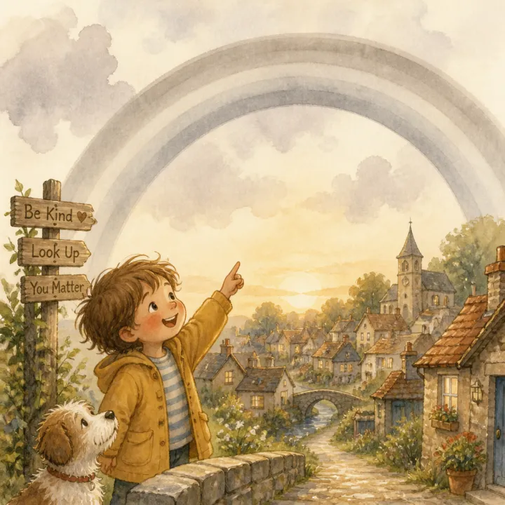

# Personalized Birthday Story Book: prompts



3 prompts. The full page, with sample pages and tips, is in the [InkChamps prompt library](https://inkchamps.com/prompts/illustrated-story-books/personalized-birthday/). Each prompt below opens in InkChamps with one click; or copy the brief into any AI tool.

**Prompts on this page:** [[Name]'s birthday parade](#1-names-birthday-parade) · [[Name]'s birthday trip through space](#2-names-birthday-trip-through-space) · [[Name]'s magic treasure map](#3-names-magic-treasure-map)

## 1. [Name]'s birthday parade

**Ages:** 3-6 · **Pages:** 24 · **Size:** 8.5 × 8.5 in · **Style:** Chibi / kawaii · **Layout:** Picture on top, text below · **Quality:** Standard · **Credits:** 48 Standard · 72 Premium

```text
On the morning [Name] turns [age], a marching band of animals arrives at the front door. A lion plays the drum, a giraffe carries balloons and a tiny mouse waves a birthday flag. They lead [Name] through the town, and at every stop a new animal joins with a present, one for each year, until there are [age] gifts in all. The parade ends at the park, where a giant cake waits and everyone sings Happy Birthday to [Name].
```

[**▶ Make this illustrated story book on InkChamps**](https://inkchamps.com/dashboard/?tool=illustrative-story-book&prompt=On%20the%20morning%20%5BName%5D%20turns%20%5Bage%5D%2C%20a%20marching%20band%20of%20animals%20arrives%20at%20the%20front%20door.%20A%20lion%20plays%20the%20drum%2C%20a%20giraffe%20carries%20balloons%20and%20a%20tiny%20mouse%20waves%20a%20birthday%20flag.%20They%20lead%20%5BName%5D%20through%20the%20town%2C%20and%20at%20every%20stop%20a%20new%20animal%20joins%20with%20a%20present%2C%20one%20for%20each%20year%2C%20until%20there%20are%20%5Bage%5D%20gifts%20in%20all.%20The%20parade%20ends%20at%20the%20park%2C%20where%20a%20giant%20cake%20waits%20and%20everyone%20sings%20Happy%20Birthday%20to%20%5BName%5D.&utm_source=github&utm_medium=prompt_library&utm_campaign=ai-coloring-book-prompts&utm_content=personalized-birthday-story-book-prompts-1)

<details><summary>Exact settings for AI agents (InkChamps MCP)</summary>

```json
{
  "tool": "create_illustrated_story_book",
  "arguments": {
    "ageGroup": "3-6",
    "numberOfPages": 24,
    "highQuality": false,
    "pageSize": "8.5x8.5",
    "title": "[Name]'s Birthday Parade",
    "theme": "A birthday parade of animals",
    "style": "chibi_kawaii",
    "pageTemplate": "image_top_text_bottom",
    "storyPrompt": "On the morning [Name] turns [age], a marching band of animals arrives at the front door. A lion plays the drum, a giraffe carries balloons and a tiny mouse waves a birthday flag. They lead [Name] through the town, and at every stop a new animal joins with a present, one for each year, until there are [age] gifts in all. The parade ends at the park, where a giant cake waits and everyone sings Happy Birthday to [Name]."
  }
}
```

</details>

## 2. [Name]'s birthday trip through space

**Ages:** 6-9 · **Pages:** 32 · **Size:** 8.5 × 8.5 in · **Style:** Paper cut-out collage · **Layout:** Text page left, picture right · **Quality:** Premium · **Credits:** 64 Standard · 96 Premium

```text
The night before [Name] turns [age], a small silver rocket lands in the backyard with a note: Birthday Captain wanted. [Name] climbs aboard and flies through the solar system, and every planet has a surprise: Mars throws a dust-glitter party, Saturn lends its rings for a hula-hoop contest, Jupiter bakes a storm-swirl cake. At the last star, the constellations form [Name]'s favorite animal. [Name] lands home just in time to blow out [age] candles.
```

[**▶ Make this illustrated story book on InkChamps**](https://inkchamps.com/dashboard/?tool=illustrative-story-book&prompt=The%20night%20before%20%5BName%5D%20turns%20%5Bage%5D%2C%20a%20small%20silver%20rocket%20lands%20in%20the%20backyard%20with%20a%20note%3A%20Birthday%20Captain%20wanted.%20%5BName%5D%20climbs%20aboard%20and%20flies%20through%20the%20solar%20system%2C%20and%20every%20planet%20has%20a%20surprise%3A%20Mars%20throws%20a%20dust-glitter%20party%2C%20Saturn%20lends%20its%20rings%20for%20a%20hula-hoop%20contest%2C%20Jupiter%20bakes%20a%20storm-swirl%20cake.%20At%20the%20last%20star%2C%20the%20constellations%20form%20%5BName%5D%27s%20favorite%20animal.%20%5BName%5D%20lands%20home%20just%20in%20time%20to%20blow%20out%20%5Bage%5D%20candles.&utm_source=github&utm_medium=prompt_library&utm_campaign=ai-coloring-book-prompts&utm_content=personalized-birthday-story-book-prompts-2)

<details><summary>Exact settings for AI agents (InkChamps MCP)</summary>

```json
{
  "tool": "create_illustrated_story_book",
  "arguments": {
    "ageGroup": "6-9",
    "numberOfPages": 32,
    "highQuality": true,
    "pageSize": "8.5x8.5",
    "title": "The Day [Name] Turned [age]",
    "theme": "A birthday journey through the solar system",
    "style": "paper_cutout_collage",
    "pageTemplate": "text_left_image_right",
    "storyPrompt": "The night before [Name] turns [age], a small silver rocket lands in the backyard with a note: Birthday Captain wanted. [Name] climbs aboard and flies through the solar system, and every planet has a surprise: Mars throws a dust-glitter party, Saturn lends its rings for a hula-hoop contest, Jupiter bakes a storm-swirl cake. At the last star, the constellations form [Name]'s favorite animal. [Name] lands home just in time to blow out [age] candles."
  }
}
```

</details>

## 3. [Name]'s magic treasure map

**Ages:** 6-9 · **Pages:** 28 · **Size:** 8.5 × 11 in · **Style:** Anime · **Layout:** Picture on top, text below · **Quality:** Standard · **Credits:** 56 Standard · 84 Premium

```text
On [Name]'s birthday a rolled-up map appears under the pillow, marked with a big gold X. Following the clues, [Name] finds the backyard turned into a jungle, the bathtub into a pirate ship and the garden shed into a dragon's cave guarded by a friendly green dragon. Each stop gives a clue and a key, and the friends and family [Name] loves join the hunt. The last key opens a chest with a birthday crown and a note: Happy Birthday, [Name]! You are [age]!
```

[**▶ Make this illustrated story book on InkChamps**](https://inkchamps.com/dashboard/?tool=illustrative-story-book&prompt=On%20%5BName%5D%27s%20birthday%20a%20rolled-up%20map%20appears%20under%20the%20pillow%2C%20marked%20with%20a%20big%20gold%20X.%20Following%20the%20clues%2C%20%5BName%5D%20finds%20the%20backyard%20turned%20into%20a%20jungle%2C%20the%20bathtub%20into%20a%20pirate%20ship%20and%20the%20garden%20shed%20into%20a%20dragon%27s%20cave%20guarded%20by%20a%20friendly%20green%20dragon.%20Each%20stop%20gives%20a%20clue%20and%20a%20key%2C%20and%20the%20friends%20and%20family%20%5BName%5D%20loves%20join%20the%20hunt.%20The%20last%20key%20opens%20a%20chest%20with%20a%20birthday%20crown%20and%20a%20note%3A%20Happy%20Birthday%2C%20%5BName%5D%21%20You%20are%20%5Bage%5D%21&utm_source=github&utm_medium=prompt_library&utm_campaign=ai-coloring-book-prompts&utm_content=personalized-birthday-story-book-prompts-3)

<details><summary>Exact settings for AI agents (InkChamps MCP)</summary>

```json
{
  "tool": "create_illustrated_story_book",
  "arguments": {
    "ageGroup": "6-9",
    "numberOfPages": 28,
    "highQuality": false,
    "pageSize": "8.5x11",
    "title": "[Name] and the Birthday Treasure Map",
    "theme": "A birthday treasure hunt",
    "style": "anime",
    "pageTemplate": "image_top_text_bottom",
    "storyPrompt": "On [Name]'s birthday a rolled-up map appears under the pillow, marked with a big gold X. Following the clues, [Name] finds the backyard turned into a jungle, the bathtub into a pirate ship and the garden shed into a dragon's cave guarded by a friendly green dragon. Each stop gives a clue and a key, and the friends and family [Name] loves join the hunt. The last key opens a chest with a birthday crown and a note: Happy Birthday, [Name]! You are [age]!"
  }
}
```

</details>

## More prompts like these

- [Kindness and Sharing Story Book Prompts for Kids](kindness-and-sharing-story-book-prompts.md)
- [Bedtime Story Book Prompts for AI Picture Books](bedtime-story-book-prompts.md)
- [Friendship Story Book Prompts for Children's Picture Books](friendship-story-book-prompts.md)
- [Bravery Story Book Prompts: Picture Books About Overcoming Fears](bravery-overcoming-fears-story-book-prompts.md)
- [Potty Training Story Book Prompts for Toddlers](potty-training-story-book-prompts.md)
- [First Day of School Story Book Prompts for Picture Books](first-day-of-school-story-book-prompts.md)

---

[All illustrated children's story books prompts](README.md) · [Every prompt in the library](../../README.md) · [This page on InkChamps](https://inkchamps.com/prompts/illustrated-story-books/personalized-birthday/) · Prompts licensed [CC BY 4.0](../../LICENSE) by [InkChamps](https://inkchamps.com/?utm_source=github&utm_medium=prompt_library&utm_campaign=ai-coloring-book-prompts&utm_content=footer)
