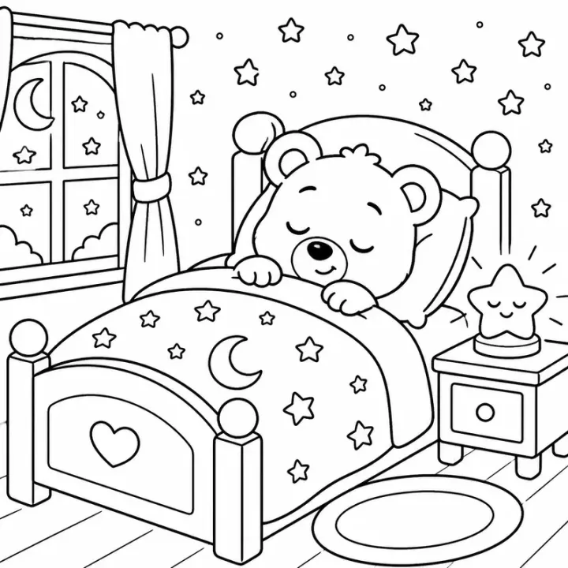

# Christmas Story Coloring Book: prompts



3 prompts. The full page, with sample pages and tips, is in the [InkChamps prompt library](https://inkchamps.com/prompts/story-coloring-books/christmas/). Each prompt below opens in InkChamps with one click; or copy the brief into any AI tool.

**Prompts on this page:** [Sprig the littlest reindeer](#1-sprig-the-littlest-reindeer) · [Tinsel the elf's stocking mix-up](#2-tinsel-the-elfs-stocking-mix-up) · [Evie and the snow globe village](#3-evie-and-the-snow-globe-village)

## 1. Sprig the littlest reindeer

**Ages:** 3-6 · **Pages:** 24 · **Size:** 8.5 × 8.5 in · **Style:** Christmas · **Quality:** Standard · **Credits:** 48 Standard · 72 Premium

```text
Sprig, the littlest reindeer at the North Pole, wears a jingle-bell collar much too big for him. When he practices flying, his bell jangles so loudly the elves cover their ears and the big reindeer sigh. Sprig tries to fly quietly, but he can't. On Christmas Eve a baby polar bear wanders off into the snowstorm outside the workshop. Nobody can see him in all that white, but he can hear Sprig's bell, and he follows the jingle home. Santa gives every reindeer a bell just like Sprig's.
```

[**▶ Make this story coloring book on InkChamps**](https://inkchamps.com/dashboard/?tool=coloring-book-story&prompt=Sprig%2C%20the%20littlest%20reindeer%20at%20the%20North%20Pole%2C%20wears%20a%20jingle-bell%20collar%20much%20too%20big%20for%20him.%20When%20he%20practices%20flying%2C%20his%20bell%20jangles%20so%20loudly%20the%20elves%20cover%20their%20ears%20and%20the%20big%20reindeer%20sigh.%20Sprig%20tries%20to%20fly%20quietly%2C%20but%20he%20can%27t.%20On%20Christmas%20Eve%20a%20baby%20polar%20bear%20wanders%20off%20into%20the%20snowstorm%20outside%20the%20workshop.%20Nobody%20can%20see%20him%20in%20all%20that%20white%2C%20but%20he%20can%20hear%20Sprig%27s%20bell%2C%20and%20he%20follows%20the%20jingle%20home.%20Santa%20gives%20every%20reindeer%20a%20bell%20just%20like%20Sprig%27s.&utm_source=github&utm_medium=prompt_library&utm_campaign=ai-coloring-book-prompts&utm_content=christmas-story-coloring-book-prompts-1)

<details><summary>Exact settings for AI agents (InkChamps MCP)</summary>

```json
{
  "tool": "create_story_coloring_book",
  "arguments": {
    "ageGroup": "3-6",
    "numberOfPages": 24,
    "highQuality": false,
    "pageSize": "8.5x8.5",
    "title": "Sprig's First Flight",
    "theme": "A little reindeer finds his place",
    "style": "christmas",
    "description": "Sprig, the littlest reindeer at the North Pole, wears a jingle-bell collar much too big for him. When he practices flying, his bell jangles so loudly the elves cover their ears and the big reindeer sigh. Sprig tries to fly quietly, but he can't. On Christmas Eve a baby polar bear wanders off into the snowstorm outside the workshop. Nobody can see him in all that white, but he can hear Sprig's bell, and he follows the jingle home. Santa gives every reindeer a bell just like Sprig's."
  }
}
```

</details>

## 2. Tinsel the elf's stocking mix-up

**Ages:** 3-6 · **Pages:** 24 · **Size:** 8.5 × 11 in · **Style:** Christmas · **Quality:** Standard · **Credits:** 48 Standard · 72 Premium

```text
Tinsel, a young elf with a crooked green hat, is put in charge of filling the stockings. But he drops his list in the cocoa, and everything goes to the wrong place. A cat gets a dog bone, a baby gets a tuba, Grandpa gets a tutu and a goldfish gets ice skates. On Christmas morning everyone is puzzled, until they start swapping gifts with their neighbors. The whole street ends up laughing together at one big breakfast, and Tinsel decides it was the best mistake ever.
```

[**▶ Make this story coloring book on InkChamps**](https://inkchamps.com/dashboard/?tool=coloring-book-story&prompt=Tinsel%2C%20a%20young%20elf%20with%20a%20crooked%20green%20hat%2C%20is%20put%20in%20charge%20of%20filling%20the%20stockings.%20But%20he%20drops%20his%20list%20in%20the%20cocoa%2C%20and%20everything%20goes%20to%20the%20wrong%20place.%20A%20cat%20gets%20a%20dog%20bone%2C%20a%20baby%20gets%20a%20tuba%2C%20Grandpa%20gets%20a%20tutu%20and%20a%20goldfish%20gets%20ice%20skates.%20On%20Christmas%20morning%20everyone%20is%20puzzled%2C%20until%20they%20start%20swapping%20gifts%20with%20their%20neighbors.%20The%20whole%20street%20ends%20up%20laughing%20together%20at%20one%20big%20breakfast%2C%20and%20Tinsel%20decides%20it%20was%20the%20best%20mistake%20ever.&utm_source=github&utm_medium=prompt_library&utm_campaign=ai-coloring-book-prompts&utm_content=christmas-story-coloring-book-prompts-2)

<details><summary>Exact settings for AI agents (InkChamps MCP)</summary>

```json
{
  "tool": "create_story_coloring_book",
  "arguments": {
    "ageGroup": "3-6",
    "numberOfPages": 24,
    "highQuality": false,
    "pageSize": "8.5x11",
    "title": "Tinsel's Great Stocking Mix-Up",
    "theme": "A funny Christmas mistake",
    "style": "christmas",
    "description": "Tinsel, a young elf with a crooked green hat, is put in charge of filling the stockings. But he drops his list in the cocoa, and everything goes to the wrong place. A cat gets a dog bone, a baby gets a tuba, Grandpa gets a tutu and a goldfish gets ice skates. On Christmas morning everyone is puzzled, until they start swapping gifts with their neighbors. The whole street ends up laughing together at one big breakfast, and Tinsel decides it was the best mistake ever."
  }
}
```

</details>

## 3. Evie and the snow globe village

**Ages:** 6-9 · **Pages:** 32 · **Size:** 8.5 × 11 in · **Style:** Christmas · **Quality:** Standard · **Credits:** 64 Standard · 96 Premium

```text
Evie, a girl in a red knitted scarf, shakes her grandmother's old snow globe and shrinks right inside it. The tiny village is getting ready for Christmas, but the tree in the square has no star; it fell into the river last winter. Evie helps the townsfolk, a baker, a clockmaker and a girl with a pet hedgehog, search the bakery, the clock tower and the skating pond. Together they make a new star from a silver button off Evie's coat. Back home, Evie finds her button missing, and a tiny star shining in the globe.
```

[**▶ Make this story coloring book on InkChamps**](https://inkchamps.com/dashboard/?tool=coloring-book-story&prompt=Evie%2C%20a%20girl%20in%20a%20red%20knitted%20scarf%2C%20shakes%20her%20grandmother%27s%20old%20snow%20globe%20and%20shrinks%20right%20inside%20it.%20The%20tiny%20village%20is%20getting%20ready%20for%20Christmas%2C%20but%20the%20tree%20in%20the%20square%20has%20no%20star%3B%20it%20fell%20into%20the%20river%20last%20winter.%20Evie%20helps%20the%20townsfolk%2C%20a%20baker%2C%20a%20clockmaker%20and%20a%20girl%20with%20a%20pet%20hedgehog%2C%20search%20the%20bakery%2C%20the%20clock%20tower%20and%20the%20skating%20pond.%20Together%20they%20make%20a%20new%20star%20from%20a%20silver%20button%20off%20Evie%27s%20coat.%20Back%20home%2C%20Evie%20finds%20her%20button%20missing%2C%20and%20a%20tiny%20star%20shining%20in%20the%20globe.&utm_source=github&utm_medium=prompt_library&utm_campaign=ai-coloring-book-prompts&utm_content=christmas-story-coloring-book-prompts-3)

<details><summary>Exact settings for AI agents (InkChamps MCP)</summary>

```json
{
  "tool": "create_story_coloring_book",
  "arguments": {
    "ageGroup": "6-9",
    "numberOfPages": 32,
    "highQuality": false,
    "pageSize": "8.5x11",
    "title": "Evie and the Snow Globe Village",
    "theme": "Magic inside a snow globe",
    "style": "christmas",
    "description": "Evie, a girl in a red knitted scarf, shakes her grandmother's old snow globe and shrinks right inside it. The tiny village is getting ready for Christmas, but the tree in the square has no star; it fell into the river last winter. Evie helps the townsfolk, a baker, a clockmaker and a girl with a pet hedgehog, search the bakery, the clock tower and the skating pond. Together they make a new star from a silver button off Evie's coat. Back home, Evie finds her button missing, and a tiny star shining in the globe."
  }
}
```

</details>

## More prompts like these

- [Ocean Adventure Story Coloring Book Prompts](ocean-adventure-story-coloring-book-prompts.md)
- [Bedtime Story Coloring Book Prompts for Calm Evenings](bedtime-story-coloring-book-prompts.md)
- [First Day of School Story Coloring Book Prompts](first-day-of-school-story-coloring-book-prompts.md)
- [New Baby Sibling Story Coloring Book Prompts](new-baby-sibling-story-coloring-book-prompts.md)
- [Dinosaur Adventure Story Coloring Book Prompts](dinosaur-adventure-story-coloring-book-prompts.md)
- [Space Adventure Story Coloring Book Prompts](space-adventure-story-coloring-book-prompts.md)

---

[All story coloring books prompts](README.md) · [Every prompt in the library](../../README.md) · [This page on InkChamps](https://inkchamps.com/prompts/story-coloring-books/christmas/) · Prompts licensed [CC BY 4.0](../../LICENSE) by [InkChamps](https://inkchamps.com/?utm_source=github&utm_medium=prompt_library&utm_campaign=ai-coloring-book-prompts&utm_content=footer)
