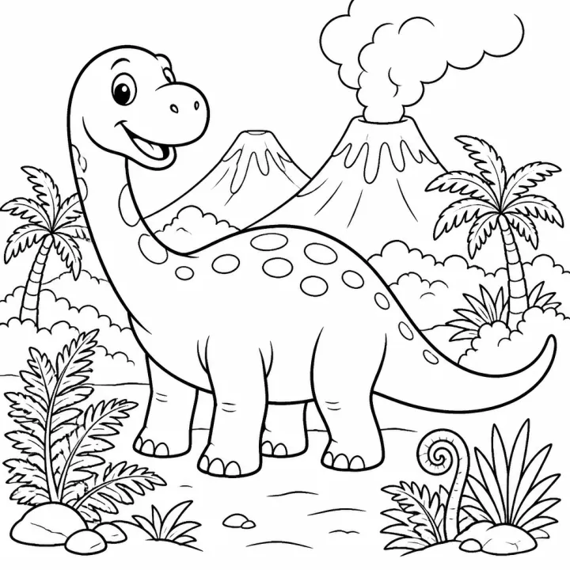

# Dinosaur Adventure Story Coloring Book: prompts



3 prompts. The full page, with sample pages and tips, is in the [InkChamps prompt library](https://inkchamps.com/prompts/story-coloring-books/dinosaur-adventure/). Each prompt below opens in InkChamps with one click; or copy the brief into any AI tool.

**Prompts on this page:** [Rumble the littlest T. rex saves the eggs](#1-rumble-the-littlest-t-rex-saves-the-eggs) · [The dinosaur in Grandma's garden](#2-the-dinosaur-in-grandmas-garden) · [Fossil hunters of Red Rock Canyon](#3-fossil-hunters-of-red-rock-canyon)

## 1. Rumble the littlest T. rex saves the eggs

**Ages:** 3-6 · **Pages:** 24 · **Size:** 8.5 × 8.5 in · **Style:** Cute animals · **Quality:** Standard · **Credits:** 48 Standard · 72 Premium

```text
Rumble, a little green T. rex with a big grin, is the smallest dinosaur in the valley. He can't reach the high leaves like Lulu the brachiosaurus or push logs like Tansy the triceratops. When the volcano rumbles, the herd's eggs roll into a narrow cave. Nobody fits, except Rumble. He wriggles in and nudges the eggs out one by one with his nose. The herd cheers, the eggs hatch, and the babies all want to be just like Rumble.
```

[**▶ Make this story coloring book on InkChamps**](https://inkchamps.com/dashboard/?tool=coloring-book-story&prompt=Rumble%2C%20a%20little%20green%20T.%20rex%20with%20a%20big%20grin%2C%20is%20the%20smallest%20dinosaur%20in%20the%20valley.%20He%20can%27t%20reach%20the%20high%20leaves%20like%20Lulu%20the%20brachiosaurus%20or%20push%20logs%20like%20Tansy%20the%20triceratops.%20When%20the%20volcano%20rumbles%2C%20the%20herd%27s%20eggs%20roll%20into%20a%20narrow%20cave.%20Nobody%20fits%2C%20except%20Rumble.%20He%20wriggles%20in%20and%20nudges%20the%20eggs%20out%20one%20by%20one%20with%20his%20nose.%20The%20herd%20cheers%2C%20the%20eggs%20hatch%2C%20and%20the%20babies%20all%20want%20to%20be%20just%20like%20Rumble.&utm_source=github&utm_medium=prompt_library&utm_campaign=ai-coloring-book-prompts&utm_content=dinosaur-adventure-story-coloring-book-prompts-1)

<details><summary>Exact settings for AI agents (InkChamps MCP)</summary>

```json
{
  "tool": "create_story_coloring_book",
  "arguments": {
    "ageGroup": "3-6",
    "numberOfPages": 24,
    "highQuality": false,
    "pageSize": "8.5x8.5",
    "title": "Rumble and the Rolling Eggs",
    "theme": "Being small can be a strength",
    "style": "cute_animals",
    "description": "Rumble, a little green T. rex with a big grin, is the smallest dinosaur in the valley. He can't reach the high leaves like Lulu the brachiosaurus or push logs like Tansy the triceratops. When the volcano rumbles, the herd's eggs roll into a narrow cave. Nobody fits, except Rumble. He wriggles in and nudges the eggs out one by one with his nose. The herd cheers, the eggs hatch, and the babies all want to be just like Rumble."
  }
}
```

</details>

## 2. The dinosaur in Grandma's garden

**Ages:** 6-9 · **Pages:** 32 · **Size:** 8.5 × 11 in · **Style:** Story · **Quality:** Standard · **Credits:** 64 Standard · 96 Premium

```text
Oliver, a boy with muddy knees, finds a huge speckled egg in Grandma's vegetable patch. It hatches into a baby stegosaurus he names Clementine. She eats all the cabbages, naps in the wheelbarrow and grows bigger every day, until she no longer fits in the shed. Oliver and Grandma follow her tracks to a mossy door at the back of the greenhouse that opens onto a prehistoric jungle. Oliver says goodbye as Clementine joins her herd, and next spring a tiny tail-plate sprouts in the cabbage bed.
```

[**▶ Make this story coloring book on InkChamps**](https://inkchamps.com/dashboard/?tool=coloring-book-story&prompt=Oliver%2C%20a%20boy%20with%20muddy%20knees%2C%20finds%20a%20huge%20speckled%20egg%20in%20Grandma%27s%20vegetable%20patch.%20It%20hatches%20into%20a%20baby%20stegosaurus%20he%20names%20Clementine.%20She%20eats%20all%20the%20cabbages%2C%20naps%20in%20the%20wheelbarrow%20and%20grows%20bigger%20every%20day%2C%20until%20she%20no%20longer%20fits%20in%20the%20shed.%20Oliver%20and%20Grandma%20follow%20her%20tracks%20to%20a%20mossy%20door%20at%20the%20back%20of%20the%20greenhouse%20that%20opens%20onto%20a%20prehistoric%20jungle.%20Oliver%20says%20goodbye%20as%20Clementine%20joins%20her%20herd%2C%20and%20next%20spring%20a%20tiny%20tail-plate%20sprouts%20in%20the%20cabbage%20bed.&utm_source=github&utm_medium=prompt_library&utm_campaign=ai-coloring-book-prompts&utm_content=dinosaur-adventure-story-coloring-book-prompts-2)

<details><summary>Exact settings for AI agents (InkChamps MCP)</summary>

```json
{
  "tool": "create_story_coloring_book",
  "arguments": {
    "ageGroup": "6-9",
    "numberOfPages": 32,
    "highQuality": false,
    "pageSize": "8.5x11",
    "title": "The Dinosaur in Grandma's Garden",
    "theme": "A secret baby dinosaur",
    "style": "story",
    "description": "Oliver, a boy with muddy knees, finds a huge speckled egg in Grandma's vegetable patch. It hatches into a baby stegosaurus he names Clementine. She eats all the cabbages, naps in the wheelbarrow and grows bigger every day, until she no longer fits in the shed. Oliver and Grandma follow her tracks to a mossy door at the back of the greenhouse that opens onto a prehistoric jungle. Oliver says goodbye as Clementine joins her herd, and next spring a tiny tail-plate sprouts in the cabbage bed."
  }
}
```

</details>

## 3. Fossil hunters of Red Rock Canyon

**Ages:** 9-13 · **Pages:** 36 · **Size:** 8.5 × 11 in · **Style:** Story · **Quality:** Standard · **Credits:** 72 Standard · 108 Premium

```text
Siblings Nia and Kofi spend the summer at a desert dig with their aunt, a paleontologist with a wide straw hat. They brush sand from bones, sift gravel and label finds. Then Kofi spots a trail of giant three-toed footprints in the rock. As a storm rolls in, they map the tracks and work out the story: a herd of hadrosaurs crossing a river, chased by a gorgosaurus. Pages switch between the dig and the herd's ancient journey, and the book ends with the footprints named after the two kids.
```

[**▶ Make this story coloring book on InkChamps**](https://inkchamps.com/dashboard/?tool=coloring-book-story&prompt=Siblings%20Nia%20and%20Kofi%20spend%20the%20summer%20at%20a%20desert%20dig%20with%20their%20aunt%2C%20a%20paleontologist%20with%20a%20wide%20straw%20hat.%20They%20brush%20sand%20from%20bones%2C%20sift%20gravel%20and%20label%20finds.%20Then%20Kofi%20spots%20a%20trail%20of%20giant%20three-toed%20footprints%20in%20the%20rock.%20As%20a%20storm%20rolls%20in%2C%20they%20map%20the%20tracks%20and%20work%20out%20the%20story%3A%20a%20herd%20of%20hadrosaurs%20crossing%20a%20river%2C%20chased%20by%20a%20gorgosaurus.%20Pages%20switch%20between%20the%20dig%20and%20the%20herd%27s%20ancient%20journey%2C%20and%20the%20book%20ends%20with%20the%20footprints%20named%20after%20the%20two%20kids.&utm_source=github&utm_medium=prompt_library&utm_campaign=ai-coloring-book-prompts&utm_content=dinosaur-adventure-story-coloring-book-prompts-3)

<details><summary>Exact settings for AI agents (InkChamps MCP)</summary>

```json
{
  "tool": "create_story_coloring_book",
  "arguments": {
    "ageGroup": "9-13",
    "numberOfPages": 36,
    "highQuality": false,
    "pageSize": "8.5x11",
    "title": "Fossil Hunters of Red Rock Canyon",
    "theme": "Paleontology and discovery",
    "style": "story",
    "description": "Siblings Nia and Kofi spend the summer at a desert dig with their aunt, a paleontologist with a wide straw hat. They brush sand from bones, sift gravel and label finds. Then Kofi spots a trail of giant three-toed footprints in the rock. As a storm rolls in, they map the tracks and work out the story: a herd of hadrosaurs crossing a river, chased by a gorgosaurus. Pages switch between the dig and the herd's ancient journey, and the book ends with the footprints named after the two kids."
  }
}
```

</details>

## More prompts like these

- [Space Adventure Story Coloring Book Prompts](space-adventure-story-coloring-book-prompts.md)
- [Kindness and Friendship Story Coloring Book Prompts](kindness-friendship-story-coloring-book-prompts.md)
- [Christmas Story Coloring Book Prompts for Kids](christmas-story-coloring-book-prompts.md)
- [Ocean Adventure Story Coloring Book Prompts](ocean-adventure-story-coloring-book-prompts.md)
- [Bedtime Story Coloring Book Prompts for Calm Evenings](bedtime-story-coloring-book-prompts.md)
- [First Day of School Story Coloring Book Prompts](first-day-of-school-story-coloring-book-prompts.md)

---

[All story coloring books prompts](README.md) · [Every prompt in the library](../../README.md) · [This page on InkChamps](https://inkchamps.com/prompts/story-coloring-books/dinosaur-adventure/) · Prompts licensed [CC BY 4.0](../../LICENSE) by [InkChamps](https://inkchamps.com/?utm_source=github&utm_medium=prompt_library&utm_campaign=ai-coloring-book-prompts&utm_content=footer)
